# Vancouver Airbnb Dataset

## Setup


```python
import os
import sys

venv_name = "venv"

if not os.path.exists(venv_name):
    print(f"Creating virtual environment '{venv_name}'...")
    # We use sys.executable to ensure we use the same python version
    os.system(f"{sys.executable} -m venv {venv_name}")
    print(f"Virtual environment created.")
else:
    print(f"Virtual environment '{venv_name}' already exists.")
```

    Virtual environment 'venv' already exists.


```python
#Auto Install everything I need

packages = [
    "pandas",
    "matplotlib",
    "seaborn",
    "scipy",        # For hypothesis testing
    "plotly",       # For interactive maps
    "folium",       # For alternative interactive maps
    "nbformat",     # The package you were missing for plotly
    "jupyterlab",    # Good to have Jupyter inside the venv
    "ipywidgets"    # For interactive widgets in Jupyter
]

# --- Find the correct pip executable ---
if sys.platform == "win32":
    pip_executable = os.path.join(venv_name, "Scripts", "pip.exe")
else:
    pip_executable = os.path.join(venv_name, "bin", "pip")

# --- Install the packages ---
print("Installing packages into the virtual environment...")
for package in packages:
    print(f"Installing {package}...")
    os.system(f"{pip_executable} install {package}")

print("All packages installed.")
```

    Installing packages into the virtual environment...
    Installing pandas...
    Requirement already satisfied: pandas in ./venv/lib/python3.12/site-packages (2.3.3)
    Requirement already satisfied: numpy>=1.26.0 in ./venv/lib/python3.12/site-packages (from pandas) (2.3.3)
    Requirement already satisfied: python-dateutil>=2.8.2 in ./venv/lib/python3.12/site-packages (from pandas) (2.9.0.post0)
    Requirement already satisfied: pytz>=2020.1 in ./venv/lib/python3.12/site-packages (from pandas) (2025.2)
    Requirement already satisfied: tzdata>=2022.7 in ./venv/lib/python3.12/site-packages (from pandas) (2025.2)
    Requirement already satisfied: six>=1.5 in ./venv/lib/python3.12/site-packages (from python-dateutil>=2.8.2->pandas) (1.17.0)
    Installing matplotlib...
    Requirement already satisfied: matplotlib in ./venv/lib/python3.12/site-packages (3.10.6)
    Requirement already satisfied: contourpy>=1.0.1 in ./venv/lib/python3.12/site-packages (from matplotlib) (1.3.3)
    Requirement already satisfied: cycler>=0.10 in ./venv/lib/python3.12/site-packages (from matplotlib) (0.12.1)
    Requirement already satisfied: fonttools>=4.22.0 in ./venv/lib/python3.12/site-packages (from matplotlib) (4.60.1)
    Requirement already satisfied: kiwisolver>=1.3.1 in ./venv/lib/python3.12/site-packages (from matplotlib) (1.4.9)
    Requirement already satisfied: numpy>=1.23 in ./venv/lib/python3.12/site-packages (from matplotlib) (2.3.3)
    Requirement already satisfied: packaging>=20.0 in ./venv/lib/python3.12/site-packages (from matplotlib) (25.0)
    Requirement already satisfied: pillow>=8 in ./venv/lib/python3.12/site-packages (from matplotlib) (11.3.0)
    Requirement already satisfied: pyparsing>=2.3.1 in ./venv/lib/python3.12/site-packages (from matplotlib) (3.2.5)
    Requirement already satisfied: python-dateutil>=2.7 in ./venv/lib/python3.12/site-packages (from matplotlib) (2.9.0.post0)
    Requirement already satisfied: six>=1.5 in ./venv/lib/python3.12/site-packages (from python-dateutil>=2.7->matplotlib) (1.17.0)
    Installing seaborn...
    Requirement already satisfied: seaborn in ./venv/lib/python3.12/site-packages (0.13.2)
    Requirement already satisfied: numpy!=1.24.0,>=1.20 in ./venv/lib/python3.12/site-packages (from seaborn) (2.3.3)
    Requirement already satisfied: pandas>=1.2 in ./venv/lib/python3.12/site-packages (from seaborn) (2.3.3)
    Requirement already satisfied: matplotlib!=3.6.1,>=3.4 in ./venv/lib/python3.12/site-packages (from seaborn) (3.10.6)
    Requirement already satisfied: contourpy>=1.0.1 in ./venv/lib/python3.12/site-packages (from matplotlib!=3.6.1,>=3.4->seaborn) (1.3.3)
    Requirement already satisfied: cycler>=0.10 in ./venv/lib/python3.12/site-packages (from matplotlib!=3.6.1,>=3.4->seaborn) (0.12.1)
    Requirement already satisfied: fonttools>=4.22.0 in ./venv/lib/python3.12/site-packages (from matplotlib!=3.6.1,>=3.4->seaborn) (4.60.1)
    Requirement already satisfied: kiwisolver>=1.3.1 in ./venv/lib/python3.12/site-packages (from matplotlib!=3.6.1,>=3.4->seaborn) (1.4.9)
    Requirement already satisfied: packaging>=20.0 in ./venv/lib/python3.12/site-packages (from matplotlib!=3.6.1,>=3.4->seaborn) (25.0)
    Requirement already satisfied: pillow>=8 in ./venv/lib/python3.12/site-packages (from matplotlib!=3.6.1,>=3.4->seaborn) (11.3.0)
    Requirement already satisfied: pyparsing>=2.3.1 in ./venv/lib/python3.12/site-packages (from matplotlib!=3.6.1,>=3.4->seaborn) (3.2.5)
    Requirement already satisfied: python-dateutil>=2.7 in ./venv/lib/python3.12/site-packages (from matplotlib!=3.6.1,>=3.4->seaborn) (2.9.0.post0)
    Requirement already satisfied: pytz>=2020.1 in ./venv/lib/python3.12/site-packages (from pandas>=1.2->seaborn) (2025.2)
    Requirement already satisfied: tzdata>=2022.7 in ./venv/lib/python3.12/site-packages (from pandas>=1.2->seaborn) (2025.2)
    Requirement already satisfied: six>=1.5 in ./venv/lib/python3.12/site-packages (from python-dateutil>=2.7->matplotlib!=3.6.1,>=3.4->seaborn) (1.17.0)
    Installing scipy...
    Requirement already satisfied: scipy in ./venv/lib/python3.12/site-packages (1.16.2)
    Requirement already satisfied: numpy<2.6,>=1.25.2 in ./venv/lib/python3.12/site-packages (from scipy) (2.3.3)
    Installing plotly...
    Requirement already satisfied: plotly in ./venv/lib/python3.12/site-packages (6.3.1)
    Requirement already satisfied: narwhals>=1.15.1 in ./venv/lib/python3.12/site-packages (from plotly) (2.9.0)
    Requirement already satisfied: packaging in ./venv/lib/python3.12/site-packages (from plotly) (25.0)
    Installing folium...
    Requirement already satisfied: folium in ./venv/lib/python3.12/site-packages (0.20.0)
    Requirement already satisfied: branca>=0.6.0 in ./venv/lib/python3.12/site-packages (from folium) (0.8.2)
    Requirement already satisfied: jinja2>=2.9 in ./venv/lib/python3.12/site-packages (from folium) (3.1.6)
    Requirement already satisfied: numpy in ./venv/lib/python3.12/site-packages (from folium) (2.3.3)
    Requirement already satisfied: requests in ./venv/lib/python3.12/site-packages (from folium) (2.32.5)
    Requirement already satisfied: xyzservices in ./venv/lib/python3.12/site-packages (from folium) (2025.4.0)
    Requirement already satisfied: MarkupSafe>=2.0 in ./venv/lib/python3.12/site-packages (from jinja2>=2.9->folium) (3.0.3)
    Requirement already satisfied: charset_normalizer<4,>=2 in ./venv/lib/python3.12/site-packages (from requests->folium) (3.4.4)
    Requirement already satisfied: idna<4,>=2.5 in ./venv/lib/python3.12/site-packages (from requests->folium) (3.11)
    Requirement already satisfied: urllib3<3,>=1.21.1 in ./venv/lib/python3.12/site-packages (from requests->folium) (2.5.0)
    Requirement already satisfied: certifi>=2017.4.17 in ./venv/lib/python3.12/site-packages (from requests->folium) (2025.10.5)
    Installing nbformat...
    Requirement already satisfied: nbformat in ./venv/lib/python3.12/site-packages (5.10.4)
    Requirement already satisfied: fastjsonschema>=2.15 in ./venv/lib/python3.12/site-packages (from nbformat) (2.21.2)
    Requirement already satisfied: jsonschema>=2.6 in ./venv/lib/python3.12/site-packages (from nbformat) (4.25.1)
    Requirement already satisfied: jupyter-core!=5.0.*,>=4.12 in ./venv/lib/python3.12/site-packages (from nbformat) (5.8.1)
    Requirement already satisfied: traitlets>=5.1 in ./venv/lib/python3.12/site-packages (from nbformat) (5.14.3)
    Requirement already satisfied: attrs>=22.2.0 in ./venv/lib/python3.12/site-packages (from jsonschema>=2.6->nbformat) (25.4.0)
    Requirement already satisfied: jsonschema-specifications>=2023.03.6 in ./venv/lib/python3.12/site-packages (from jsonschema>=2.6->nbformat) (2025.9.1)
    Requirement already satisfied: referencing>=0.28.4 in ./venv/lib/python3.12/site-packages (from jsonschema>=2.6->nbformat) (0.37.0)
    Requirement already satisfied: rpds-py>=0.7.1 in ./venv/lib/python3.12/site-packages (from jsonschema>=2.6->nbformat) (0.28.0)
    Requirement already satisfied: platformdirs>=2.5 in ./venv/lib/python3.12/site-packages (from jupyter-core!=5.0.*,>=4.12->nbformat) (4.4.0)
    Requirement already satisfied: typing-extensions>=4.4.0 in ./venv/lib/python3.12/site-packages (from referencing>=0.28.4->jsonschema>=2.6->nbformat) (4.15.0)
    Installing jupyterlab...
    Requirement already satisfied: jupyterlab in ./venv/lib/python3.12/site-packages (4.4.10)
    Requirement already satisfied: async-lru>=1.0.0 in ./venv/lib/python3.12/site-packages (from jupyterlab) (2.0.5)
    Requirement already satisfied: httpx<1,>=0.25.0 in ./venv/lib/python3.12/site-packages (from jupyterlab) (0.28.1)
    Requirement already satisfied: ipykernel!=6.30.0,>=6.5.0 in ./venv/lib/python3.12/site-packages (from jupyterlab) (7.0.1)
    Requirement already satisfied: jinja2>=3.0.3 in ./venv/lib/python3.12/site-packages (from jupyterlab) (3.1.6)
    Requirement already satisfied: jupyter-core in ./venv/lib/python3.12/site-packages (from jupyterlab) (5.8.1)
    Requirement already satisfied: jupyter-lsp>=2.0.0 in ./venv/lib/python3.12/site-packages (from jupyterlab) (2.3.0)
    Requirement already satisfied: jupyter-server<3,>=2.4.0 in ./venv/lib/python3.12/site-packages (from jupyterlab) (2.17.0)
    Requirement already satisfied: jupyterlab-server<3,>=2.27.1 in ./venv/lib/python3.12/site-packages (from jupyterlab) (2.28.0)
    Requirement already satisfied: notebook-shim>=0.2 in ./venv/lib/python3.12/site-packages (from jupyterlab) (0.2.4)
    Requirement already satisfied: packaging in ./venv/lib/python3.12/site-packages (from jupyterlab) (25.0)
    Requirement already satisfied: setuptools>=41.1.0 in ./venv/lib/python3.12/site-packages (from jupyterlab) (80.9.0)
    Requirement already satisfied: tornado>=6.2.0 in ./venv/lib/python3.12/site-packages (from jupyterlab) (6.5.2)
    Requirement already satisfied: traitlets in ./venv/lib/python3.12/site-packages (from jupyterlab) (5.14.3)
    Requirement already satisfied: anyio in ./venv/lib/python3.12/site-packages (from httpx<1,>=0.25.0->jupyterlab) (4.11.0)
    Requirement already satisfied: certifi in ./venv/lib/python3.12/site-packages (from httpx<1,>=0.25.0->jupyterlab) (2025.10.5)
    Requirement already satisfied: httpcore==1.* in ./venv/lib/python3.12/site-packages (from httpx<1,>=0.25.0->jupyterlab) (1.0.9)
    Requirement already satisfied: idna in ./venv/lib/python3.12/site-packages (from httpx<1,>=0.25.0->jupyterlab) (3.11)
    Requirement already satisfied: h11>=0.16 in ./venv/lib/python3.12/site-packages (from httpcore==1.*->httpx<1,>=0.25.0->jupyterlab) (0.16.0)
    Requirement already satisfied: comm>=0.1.1 in ./venv/lib/python3.12/site-packages (from ipykernel!=6.30.0,>=6.5.0->jupyterlab) (0.2.3)
    Requirement already satisfied: debugpy>=1.6.5 in ./venv/lib/python3.12/site-packages (from ipykernel!=6.30.0,>=6.5.0->jupyterlab) (1.8.17)
    Requirement already satisfied: ipython>=7.23.1 in ./venv/lib/python3.12/site-packages (from ipykernel!=6.30.0,>=6.5.0->jupyterlab) (9.6.0)
    Requirement already satisfied: jupyter-client>=8.0.0 in ./venv/lib/python3.12/site-packages (from ipykernel!=6.30.0,>=6.5.0->jupyterlab) (8.6.3)
    Requirement already satisfied: matplotlib-inline>=0.1 in ./venv/lib/python3.12/site-packages (from ipykernel!=6.30.0,>=6.5.0->jupyterlab) (0.1.7)
    Requirement already satisfied: nest-asyncio>=1.4 in ./venv/lib/python3.12/site-packages (from ipykernel!=6.30.0,>=6.5.0->jupyterlab) (1.6.0)
    Requirement already satisfied: psutil>=5.7 in ./venv/lib/python3.12/site-packages (from ipykernel!=6.30.0,>=6.5.0->jupyterlab) (7.1.0)
    Requirement already satisfied: pyzmq>=25 in ./venv/lib/python3.12/site-packages (from ipykernel!=6.30.0,>=6.5.0->jupyterlab) (27.1.0)
    Requirement already satisfied: MarkupSafe>=2.0 in ./venv/lib/python3.12/site-packages (from jinja2>=3.0.3->jupyterlab) (3.0.3)
    Requirement already satisfied: platformdirs>=2.5 in ./venv/lib/python3.12/site-packages (from jupyter-core->jupyterlab) (4.4.0)
    Requirement already satisfied: argon2-cffi>=21.1 in ./venv/lib/python3.12/site-packages (from jupyter-server<3,>=2.4.0->jupyterlab) (25.1.0)
    Requirement already satisfied: jupyter-events>=0.11.0 in ./venv/lib/python3.12/site-packages (from jupyter-server<3,>=2.4.0->jupyterlab) (0.12.0)
    Requirement already satisfied: jupyter-server-terminals>=0.4.4 in ./venv/lib/python3.12/site-packages (from jupyter-server<3,>=2.4.0->jupyterlab) (0.5.3)
    Requirement already satisfied: nbconvert>=6.4.4 in ./venv/lib/python3.12/site-packages (from jupyter-server<3,>=2.4.0->jupyterlab) (7.16.6)
    Requirement already satisfied: nbformat>=5.3.0 in ./venv/lib/python3.12/site-packages (from jupyter-server<3,>=2.4.0->jupyterlab) (5.10.4)
    Requirement already satisfied: prometheus-client>=0.9 in ./venv/lib/python3.12/site-packages (from jupyter-server<3,>=2.4.0->jupyterlab) (0.23.1)
    Requirement already satisfied: send2trash>=1.8.2 in ./venv/lib/python3.12/site-packages (from jupyter-server<3,>=2.4.0->jupyterlab) (1.8.3)
    Requirement already satisfied: terminado>=0.8.3 in ./venv/lib/python3.12/site-packages (from jupyter-server<3,>=2.4.0->jupyterlab) (0.18.1)
    Requirement already satisfied: websocket-client>=1.7 in ./venv/lib/python3.12/site-packages (from jupyter-server<3,>=2.4.0->jupyterlab) (1.9.0)
    Requirement already satisfied: babel>=2.10 in ./venv/lib/python3.12/site-packages (from jupyterlab-server<3,>=2.27.1->jupyterlab) (2.17.0)
    Requirement already satisfied: json5>=0.9.0 in ./venv/lib/python3.12/site-packages (from jupyterlab-server<3,>=2.27.1->jupyterlab) (0.12.1)
    Requirement already satisfied: jsonschema>=4.18.0 in ./venv/lib/python3.12/site-packages (from jupyterlab-server<3,>=2.27.1->jupyterlab) (4.25.1)
    Requirement already satisfied: requests>=2.31 in ./venv/lib/python3.12/site-packages (from jupyterlab-server<3,>=2.27.1->jupyterlab) (2.32.5)
    Requirement already satisfied: sniffio>=1.1 in ./venv/lib/python3.12/site-packages (from anyio->httpx<1,>=0.25.0->jupyterlab) (1.3.1)
    Requirement already satisfied: typing_extensions>=4.5 in ./venv/lib/python3.12/site-packages (from anyio->httpx<1,>=0.25.0->jupyterlab) (4.15.0)
    Requirement already satisfied: argon2-cffi-bindings in ./venv/lib/python3.12/site-packages (from argon2-cffi>=21.1->jupyter-server<3,>=2.4.0->jupyterlab) (25.1.0)
    Requirement already satisfied: decorator in ./venv/lib/python3.12/site-packages (from ipython>=7.23.1->ipykernel!=6.30.0,>=6.5.0->jupyterlab) (5.2.1)
    Requirement already satisfied: ipython-pygments-lexers in ./venv/lib/python3.12/site-packages (from ipython>=7.23.1->ipykernel!=6.30.0,>=6.5.0->jupyterlab) (1.1.1)
    Requirement already satisfied: jedi>=0.16 in ./venv/lib/python3.12/site-packages (from ipython>=7.23.1->ipykernel!=6.30.0,>=6.5.0->jupyterlab) (0.19.2)
    Requirement already satisfied: pexpect>4.3 in ./venv/lib/python3.12/site-packages (from ipython>=7.23.1->ipykernel!=6.30.0,>=6.5.0->jupyterlab) (4.9.0)
    Requirement already satisfied: prompt_toolkit<3.1.0,>=3.0.41 in ./venv/lib/python3.12/site-packages (from ipython>=7.23.1->ipykernel!=6.30.0,>=6.5.0->jupyterlab) (3.0.52)
    Requirement already satisfied: pygments>=2.4.0 in ./venv/lib/python3.12/site-packages (from ipython>=7.23.1->ipykernel!=6.30.0,>=6.5.0->jupyterlab) (2.19.2)
    Requirement already satisfied: stack_data in ./venv/lib/python3.12/site-packages (from ipython>=7.23.1->ipykernel!=6.30.0,>=6.5.0->jupyterlab) (0.6.3)
    Requirement already satisfied: attrs>=22.2.0 in ./venv/lib/python3.12/site-packages (from jsonschema>=4.18.0->jupyterlab-server<3,>=2.27.1->jupyterlab) (25.4.0)
    Requirement already satisfied: jsonschema-specifications>=2023.03.6 in ./venv/lib/python3.12/site-packages (from jsonschema>=4.18.0->jupyterlab-server<3,>=2.27.1->jupyterlab) (2025.9.1)
    Requirement already satisfied: referencing>=0.28.4 in ./venv/lib/python3.12/site-packages (from jsonschema>=4.18.0->jupyterlab-server<3,>=2.27.1->jupyterlab) (0.37.0)
    Requirement already satisfied: rpds-py>=0.7.1 in ./venv/lib/python3.12/site-packages (from jsonschema>=4.18.0->jupyterlab-server<3,>=2.27.1->jupyterlab) (0.28.0)
    Requirement already satisfied: python-dateutil>=2.8.2 in ./venv/lib/python3.12/site-packages (from jupyter-client>=8.0.0->ipykernel!=6.30.0,>=6.5.0->jupyterlab) (2.9.0.post0)
    Requirement already satisfied: python-json-logger>=2.0.4 in ./venv/lib/python3.12/site-packages (from jupyter-events>=0.11.0->jupyter-server<3,>=2.4.0->jupyterlab) (4.0.0)
    Requirement already satisfied: pyyaml>=5.3 in ./venv/lib/python3.12/site-packages (from jupyter-events>=0.11.0->jupyter-server<3,>=2.4.0->jupyterlab) (6.0.3)
    Requirement already satisfied: rfc3339-validator in ./venv/lib/python3.12/site-packages (from jupyter-events>=0.11.0->jupyter-server<3,>=2.4.0->jupyterlab) (0.1.4)
    Requirement already satisfied: rfc3986-validator>=0.1.1 in ./venv/lib/python3.12/site-packages (from jupyter-events>=0.11.0->jupyter-server<3,>=2.4.0->jupyterlab) (0.1.1)
    Requirement already satisfied: beautifulsoup4 in ./venv/lib/python3.12/site-packages (from nbconvert>=6.4.4->jupyter-server<3,>=2.4.0->jupyterlab) (4.14.2)
    Requirement already satisfied: bleach!=5.0.0 in ./venv/lib/python3.12/site-packages (from bleach[css]!=5.0.0->nbconvert>=6.4.4->jupyter-server<3,>=2.4.0->jupyterlab) (6.2.0)
    Requirement already satisfied: defusedxml in ./venv/lib/python3.12/site-packages (from nbconvert>=6.4.4->jupyter-server<3,>=2.4.0->jupyterlab) (0.7.1)
    Requirement already satisfied: jupyterlab-pygments in ./venv/lib/python3.12/site-packages (from nbconvert>=6.4.4->jupyter-server<3,>=2.4.0->jupyterlab) (0.3.0)
    Requirement already satisfied: mistune<4,>=2.0.3 in ./venv/lib/python3.12/site-packages (from nbconvert>=6.4.4->jupyter-server<3,>=2.4.0->jupyterlab) (3.1.4)
    Requirement already satisfied: nbclient>=0.5.0 in ./venv/lib/python3.12/site-packages (from nbconvert>=6.4.4->jupyter-server<3,>=2.4.0->jupyterlab) (0.10.2)
    Requirement already satisfied: pandocfilters>=1.4.1 in ./venv/lib/python3.12/site-packages (from nbconvert>=6.4.4->jupyter-server<3,>=2.4.0->jupyterlab) (1.5.1)
    Requirement already satisfied: fastjsonschema>=2.15 in ./venv/lib/python3.12/site-packages (from nbformat>=5.3.0->jupyter-server<3,>=2.4.0->jupyterlab) (2.21.2)
    Requirement already satisfied: charset_normalizer<4,>=2 in ./venv/lib/python3.12/site-packages (from requests>=2.31->jupyterlab-server<3,>=2.27.1->jupyterlab) (3.4.4)
    Requirement already satisfied: urllib3<3,>=1.21.1 in ./venv/lib/python3.12/site-packages (from requests>=2.31->jupyterlab-server<3,>=2.27.1->jupyterlab) (2.5.0)
    Requirement already satisfied: ptyprocess in ./venv/lib/python3.12/site-packages (from terminado>=0.8.3->jupyter-server<3,>=2.4.0->jupyterlab) (0.7.0)
    Requirement already satisfied: webencodings in ./venv/lib/python3.12/site-packages (from bleach!=5.0.0->bleach[css]!=5.0.0->nbconvert>=6.4.4->jupyter-server<3,>=2.4.0->jupyterlab) (0.5.1)
    Requirement already satisfied: tinycss2<1.5,>=1.1.0 in ./venv/lib/python3.12/site-packages (from bleach[css]!=5.0.0->nbconvert>=6.4.4->jupyter-server<3,>=2.4.0->jupyterlab) (1.4.0)
    Requirement already satisfied: parso<0.9.0,>=0.8.4 in ./venv/lib/python3.12/site-packages (from jedi>=0.16->ipython>=7.23.1->ipykernel!=6.30.0,>=6.5.0->jupyterlab) (0.8.5)
    Requirement already satisfied: fqdn in ./venv/lib/python3.12/site-packages (from jsonschema[format-nongpl]>=4.18.0->jupyter-events>=0.11.0->jupyter-server<3,>=2.4.0->jupyterlab) (1.5.1)
    Requirement already satisfied: isoduration in ./venv/lib/python3.12/site-packages (from jsonschema[format-nongpl]>=4.18.0->jupyter-events>=0.11.0->jupyter-server<3,>=2.4.0->jupyterlab) (20.11.0)
    Requirement already satisfied: jsonpointer>1.13 in ./venv/lib/python3.12/site-packages (from jsonschema[format-nongpl]>=4.18.0->jupyter-events>=0.11.0->jupyter-server<3,>=2.4.0->jupyterlab) (3.0.0)
    Requirement already satisfied: rfc3987-syntax>=1.1.0 in ./venv/lib/python3.12/site-packages (from jsonschema[format-nongpl]>=4.18.0->jupyter-events>=0.11.0->jupyter-server<3,>=2.4.0->jupyterlab) (1.1.0)
    Requirement already satisfied: uri-template in ./venv/lib/python3.12/site-packages (from jsonschema[format-nongpl]>=4.18.0->jupyter-events>=0.11.0->jupyter-server<3,>=2.4.0->jupyterlab) (1.3.0)
    Requirement already satisfied: webcolors>=24.6.0 in ./venv/lib/python3.12/site-packages (from jsonschema[format-nongpl]>=4.18.0->jupyter-events>=0.11.0->jupyter-server<3,>=2.4.0->jupyterlab) (24.11.1)
    Requirement already satisfied: wcwidth in ./venv/lib/python3.12/site-packages (from prompt_toolkit<3.1.0,>=3.0.41->ipython>=7.23.1->ipykernel!=6.30.0,>=6.5.0->jupyterlab) (0.2.14)
    Requirement already satisfied: six>=1.5 in ./venv/lib/python3.12/site-packages (from python-dateutil>=2.8.2->jupyter-client>=8.0.0->ipykernel!=6.30.0,>=6.5.0->jupyterlab) (1.17.0)
    Requirement already satisfied: cffi>=1.0.1 in ./venv/lib/python3.12/site-packages (from argon2-cffi-bindings->argon2-cffi>=21.1->jupyter-server<3,>=2.4.0->jupyterlab) (2.0.0)
    Requirement already satisfied: soupsieve>1.2 in ./venv/lib/python3.12/site-packages (from beautifulsoup4->nbconvert>=6.4.4->jupyter-server<3,>=2.4.0->jupyterlab) (2.8)
    Requirement already satisfied: executing>=1.2.0 in ./venv/lib/python3.12/site-packages (from stack_data->ipython>=7.23.1->ipykernel!=6.30.0,>=6.5.0->jupyterlab) (2.2.1)
    Requirement already satisfied: asttokens>=2.1.0 in ./venv/lib/python3.12/site-packages (from stack_data->ipython>=7.23.1->ipykernel!=6.30.0,>=6.5.0->jupyterlab) (3.0.0)
    Requirement already satisfied: pure-eval in ./venv/lib/python3.12/site-packages (from stack_data->ipython>=7.23.1->ipykernel!=6.30.0,>=6.5.0->jupyterlab) (0.2.3)
    Requirement already satisfied: pycparser in ./venv/lib/python3.12/site-packages (from cffi>=1.0.1->argon2-cffi-bindings->argon2-cffi>=21.1->jupyter-server<3,>=2.4.0->jupyterlab) (2.23)
    Requirement already satisfied: lark>=1.2.2 in ./venv/lib/python3.12/site-packages (from rfc3987-syntax>=1.1.0->jsonschema[format-nongpl]>=4.18.0->jupyter-events>=0.11.0->jupyter-server<3,>=2.4.0->jupyterlab) (1.3.0)
    Requirement already satisfied: arrow>=0.15.0 in ./venv/lib/python3.12/site-packages (from isoduration->jsonschema[format-nongpl]>=4.18.0->jupyter-events>=0.11.0->jupyter-server<3,>=2.4.0->jupyterlab) (1.4.0)
    Requirement already satisfied: tzdata in ./venv/lib/python3.12/site-packages (from arrow>=0.15.0->isoduration->jsonschema[format-nongpl]>=4.18.0->jupyter-events>=0.11.0->jupyter-server<3,>=2.4.0->jupyterlab) (2025.2)
    Installing ipywidgets...
    Requirement already satisfied: ipywidgets in ./venv/lib/python3.12/site-packages (8.1.8)
    Requirement already satisfied: comm>=0.1.3 in ./venv/lib/python3.12/site-packages (from ipywidgets) (0.2.3)
    Requirement already satisfied: ipython>=6.1.0 in ./venv/lib/python3.12/site-packages (from ipywidgets) (9.6.0)
    Requirement already satisfied: traitlets>=4.3.1 in ./venv/lib/python3.12/site-packages (from ipywidgets) (5.14.3)
    Requirement already satisfied: widgetsnbextension~=4.0.14 in ./venv/lib/python3.12/site-packages (from ipywidgets) (4.0.15)
    Requirement already satisfied: jupyterlab_widgets~=3.0.15 in ./venv/lib/python3.12/site-packages (from ipywidgets) (3.0.16)
    Requirement already satisfied: decorator in ./venv/lib/python3.12/site-packages (from ipython>=6.1.0->ipywidgets) (5.2.1)
    Requirement already satisfied: ipython-pygments-lexers in ./venv/lib/python3.12/site-packages (from ipython>=6.1.0->ipywidgets) (1.1.1)
    Requirement already satisfied: jedi>=0.16 in ./venv/lib/python3.12/site-packages (from ipython>=6.1.0->ipywidgets) (0.19.2)
    Requirement already satisfied: matplotlib-inline in ./venv/lib/python3.12/site-packages (from ipython>=6.1.0->ipywidgets) (0.1.7)
    Requirement already satisfied: pexpect>4.3 in ./venv/lib/python3.12/site-packages (from ipython>=6.1.0->ipywidgets) (4.9.0)
    Requirement already satisfied: prompt_toolkit<3.1.0,>=3.0.41 in ./venv/lib/python3.12/site-packages (from ipython>=6.1.0->ipywidgets) (3.0.52)
    Requirement already satisfied: pygments>=2.4.0 in ./venv/lib/python3.12/site-packages (from ipython>=6.1.0->ipywidgets) (2.19.2)
    Requirement already satisfied: stack_data in ./venv/lib/python3.12/site-packages (from ipython>=6.1.0->ipywidgets) (0.6.3)
    Requirement already satisfied: parso<0.9.0,>=0.8.4 in ./venv/lib/python3.12/site-packages (from jedi>=0.16->ipython>=6.1.0->ipywidgets) (0.8.5)
    Requirement already satisfied: ptyprocess>=0.5 in ./venv/lib/python3.12/site-packages (from pexpect>4.3->ipython>=6.1.0->ipywidgets) (0.7.0)
    Requirement already satisfied: wcwidth in ./venv/lib/python3.12/site-packages (from prompt_toolkit<3.1.0,>=3.0.41->ipython>=6.1.0->ipywidgets) (0.2.14)
    Requirement already satisfied: executing>=1.2.0 in ./venv/lib/python3.12/site-packages (from stack_data->ipython>=6.1.0->ipywidgets) (2.2.1)
    Requirement already satisfied: asttokens>=2.1.0 in ./venv/lib/python3.12/site-packages (from stack_data->ipython>=6.1.0->ipywidgets) (3.0.0)
    Requirement already satisfied: pure-eval in ./venv/lib/python3.12/site-packages (from stack_data->ipython>=6.1.0->ipywidgets) (0.2.3)
    All packages installed.


## Import csv


```python
import pandas as pd
import numpy as np

df = pd.read_csv('listings.csv')
df.head(5)
```


<div>
<style scoped>
    .dataframe tbody tr th:only-of-type {
        vertical-align: middle;
    }

    .dataframe tbody tr th {
        vertical-align: top;
    }

    .dataframe thead th {
        text-align: right;
    }
</style>
<table border="1" class="dataframe">
  <thead>
    <tr style="text-align: right;">
      <th></th>
      <th>id</th>
      <th>listing_url</th>
      <th>scrape_id</th>
      <th>last_scraped</th>
      <th>source</th>
      <th>name</th>
      <th>description</th>
      <th>neighborhood_overview</th>
      <th>picture_url</th>
      <th>host_id</th>
      <th>...</th>
      <th>review_scores_communication</th>
      <th>review_scores_location</th>
      <th>review_scores_value</th>
      <th>license</th>
      <th>instant_bookable</th>
      <th>calculated_host_listings_count</th>
      <th>calculated_host_listings_count_entire_homes</th>
      <th>calculated_host_listings_count_private_rooms</th>
      <th>calculated_host_listings_count_shared_rooms</th>
      <th>reviews_per_month</th>
    </tr>
  </thead>
  <tbody>
    <tr>
      <th>0</th>
      <td>13188</td>
      <td>https://www.airbnb.com/rooms/13188</td>
      <td>20250810152821</td>
      <td>2025-08-10</td>
      <td>city scrape</td>
      <td>Garden level studio in ideal loc.</td>
      <td>Garden level studio suite with garden patio - ...</td>
      <td>The uber hip Main street area is a short walk ...</td>
      <td>https://a0.muscache.com/pictures/8408188/e1af6...</td>
      <td>51466</td>
      <td>...</td>
      <td>4.94</td>
      <td>4.90</td>
      <td>4.81</td>
      <td>Municipal registration number: 25-156058&lt;br /&gt;...</td>
      <td>f</td>
      <td>1</td>
      <td>1</td>
      <td>0</td>
      <td>0</td>
      <td>1.98</td>
    </tr>
    <tr>
      <th>1</th>
      <td>13358</td>
      <td>https://www.airbnb.com/rooms/13358</td>
      <td>20250810152821</td>
      <td>2025-08-10</td>
      <td>city scrape</td>
      <td>Downtown Designer  one bedroom</td>
      <td>The iconic Electra Building.&lt;br /&gt;A Vancouver ...</td>
      <td>2 blocks away from the shopping area of Robson...</td>
      <td>https://a0.muscache.com/pictures/miso/Hosting-...</td>
      <td>52116</td>
      <td>...</td>
      <td>4.81</td>
      <td>4.91</td>
      <td>4.66</td>
      <td>Municipal registration number: 25-157257&lt;br /&gt;...</td>
      <td>t</td>
      <td>1</td>
      <td>1</td>
      <td>0</td>
      <td>0</td>
      <td>3.12</td>
    </tr>
    <tr>
      <th>2</th>
      <td>16611</td>
      <td>https://www.airbnb.com/rooms/16611</td>
      <td>20250810152821</td>
      <td>2025-08-10</td>
      <td>previous scrape</td>
      <td>1 block to skytrain station, shops,restaurant,...</td>
      <td>My place is close to bank, coffee shops, groce...</td>
      <td>Next block to Commercial Drive which has many ...</td>
      <td>https://a0.muscache.com/pictures/82101/7127b63...</td>
      <td>58512</td>
      <td>...</td>
      <td>4.33</td>
      <td>5.00</td>
      <td>3.67</td>
      <td>NaN</td>
      <td>f</td>
      <td>5</td>
      <td>5</td>
      <td>0</td>
      <td>0</td>
      <td>0.03</td>
    </tr>
    <tr>
      <th>3</th>
      <td>18270</td>
      <td>https://www.airbnb.com/rooms/18270</td>
      <td>20250810152821</td>
      <td>2025-08-10</td>
      <td>city scrape</td>
      <td>private rm in clean central 2BR apt</td>
      <td>I have a bright furnished 2 bedroom suite on a...</td>
      <td>Lots of restaurants, coffee shops.&lt;br /&gt;Easy a...</td>
      <td>https://a0.muscache.com/pictures/108520241/aec...</td>
      <td>70437</td>
      <td>...</td>
      <td>4.73</td>
      <td>4.69</td>
      <td>4.49</td>
      <td>NaN</td>
      <td>f</td>
      <td>1</td>
      <td>0</td>
      <td>1</td>
      <td>0</td>
      <td>0.67</td>
    </tr>
    <tr>
      <th>4</th>
      <td>18589</td>
      <td>https://www.airbnb.com/rooms/18589</td>
      <td>20250810152821</td>
      <td>2025-08-10</td>
      <td>city scrape</td>
      <td>Commercial Drive B&amp;B</td>
      <td>As hosts, we are welcoming you into our home, ...</td>
      <td>Lots of restaurants and boutiques just outside...</td>
      <td>https://a0.muscache.com/pictures/dd3ca406-cb74...</td>
      <td>71508</td>
      <td>...</td>
      <td>5.00</td>
      <td>4.93</td>
      <td>4.96</td>
      <td>Municipal registration number: 25-155972&lt;br /&gt;...</td>
      <td>f</td>
      <td>1</td>
      <td>0</td>
      <td>1</td>
      <td>0</td>
      <td>3.57</td>
    </tr>
  </tbody>
</table>
<p>5 rows × 79 columns</p>
</div>


```python
df.info()
```

    <class 'pandas.core.frame.DataFrame'>
    RangeIndex: 5550 entries, 0 to 5549
    Data columns (total 79 columns):
     #   Column                                        Non-Null Count  Dtype  
    ---  ------                                        --------------  -----  
     0   id                                            5550 non-null   int64  
     1   listing_url                                   5550 non-null   object 
     2   scrape_id                                     5550 non-null   int64  
     3   last_scraped                                  5550 non-null   object 
     4   source                                        5550 non-null   object 
     5   name                                          5550 non-null   object 
     6   description                                   5489 non-null   object 
     7   neighborhood_overview                         2802 non-null   object 
     8   picture_url                                   5550 non-null   object 
     9   host_id                                       5550 non-null   int64  
     10  host_url                                      5550 non-null   object 
     11  host_name                                     5548 non-null   object 
     12  host_since                                    5548 non-null   object 
     13  host_location                                 4257 non-null   object 
     14  host_about                                    2782 non-null   object 
     15  host_response_time                            4717 non-null   object 
     16  host_response_rate                            4717 non-null   object 
     17  host_acceptance_rate                          4924 non-null   object 
     18  host_is_superhost                             5336 non-null   object 
     19  host_thumbnail_url                            5548 non-null   object 
     20  host_picture_url                              5548 non-null   object 
     21  host_neighbourhood                            5313 non-null   object 
     22  host_listings_count                           5548 non-null   float64
     23  host_total_listings_count                     5548 non-null   float64
     24  host_verifications                            5548 non-null   object 
     25  host_has_profile_pic                          5548 non-null   object 
     26  host_identity_verified                        5548 non-null   object 
     27  neighbourhood                                 2802 non-null   object 
     28  neighbourhood_cleansed                        5550 non-null   object 
     29  neighbourhood_group_cleansed                  0 non-null      float64
     30  latitude                                      5550 non-null   float64
     31  longitude                                     5550 non-null   float64
     32  property_type                                 5550 non-null   object 
     33  room_type                                     5550 non-null   object 
     34  accommodates                                  5550 non-null   int64  
     35  bathrooms                                     4646 non-null   float64
     36  bathrooms_text                                5546 non-null   object 
     37  bedrooms                                      5375 non-null   float64
     38  beds                                          4648 non-null   float64
     39  amenities                                     5550 non-null   object 
     40  price                                         4639 non-null   object 
     41  minimum_nights                                5550 non-null   int64  
     42  maximum_nights                                5550 non-null   int64  
     43  minimum_minimum_nights                        5547 non-null   float64
     44  maximum_minimum_nights                        5547 non-null   float64
     45  minimum_maximum_nights                        5547 non-null   float64
     46  maximum_maximum_nights                        5547 non-null   float64
     47  minimum_nights_avg_ntm                        5550 non-null   float64
     48  maximum_nights_avg_ntm                        5550 non-null   float64
     49  calendar_updated                              0 non-null      float64
     50  has_availability                              5456 non-null   object 
     51  availability_30                               5550 non-null   int64  
     52  availability_60                               5550 non-null   int64  
     53  availability_90                               5550 non-null   int64  
     54  availability_365                              5550 non-null   int64  
     55  calendar_last_scraped                         5550 non-null   object 
     56  number_of_reviews                             5550 non-null   int64  
     57  number_of_reviews_ltm                         5550 non-null   int64  
     58  number_of_reviews_l30d                        5550 non-null   int64  
     59  availability_eoy                              5550 non-null   int64  
     60  number_of_reviews_ly                          5550 non-null   int64  
     61  estimated_occupancy_l365d                     5550 non-null   int64  
     62  estimated_revenue_l365d                       4639 non-null   float64
     63  first_review                                  4824 non-null   object 
     64  last_review                                   4824 non-null   object 
     65  review_scores_rating                          4824 non-null   float64
     66  review_scores_accuracy                        4823 non-null   float64
     67  review_scores_cleanliness                     4823 non-null   float64
     68  review_scores_checkin                         4823 non-null   float64
     69  review_scores_communication                   4823 non-null   float64
     70  review_scores_location                        4823 non-null   float64
     71  review_scores_value                           4823 non-null   float64
     72  license                                       4350 non-null   object 
     73  instant_bookable                              5550 non-null   object 
     74  calculated_host_listings_count                5550 non-null   int64  
     75  calculated_host_listings_count_entire_homes   5550 non-null   int64  
     76  calculated_host_listings_count_private_rooms  5550 non-null   int64  
     77  calculated_host_listings_count_shared_rooms   5550 non-null   int64  
     78  reviews_per_month                             4824 non-null   float64
    dtypes: float64(24), int64(20), object(35)
    memory usage: 3.3+ MB


```python
df.describe()
```


<div>
<style scoped>
    .dataframe tbody tr th:only-of-type {
        vertical-align: middle;
    }

    .dataframe tbody tr th {
        vertical-align: top;
    }

    .dataframe thead th {
        text-align: right;
    }
</style>
<table border="1" class="dataframe">
  <thead>
    <tr style="text-align: right;">
      <th></th>
      <th>id</th>
      <th>scrape_id</th>
      <th>host_id</th>
      <th>host_listings_count</th>
      <th>host_total_listings_count</th>
      <th>neighbourhood_group_cleansed</th>
      <th>latitude</th>
      <th>longitude</th>
      <th>accommodates</th>
      <th>bathrooms</th>
      <th>...</th>
      <th>review_scores_cleanliness</th>
      <th>review_scores_checkin</th>
      <th>review_scores_communication</th>
      <th>review_scores_location</th>
      <th>review_scores_value</th>
      <th>calculated_host_listings_count</th>
      <th>calculated_host_listings_count_entire_homes</th>
      <th>calculated_host_listings_count_private_rooms</th>
      <th>calculated_host_listings_count_shared_rooms</th>
      <th>reviews_per_month</th>
    </tr>
  </thead>
  <tbody>
    <tr>
      <th>count</th>
      <td>5.550000e+03</td>
      <td>5.550000e+03</td>
      <td>5.550000e+03</td>
      <td>5548.000000</td>
      <td>5548.000000</td>
      <td>0.0</td>
      <td>5550.000000</td>
      <td>5550.000000</td>
      <td>5550.000000</td>
      <td>4646.000000</td>
      <td>...</td>
      <td>4823.000000</td>
      <td>4823.000000</td>
      <td>4823.000000</td>
      <td>4823.000000</td>
      <td>4823.000000</td>
      <td>5550.000000</td>
      <td>5550.000000</td>
      <td>5550.000000</td>
      <td>5550.000000</td>
      <td>4824.000000</td>
    </tr>
    <tr>
      <th>mean</th>
      <td>7.212136e+17</td>
      <td>2.025081e+13</td>
      <td>2.486465e+08</td>
      <td>12.339041</td>
      <td>20.724225</td>
      <td>NaN</td>
      <td>49.261179</td>
      <td>-123.111347</td>
      <td>3.674955</td>
      <td>1.352023</td>
      <td>...</td>
      <td>4.744676</td>
      <td>4.840278</td>
      <td>4.854078</td>
      <td>4.809140</td>
      <td>4.645685</td>
      <td>8.292973</td>
      <td>6.601982</td>
      <td>1.672793</td>
      <td>0.016577</td>
      <td>1.959745</td>
    </tr>
    <tr>
      <th>std</th>
      <td>5.640347e+17</td>
      <td>0.000000e+00</td>
      <td>2.225780e+08</td>
      <td>37.943111</td>
      <td>57.532584</td>
      <td>NaN</td>
      <td>0.021399</td>
      <td>0.040218</td>
      <td>2.120093</td>
      <td>0.688599</td>
      <td>...</td>
      <td>0.469888</td>
      <td>0.336280</td>
      <td>0.374847</td>
      <td>0.298626</td>
      <td>0.468471</td>
      <td>24.473028</td>
      <td>24.005675</td>
      <td>5.965688</td>
      <td>0.231146</td>
      <td>1.877323</td>
    </tr>
    <tr>
      <th>min</th>
      <td>1.318800e+04</td>
      <td>2.025081e+13</td>
      <td>6.033000e+03</td>
      <td>1.000000</td>
      <td>1.000000</td>
      <td>NaN</td>
      <td>49.202270</td>
      <td>-123.223370</td>
      <td>1.000000</td>
      <td>0.000000</td>
      <td>...</td>
      <td>1.000000</td>
      <td>1.000000</td>
      <td>1.000000</td>
      <td>1.000000</td>
      <td>1.000000</td>
      <td>1.000000</td>
      <td>0.000000</td>
      <td>0.000000</td>
      <td>0.000000</td>
      <td>0.010000</td>
    </tr>
    <tr>
      <th>25%</th>
      <td>4.229575e+07</td>
      <td>2.025081e+13</td>
      <td>3.899611e+07</td>
      <td>1.000000</td>
      <td>1.000000</td>
      <td>NaN</td>
      <td>49.247595</td>
      <td>-123.130649</td>
      <td>2.000000</td>
      <td>1.000000</td>
      <td>...</td>
      <td>4.720000</td>
      <td>4.820000</td>
      <td>4.865000</td>
      <td>4.760000</td>
      <td>4.600000</td>
      <td>1.000000</td>
      <td>1.000000</td>
      <td>0.000000</td>
      <td>0.000000</td>
      <td>0.340000</td>
    </tr>
    <tr>
      <th>50%</th>
      <td>8.777264e+17</td>
      <td>2.025081e+13</td>
      <td>1.952416e+08</td>
      <td>2.000000</td>
      <td>3.000000</td>
      <td>NaN</td>
      <td>49.266691</td>
      <td>-123.112210</td>
      <td>4.000000</td>
      <td>1.000000</td>
      <td>...</td>
      <td>4.880000</td>
      <td>4.930000</td>
      <td>4.960000</td>
      <td>4.890000</td>
      <td>4.750000</td>
      <td>1.000000</td>
      <td>1.000000</td>
      <td>0.000000</td>
      <td>0.000000</td>
      <td>1.460000</td>
    </tr>
    <tr>
      <th>75%</th>
      <td>1.225518e+18</td>
      <td>2.025081e+13</td>
      <td>4.535973e+08</td>
      <td>5.000000</td>
      <td>8.000000</td>
      <td>NaN</td>
      <td>49.278892</td>
      <td>-123.086756</td>
      <td>4.000000</td>
      <td>2.000000</td>
      <td>...</td>
      <td>4.980000</td>
      <td>5.000000</td>
      <td>5.000000</td>
      <td>5.000000</td>
      <td>4.870000</td>
      <td>4.000000</td>
      <td>2.000000</td>
      <td>1.000000</td>
      <td>0.000000</td>
      <td>3.040000</td>
    </tr>
    <tr>
      <th>max</th>
      <td>1.483828e+18</td>
      <td>2.025081e+13</td>
      <td>7.122721e+08</td>
      <td>766.000000</td>
      <td>943.000000</td>
      <td>NaN</td>
      <td>49.294360</td>
      <td>-123.023530</td>
      <td>16.000000</td>
      <td>8.000000</td>
      <td>...</td>
      <td>5.000000</td>
      <td>5.000000</td>
      <td>5.000000</td>
      <td>5.000000</td>
      <td>5.000000</td>
      <td>147.000000</td>
      <td>147.000000</td>
      <td>51.000000</td>
      <td>5.000000</td>
      <td>15.460000</td>
    </tr>
  </tbody>
</table>
<p>8 rows × 44 columns</p>
</div>


```python
# % missing by column
na_rate = df.isna().mean().sort_values(ascending=False)
na_rate.head(20)
```


    neighbourhood_group_cleansed    1.000000
    calendar_updated                1.000000
    host_about                      0.498739
    neighborhood_overview           0.495135
    neighbourhood                   0.495135
    host_location                   0.232973
    license                         0.216216
    estimated_revenue_l365d         0.164144
    price                           0.164144
    bathrooms                       0.162883
    beds                            0.162523
    host_response_time              0.150090
    host_response_rate              0.150090
    review_scores_communication     0.130991
    review_scores_location          0.130991
    review_scores_cleanliness       0.130991
    review_scores_accuracy          0.130991
    review_scores_checkin           0.130991
    review_scores_value             0.130991
    last_review                     0.130811
    dtype: float64


```python
# constant / near-constant features
nunique = df.nunique(dropna=False).sort_values()
const_cols = nunique[nunique<=1].index.tolist()
const_cols
```


    ['last_scraped',
     'scrape_id',
     'neighbourhood_group_cleansed',
     'calendar_last_scraped',
     'calendar_updated']


### Initial Insights/First Impressions:

A lot of columns are regarding metadata I don't neccessarily need or would not be practical for an analysis. For example:

id: Pandas already assigns each row an ID. The ID in the dataset isn't correlated with the item. For example, "13188" doesn't really say anything about the property. It's just as arbitary as Pandas assigning it an index value of 0. 

The same applies to scrape_id (which seems to use the timestamp of last_scraped as it's 20250810152821 vs 2025-08-10), last_scraped. I don't think it's relevant to know what scraped the data. The data is here therefore it is scraped.

Host metadata: Columns like host_thumbnail_url, host_picture_url and arguably even host_name are unnessary. Aside from being images (well, links to images that don't even show up in the dataset). In any case, I don't believe how a URL is formatted is affecting the success of an AirBnb Property so I believe these columns should be dropped.

However, I believe columns like host_has_profile_pic, host_identity_verified, host_response_rate, host_is_superhost, host_since etc would be more relevant in the success of an airbnb property. It's a reasonable assumption that a verified host that's been active a long time would likely attract more tenants and one worth investigating

Latitude/Longitude: I believe these columns are redundant because the column "neighbourhood_cleansed" provides the rough location for a property. For example, the property at 49.24773, -123.10509 is 500 metres from the "neighbourhood_cleansed" location "Riley Park". So I can drop latitude and longitude and instead rely on neighbourhood_cleansed for location information. That being said, A bonus feature could be analyzing how far each property from a point of interest such as downtown. I might keep that in the back.

Property name, description, amenities and even host_description could be candidates for sentiment analysis?

Price isn't stored as a float lol. The dates don't seem to be stored as datetimes. T/F Columns could be made into Booleans

neighbourhood_group_cleansed and calendar_updated are entirely blank.

neighbourhood is either blank or "Neighborhood highlights". So it can be dropped

Columns such as reviews are highly correlated. Columns such as availability has one for 30 days, 60 days, 90 days and 365 days. More analysis needs to be done on how to handle that.


Host verification and Host Verification methods seem redundant. I am going to assume it doesn't matter how a host gets verified (since most either use their email or phone to do it. The specifics doesn't matter)

So many stats for bedrooms, bathrooms and accomodates. I could make columns that are more useful like "'beds_per_guest'", baths_per_guest, price_per_guest etc

host_response_time is text (e.g within the hour). As is host_response_rate and host_acceptance_rate (100%. I could make these scale from 0-1)

All the "calculated_host_listings_count	calculated_host_listings_count_entire_homes	calculated_host_listings_count_private_rooms	calculated_host_listings_count_shared_rooms" ones are redundant when we already have the total host listings column

# Part 1: Dropping the most Unnessary, Redundant or unhelpful Columns. Fixing Datatypes, Booleans and datetimes. Some Graphing


```python
#columns_to_drop = ['last_scraped', 'scrape_id', 'neighbourhood_group_cleansed', 'calendar_last_scraped', 'calendar_updated', 'host_thumbnail_url', 'host_picture_url', 'host_url', 'host_name', 'source', 'longitude', 'latitude', 'host_verifications', 'listing_url', 'picture_url', 'neighbourhood', 'calculated_host_listings_count_entire_homes', 'calculated_host_listings_count_private_rooms', 'calculated_host_listings_count_shared_rooms', 'calculated_host_listings_count', 'host_listings_count', 'availability_30', 'availability_60', 'availability_90', 'availability_eoy', 'license']

columns_to_drop = ['last_scraped', 'scrape_id', 'neighbourhood_group_cleansed', 'calendar_last_scraped', 'calendar_updated', 'host_thumbnail_url', 'host_picture_url', 'host_url', 'host_name', 'source',  'host_verifications', 'listing_url', 'picture_url', 'neighbourhood', 'calculated_host_listings_count_entire_homes', 'calculated_host_listings_count_private_rooms', 'calculated_host_listings_count_shared_rooms', 'calculated_host_listings_count', 'host_listings_count', 'availability_30', 'availability_60', 'availability_90', 'availability_eoy', 'license']


df = df.drop(columns=columns_to_drop)
df.shape
```


    (5550, 55)


## Data Type Fixes

### Fixing Price


```python
#Convert Price to float
df['price'] = df['price'].str.replace('$', '').str.replace(',', '').astype(float)
df['price'].head()
```


    0    141.0
    1    274.0
    2      NaN
    3     47.0
    4    160.0
    Name: price, dtype: float64


### Convert Date Columns to datetime


```python
# Convert Date Columns to datetime
date_cols = ['host_since', 'first_review', 'last_review']
for col in date_cols:
    df[col] = pd.to_datetime(df[col], errors='coerce')
df[date_cols].info()
```

    <class 'pandas.core.frame.DataFrame'>
    RangeIndex: 5550 entries, 0 to 5549
    Data columns (total 3 columns):
     #   Column        Non-Null Count  Dtype         
    ---  ------        --------------  -----         
     0   host_since    5548 non-null   datetime64[ns]
     1   first_review  4824 non-null   datetime64[ns]
     2   last_review   4824 non-null   datetime64[ns]
    dtypes: datetime64[ns](3)
    memory usage: 130.2 KB


### Convert t/fs to Booleans


```python
# Convert t/fs and 1/0 to Booleans
bool_cols = ['host_is_superhost', 'host_has_profile_pic', 'host_identity_verified', 'instant_bookable', 'has_availability']

for col in bool_cols:
    df[col] = df[col].map({'t': True, 'f': False, 1: True, 0: False}).astype(bool)
df[bool_cols].info()
```

    <class 'pandas.core.frame.DataFrame'>
    RangeIndex: 5550 entries, 0 to 5549
    Data columns (total 5 columns):
     #   Column                  Non-Null Count  Dtype
    ---  ------                  --------------  -----
     0   host_is_superhost       5550 non-null   bool 
     1   host_has_profile_pic    5550 non-null   bool 
     2   host_identity_verified  5550 non-null   bool 
     3   instant_bookable        5550 non-null   bool 
     4   has_availability        5550 non-null   bool 
    dtypes: bool(5)
    memory usage: 27.2 KB


```python
df.info()
```

    <class 'pandas.core.frame.DataFrame'>
    RangeIndex: 5550 entries, 0 to 5549
    Data columns (total 55 columns):
     #   Column                       Non-Null Count  Dtype         
    ---  ------                       --------------  -----         
     0   id                           5550 non-null   int64         
     1   name                         5550 non-null   object        
     2   description                  5489 non-null   object        
     3   neighborhood_overview        2802 non-null   object        
     4   host_id                      5550 non-null   int64         
     5   host_since                   5548 non-null   datetime64[ns]
     6   host_location                4257 non-null   object        
     7   host_about                   2782 non-null   object        
     8   host_response_time           4717 non-null   object        
     9   host_response_rate           4717 non-null   object        
     10  host_acceptance_rate         4924 non-null   object        
     11  host_is_superhost            5550 non-null   bool          
     12  host_neighbourhood           5313 non-null   object        
     13  host_total_listings_count    5548 non-null   float64       
     14  host_has_profile_pic         5550 non-null   bool          
     15  host_identity_verified       5550 non-null   bool          
     16  neighbourhood_cleansed       5550 non-null   object        
     17  latitude                     5550 non-null   float64       
     18  longitude                    5550 non-null   float64       
     19  property_type                5550 non-null   object        
     20  room_type                    5550 non-null   object        
     21  accommodates                 5550 non-null   int64         
     22  bathrooms                    4646 non-null   float64       
     23  bathrooms_text               5546 non-null   object        
     24  bedrooms                     5375 non-null   float64       
     25  beds                         4648 non-null   float64       
     26  amenities                    5550 non-null   object        
     27  price                        4639 non-null   float64       
     28  minimum_nights               5550 non-null   int64         
     29  maximum_nights               5550 non-null   int64         
     30  minimum_minimum_nights       5547 non-null   float64       
     31  maximum_minimum_nights       5547 non-null   float64       
     32  minimum_maximum_nights       5547 non-null   float64       
     33  maximum_maximum_nights       5547 non-null   float64       
     34  minimum_nights_avg_ntm       5550 non-null   float64       
     35  maximum_nights_avg_ntm       5550 non-null   float64       
     36  has_availability             5550 non-null   bool          
     37  availability_365             5550 non-null   int64         
     38  number_of_reviews            5550 non-null   int64         
     39  number_of_reviews_ltm        5550 non-null   int64         
     40  number_of_reviews_l30d       5550 non-null   int64         
     41  number_of_reviews_ly         5550 non-null   int64         
     42  estimated_occupancy_l365d    5550 non-null   int64         
     43  estimated_revenue_l365d      4639 non-null   float64       
     44  first_review                 4824 non-null   datetime64[ns]
     45  last_review                  4824 non-null   datetime64[ns]
     46  review_scores_rating         4824 non-null   float64       
     47  review_scores_accuracy       4823 non-null   float64       
     48  review_scores_cleanliness    4823 non-null   float64       
     49  review_scores_checkin        4823 non-null   float64       
     50  review_scores_communication  4823 non-null   float64       
     51  review_scores_location       4823 non-null   float64       
     52  review_scores_value          4823 non-null   float64       
     53  instant_bookable             5550 non-null   bool          
     54  reviews_per_month            4824 non-null   float64       
    dtypes: bool(5), datetime64[ns](3), float64(22), int64(11), object(14)
    memory usage: 2.1+ MB


```python
df.head()
```


<div>
<style scoped>
    .dataframe tbody tr th:only-of-type {
        vertical-align: middle;
    }

    .dataframe tbody tr th {
        vertical-align: top;
    }

    .dataframe thead th {
        text-align: right;
    }
</style>
<table border="1" class="dataframe">
  <thead>
    <tr style="text-align: right;">
      <th></th>
      <th>id</th>
      <th>name</th>
      <th>description</th>
      <th>neighborhood_overview</th>
      <th>host_id</th>
      <th>host_since</th>
      <th>host_location</th>
      <th>host_about</th>
      <th>host_response_time</th>
      <th>host_response_rate</th>
      <th>...</th>
      <th>last_review</th>
      <th>review_scores_rating</th>
      <th>review_scores_accuracy</th>
      <th>review_scores_cleanliness</th>
      <th>review_scores_checkin</th>
      <th>review_scores_communication</th>
      <th>review_scores_location</th>
      <th>review_scores_value</th>
      <th>instant_bookable</th>
      <th>reviews_per_month</th>
    </tr>
  </thead>
  <tbody>
    <tr>
      <th>0</th>
      <td>13188</td>
      <td>Garden level studio in ideal loc.</td>
      <td>Garden level studio suite with garden patio - ...</td>
      <td>The uber hip Main street area is a short walk ...</td>
      <td>51466</td>
      <td>2009-11-04</td>
      <td>Vancouver, Canada</td>
      <td>I love to travel with my family in comfort and...</td>
      <td>within an hour</td>
      <td>100%</td>
      <td>...</td>
      <td>2025-08-08</td>
      <td>4.85</td>
      <td>4.88</td>
      <td>4.86</td>
      <td>4.87</td>
      <td>4.94</td>
      <td>4.90</td>
      <td>4.81</td>
      <td>False</td>
      <td>1.98</td>
    </tr>
    <tr>
      <th>1</th>
      <td>13358</td>
      <td>Downtown Designer  one bedroom</td>
      <td>The iconic Electra Building.&lt;br /&gt;A Vancouver ...</td>
      <td>2 blocks away from the shopping area of Robson...</td>
      <td>52116</td>
      <td>2009-11-07</td>
      <td>Vancouver, Canada</td>
      <td>I am from Vancouver and in my free time I enjo...</td>
      <td>within an hour</td>
      <td>100%</td>
      <td>...</td>
      <td>2025-06-22</td>
      <td>4.71</td>
      <td>4.77</td>
      <td>4.82</td>
      <td>4.83</td>
      <td>4.81</td>
      <td>4.91</td>
      <td>4.66</td>
      <td>True</td>
      <td>3.12</td>
    </tr>
    <tr>
      <th>2</th>
      <td>16611</td>
      <td>1 block to skytrain station, shops,restaurant,...</td>
      <td>My place is close to bank, coffee shops, groce...</td>
      <td>Next block to Commercial Drive which has many ...</td>
      <td>58512</td>
      <td>2009-11-29</td>
      <td>NaN</td>
      <td>NaN</td>
      <td>NaN</td>
      <td>NaN</td>
      <td>...</td>
      <td>2018-02-16</td>
      <td>4.00</td>
      <td>4.00</td>
      <td>3.00</td>
      <td>4.00</td>
      <td>4.33</td>
      <td>5.00</td>
      <td>3.67</td>
      <td>False</td>
      <td>0.03</td>
    </tr>
    <tr>
      <th>3</th>
      <td>18270</td>
      <td>private rm in clean central 2BR apt</td>
      <td>I have a bright furnished 2 bedroom suite on a...</td>
      <td>Lots of restaurants, coffee shops.&lt;br /&gt;Easy a...</td>
      <td>70437</td>
      <td>2010-01-14</td>
      <td>Vancouver, Canada</td>
      <td>In my spare time I am pretty active - currentl...</td>
      <td>NaN</td>
      <td>NaN</td>
      <td>...</td>
      <td>2019-12-31</td>
      <td>4.54</td>
      <td>4.50</td>
      <td>3.98</td>
      <td>4.75</td>
      <td>4.73</td>
      <td>4.69</td>
      <td>4.49</td>
      <td>False</td>
      <td>0.67</td>
    </tr>
    <tr>
      <th>4</th>
      <td>18589</td>
      <td>Commercial Drive B&amp;B</td>
      <td>As hosts, we are welcoming you into our home, ...</td>
      <td>Lots of restaurants and boutiques just outside...</td>
      <td>71508</td>
      <td>2010-01-18</td>
      <td>Vancouver, Canada</td>
      <td>We - Alexis and Sylvain - are the Artistic Dir...</td>
      <td>within an hour</td>
      <td>100%</td>
      <td>...</td>
      <td>2025-08-05</td>
      <td>4.98</td>
      <td>4.97</td>
      <td>4.98</td>
      <td>4.99</td>
      <td>5.00</td>
      <td>4.93</td>
      <td>4.96</td>
      <td>False</td>
      <td>3.57</td>
    </tr>
  </tbody>
</table>
<p>5 rows × 55 columns</p>
</div>


## Analyzing review Score columns


```python
# columns containing "review"
review_cols = [c for c in df.columns if "review" in c.lower()]

# 1) Peek at just the review columns
df[review_cols].head(5)

```


<div>
<style scoped>
    .dataframe tbody tr th:only-of-type {
        vertical-align: middle;
    }

    .dataframe tbody tr th {
        vertical-align: top;
    }

    .dataframe thead th {
        text-align: right;
    }
</style>
<table border="1" class="dataframe">
  <thead>
    <tr style="text-align: right;">
      <th></th>
      <th>number_of_reviews</th>
      <th>number_of_reviews_ltm</th>
      <th>number_of_reviews_l30d</th>
      <th>number_of_reviews_ly</th>
      <th>first_review</th>
      <th>last_review</th>
      <th>review_scores_rating</th>
      <th>review_scores_accuracy</th>
      <th>review_scores_cleanliness</th>
      <th>review_scores_checkin</th>
      <th>review_scores_communication</th>
      <th>review_scores_location</th>
      <th>review_scores_value</th>
      <th>reviews_per_month</th>
    </tr>
  </thead>
  <tbody>
    <tr>
      <th>0</th>
      <td>372</td>
      <td>51</td>
      <td>7</td>
      <td>60</td>
      <td>2010-02-21</td>
      <td>2025-08-08</td>
      <td>4.85</td>
      <td>4.88</td>
      <td>4.86</td>
      <td>4.87</td>
      <td>4.94</td>
      <td>4.90</td>
      <td>4.81</td>
      <td>1.98</td>
    </tr>
    <tr>
      <th>1</th>
      <td>575</td>
      <td>43</td>
      <td>0</td>
      <td>56</td>
      <td>2010-06-22</td>
      <td>2025-06-22</td>
      <td>4.71</td>
      <td>4.77</td>
      <td>4.82</td>
      <td>4.83</td>
      <td>4.81</td>
      <td>4.91</td>
      <td>4.66</td>
      <td>3.12</td>
    </tr>
    <tr>
      <th>2</th>
      <td>3</td>
      <td>0</td>
      <td>0</td>
      <td>0</td>
      <td>2017-12-24</td>
      <td>2018-02-16</td>
      <td>4.00</td>
      <td>4.00</td>
      <td>3.00</td>
      <td>4.00</td>
      <td>4.33</td>
      <td>5.00</td>
      <td>3.67</td>
      <td>0.03</td>
    </tr>
    <tr>
      <th>3</th>
      <td>118</td>
      <td>0</td>
      <td>0</td>
      <td>0</td>
      <td>2011-03-17</td>
      <td>2019-12-31</td>
      <td>4.54</td>
      <td>4.50</td>
      <td>3.98</td>
      <td>4.75</td>
      <td>4.73</td>
      <td>4.69</td>
      <td>4.49</td>
      <td>0.67</td>
    </tr>
    <tr>
      <th>4</th>
      <td>616</td>
      <td>54</td>
      <td>4</td>
      <td>71</td>
      <td>2011-06-06</td>
      <td>2025-08-05</td>
      <td>4.98</td>
      <td>4.97</td>
      <td>4.98</td>
      <td>4.99</td>
      <td>5.00</td>
      <td>4.93</td>
      <td>4.96</td>
      <td>3.57</td>
    </tr>
  </tbody>
</table>
</div>


It appears that the columns that measure an individual property's review (e.g review_scores_accuracy	review_scores_cleanliness	review_scores_checkin	review_scores_communication etc) are tightly correlated. I should check that and decide if they should be dropped or merged into an average review score


```python
# pick only the rating columns that exist
score_cols = [c for c in [
    'review_scores_rating','review_scores_accuracy','review_scores_cleanliness',
    'review_scores_checkin','review_scores_communication','review_scores_location',
    'review_scores_value'
] if c in df.columns]

# correlation matrix
corr_scores = df[score_cols].corr()
print(corr_scores.round(3))

# how strongly each sub-score relates to overall rating
if 'review_scores_rating' in score_cols:
    print("\nCorrelations vs overall:")
    print(corr_scores['review_scores_rating'].sort_values(ascending=False).round(3))

```

                                 review_scores_rating  review_scores_accuracy  \
    review_scores_rating                        1.000                   0.906   
    review_scores_accuracy                      0.906                   1.000   
    review_scores_cleanliness                   0.858                   0.825   
    review_scores_checkin                       0.719                   0.726   
    review_scores_communication                 0.831                   0.797   
    review_scores_location                      0.605                   0.584   
    review_scores_value                         0.898                   0.870   
    
                                 review_scores_cleanliness  review_scores_checkin  \
    review_scores_rating                             0.858                  0.719   
    review_scores_accuracy                           0.825                  0.726   
    review_scores_cleanliness                        1.000                  0.646   
    review_scores_checkin                            0.646                  1.000   
    review_scores_communication                      0.743                  0.752   
    review_scores_location                           0.531                  0.559   
    review_scores_value                              0.814                  0.689   
    
                                 review_scores_communication  \
    review_scores_rating                               0.831   
    review_scores_accuracy                             0.797   
    review_scores_cleanliness                          0.743   
    review_scores_checkin                              0.752   
    review_scores_communication                        1.000   
    review_scores_location                             0.532   
    review_scores_value                                0.765   
    
                                 review_scores_location  review_scores_value  
    review_scores_rating                          0.605                0.898  
    review_scores_accuracy                        0.584                0.870  
    review_scores_cleanliness                     0.531                0.814  
    review_scores_checkin                         0.559                0.689  
    review_scores_communication                   0.532                0.765  
    review_scores_location                        1.000                0.584  
    review_scores_value                           0.584                1.000  
    
    Correlations vs overall:
    review_scores_rating           1.000
    review_scores_accuracy         0.906
    review_scores_value            0.898
    review_scores_cleanliness      0.858
    review_scores_communication    0.831
    review_scores_checkin          0.719
    review_scores_location         0.605
    Name: review_scores_rating, dtype: float64


Yeah. It looks like review scores are genrally quite correlated. I can combine them into a single column called "average_review_score"


```python
# Take the columns in score_cols  and average them into a new column called 'average_review_score'. Drop the original columns
df['average_review_score'] = df[score_cols].mean(axis=1)
df = df.drop(columns=score_cols)
df[['average_review_score']].head()
```


<div>
<style scoped>
    .dataframe tbody tr th:only-of-type {
        vertical-align: middle;
    }

    .dataframe tbody tr th {
        vertical-align: top;
    }

    .dataframe thead th {
        text-align: right;
    }
</style>
<table border="1" class="dataframe">
  <thead>
    <tr style="text-align: right;">
      <th></th>
      <th>average_review_score</th>
    </tr>
  </thead>
  <tbody>
    <tr>
      <th>0</th>
      <td>4.872857</td>
    </tr>
    <tr>
      <th>1</th>
      <td>4.787143</td>
    </tr>
    <tr>
      <th>2</th>
      <td>4.000000</td>
    </tr>
    <tr>
      <th>3</th>
      <td>4.525714</td>
    </tr>
    <tr>
      <th>4</th>
      <td>4.972857</td>
    </tr>
  </tbody>
</table>
</div>


## Analyzing Review Time Columns

A lot of redundant columns and ones we can calc. I think a more suitable one is to keep just "number_of_reviews" and use it alongside other columns to create a "reviews per year" column.


```python
today = pd.Timestamp('2025-10-06')

# Ensure dates are parsed
for c in ['first_review','last_review']:
    if c in df.columns:
        df[c] = pd.to_datetime(df[c], errors='coerce')

# Active window for reviews: from first_review to last_review (fallbacks included)
start = df['first_review']
end = df['last_review'].fillna(today)              # if no last_review, treat as still active
days_active = (end - start).dt.days

# Avoid div-by-zero/negatives (brand-new or malformed rows)
days_active = days_active.clip(lower=1)

# Reviews per year 
df['reviews_per_year'] = df['number_of_reviews'] / (days_active / 365.25)
df.info()

```

    <class 'pandas.core.frame.DataFrame'>
    RangeIndex: 5550 entries, 0 to 5549
    Data columns (total 50 columns):
     #   Column                     Non-Null Count  Dtype         
    ---  ------                     --------------  -----         
     0   id                         5550 non-null   int64         
     1   name                       5550 non-null   object        
     2   description                5489 non-null   object        
     3   neighborhood_overview      2802 non-null   object        
     4   host_id                    5550 non-null   int64         
     5   host_since                 5548 non-null   datetime64[ns]
     6   host_location              4257 non-null   object        
     7   host_about                 2782 non-null   object        
     8   host_response_time         4717 non-null   object        
     9   host_response_rate         4717 non-null   object        
     10  host_acceptance_rate       4924 non-null   object        
     11  host_is_superhost          5550 non-null   bool          
     12  host_neighbourhood         5313 non-null   object        
     13  host_total_listings_count  5548 non-null   float64       
     14  host_has_profile_pic       5550 non-null   bool          
     15  host_identity_verified     5550 non-null   bool          
     16  neighbourhood_cleansed     5550 non-null   object        
     17  latitude                   5550 non-null   float64       
     18  longitude                  5550 non-null   float64       
     19  property_type              5550 non-null   object        
     20  room_type                  5550 non-null   object        
     21  accommodates               5550 non-null   int64         
     22  bathrooms                  4646 non-null   float64       
     23  bathrooms_text             5546 non-null   object        
     24  bedrooms                   5375 non-null   float64       
     25  beds                       4648 non-null   float64       
     26  amenities                  5550 non-null   object        
     27  price                      4639 non-null   float64       
     28  minimum_nights             5550 non-null   int64         
     29  maximum_nights             5550 non-null   int64         
     30  minimum_minimum_nights     5547 non-null   float64       
     31  maximum_minimum_nights     5547 non-null   float64       
     32  minimum_maximum_nights     5547 non-null   float64       
     33  maximum_maximum_nights     5547 non-null   float64       
     34  minimum_nights_avg_ntm     5550 non-null   float64       
     35  maximum_nights_avg_ntm     5550 non-null   float64       
     36  has_availability           5550 non-null   bool          
     37  availability_365           5550 non-null   int64         
     38  number_of_reviews          5550 non-null   int64         
     39  number_of_reviews_ltm      5550 non-null   int64         
     40  number_of_reviews_l30d     5550 non-null   int64         
     41  number_of_reviews_ly       5550 non-null   int64         
     42  estimated_occupancy_l365d  5550 non-null   int64         
     43  estimated_revenue_l365d    4639 non-null   float64       
     44  first_review               4824 non-null   datetime64[ns]
     45  last_review                4824 non-null   datetime64[ns]
     46  instant_bookable           5550 non-null   bool          
     47  reviews_per_month          4824 non-null   float64       
     48  average_review_score       4824 non-null   float64       
     49  reviews_per_year           4824 non-null   float64       
    dtypes: bool(5), datetime64[ns](3), float64(17), int64(11), object(14)
    memory usage: 1.9+ MB


 Looks good. I can now drop all the other columns regarding review stats


```python
cols_to_drop = ['first_review', 'last_review', 'number_of_reviews_ltm', 'number_of_reviews_l30d', 'number_of_reviews_ly', 'reviews_per_month']
df = df.drop(columns=cols_to_drop)
df.info()
```

    <class 'pandas.core.frame.DataFrame'>
    RangeIndex: 5550 entries, 0 to 5549
    Data columns (total 44 columns):
     #   Column                     Non-Null Count  Dtype         
    ---  ------                     --------------  -----         
     0   id                         5550 non-null   int64         
     1   name                       5550 non-null   object        
     2   description                5489 non-null   object        
     3   neighborhood_overview      2802 non-null   object        
     4   host_id                    5550 non-null   int64         
     5   host_since                 5548 non-null   datetime64[ns]
     6   host_location              4257 non-null   object        
     7   host_about                 2782 non-null   object        
     8   host_response_time         4717 non-null   object        
     9   host_response_rate         4717 non-null   object        
     10  host_acceptance_rate       4924 non-null   object        
     11  host_is_superhost          5550 non-null   bool          
     12  host_neighbourhood         5313 non-null   object        
     13  host_total_listings_count  5548 non-null   float64       
     14  host_has_profile_pic       5550 non-null   bool          
     15  host_identity_verified     5550 non-null   bool          
     16  neighbourhood_cleansed     5550 non-null   object        
     17  latitude                   5550 non-null   float64       
     18  longitude                  5550 non-null   float64       
     19  property_type              5550 non-null   object        
     20  room_type                  5550 non-null   object        
     21  accommodates               5550 non-null   int64         
     22  bathrooms                  4646 non-null   float64       
     23  bathrooms_text             5546 non-null   object        
     24  bedrooms                   5375 non-null   float64       
     25  beds                       4648 non-null   float64       
     26  amenities                  5550 non-null   object        
     27  price                      4639 non-null   float64       
     28  minimum_nights             5550 non-null   int64         
     29  maximum_nights             5550 non-null   int64         
     30  minimum_minimum_nights     5547 non-null   float64       
     31  maximum_minimum_nights     5547 non-null   float64       
     32  minimum_maximum_nights     5547 non-null   float64       
     33  maximum_maximum_nights     5547 non-null   float64       
     34  minimum_nights_avg_ntm     5550 non-null   float64       
     35  maximum_nights_avg_ntm     5550 non-null   float64       
     36  has_availability           5550 non-null   bool          
     37  availability_365           5550 non-null   int64         
     38  number_of_reviews          5550 non-null   int64         
     39  estimated_occupancy_l365d  5550 non-null   int64         
     40  estimated_revenue_l365d    4639 non-null   float64       
     41  instant_bookable           5550 non-null   bool          
     42  average_review_score       4824 non-null   float64       
     43  reviews_per_year           4824 non-null   float64       
    dtypes: bool(5), datetime64[ns](1), float64(16), int64(8), object(14)
    memory usage: 1.7+ MB


## Max/Min Nights

There's 8 columns on how many min/max nights a guest can stay. Lets see if we can get any info out of them


```python
# columns containing "night"
night_cols = [c for c in df.columns if "night" in c.lower()]

# 1) Peek at just the night columns
df[night_cols].head(5)

```


<div>
<style scoped>
    .dataframe tbody tr th:only-of-type {
        vertical-align: middle;
    }

    .dataframe tbody tr th {
        vertical-align: top;
    }

    .dataframe thead th {
        text-align: right;
    }
</style>
<table border="1" class="dataframe">
  <thead>
    <tr style="text-align: right;">
      <th></th>
      <th>minimum_nights</th>
      <th>maximum_nights</th>
      <th>minimum_minimum_nights</th>
      <th>maximum_minimum_nights</th>
      <th>minimum_maximum_nights</th>
      <th>maximum_maximum_nights</th>
      <th>minimum_nights_avg_ntm</th>
      <th>maximum_nights_avg_ntm</th>
    </tr>
  </thead>
  <tbody>
    <tr>
      <th>0</th>
      <td>2</td>
      <td>180</td>
      <td>1.0</td>
      <td>2.0</td>
      <td>180.0</td>
      <td>180.0</td>
      <td>2.0</td>
      <td>180.0</td>
    </tr>
    <tr>
      <th>1</th>
      <td>1</td>
      <td>1125</td>
      <td>1.0</td>
      <td>2.0</td>
      <td>1125.0</td>
      <td>1125.0</td>
      <td>2.0</td>
      <td>1125.0</td>
    </tr>
    <tr>
      <th>2</th>
      <td>365</td>
      <td>365</td>
      <td>365.0</td>
      <td>365.0</td>
      <td>365.0</td>
      <td>365.0</td>
      <td>365.0</td>
      <td>365.0</td>
    </tr>
    <tr>
      <th>3</th>
      <td>90</td>
      <td>1125</td>
      <td>90.0</td>
      <td>90.0</td>
      <td>1125.0</td>
      <td>1125.0</td>
      <td>90.0</td>
      <td>1125.0</td>
    </tr>
    <tr>
      <th>4</th>
      <td>1</td>
      <td>40</td>
      <td>1.0</td>
      <td>2.0</td>
      <td>1125.0</td>
      <td>1125.0</td>
      <td>1.0</td>
      <td>1125.0</td>
    </tr>
  </tbody>
</table>
</div>


 The columns that aren't min/max seem to average stats and are super correlated. I can safely drop them


```python
cols_to_drop = ['minimum_minimum_nights', 'maximum_minimum_nights', 'minimum_maximum_nights', 'maximum_maximum_nights', 'minimum_nights_avg_ntm', 'maximum_nights_avg_ntm']
df = df.drop(columns=cols_to_drop)
df.info()
```

    <class 'pandas.core.frame.DataFrame'>
    RangeIndex: 5550 entries, 0 to 5549
    Data columns (total 38 columns):
     #   Column                     Non-Null Count  Dtype         
    ---  ------                     --------------  -----         
     0   id                         5550 non-null   int64         
     1   name                       5550 non-null   object        
     2   description                5489 non-null   object        
     3   neighborhood_overview      2802 non-null   object        
     4   host_id                    5550 non-null   int64         
     5   host_since                 5548 non-null   datetime64[ns]
     6   host_location              4257 non-null   object        
     7   host_about                 2782 non-null   object        
     8   host_response_time         4717 non-null   object        
     9   host_response_rate         4717 non-null   object        
     10  host_acceptance_rate       4924 non-null   object        
     11  host_is_superhost          5550 non-null   bool          
     12  host_neighbourhood         5313 non-null   object        
     13  host_total_listings_count  5548 non-null   float64       
     14  host_has_profile_pic       5550 non-null   bool          
     15  host_identity_verified     5550 non-null   bool          
     16  neighbourhood_cleansed     5550 non-null   object        
     17  latitude                   5550 non-null   float64       
     18  longitude                  5550 non-null   float64       
     19  property_type              5550 non-null   object        
     20  room_type                  5550 non-null   object        
     21  accommodates               5550 non-null   int64         
     22  bathrooms                  4646 non-null   float64       
     23  bathrooms_text             5546 non-null   object        
     24  bedrooms                   5375 non-null   float64       
     25  beds                       4648 non-null   float64       
     26  amenities                  5550 non-null   object        
     27  price                      4639 non-null   float64       
     28  minimum_nights             5550 non-null   int64         
     29  maximum_nights             5550 non-null   int64         
     30  has_availability           5550 non-null   bool          
     31  availability_365           5550 non-null   int64         
     32  number_of_reviews          5550 non-null   int64         
     33  estimated_occupancy_l365d  5550 non-null   int64         
     34  estimated_revenue_l365d    4639 non-null   float64       
     35  instant_bookable           5550 non-null   bool          
     36  average_review_score       4824 non-null   float64       
     37  reviews_per_year           4824 non-null   float64       
    dtypes: bool(5), datetime64[ns](1), float64(10), int64(8), object(14)
    memory usage: 1.4+ MB


## Host Response Time and Rate.

The column host_response_time is text (e.g within the hour). I want to see what unique entries there and possibly make it numeric with a "max_host_response_time".

 As is host_response_rate and host_acceptance_rate (100%. I could make these scale from 0-1)


```python
df['host_response_time'].unique()
```


    array(['within an hour', nan, 'a few days or more', 'within a few hours',
           'within a day'], dtype=object)


The times seem to be 'within an hour', nan, 'a few days or more', 'within a few hours', 'within a day'. I could map within an hour to 1 (for 1 hour max), a few days or more to 168 (assuming a week's wait). 'within a few hours' I am assuming 6 hours max. And 'within a day' to be 24 hours max. Nan I am going to leave Nan (assuming the host never replies)


```python

time_map = {
    'within an hour': 1,
    'within a few hours': 6,
    'within a day': 24,
    'a few days or more': 168
}
df['max_host_response_time_hours'] = df['host_response_time'].map(time_map)
df = df.drop(columns=['host_response_time'])
df.info()
```

    <class 'pandas.core.frame.DataFrame'>
    RangeIndex: 5550 entries, 0 to 5549
    Data columns (total 38 columns):
     #   Column                        Non-Null Count  Dtype         
    ---  ------                        --------------  -----         
     0   id                            5550 non-null   int64         
     1   name                          5550 non-null   object        
     2   description                   5489 non-null   object        
     3   neighborhood_overview         2802 non-null   object        
     4   host_id                       5550 non-null   int64         
     5   host_since                    5548 non-null   datetime64[ns]
     6   host_location                 4257 non-null   object        
     7   host_about                    2782 non-null   object        
     8   host_response_rate            4717 non-null   object        
     9   host_acceptance_rate          4924 non-null   object        
     10  host_is_superhost             5550 non-null   bool          
     11  host_neighbourhood            5313 non-null   object        
     12  host_total_listings_count     5548 non-null   float64       
     13  host_has_profile_pic          5550 non-null   bool          
     14  host_identity_verified        5550 non-null   bool          
     15  neighbourhood_cleansed        5550 non-null   object        
     16  latitude                      5550 non-null   float64       
     17  longitude                     5550 non-null   float64       
     18  property_type                 5550 non-null   object        
     19  room_type                     5550 non-null   object        
     20  accommodates                  5550 non-null   int64         
     21  bathrooms                     4646 non-null   float64       
     22  bathrooms_text                5546 non-null   object        
     23  bedrooms                      5375 non-null   float64       
     24  beds                          4648 non-null   float64       
     25  amenities                     5550 non-null   object        
     26  price                         4639 non-null   float64       
     27  minimum_nights                5550 non-null   int64         
     28  maximum_nights                5550 non-null   int64         
     29  has_availability              5550 non-null   bool          
     30  availability_365              5550 non-null   int64         
     31  number_of_reviews             5550 non-null   int64         
     32  estimated_occupancy_l365d     5550 non-null   int64         
     33  estimated_revenue_l365d       4639 non-null   float64       
     34  instant_bookable              5550 non-null   bool          
     35  average_review_score          4824 non-null   float64       
     36  reviews_per_year              4824 non-null   float64       
     37  max_host_response_time_hours  4717 non-null   float64       
    dtypes: bool(5), datetime64[ns](1), float64(11), int64(8), object(13)
    memory usage: 1.4+ MB


```python
# Now for host_response_rate and host_acceptance_rate (both are percentages as strings like '100%')
rate_cols = ['host_response_rate', 'host_acceptance_rate']
for col in rate_cols:
    if col in df.columns:
        df[col] = df[col].str.replace('%', '').astype(float) / 100.0
df[rate_cols].head()
```


<div>
<style scoped>
    .dataframe tbody tr th:only-of-type {
        vertical-align: middle;
    }

    .dataframe tbody tr th {
        vertical-align: top;
    }

    .dataframe thead th {
        text-align: right;
    }
</style>
<table border="1" class="dataframe">
  <thead>
    <tr style="text-align: right;">
      <th></th>
      <th>host_response_rate</th>
      <th>host_acceptance_rate</th>
    </tr>
  </thead>
  <tbody>
    <tr>
      <th>0</th>
      <td>1.0</td>
      <td>1.0</td>
    </tr>
    <tr>
      <th>1</th>
      <td>1.0</td>
      <td>1.0</td>
    </tr>
    <tr>
      <th>2</th>
      <td>NaN</td>
      <td>NaN</td>
    </tr>
    <tr>
      <th>3</th>
      <td>NaN</td>
      <td>NaN</td>
    </tr>
    <tr>
      <th>4</th>
      <td>1.0</td>
      <td>1.0</td>
    </tr>
  </tbody>
</table>
</div>


## Now for Some Final Summaries and Statsical Analysis


```python
#Now for Some Final Summaries and Statsical Analysis

df.info()

```

    <class 'pandas.core.frame.DataFrame'>
    RangeIndex: 5550 entries, 0 to 5549
    Data columns (total 38 columns):
     #   Column                        Non-Null Count  Dtype         
    ---  ------                        --------------  -----         
     0   id                            5550 non-null   int64         
     1   name                          5550 non-null   object        
     2   description                   5489 non-null   object        
     3   neighborhood_overview         2802 non-null   object        
     4   host_id                       5550 non-null   int64         
     5   host_since                    5548 non-null   datetime64[ns]
     6   host_location                 4257 non-null   object        
     7   host_about                    2782 non-null   object        
     8   host_response_rate            4717 non-null   float64       
     9   host_acceptance_rate          4924 non-null   float64       
     10  host_is_superhost             5550 non-null   bool          
     11  host_neighbourhood            5313 non-null   object        
     12  host_total_listings_count     5548 non-null   float64       
     13  host_has_profile_pic          5550 non-null   bool          
     14  host_identity_verified        5550 non-null   bool          
     15  neighbourhood_cleansed        5550 non-null   object        
     16  latitude                      5550 non-null   float64       
     17  longitude                     5550 non-null   float64       
     18  property_type                 5550 non-null   object        
     19  room_type                     5550 non-null   object        
     20  accommodates                  5550 non-null   int64         
     21  bathrooms                     4646 non-null   float64       
     22  bathrooms_text                5546 non-null   object        
     23  bedrooms                      5375 non-null   float64       
     24  beds                          4648 non-null   float64       
     25  amenities                     5550 non-null   object        
     26  price                         4639 non-null   float64       
     27  minimum_nights                5550 non-null   int64         
     28  maximum_nights                5550 non-null   int64         
     29  has_availability              5550 non-null   bool          
     30  availability_365              5550 non-null   int64         
     31  number_of_reviews             5550 non-null   int64         
     32  estimated_occupancy_l365d     5550 non-null   int64         
     33  estimated_revenue_l365d       4639 non-null   float64       
     34  instant_bookable              5550 non-null   bool          
     35  average_review_score          4824 non-null   float64       
     36  reviews_per_year              4824 non-null   float64       
     37  max_host_response_time_hours  4717 non-null   float64       
    dtypes: bool(5), datetime64[ns](1), float64(13), int64(8), object(11)
    memory usage: 1.4+ MB


```python
df.describe()
```


<div>
<style scoped>
    .dataframe tbody tr th:only-of-type {
        vertical-align: middle;
    }

    .dataframe tbody tr th {
        vertical-align: top;
    }

    .dataframe thead th {
        text-align: right;
    }
</style>
<table border="1" class="dataframe">
  <thead>
    <tr style="text-align: right;">
      <th></th>
      <th>id</th>
      <th>host_id</th>
      <th>host_since</th>
      <th>host_response_rate</th>
      <th>host_acceptance_rate</th>
      <th>host_total_listings_count</th>
      <th>latitude</th>
      <th>longitude</th>
      <th>accommodates</th>
      <th>bathrooms</th>
      <th>...</th>
      <th>price</th>
      <th>minimum_nights</th>
      <th>maximum_nights</th>
      <th>availability_365</th>
      <th>number_of_reviews</th>
      <th>estimated_occupancy_l365d</th>
      <th>estimated_revenue_l365d</th>
      <th>average_review_score</th>
      <th>reviews_per_year</th>
      <th>max_host_response_time_hours</th>
    </tr>
  </thead>
  <tbody>
    <tr>
      <th>count</th>
      <td>5.550000e+03</td>
      <td>5.550000e+03</td>
      <td>5548</td>
      <td>4717.000000</td>
      <td>4924.000000</td>
      <td>5548.000000</td>
      <td>5550.000000</td>
      <td>5550.000000</td>
      <td>5550.000000</td>
      <td>4646.000000</td>
      <td>...</td>
      <td>4639.000000</td>
      <td>5550.000000</td>
      <td>5550.000000</td>
      <td>5550.000000</td>
      <td>5550.000000</td>
      <td>5550.000000</td>
      <td>4.639000e+03</td>
      <td>4824.000000</td>
      <td>4824.000000</td>
      <td>4717.000000</td>
    </tr>
    <tr>
      <th>mean</th>
      <td>7.212136e+17</td>
      <td>2.486465e+08</td>
      <td>2018-08-08 21:51:00.129776384</td>
      <td>0.962546</td>
      <td>0.893280</td>
      <td>20.724225</td>
      <td>49.261179</td>
      <td>-123.111347</td>
      <td>3.674955</td>
      <td>1.352023</td>
      <td>...</td>
      <td>289.427678</td>
      <td>39.304685</td>
      <td>398.327207</td>
      <td>170.053514</td>
      <td>53.624685</td>
      <td>117.156757</td>
      <td>3.714505e+04</td>
      <td>4.777559</td>
      <td>56.105166</td>
      <td>6.623702</td>
    </tr>
    <tr>
      <th>min</th>
      <td>1.318800e+04</td>
      <td>6.033000e+03</td>
      <td>2009-01-05 00:00:00</td>
      <td>0.000000</td>
      <td>0.000000</td>
      <td>1.000000</td>
      <td>49.202270</td>
      <td>-123.223370</td>
      <td>1.000000</td>
      <td>0.000000</td>
      <td>...</td>
      <td>14.000000</td>
      <td>1.000000</td>
      <td>2.000000</td>
      <td>0.000000</td>
      <td>0.000000</td>
      <td>0.000000</td>
      <td>0.000000e+00</td>
      <td>1.000000</td>
      <td>0.473244</td>
      <td>1.000000</td>
    </tr>
    <tr>
      <th>25%</th>
      <td>4.229575e+07</td>
      <td>3.899611e+07</td>
      <td>2015-07-24 00:00:00</td>
      <td>1.000000</td>
      <td>0.910000</td>
      <td>1.000000</td>
      <td>49.247595</td>
      <td>-123.130649</td>
      <td>2.000000</td>
      <td>1.000000</td>
      <td>...</td>
      <td>133.000000</td>
      <td>2.000000</td>
      <td>90.000000</td>
      <td>55.000000</td>
      <td>3.000000</td>
      <td>0.000000</td>
      <td>3.630000e+03</td>
      <td>4.762500</td>
      <td>10.093582</td>
      <td>1.000000</td>
    </tr>
    <tr>
      <th>50%</th>
      <td>8.777264e+17</td>
      <td>1.952416e+08</td>
      <td>2018-06-13 12:00:00</td>
      <td>1.000000</td>
      <td>0.980000</td>
      <td>3.000000</td>
      <td>49.266691</td>
      <td>-123.112210</td>
      <td>4.000000</td>
      <td>1.000000</td>
      <td>...</td>
      <td>210.000000</td>
      <td>3.000000</td>
      <td>365.000000</td>
      <td>161.000000</td>
      <td>19.000000</td>
      <td>108.000000</td>
      <td>2.346000e+04</td>
      <td>4.860000</td>
      <td>28.525899</td>
      <td>1.000000</td>
    </tr>
    <tr>
      <th>75%</th>
      <td>1.225518e+18</td>
      <td>4.535973e+08</td>
      <td>2022-04-10 12:00:00</td>
      <td>1.000000</td>
      <td>1.000000</td>
      <td>8.000000</td>
      <td>49.278892</td>
      <td>-123.086756</td>
      <td>4.000000</td>
      <td>2.000000</td>
      <td>...</td>
      <td>338.500000</td>
      <td>90.000000</td>
      <td>365.000000</td>
      <td>274.000000</td>
      <td>69.000000</td>
      <td>234.000000</td>
      <td>4.635000e+04</td>
      <td>4.931429</td>
      <td>53.186756</td>
      <td>1.000000</td>
    </tr>
    <tr>
      <th>max</th>
      <td>1.483828e+18</td>
      <td>7.122721e+08</td>
      <td>2025-08-08 00:00:00</td>
      <td>1.000000</td>
      <td>1.000000</td>
      <td>943.000000</td>
      <td>49.294360</td>
      <td>-123.023530</td>
      <td>16.000000</td>
      <td>8.000000</td>
      <td>...</td>
      <td>64360.000000</td>
      <td>399.000000</td>
      <td>1125.000000</td>
      <td>365.000000</td>
      <td>1102.000000</td>
      <td>255.000000</td>
      <td>1.641180e+07</td>
      <td>5.000000</td>
      <td>730.500000</td>
      <td>168.000000</td>
    </tr>
    <tr>
      <th>std</th>
      <td>5.640347e+17</td>
      <td>2.225780e+08</td>
      <td>NaN</td>
      <td>0.149769</td>
      <td>0.207894</td>
      <td>57.532584</td>
      <td>0.021399</td>
      <td>0.040218</td>
      <td>2.120093</td>
      <td>0.688599</td>
      <td>...</td>
      <td>1043.364323</td>
      <td>49.398457</td>
      <td>364.306085</td>
      <td>122.717126</td>
      <td>88.676272</td>
      <td>102.637810</td>
      <td>2.529879e+05</td>
      <td>0.356280</td>
      <td>92.417188</td>
      <td>24.823179</td>
    </tr>
  </tbody>
</table>
<p>8 rows × 22 columns</p>
</div>


```python
import matplotlib.pyplot as plt
import seaborn as sns

#Some Helper Functions

def topk_counts(s, k=15):
    return s.value_counts(dropna=False).head(k)[::-1] 

def save_show(title, fname=None):
    plt.title(title)
    plt.tight_layout()
    if fname: plt.savefig(fname, dpi=150)
    plt.show()


```


```python
# Numerical columns to plot distributions for

num_cols = ['price','accommodates','bedrooms','beds','bathrooms',
            'minimum_nights','maximum_nights','availability_365',
            'number_of_reviews','reviews_per_year','average_review_score']

for c in [x for x in num_cols if x in df.columns]:
    s = df[c].dropna()
    plt.figure()
    plt.hist(s, bins=20)
    save_show(f'{c} distribution (n={len(s)})')
```


    
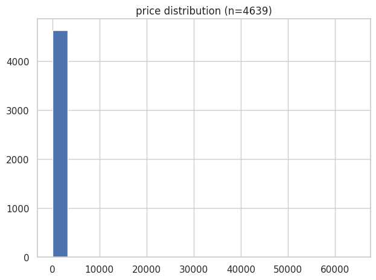
    


    
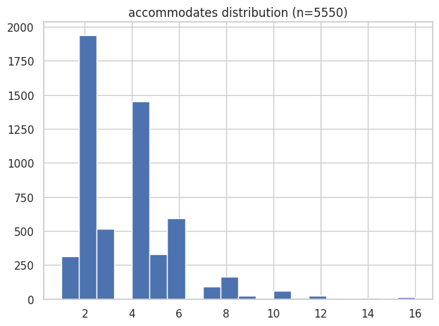
    


    
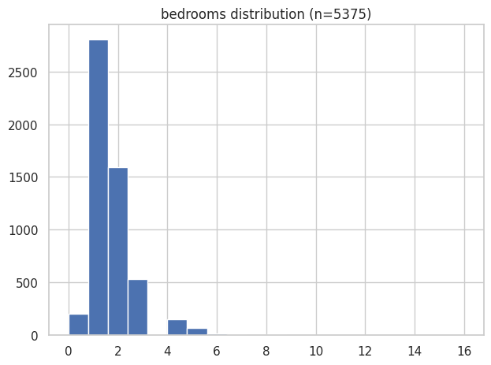
    


    
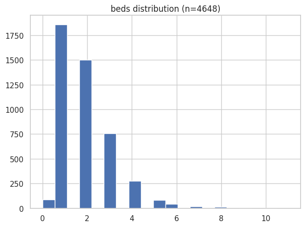
    


    
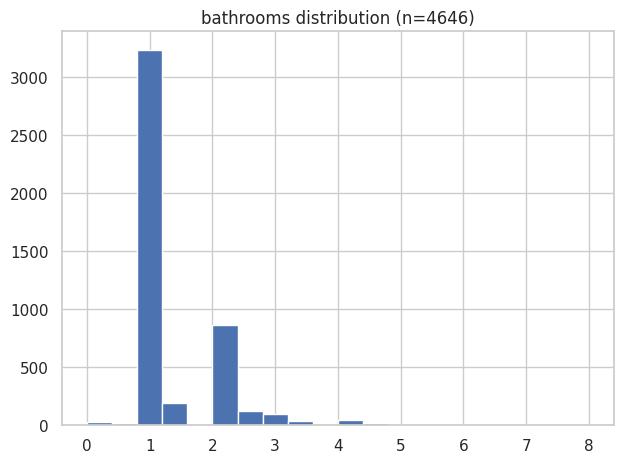
    


    
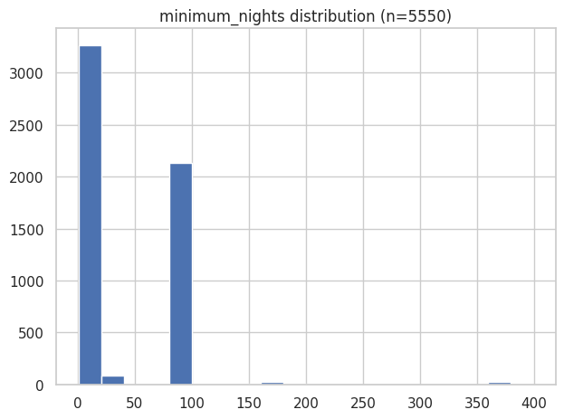
    


    
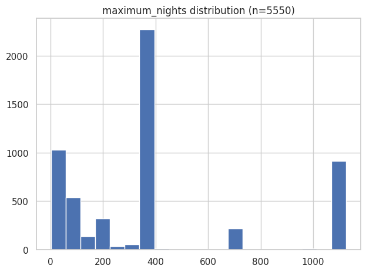
    


    
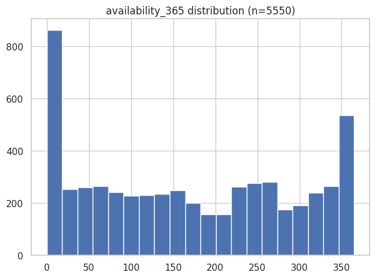
    


    
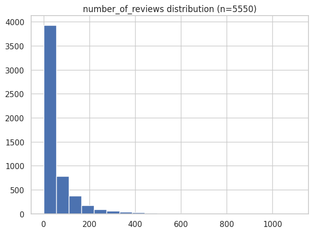
    


    
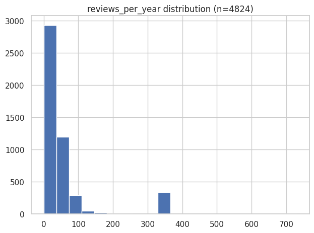
    


    
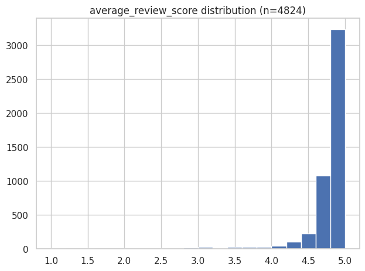
    


```python
#Categorical columns to plot distributions for
for c in ['room_type','property_type','neighbourhood_cleansed','host_is_superhost','instant_bookable']:
    if c in df.columns:
        vc = topk_counts(df[c], 15)
        plt.figure()
        plt.barh(vc.index.astype(str), vc.values)
        save_show(f'{c}: top {len(vc)}')

```


    
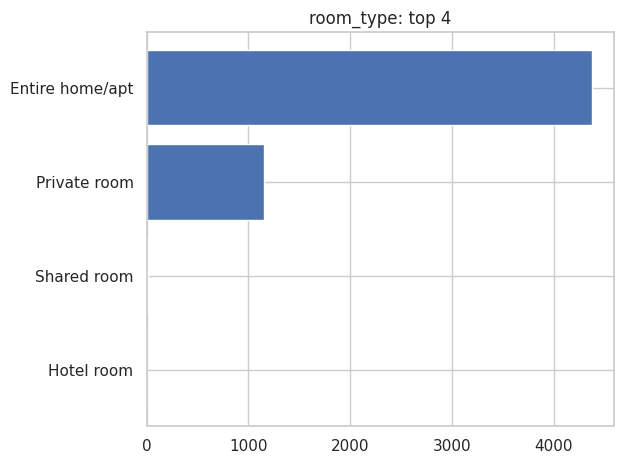
    


    
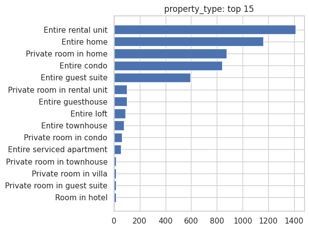
    


    
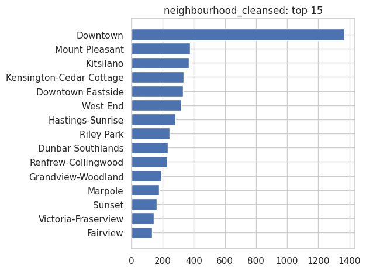
    


    
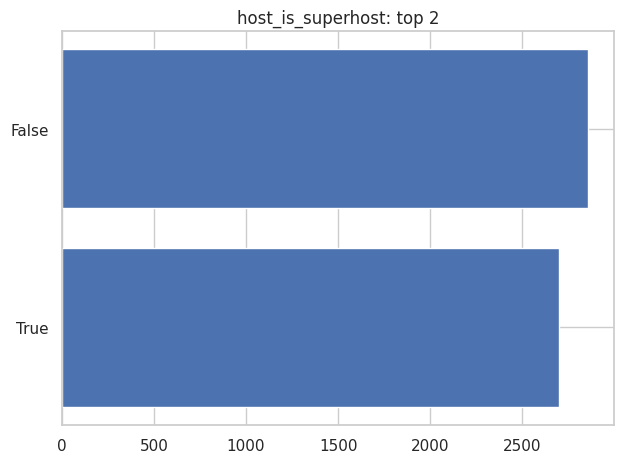
    


    

    


```python
#Scatter plot for price and some numerical columns
pairs = [
    ('accommodates','price'),
    ('bedrooms','price'),
    ('average_review_score','price'),
    ('reviews_per_year','price')
]
for x,y in pairs:
    if x in df.columns and y in df.columns:
        d = df[[x,y]].dropna()
        plt.figure()
        plt.scatter(d[x], d[y], s=8, alpha=0.5)
        save_show(f'{y} vs {x} (n={len(d)})')

```


    
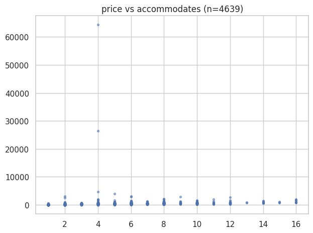
    


    
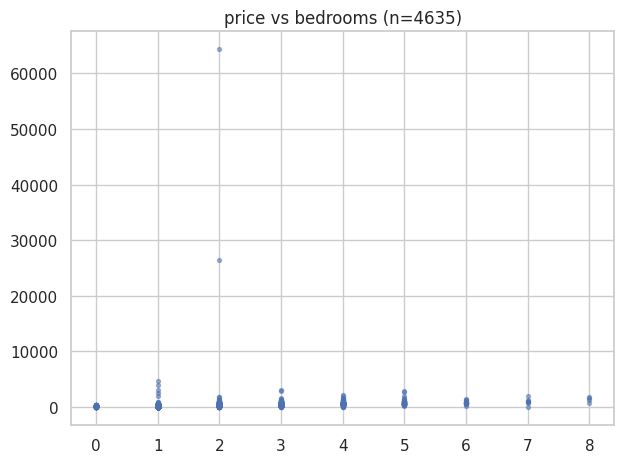
    


    

    


    
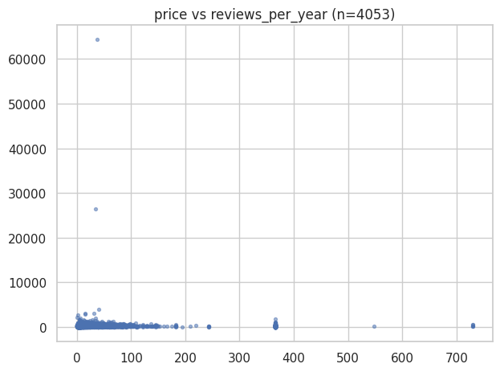
    


```python
#Correlation Heatmap
focus = [c for c in [
    'price','accommodates','bedrooms','beds','bathrooms',
    'minimum_nights','maximum_nights','availability_365',
    'number_of_reviews','reviews_per_year','average_review_score',
    'estimated_occupancy_l365d','estimated_revenue_l365d'
] if c in df.columns]

corr = df[focus].corr()
plt.figure(figsize=(8,6))
plt.imshow(corr, interpolation='nearest')
plt.xticks(range(len(focus)), focus, rotation=45, ha='right')
plt.yticks(range(len(focus)), focus)
plt.colorbar()
save_show('Correlation matrix (numeric)')

```


    

    


```python
# Export cleaned data to CSV
df.to_csv('listings_cleaned.csv', index=False)
```

# Part 2 Additional Fixes. Dropping Nulls for host, location, prices, reviews (and also doing Encoding)

## Dealing With some extra Nulls


```python
# % missing by column
na_rate = df.isna().mean().sort_values(ascending=False)
na_rate.head(20)
```


    host_about                      0.498739
    neighborhood_overview           0.495135
    host_location                   0.232973
    estimated_revenue_l365d         0.164144
    price                           0.164144
    bathrooms                       0.162883
    beds                            0.162523
    max_host_response_time_hours    0.150090
    host_response_rate              0.150090
    average_review_score            0.130811
    reviews_per_year                0.130811
    host_acceptance_rate            0.112793
    host_neighbourhood              0.042703
    bedrooms                        0.031532
    description                     0.010991
    bathrooms_text                  0.000721
    host_total_listings_count       0.000360
    host_since                      0.000360
    host_id                         0.000000
    name                            0.000000
    dtype: float64


ooof. host_about and neighbourhood_overview has nearly 50% nulls!. host_location is also pretty high. Lets look at them


```python
df['host_about'].unique()
```


    array(['I love to travel with my family in comfort and enjoy the ethos and community spirit of AirBNB. I also host on AirBNB so travelers can enjoy staying with us in Vancouver!\nBon Voyage !!',
           'I am from Vancouver and in my free time I enjoy Yoga, Cycling and exploring the neighborhoods of my hometown.\nLove slow travel',
           nan, ...,
           'After graduating from the medical university, I chose to be a journalist. I have been to more than 30 countries in the world. I love art, especially interior design. I hope my home can give you the feeling of "feeling at home".',
           'Sally and I love to travel and have enjoyed hosting guests in other homes that we have lived in. This is our primary home but  We’re flexible hosts who spend time at our cabin, and can stay in our laneway home when needed — so we’re able to accommodate a variety of booking dates for our guests.',
           'Travel creates some of the most enjoyable moments in life.  I hope that wonderful new memories are made in our home that we share with you.'],
          shape=(1811,), dtype=object)


```python
'''
I am going to replace nulls with 'No description provided' and then analyze the text to see if there are any common themes or keywords that can be extracted. This might help in understanding the type of hosts and their offerings better.

I will also create a column called host_has_about which will be a boolean indicating whether the host has provided a description or not. Will use this for analysis later.

'''

df['host_has_about'] = df['host_about'].notna().astype(bool)

df['host_about'] = df['host_about'].fillna('No description provided')

df['host_about'].unique()
```


    array(['I love to travel with my family in comfort and enjoy the ethos and community spirit of AirBNB. I also host on AirBNB so travelers can enjoy staying with us in Vancouver!\nBon Voyage !!',
           'I am from Vancouver and in my free time I enjoy Yoga, Cycling and exploring the neighborhoods of my hometown.\nLove slow travel',
           'No description provided', ...,
           'After graduating from the medical university, I chose to be a journalist. I have been to more than 30 countries in the world. I love art, especially interior design. I hope my home can give you the feeling of "feeling at home".',
           'Sally and I love to travel and have enjoyed hosting guests in other homes that we have lived in. This is our primary home but  We’re flexible hosts who spend time at our cabin, and can stay in our laneway home when needed — so we’re able to accommodate a variety of booking dates for our guests.',
           'Travel creates some of the most enjoyable moments in life.  I hope that wonderful new memories are made in our home that we share with you.'],
          shape=(1811,), dtype=object)


```python
print(df[['host_about', 'host_has_about']].head())
```

                                              host_about  host_has_about
    0  I love to travel with my family in comfort and...            True
    1  I am from Vancouver and in my free time I enjo...            True
    2                            No description provided           False
    3  In my spare time I am pretty active - currentl...            True
    4  We - Alexis and Sylvain - are the Artistic Dir...            True


## Neighbourhood Overview


```python
df['neighborhood_overview'].unique()
```


    array(['The uber hip Main street area is a short walk of 6 minutes to the east.  Dozens of dining options.  Great supermarkets, butcher ,cafe, pub, tiki lounge, ethnic restaurants of all sorts.  Sprinkled with antique stores and retro clothing stores.  To the West, just down the hill from the Canada Line station at King Edward is Cambie Village, theatre, flamenco dancing, fine dining, ice cream and more.',
           "2 blocks away from the shopping area of Robson Street.<br />A short walk away to Trendy Yaletown with all its cafes, restaurants, waterfront seawall access. It's also an easy stroll to catch the aqua bus to Granville Island for fresh food shopping at the public market.",
           'Next block to Commercial Drive which has many buses, shops, restaurants, doctors, coffee shops, banks',
           ...,
           "🌿 Live by the Lake – Nature, Culture & Convenience in East Vancouver<br />Just a short walk from the beautiful Trout Lake (John Hendry Park), our home offers the rare charm of lakeside living in the heart of the city. Enjoy morning jogs by the water, yoga on the grass, or feeding ducks with little ones — all just steps from your door.<br /><br />🛍️ Explore the Beloved Trout Lake Farmers Market<br />Every weekend, the nearby community comes alive with one of Vancouver’s most popular farmers markets — a perfect spot to pick up fresh produce, local treats, and handmade goods.<br /><br />🚇 Fast Access to the City<br />Located near Templeton Drive, with quick access to Commercial–Broadway SkyTrain Station and major bus routes, you’re only minutes from Downtown, Main Street, or Metrotown. Whether you're exploring or commuting, it’s effortless.<br /><br />🍽️ A Foodie's Dream Neighborhood<br />Savor diverse culinary options nearby — from authentic Asian eateries on Kingsway to trendy cafés, ve",
           '📍 Prime Downtown Location – 58 Keefer Place, Vancouver<br />Conveniently located in the heart of downtown Vancouver, this condo offers unbeatable access to transit, shopping, dining, and entertainment.<br /><br />🚆 Transit Access<br />Just a 3-minute walk to Stadium–Chinatown SkyTrain Station, making it easy to get around the city or connect to YVR International Airport.<br /><br />🛒 Shops & Essentials<br /><br />T&T Supermarket – Located right downstairs for all your grocery needs<br /><br />Costco Wholesale – Just 1 minute away<br /><br />Nesters Market – About a 5-minute walk<br /><br />Crosstown Liquor Store – 2-minute walk<br /><br />Rexall – Nearby for daily convenience items and pharmacy services<br /><br />☕ Coffee Shops<br />Enjoy local favorites such as Starbucks, Blenz, Charisma Café, PappaRoti, and Tim Hortons, all within walking distance.<br />For something unique, visit Catfé – a cat-themed café located inside International Village Mall, just across the street, where you ',
           'Located in the vibrant heart of Downtown Vancouver’s Yaletown district, this home offers the perfect blend of urban convenience and scenic charm. Enjoy tree-lined streets, waterfront parks, and trendy restaurants just steps away. The seawall, grocery stores, cafes, and boutique shops are all within walking distance, while SkyTrain and bus access make commuting effortless. A lively yet relaxed neighborhood ideal for both work and leisure.<br /><br /><br /><br /><br /><br /><br /><br /><br />Ask ChatGPT'],
          shape=(2449,), dtype=object)


```python
'''
I am going to replace nulls with 'No description provided' and then analyze the text to see if there are any common themes or keywords that can be extracted. This might help in later determining if the lack of descriptions affect listings' performance.

I am also going to create a column called neighborhood_has_overview which will be a boolean indicating whether the neighborhood overview has been provided or not. Will use this for analysis later.

'''

df['neighborhood_has_overview'] = df['neighborhood_overview'].notna().astype(bool)

df['neighborhood_overview'] = df['neighborhood_overview'].fillna('No description provided')
df['neighborhood_overview'].unique()
```


    array(['The uber hip Main street area is a short walk of 6 minutes to the east.  Dozens of dining options.  Great supermarkets, butcher ,cafe, pub, tiki lounge, ethnic restaurants of all sorts.  Sprinkled with antique stores and retro clothing stores.  To the West, just down the hill from the Canada Line station at King Edward is Cambie Village, theatre, flamenco dancing, fine dining, ice cream and more.',
           "2 blocks away from the shopping area of Robson Street.<br />A short walk away to Trendy Yaletown with all its cafes, restaurants, waterfront seawall access. It's also an easy stroll to catch the aqua bus to Granville Island for fresh food shopping at the public market.",
           'Next block to Commercial Drive which has many buses, shops, restaurants, doctors, coffee shops, banks',
           ...,
           "🌿 Live by the Lake – Nature, Culture & Convenience in East Vancouver<br />Just a short walk from the beautiful Trout Lake (John Hendry Park), our home offers the rare charm of lakeside living in the heart of the city. Enjoy morning jogs by the water, yoga on the grass, or feeding ducks with little ones — all just steps from your door.<br /><br />🛍️ Explore the Beloved Trout Lake Farmers Market<br />Every weekend, the nearby community comes alive with one of Vancouver’s most popular farmers markets — a perfect spot to pick up fresh produce, local treats, and handmade goods.<br /><br />🚇 Fast Access to the City<br />Located near Templeton Drive, with quick access to Commercial–Broadway SkyTrain Station and major bus routes, you’re only minutes from Downtown, Main Street, or Metrotown. Whether you're exploring or commuting, it’s effortless.<br /><br />🍽️ A Foodie's Dream Neighborhood<br />Savor diverse culinary options nearby — from authentic Asian eateries on Kingsway to trendy cafés, ve",
           '📍 Prime Downtown Location – 58 Keefer Place, Vancouver<br />Conveniently located in the heart of downtown Vancouver, this condo offers unbeatable access to transit, shopping, dining, and entertainment.<br /><br />🚆 Transit Access<br />Just a 3-minute walk to Stadium–Chinatown SkyTrain Station, making it easy to get around the city or connect to YVR International Airport.<br /><br />🛒 Shops & Essentials<br /><br />T&T Supermarket – Located right downstairs for all your grocery needs<br /><br />Costco Wholesale – Just 1 minute away<br /><br />Nesters Market – About a 5-minute walk<br /><br />Crosstown Liquor Store – 2-minute walk<br /><br />Rexall – Nearby for daily convenience items and pharmacy services<br /><br />☕ Coffee Shops<br />Enjoy local favorites such as Starbucks, Blenz, Charisma Café, PappaRoti, and Tim Hortons, all within walking distance.<br />For something unique, visit Catfé – a cat-themed café located inside International Village Mall, just across the street, where you ',
           'Located in the vibrant heart of Downtown Vancouver’s Yaletown district, this home offers the perfect blend of urban convenience and scenic charm. Enjoy tree-lined streets, waterfront parks, and trendy restaurants just steps away. The seawall, grocery stores, cafes, and boutique shops are all within walking distance, while SkyTrain and bus access make commuting effortless. A lively yet relaxed neighborhood ideal for both work and leisure.<br /><br /><br /><br /><br /><br /><br /><br /><br />Ask ChatGPT'],
          shape=(2449,), dtype=object)


```python
print(df[['neighborhood_overview', 'neighborhood_has_overview']].head())
```

                                   neighborhood_overview  \
    0  The uber hip Main street area is a short walk ...   
    1  2 blocks away from the shopping area of Robson...   
    2  Next block to Commercial Drive which has many ...   
    3  Lots of restaurants, coffee shops.<br />Easy a...   
    4  Lots of restaurants and boutiques just outside...   
    
       neighborhood_has_overview  
    0                       True  
    1                       True  
    2                       True  
    3                       True  
    4                       True  


## host_location nulls


```python
df['host_location'].unique()
```


    array(['Vancouver, Canada', nan, 'Richmond, Canada', 'Abbotsford, Canada',
           'Lethbridge, Canada', 'West Vancouver, Canada',
           'Stuttgart, Germany', 'Toronto, Canada', 'New Orleans, LA',
           'Los Angeles, CA', 'West Hollywood, CA', 'Seattle, WA',
           'Fontainebleau, France', 'Regina, Canada', 'Pemberton, Canada',
           'British Columbia, Canada', 'Montreal, Canada', 'Gibsons, Canada',
           'Coquitlam, Canada', 'Whistler, Canada', 'Las Vegas, NV',
           'United States', 'Tokyo, Japan', 'Burnaby, Canada',
           'San Francisco, CA', 'Cobble Hill, Canada', 'Sliema, Malta',
           'Taiwan', 'New Boston, NH', 'New Westminster, Canada', 'Canada',
           'Halfmoon Bay, Canada', 'Valencia, Spain', 'Calgary, Canada',
           'Squamish, Canada', 'Kingston, Canada', 'Surrey, Canada',
           'Honolulu, HI', 'North Vancouver, Canada',
           'Frankston South, Australia', 'Victoria, Canada',
           'Melbourne, Australia', 'Port Moody, Canada', 'Mendoza, Argentina',
           'Seongnam-si, South Korea', 'Orlando, FL', 'San Mateo, Costa Rica',
           'Langley Township, Canada', 'Langley City, Canada',
           'Vancouver, WA', 'Bournemouth, United Kingdom', 'Ottawa, Canada',
           'Lions Bay, Canada', 'London, United Kingdom',
           'California, United States', 'Santa Rosa, CA', 'Hong Kong',
           'Edmonton, Canada', 'Saltair, Canada', 'White Rock, Canada',
           'Oakville, Canada', 'Langley, Canada', 'Dasmariñas, Philippines',
           'Batala, India', 'Maple Ridge, Canada', 'Philadelphia, PA',
           'Whitehorse, Canada', 'Inuvik, Canada', 'Delta, Canada',
           'Greater Vancouver A, Canada', 'Glenside, PA', 'São Paulo, Brazil',
           'Saskatoon, Canada', 'The Colony, TX', 'Kelowna, Canada',
           'Smithers, Canada', 'San Diego, CA', 'Berdychiv, Ukraine',
           'University Endowment Lands, Canada', 'Port Alberni, Canada',
           'Koszalin, Poland', 'Arlington, VA', 'Saltillo, Mexico',
           'Roberts Creek, Canada', 'China', 'Washington, DC', 'McLean, VA',
           'Neuilly-sur-Seine, France'], dtype=object)


```python
'''
Replace with nulls with 'No location provided'

I will also create a column called host_location_provided which will be a boolean indicating whether the host has provided a location or not. Will use this for analysis later.

'''

df['host_location_provided'] = df['host_location'].notna().astype(bool)

df['host_location'] = df['host_location'].fillna('No location provided')
df['host_location'].unique()
```


    array(['Vancouver, Canada', 'No location provided', 'Richmond, Canada',
           'Abbotsford, Canada', 'Lethbridge, Canada',
           'West Vancouver, Canada', 'Stuttgart, Germany', 'Toronto, Canada',
           'New Orleans, LA', 'Los Angeles, CA', 'West Hollywood, CA',
           'Seattle, WA', 'Fontainebleau, France', 'Regina, Canada',
           'Pemberton, Canada', 'British Columbia, Canada',
           'Montreal, Canada', 'Gibsons, Canada', 'Coquitlam, Canada',
           'Whistler, Canada', 'Las Vegas, NV', 'United States',
           'Tokyo, Japan', 'Burnaby, Canada', 'San Francisco, CA',
           'Cobble Hill, Canada', 'Sliema, Malta', 'Taiwan', 'New Boston, NH',
           'New Westminster, Canada', 'Canada', 'Halfmoon Bay, Canada',
           'Valencia, Spain', 'Calgary, Canada', 'Squamish, Canada',
           'Kingston, Canada', 'Surrey, Canada', 'Honolulu, HI',
           'North Vancouver, Canada', 'Frankston South, Australia',
           'Victoria, Canada', 'Melbourne, Australia', 'Port Moody, Canada',
           'Mendoza, Argentina', 'Seongnam-si, South Korea', 'Orlando, FL',
           'San Mateo, Costa Rica', 'Langley Township, Canada',
           'Langley City, Canada', 'Vancouver, WA',
           'Bournemouth, United Kingdom', 'Ottawa, Canada',
           'Lions Bay, Canada', 'London, United Kingdom',
           'California, United States', 'Santa Rosa, CA', 'Hong Kong',
           'Edmonton, Canada', 'Saltair, Canada', 'White Rock, Canada',
           'Oakville, Canada', 'Langley, Canada', 'Dasmariñas, Philippines',
           'Batala, India', 'Maple Ridge, Canada', 'Philadelphia, PA',
           'Whitehorse, Canada', 'Inuvik, Canada', 'Delta, Canada',
           'Greater Vancouver A, Canada', 'Glenside, PA', 'São Paulo, Brazil',
           'Saskatoon, Canada', 'The Colony, TX', 'Kelowna, Canada',
           'Smithers, Canada', 'San Diego, CA', 'Berdychiv, Ukraine',
           'University Endowment Lands, Canada', 'Port Alberni, Canada',
           'Koszalin, Poland', 'Arlington, VA', 'Saltillo, Mexico',
           'Roberts Creek, Canada', 'China', 'Washington, DC', 'McLean, VA',
           'Neuilly-sur-Seine, France'], dtype=object)


```python
print(df[['neighborhood_overview', 'neighborhood_has_overview']].head())
```

                                   neighborhood_overview  \
    0  The uber hip Main street area is a short walk ...   
    1  2 blocks away from the shopping area of Robson...   
    2  Next block to Commercial Drive which has many ...   
    3  Lots of restaurants, coffee shops.<br />Easy a...   
    4  Lots of restaurants and boutiques just outside...   
    
       neighborhood_has_overview  
    0                       True  
    1                       True  
    2                       True  
    3                       True  
    4                       True  


## Price and Estimated Revenue Nulls


```python
'''
Since price and estimated revenue and reviews are crucial for our analysis, I will drop rows where either of these columns have null values. This will ensure that our dataset is complete for any financial analysis we plan to conduct.
'''
df = df.dropna(subset=['price', 'estimated_revenue_l365d', 'average_review_score', 'reviews_per_year'])
df.shape
```


    (4053, 41)


# Bonus Experimentation and stats. (DONT SHOW PROF unless I have a solid understanding of the stats)


```python
# % missing by column
na_rate = df.isna().mean().sort_values(ascending=False)
na_rate.head(20)
```


    host_response_rate              0.068098
    max_host_response_time_hours    0.068098
    host_neighbourhood              0.040464
    host_acceptance_rate            0.035036
    description                     0.008142
    bathrooms_text                  0.000740
    host_since                      0.000493
    host_total_listings_count       0.000493
    bathrooms                       0.000493
    bedrooms                        0.000247
    beds                            0.000247
    host_about                      0.000000
    host_location                   0.000000
    name                            0.000000
    id                              0.000000
    neighborhood_overview           0.000000
    host_id                         0.000000
    latitude                        0.000000
    neighbourhood_cleansed          0.000000
    host_identity_verified          0.000000
    dtype: float64


```python
df.info()
```

    <class 'pandas.core.frame.DataFrame'>
    Index: 4053 entries, 0 to 5536
    Data columns (total 41 columns):
     #   Column                        Non-Null Count  Dtype         
    ---  ------                        --------------  -----         
     0   id                            4053 non-null   int64         
     1   name                          4053 non-null   object        
     2   description                   4020 non-null   object        
     3   neighborhood_overview         4053 non-null   object        
     4   host_id                       4053 non-null   int64         
     5   host_since                    4051 non-null   datetime64[ns]
     6   host_location                 4053 non-null   object        
     7   host_about                    4053 non-null   object        
     8   host_response_rate            3777 non-null   float64       
     9   host_acceptance_rate          3911 non-null   float64       
     10  host_is_superhost             4053 non-null   bool          
     11  host_neighbourhood            3889 non-null   object        
     12  host_total_listings_count     4051 non-null   float64       
     13  host_has_profile_pic          4053 non-null   bool          
     14  host_identity_verified        4053 non-null   bool          
     15  neighbourhood_cleansed        4053 non-null   object        
     16  latitude                      4053 non-null   float64       
     17  longitude                     4053 non-null   float64       
     18  property_type                 4053 non-null   object        
     19  room_type                     4053 non-null   object        
     20  accommodates                  4053 non-null   int64         
     21  bathrooms                     4051 non-null   float64       
     22  bathrooms_text                4050 non-null   object        
     23  bedrooms                      4052 non-null   float64       
     24  beds                          4052 non-null   float64       
     25  amenities                     4053 non-null   object        
     26  price                         4053 non-null   float64       
     27  minimum_nights                4053 non-null   int64         
     28  maximum_nights                4053 non-null   int64         
     29  has_availability              4053 non-null   bool          
     30  availability_365              4053 non-null   int64         
     31  number_of_reviews             4053 non-null   int64         
     32  estimated_occupancy_l365d     4053 non-null   int64         
     33  estimated_revenue_l365d       4053 non-null   float64       
     34  instant_bookable              4053 non-null   bool          
     35  average_review_score          4053 non-null   float64       
     36  reviews_per_year              4053 non-null   float64       
     37  max_host_response_time_hours  3777 non-null   float64       
     38  host_has_about                4053 non-null   bool          
     39  neighborhood_has_overview     4053 non-null   bool          
     40  host_location_provided        4053 non-null   bool          
    dtypes: bool(8), datetime64[ns](1), float64(13), int64(8), object(11)
    memory usage: 1.1+ MB


### Some experimentation with encoding (Don't show PROF)


```python
card = df.nunique(dropna=False).sort_values(ascending=False)
print(card)

```

    id                              4053
    name                            4008
    amenities                       3978
    description                     3706
    longitude                       3608
    latitude                        3421
    reviews_per_year                3292
    host_id                         2865
    estimated_revenue_l365d         2299
    host_since                      2164
    neighborhood_overview           1915
    host_about                      1377
    average_review_score             728
    price                            724
    number_of_reviews                393
    availability_365                 366
    maximum_nights                   110
    estimated_occupancy_l365d         80
    host_acceptance_rate              75
    host_neighbourhood                69
    host_total_listings_count         66
    host_location                     58
    property_type                     44
    host_response_rate                35
    minimum_nights                    32
    bathrooms_text                    23
    neighbourhood_cleansed            23
    accommodates                      16
    bathrooms                         15
    beds                              13
    bedrooms                          10
    max_host_response_time_hours       5
    room_type                          3
    host_identity_verified             2
    host_is_superhost                  2
    host_has_profile_pic               2
    instant_bookable                   2
    neighborhood_has_overview          2
    host_has_about                     2
    host_location_provided             2
    has_availability                   1
    dtype: int64


```python
cat_cols = df.select_dtypes(include=['object','category','bool']).columns

for c in cat_cols:
    print(f'\n=== {c} | dtype={df[c].dtype} | nunique={df[c].nunique(dropna=False)} ===')
    print(df[c].value_counts(dropna=False).head(15))

```

    
    === name | dtype=object | nunique=4008 ===
    name
    Warm Room In Shaughnessy                        4
    Bright & Spacious Loft | Office & AC            2
    08                                              2
    g2b                                             2
    Stunning Gastown Loft! 1200 sq ft & King Bed    2
    Vancouver, Dundas St, Room on upstairs, U1      2
    Coal Harbour Luxury Apartment                   2
    26-1 Basement room                              2
    Cozy Studio in Mount Pleasant                   2
    Downtown single room near beach                 2
    Private Spacious Room w/ Queen Bed Near UBC     2
    Heart of Downtown Vancouver                     2
    g1                                              2
    Condo in Downtown Vancouver                     2
    11-3                                            2
    Name: count, dtype: int64
    
    === description | dtype=object | nunique=3706 ===
    description
    Enjoy easy access to everything from this perfectly located home base.                                                                                                                                                                                                                                                                                                                                                                                                                                                                                       54
    NaN                                                                                                                                                                                                                                                                                                                                                                                                                                                                                                                                                          33
    Take it easy at this unique and tranquil getaway.                                                                                                                                                                                                                                                                                                                                                                                                                                                                                                            20
    The suite way to stay in downtown Vancouver. Enjoy comforts of home with fully-equipped kitchens, functional living areas, personal outdoor balconies or patios, and convenient in-suite laundry at Level.                                                                                                                                                                                                                                                                                                                                                   11
    Enjoy a stylish experience at this centrally located place.                                                                                                                                                                                                                                                                                                                                                                                                                                                                                                  10
    This centrally located place is a peaceful escape and brings you back to the simple life.                                                                                                                                                                                                                                                                                                                                                                                                                                                                    10
    Relax with the whole family at this peaceful place to stay.                                                                                                                                                                                                                                                                                                                                                                                                                                                                                                   9
    Welcome to Level Yaletown – Seymour, where comfort meets boutique luxury in the heart of downtown Vancouver.<br /><br />Skip the cramped short-term rentals and generic hotel rooms. Whether you're here for work, play, or both, this spacious suite offers the perfect balance of home-style living and hotel-style amenities. Relax by the pool after a day of exploring, cook fresh market finds in your fully equipped kitchen, or unwind with a drink on the terrace after meetings.<br /><br />Live like a local—stay in style.                        8
    Situated in Vancouver, this private bedroom is located on the main floor of a home. It is 15 minutes from the airport and a 20-minute drive to downtown Vancouver. Public transit is convenient because of the proximity to the bus stops! The bus stop in front of the house goes to downtown Vancouver or VCC-Clark Station. There is a bus stop 100m from the house going to KPU, Richmond-Brighouse Station, or Richmond Centre. There is a bus stop across the street going to Metrotown Station.                                                        8
    Take a break and unwind at this peaceful oasis.                                                                                                                                                                                                                                                                                                                                                                                                                                                                                                               8
    This renovated suite in a character home is nestled between Cambie Village, Broadway medical and business corridor, mount pleasant tech hub & lively Main St. <br /><br />Explore the many restaurants, cafes, bakeries, grocery stores, gyms, yoga, and parks.<br /><br />Experience the close-by protected bike routes that take you to attractions like the scenic sea wall, Kitsilano, and Granville island.<br /><br />8 mins walk to Broadway-City Hall Station (2 stops by train to DT). 10 mins walk to Vancouver General Hospital.                   7
    Bring the whole family to this great place with lots of room for fun.                                                                                                                                                                                                                                                                                                                                                                                                                                                                                         7
    The whole group will enjoy easy access to everything from this centrally located place.                                                                                                                                                                                                                                                                                                                                                                                                                                                                       7
    Book this centrally located home for groups and enjoy the convenience of being close to everything.                                                                                                                                                                                                                                                                                                                                                                                                                                                           6
    Welcome to your home away from home! <br />Located in Vancouver’s desirable Oakridge neighborhood, offering easy access to the city’s best attractions. <br />This space has everything you need to unwind and explore.<br />-Bright and airy living area with modern decor<br />-Fully equipped kitchen for home-cooked meals<br />-Cozy bedroom with a comfy queen bed and fresh linens<br />-Sparkling clean bathroom with all essentials provided<br />-High-speed Wi-Fi and smart TV for entertainment<br />-With fitness equipment and a sauna room     6
    Name: count, dtype: int64
    
    === neighborhood_overview | dtype=object | nunique=1915 ===
    neighborhood_overview
    No description provided                                                                                                                                                                                                                                                                                                                                                                                                                                                                                                                                                                                                                                                                                                                                                                                                                                                                                                                                                                                                                     1889
    Yaletown might not be the oldest neighborhood in Vancouver, but it certainly isn’t lacking in historical value. The most significant landmark being Roundhouse Community Center, home to Engine 374; the first transcontinental passenger train to enter city limits. This trendy neighborhood is within close proximity to BC Place Stadium, Stanley Park, Rogers Arena, Vancouver Convention Center, and more. It is sure to meet the needs of both the business and leisure traveler. <br /><br />If you’re feeling adventurous, try these local hot-spots!<br /><br />Soul Cycle<br />This isn’t your average workout, it’s a lifestyle. And if you like challenging yourself, enjoy unique playlists and thrive under motivation then this is the place for you. <br />1128 Mainland St, Vancouver, BC<br /><br />Elisa Steakhouse<br />This eccentric steakhouse has taken your standard experience to a new level, adding a feminine twist and serving it straight from a Grillworks Infierno wood-fired grill. <br />1109 Hamilt      20
    The West End is a neighbourhood in Downtown Vancouver, BC, close to Stanley Park and the areas of Yaletown, Coal Harbour and the financial and central business districts. It is considered the most livable and vibrant community in Vancouver as is filled with beautiful tree-lined streets, yet provides an abundance of options for: shopping, entertainment, health care, schools and much more.<br /><br />The West End is surrounded by the ocean and beaches, which are within walking distance of this property.                                                                                                                                                                                                                                                                                                                                                                                                                                                                                                                    19
    Kitsilano is a picturesque area that encompasses the true essence of Vancouver and all it has to offer. Kits Beach provides soft sand, lovely waters, and stunning views of the ocean and signature mountain ranges unique to the Pacific Northwest. 4th Avenue is exciting and bustling with life, offering lovely shops, cafés, groceries, and efficient transit. No matter the time of year, Kitsilano is always fun and intriguing.                                                                                                                                                                                                                                                                                                                                                                                                                                                                                                                                                                                                       10
    With Vancouver’s Beach District, Yaletown, and downtown core minutes from your doorstep, Level Vancouver Downtown – Howe boasts an unbeatable location in the heart of downtown Vancouver. The most significant landmark being Roundhouse Community Center, home to Engine 374; the first transcontinental passenger train to enter city limits. This trendy neighborhood is within close proximity to BC Place Stadium, Stanley Park, Rogers Arena, Vancouver Convention Center, and more. It is sure to meet the needs of both the business and leisure traveler. <br /><br />If you’re feeling adventurous, try these local hot-spots!<br /><br />Soul Cycle<br />This isn’t your average workout, it’s a lifestyle. And if you like challenging yourself, enjoy unique playlists and thrive under motivation then this is the place for you. <br />1128 Mainland St, Vancouver, BC<br /><br />Elisa Steakhouse<br />This eccentric steakhouse has taken your standard experience to a new level, adding a feminine twist and serving      10
    Welcome to Fairview, one of Vancouver's most vibrant and sought-after neighborhoods. Nestled in the heart of the city, Fairview offers a unique blend of urban convenience and natural beauty. With its tree-lined streets, stunning views, and proximity to downtown, it's no wonder this neighborhood is a favorite among locals and visitors alike.<br /><br />One of the standout features of Fairview is its picturesque surroundings. With its close proximity to False Creek and Granville Island, residents can enjoy waterfront walks, bike rides, and the vibrant atmosphere of the famous Granville Island Public Market. The nearby seawall provides a scenic route for jogging, cycling, or simply taking in breathtaking views of the city skyline and mountains.<br /><br />Fairview is also home to world-class medical facilities, including Vancouver General Hospital and BC Children's Hospital. The presence of these renowned institutions adds a sense of security and ensures that residents have access to top-       9
    Located in the beautiful Fairview of Vancouver, a block away from restaurants and shops along South Granville. Being the best of both worlds, in a quiet residential neighbourhood but near all of Vancouver's action in the Downtown core. Situated in the center of Vancouver's greatest attractions, such as Granville Island, Kitsilano neighbourhood, and the Mount Pleasant area.                                                                                                                                                                                                                                                                                                                                                                                                                                                                                                                                                                                                                                                        9
    If you will be travelling by car:<br />The house is 15 minutes from the airport and 20 minutes to downtown Vancouver. Highway 91, highway 99 and Richmond are easily accessible.<br /><br />If you will be travelling by public transit:<br />There is a bus stop right in front of the house. The proximity of the house to the bus stop makes public transit very convenient for commuting within Vancouver. G oogle maps or the TransLink website can be used for trip planning and times.<br /><br />There is a direct bus route #22 Downtown/Knight to downtown from the bus stop in front of the house. This bus takes you directly to downtown. It will also take you directly to University Canada West (Pender Campus). It will also take you directly to various english language schools in downtown Vancouver including: Kaplan International Languages school, Canadian College Of English Language school, ILSC Vancouver English Language School, SSLC Sprott Shaw Language College, ILIA English Academy, ILAC - Interna       7
    The West Side of Vancouver is known for its tree-lined streets, beautiful homes, and well-manicured gardens. The area is a mix of residential streets and bustling commercial areas. Some of the most popular commercial streets in the area include West Broadway, West 4th Avenue, and West 10th Avenue, all of which feature a variety of boutique shops, restaurants, and cafes. These streets are also home to popular outdoor markets, like the Kitsilano Farmers Market, where visitors can sample locally grown produce and artisanal foods.                                                                                                                                                                                                                                                                                                                                                                                                                                                                                           7
    Quiet neighborhood, close to bus station. Bus routes 49 west to UBC and east to Langara Collage, Metro town.<br />Near the house:<br />Supermarket: Save-On-Foods ( 6455 West Blvd, Vancouver, BC V6M 3W4) <br />You can take bus #49 Westbound W 49 Ave @ Hudson St for 5 stops. <br />Restaurant:<br /> Sushi Mura , Domino Pizza, Tim Hortons  on the W49 Ave and Oak St. about 5 mins walk distant from hour home!                                                                                                                                                                                                                                                                                                                                                                                                                                                                                                                                                                                                                         6
    Vancouver's vibrant West End is located at the west end of downtown Vancouver, just east of Stanley Park and Lost Lagoon. The West End is surrounded by water on three sides: English Bay, Coal Harbour, and Lost Lagoon in world-famous Stanley Park. <br /><br />Safeway and Whole Foods are both within a two-minute / 140m / .08mi walk from the building's front door. The entrance to Stanley Park is just a seven-minute / 550m / 0.34mi walk from the building's front door.<br /><br />The West End is the heart of Vancouver's LGBTQ2S+ community, including Davie Village and Denman Street, which together provide local shopping and restaurants. This area also has high-end retail and boutique shopping on Robson Street and Alberni Street. The night life, movie theatres, and intimate concert venues on Granville Street are just a 20 minute / 1.7km / 1mi walk away.                                                                                                                                                     5
    To be updated                                                                                                                                                                                                                                                                                                                                                                                                                                                                                                                                                                                                                                                                                                                                                                                                                                                                                                                                                                                                                                  5
    🛒 For your daily needs and groceries, there are two options within reach: Hmart (1.3km) and Stong's (1.4km) on Dunbar Street.<br /><br />🌲 This is a beautiful peace neighborhood just steps from Pacific Spirit Park. Just 200m away, you'll find the Sasamat Trail with picnic areas. Nearby, you can explore the SW Marine Trail, Salish Trail, and St. George's Trail. <br /><br />⛳️ The University Golf Club is nine-minute drive away. It is voted #1 public golf course 10 years by Vancouver Courier Readers.<br /><br />Enjoy the convenience and natural beauty of this neighborhood!                                                                                                                                                                                                                                                                                                                                                                                                                                               5
    Kitsilano is a laid-back residential area known for the huge saltwater Kitsilano Pool and mountain views from Kitsilano Beach. Stores selling yoga wear, outdoor gear and fashionable clothes line West 4th Avenue, the main drag, and dining options range from waterside seafood spots to long-standing vegetarian eateries. Cultural attractions include the Vancouver Maritime Museum and the H.R. MacMillan Space Centre.                                                                                                                                                                                                                                                                                                                                                                                                                                                                                                                                                                                                                 5
    Located in Riley Park and neighbouring Hillcrest Community, we have access to many amenities.  If you're a foodie, explore a wide variety of Canadian, European and Ethnic foods.  Groceries, Cafes and Local Organic foods can be found near-by.  All within walking distance.  Local artists are drawn to Main Street where some of their work is highlighted in consignment stores.  <br /><br />For fitness and health, Hillcrest Community Centre is located next to Queen Elizabeth Park and is one of the public's top Community Centres.  You will find an Aquatic Pool with both Steam and Sauna Rooms, Fitness Classes, and a full Gym.                                                                                                                                                                                                                                                                                                                                                                                              5
    Name: count, dtype: int64
    
    === host_location | dtype=object | nunique=58 ===
    host_location
    Vancouver, Canada           2865
    No location provided         927
    Richmond, Canada              44
    Burnaby, Canada               27
    Canada                        22
    Surrey, Canada                18
    North Vancouver, Canada       15
    West Vancouver, Canada        13
    London, United Kingdom        10
    Coquitlam, Canada              7
    Toronto, Canada                6
    Las Vegas, NV                  6
    British Columbia, Canada       6
    Victoria, Canada               5
    Abbotsford, Canada             5
    Name: count, dtype: int64
    
    === host_about | dtype=object | nunique=1377 ===
    host_about
    No description provided                                                                                                                                                                                                                                                                                                                                                                                                                                                                      2023
    Founded in 2019, Artin Properties is a Vancouver-based furnished rental company that simplifies the rental process with flexible, technology-driven solutions. Led by Jordan Deyrmenjian, Artin has become a trusted partner for property owners and guests alike, providing high-quality accommodations and delivering strong returns for homeowners. Find out more by searching us online!                                                                                                  110
    Level Hotels & Furnished Suites offers nightly, weekly, and monthly short-term stays in Chicago, Los Angeles, Vancouver, and opening in summer, 2021 in Seattle, that combines hotel-style services with the comfort of residential living in your personal sanctuary. Our luxurious fully furnished suites are thoughtfully designed, have 24-hour concierge support, and have everything you need while being situated in the most vibrant city neighborhoods. Stay well, stay level.        34
    Vancouver housekeeping service                                                                                                                                                                                                                                                                                                                                                                                                                                                                 27
    Our team is managing Auberge Vancouver Hotel, Lord Stanley Suites on the Park and 910 Beach Apartment.                                                                                                                                                                                                                                                                                                                                                                                         13
    I'm a license property Manager & Realtor in Vancouver, working in the real estate industry for more than 10 years.                                                                                                                                                                                                                                                                                                                                                                             12
    A yogi at heart and student of natural medicine, I love to call Vancouver home.                                                                                                                                                                                                                                                                                                                                                                                                                12
    Ex Parisian, now living in Vancouver, Canada. Very outgoing and spontaneous . I love meditation, cycling, golf and being immersed in Nature. I am curious and love to travel the world.\r\n                                                                                                                                                                                                                                                                                                    11
    One of the rare Vancouverties who was born and raised here, as well as decided to stay here. I am passionate about Vancouver and everything that it has to offer. \nTraveled the world and lived in different parts of the world but life always brought be back here. \nExcited to share my passion with you.                                                                                                                                                                                 10
    Realtor and Furnished Rental Expert!                                                                                                                                                                                                                                                                                                                                                                                                                                                            9
    Born in Asian ，love novels and dogs，Workout travelling～                                                                                                                                                                                                                                                                                                                                                                                                                                         9
    My name is Carlos and I run a professional luxury short term rental company called CASA Properties. We provide amazing hospitality and we strive to guarantee customer satisfaction!\n\nContact us today if you have any questions.                                                                                                                                                                                                                                                             8
    Hoping to travel more in the future. Love my city and hope all my guests enjoy their time in Vancouver!                                                                                                                                                                                                                                                                                                                                                                                         8
    Hi, I'm Lola! I'm cheerful, easy going, and have a positive outlook on life. I host guests for stays of 90+ days. I enjoy helping visitors explore the city. I also enjoy helping newcomers settle into the city. I'm always willing to help. I've lived in Vancouver my entire life but have travelled to many countries. My favourite part about visiting other countries is trying local cuisines and learning about local cultures.                                                         8
    Elegant，Patient, kind and wonderful，Nice Person                                                                                                                                                                                                                                                                                                                                                                                                                                                 8
    Name: count, dtype: int64
    
    === host_is_superhost | dtype=bool | nunique=2 ===
    host_is_superhost
    True     2287
    False    1766
    Name: count, dtype: int64
    
    === host_neighbourhood | dtype=object | nunique=69 ===
    host_neighbourhood
    Central Vancouver             978
    East Vancouver                306
    Riley Park–Little Mountain    240
    Kitsilano                     214
    Downtown Vancouver            189
    Renfrew-Collingwood           179
    NaN                           164
    Knight                        146
    Marpole                       142
    Dunbar-Southlands             137
    Grandview-Woodland            101
    Sunset                         97
    South Vancouver                93
    West End                       79
    Arbutus Ridge                  73
    Name: count, dtype: int64
    
    === host_has_profile_pic | dtype=bool | nunique=2 ===
    host_has_profile_pic
    True     3866
    False     187
    Name: count, dtype: int64
    
    === host_identity_verified | dtype=bool | nunique=2 ===
    host_identity_verified
    True     3919
    False     134
    Name: count, dtype: int64
    
    === neighbourhood_cleansed | dtype=object | nunique=23 ===
    neighbourhood_cleansed
    Downtown                    996
    Downtown Eastside           280
    Kitsilano                   274
    Kensington-Cedar Cottage    265
    Mount Pleasant              249
    Hastings-Sunrise            215
    Riley Park                  195
    West End                    188
    Renfrew-Collingwood         175
    Dunbar Southlands           167
    Grandview-Woodland          135
    Victoria-Fraserview         126
    Marpole                     125
    Sunset                      115
    Fairview                     96
    Name: count, dtype: int64
    
    === property_type | dtype=object | nunique=44 ===
    property_type
    Entire rental unit             971
    Entire home                    894
    Entire condo                   653
    Private room in home           601
    Entire guest suite             502
    Entire guesthouse               77
    Entire loft                     65
    Entire townhouse                46
    Entire serviced apartment       43
    Private room in condo           41
    Private room in rental unit     39
    Private room in villa           12
    Private room in guest suite     12
    Private room in townhouse       11
    Private room in guesthouse      10
    Name: count, dtype: int64
    
    === room_type | dtype=object | nunique=3 ===
    room_type
    Entire home/apt    3287
    Private room        752
    Shared room          14
    Name: count, dtype: int64
    
    === bathrooms_text | dtype=object | nunique=23 ===
    bathrooms_text
    1 bath              2279
    2 baths              686
    1 private bath       306
    1 shared bath        273
    1.5 baths            145
    2.5 baths             98
    3 baths               82
    2 shared baths        37
    4 baths               31
    3.5 baths             31
    1.5 shared baths      20
    0 shared baths        13
    4.5 baths             12
    0 baths               11
    5 baths                7
    Name: count, dtype: int64
    
    === amenities | dtype=object | nunique=3978 ===
    amenities
    ["Smoke alarm", "Carbon monoxide alarm", "Washer", "Kitchen", "Fire extinguisher", "Wifi", "Lock on bedroom door"]                                                                                                                                                                                                                                                                                                                                                                                                                                                                                                                                                                                                                                                                                                                                          8
    ["Stove", "Conditioner", "Body soap", "Coffee maker", "TV", "Dining table", "Outdoor dining area", "Dryer", "Bed linens", "Oven", "Cleaning products", "Dishwasher", "Hot water kettle", "Heating", "Essentials", "Hair dryer", "Wine glasses", "Dishes and silverware", "Smoke alarm", "Carbon monoxide alarm", "Microwave", "Washer", "Kitchen", "Toaster", "Shampoo", "Hot water", "Refrigerator", "Wifi", "Air conditioning", "Lock on bedroom door", "Free street parking"]                                                                                                                                                                                                                                                                                                                                                                            6
    ["Washer", "Kitchen", "Free parking on premises", "Wifi"]                                                                                                                                                                                                                                                                                                                                                                                                                                                                                                                                                                                                                                                                                                                                                                                                   4
    ["Dryer", "Smoke alarm", "Carbon monoxide alarm", "Washer", "Kitchen", "Hot water", "Fire extinguisher", "Heating", "Wifi", "Lock on bedroom door", "Free street parking"]                                                                                                                                                                                                                                                                                                                                                                                                                                                                                                                                                                                                                                                                                  4
    ["Cooking basics", "Stove", "Conditioner", "Pets allowed", "Clothing storage", "Body soap", "Exterior security cameras on property", "Free street parking", "Long term stays allowed", "Coffee maker", "Self check-in", "Patio or balcony", "TV", "Room-darkening shades", "Dining table", "Baking sheet", "Hangers", "Portable air conditioning", "Dryer", "Bed linens", "Free parking on premises", "Iron", "Oven", "Cleaning products", "Bathtub", "Dishwasher", "Fire extinguisher", "Hot water kettle", "Heating", "Freezer", "Essentials", "Wine glasses", "Dishes and silverware", "Shower gel", "Smoke alarm", "Carbon monoxide alarm", "Microwave", "Washer", "Kitchen", "Toaster", "Coffee", "Shampoo", "Hot water", "Refrigerator", "Blender", "Wifi", "Luggage dropoff allowed", "Smart lock", "Ethernet connection"]                           4
    ["Stove", "Conditioner", "Body soap", "Coffee maker", "Dining table", "Dryer", "Bed linens", "Iron", "Oven", "Dishwasher", "Hot water kettle", "Heating", "Hair dryer", "Microwave", "Washer", "Kitchen", "Toaster", "Shampoo", "Hot water", "Refrigerator", "Wifi", "Air conditioning", "Lock on bedroom door", "Free street parking"]                                                                                                                                                                                                                                                                                                                                                                                                                                                                                                                     4
    ["Dryer", "Cooking basics", "Smoke alarm", "Stove", "Carbon monoxide alarm", "Free parking on premises", "Microwave", "Washer", "Kitchen", "Hot water", "Fire extinguisher", "Dining table", "Heating", "Wifi"]                                                                                                                                                                                                                                                                                                                                                                                                                                                                                                                                                                                                                                             3
    ["Cooking basics", "Stove", "Pets allowed", "Coffee maker", "Self check-in", "TV", "Hangers", "Dryer", "Oven", "Dishwasher", "Heating", "Freezer", "Essentials", "Dedicated workspace", "Private entrance", "Smoke alarm", "Microwave", "Washer", "Kitchen", "Hot water", "Refrigerator", "Wifi", "Smart lock", "Exterior security cameras on property"]                                                                                                                                                                                                                                                                                                                                                                                                                                                                                                    3
    ["First aid kit", "Smoke alarm", "Carbon monoxide alarm", "Washer", "TV", "Kitchen", "Fire extinguisher", "Wifi", "Dedicated workspace", "Exterior security cameras on property"]                                                                                                                                                                                                                                                                                                                                                                                                                                                                                                                                                                                                                                                                           3
    ["Cooking basics", "Stove", "Conditioner", "Pets allowed", "Clothing storage", "Body soap", "Exterior security cameras on property", "Free street parking", "Long term stays allowed", "Coffee maker", "Self check-in", "Patio or balcony", "TV", "Room-darkening shades", "Dining table", "Baking sheet", "Hangers", "Portable air conditioning", "Dryer", "Bed linens", "Free parking on premises", "Iron", "Oven", "Cleaning products", "Bathtub", "Dishwasher", "Fire extinguisher", "Hot water kettle", "Heating", "Freezer", "Essentials", "Wine glasses", "Dedicated workspace", "Dishes and silverware", "Shower gel", "Smoke alarm", "Carbon monoxide alarm", "Microwave", "Washer", "Kitchen", "Toaster", "Coffee", "Shampoo", "Hot water", "Refrigerator", "Blender", "Wifi", "Luggage dropoff allowed", "Smart lock", "Ethernet connection"]    3
    ["Cooking basics", "Stove", "Long term stays allowed", "Self check-in", "Hangers", "Keypad", "Dryer", "Oven", "Dishwasher", "Fire extinguisher", "Heating", "Freezer", "Dedicated workspace", "Dishes and silverware", "Smoke alarm", "Carbon monoxide alarm", "Microwave", "Washer", "Kitchen", "Toaster", "Shampoo", "Hot water", "Refrigerator", "Wifi", "Lock on bedroom door", "Free street parking"]                                                                                                                                                                                                                                                                                                                                                                                                                                                  3
    ["Smoke alarm", "Carbon monoxide alarm", "Washer", "Kitchen", "Wifi"]                                                                                                                                                                                                                                                                                                                                                                                                                                                                                                                                                                                                                                                                                                                                                                                       3
    ["Dryer", "Smoke alarm", "Carbon monoxide alarm", "Washer", "Kitchen", "Fire extinguisher", "Heating", "Wifi", "Lock on bedroom door", "Free street parking"]                                                                                                                                                                                                                                                                                                                                                                                                                                                                                                                                                                                                                                                                                               3
    ["Cooking basics", "Free street parking", "Long term stays allowed", "Host greets you", "Free dryer \u2013 In building", "Hangers", "Bed linens", "Iron", "Fire extinguisher", "Heating", "Essentials", "Hair dryer", "Dedicated workspace", "Dishes and silverware", "Smoke alarm", "Carbon monoxide alarm", "Free washer \u2013 In building", "Microwave", "Kitchen", "Hot water", "Refrigerator", "Wifi", "Luggage dropoff allowed", "Lock on bedroom door", "Exterior security cameras on property"]                                                                                                                                                                                                                                                                                                                                                    3
    ["Dryer", "Washer", "Kitchen", "Hot water", "Heating", "Wifi"]                                                                                                                                                                                                                                                                                                                                                                                                                                                                                                                                                                                                                                                                                                                                                                                              2
    Name: count, dtype: int64
    
    === has_availability | dtype=bool | nunique=1 ===
    has_availability
    True    4053
    Name: count, dtype: int64
    
    === instant_bookable | dtype=bool | nunique=2 ===
    instant_bookable
    False    3003
    True     1050
    Name: count, dtype: int64
    
    === host_has_about | dtype=bool | nunique=2 ===
    host_has_about
    True     2030
    False    2023
    Name: count, dtype: int64
    
    === neighborhood_has_overview | dtype=bool | nunique=2 ===
    neighborhood_has_overview
    True     2164
    False    1889
    Name: count, dtype: int64
    
    === host_location_provided | dtype=bool | nunique=2 ===
    host_location_provided
    True     3126
    False     927
    Name: count, dtype: int64


```python
def summarize_uniques(df, cols=None, top=10):
    import pandas as pd
    if cols is None:
        cols = list(df.columns)
    else:
        cols = list(cols)  # ensure list, not Index
    rows = []
    for c in cols:
        vc = df[c].value_counts(dropna=False)
        rows.append({
            'column': c,
            'dtype': str(df[c].dtype),
            'nunique': df[c].nunique(dropna=False),
            'top_values': ', '.join(f'{k}:{int(v)}' for k,v in vc.head(top).items())
        })
    return pd.DataFrame(rows).sort_values('nunique', ascending=False)

summary = summarize_uniques(df, top=5)
print(summary)

```

                              column           dtype  nunique  \
    0                             id           int64     4053   
    1                           name          object     4008   
    25                     amenities          object     3978   
    2                    description          object     3706   
    17                     longitude         float64     3608   
    16                      latitude         float64     3421   
    36              reviews_per_year         float64     3292   
    4                        host_id           int64     2865   
    33       estimated_revenue_l365d         float64     2299   
    5                     host_since  datetime64[ns]     2164   
    3          neighborhood_overview          object     1915   
    7                     host_about          object     1377   
    35          average_review_score         float64      728   
    26                         price         float64      724   
    31             number_of_reviews           int64      393   
    30              availability_365           int64      366   
    28                maximum_nights           int64      110   
    32     estimated_occupancy_l365d           int64       80   
    9           host_acceptance_rate         float64       75   
    11            host_neighbourhood          object       69   
    12     host_total_listings_count         float64       66   
    6                  host_location          object       58   
    18                 property_type          object       44   
    8             host_response_rate         float64       35   
    27                minimum_nights           int64       32   
    22                bathrooms_text          object       23   
    15        neighbourhood_cleansed          object       23   
    20                  accommodates           int64       16   
    21                     bathrooms         float64       15   
    24                          beds         float64       13   
    23                      bedrooms         float64       10   
    37  max_host_response_time_hours         float64        5   
    19                     room_type          object        3   
    14        host_identity_verified            bool        2   
    10             host_is_superhost            bool        2   
    13          host_has_profile_pic            bool        2   
    34              instant_bookable            bool        2   
    39     neighborhood_has_overview            bool        2   
    38                host_has_about            bool        2   
    40        host_location_provided            bool        2   
    29              has_availability            bool        1   
    
                                               top_values  
    0         13188:1, 13358:1, 18270:1, 18589:1, 18795:1  
    1   Warm Room In Shaughnessy:4, Bright & Spacious ...  
    25  ["Smoke alarm", "Carbon monoxide alarm", "Wash...  
    2   Enjoy easy access to everything from this perf...  
    17  -123.1088566:12, -123.1065474:11, -123.1074245...  
    16  49.2796404:12, 49.2792813:11, 49.278892:11, 49...  
    36  365.25:264, 60.875:18, 91.3125:16, 45.65625:13...  
    4   227662329:110, 2502595:34, 536634987:30, 34980...  
    33  0.0:350, 30600.0:19, 51000.0:18, 27000.0:16, 2...  
    5   2018-11-26 00:00:00:111, 2012-05-30 00:00:00:3...  
    3   No description provided:1889, Yaletown might n...  
    7   No description provided:2023, Founded in 2019,...  
    35  5.0:309, 4.857142857142857:95, 4.9285714285714...  
    26   200.0:43, 150.0:42, 120.0:35, 130.0:31, 135.0:28  
    31                   1:257, 2:208, 3:164, 4:142, 5:99  
    30            365:118, 364:51, 270:40, 343:33, 282:28  
    28        365:1549, 1125:557, 30:270, 90:218, 180:189  
    32            255:1117, 0:350, 180:335, 6:108, 18:100  
    9    1.0:1533, 0.99:453, 0.98:279, 0.97:217, 0.96:156  
    11  Central Vancouver:978, East Vancouver:306, Ril...  
    12       1.0:1444, 2.0:621, 3.0:321, 4.0:216, 5.0:171  
    6   Vancouver, Canada:2865, No location provided:9...  
    18  Entire rental unit:971, Entire home:894, Entir...  
    8        1.0:3166, nan:276, 0.99:152, 0.9:94, 0.98:39  
    27               1:1105, 2:1094, 90:1060, 3:442, 4:98  
    22  1 bath:2279, 2 baths:686, 1 private bath:306, ...  
    15  Downtown:996, Downtown Eastside:280, Kitsilano...  
    20                2:1390, 4:1075, 6:437, 3:385, 5:268  
    21         1.0:2858, 2.0:723, 1.5:165, 2.5:99, 3.0:83  
    24       1.0:1571, 2.0:1314, 3.0:693, 4.0:259, 5.0:80  
    23      1.0:2112, 2.0:1189, 3.0:383, 0.0:188, 4.0:107  
    37     1.0:3101, 6.0:470, nan:276, 24.0:166, 168.0:40  
    19  Entire home/apt:3287, Private room:752, Shared...  
    14                               True:3919, False:134  
    10                              True:2287, False:1766  
    13                               True:3866, False:187  
    34                              False:3003, True:1050  
    39                              True:2164, False:1889  
    38                              True:2030, False:2023  
    40                               True:3126, False:927  
    29                                          True:4053  


```python
card = df.nunique(dropna=False)
suggest = []
for c in df.columns:
    k = card[c]
    dt = df[c].dtype
    if dt == 'bool':
        enc = 'keep as 0/1'
    elif np.issubdtype(dt, np.number) or np.issubdtype(dt, np.datetime64):
        enc = 'numeric (no encoding)'
    elif k <= 30:
        enc = 'OneHotEncoder'
    elif k <= 80:
        enc = 'top-K OHE or Frequency'
    else:
        enc = 'text proxy (len/words) or target/freq/hash'
    suggest.append((c, k, str(dt), enc))
pd.DataFrame(suggest, columns=['column','nunique','dtype','suggested_encoding']).sort_values('nunique', ascending=False).head(20)

```


<div>
<style scoped>
    .dataframe tbody tr th:only-of-type {
        vertical-align: middle;
    }

    .dataframe tbody tr th {
        vertical-align: top;
    }

    .dataframe thead th {
        text-align: right;
    }
</style>
<table border="1" class="dataframe">
  <thead>
    <tr style="text-align: right;">
      <th></th>
      <th>column</th>
      <th>nunique</th>
      <th>dtype</th>
      <th>suggested_encoding</th>
    </tr>
  </thead>
  <tbody>
    <tr>
      <th>0</th>
      <td>id</td>
      <td>4053</td>
      <td>int64</td>
      <td>numeric (no encoding)</td>
    </tr>
    <tr>
      <th>1</th>
      <td>name</td>
      <td>4008</td>
      <td>object</td>
      <td>text proxy (len/words) or target/freq/hash</td>
    </tr>
    <tr>
      <th>25</th>
      <td>amenities</td>
      <td>3978</td>
      <td>object</td>
      <td>text proxy (len/words) or target/freq/hash</td>
    </tr>
    <tr>
      <th>2</th>
      <td>description</td>
      <td>3706</td>
      <td>object</td>
      <td>text proxy (len/words) or target/freq/hash</td>
    </tr>
    <tr>
      <th>17</th>
      <td>longitude</td>
      <td>3608</td>
      <td>float64</td>
      <td>numeric (no encoding)</td>
    </tr>
    <tr>
      <th>16</th>
      <td>latitude</td>
      <td>3421</td>
      <td>float64</td>
      <td>numeric (no encoding)</td>
    </tr>
    <tr>
      <th>36</th>
      <td>reviews_per_year</td>
      <td>3292</td>
      <td>float64</td>
      <td>numeric (no encoding)</td>
    </tr>
    <tr>
      <th>4</th>
      <td>host_id</td>
      <td>2865</td>
      <td>int64</td>
      <td>numeric (no encoding)</td>
    </tr>
    <tr>
      <th>33</th>
      <td>estimated_revenue_l365d</td>
      <td>2299</td>
      <td>float64</td>
      <td>numeric (no encoding)</td>
    </tr>
    <tr>
      <th>5</th>
      <td>host_since</td>
      <td>2164</td>
      <td>datetime64[ns]</td>
      <td>numeric (no encoding)</td>
    </tr>
    <tr>
      <th>3</th>
      <td>neighborhood_overview</td>
      <td>1915</td>
      <td>object</td>
      <td>text proxy (len/words) or target/freq/hash</td>
    </tr>
    <tr>
      <th>7</th>
      <td>host_about</td>
      <td>1377</td>
      <td>object</td>
      <td>text proxy (len/words) or target/freq/hash</td>
    </tr>
    <tr>
      <th>35</th>
      <td>average_review_score</td>
      <td>728</td>
      <td>float64</td>
      <td>numeric (no encoding)</td>
    </tr>
    <tr>
      <th>26</th>
      <td>price</td>
      <td>724</td>
      <td>float64</td>
      <td>numeric (no encoding)</td>
    </tr>
    <tr>
      <th>31</th>
      <td>number_of_reviews</td>
      <td>393</td>
      <td>int64</td>
      <td>numeric (no encoding)</td>
    </tr>
    <tr>
      <th>30</th>
      <td>availability_365</td>
      <td>366</td>
      <td>int64</td>
      <td>numeric (no encoding)</td>
    </tr>
    <tr>
      <th>28</th>
      <td>maximum_nights</td>
      <td>110</td>
      <td>int64</td>
      <td>numeric (no encoding)</td>
    </tr>
    <tr>
      <th>32</th>
      <td>estimated_occupancy_l365d</td>
      <td>80</td>
      <td>int64</td>
      <td>numeric (no encoding)</td>
    </tr>
    <tr>
      <th>9</th>
      <td>host_acceptance_rate</td>
      <td>75</td>
      <td>float64</td>
      <td>numeric (no encoding)</td>
    </tr>
    <tr>
      <th>11</th>
      <td>host_neighbourhood</td>
      <td>69</td>
      <td>object</td>
      <td>top-K OHE or Frequency</td>
    </tr>
  </tbody>
</table>
</div>


```python
#Time to drop some stuff.

#has_availability is not very useful since it is almost always True. I guess I am also dropping id and host_id since they are unique identifiers and won't help in analysis.
#df.drop(columns=['has_availability', 'id', 'host_id'], inplace=True)
df.drop(columns=['has_availability', 'host_id'], inplace=True)


```

# 3. More Graphing and Visualization

## Outlier Graph


```python
import matplotlib.pyplot as plt
import seaborn as sns

sns.set_theme(style="whitegrid")

plt.figure(figsize=(10, 5))
sns.histplot(df['price'], bins=50, kde=True)
plt.title('Distribution of Listing Price')
plt.xlabel('Price ($)')
plt.show()

# Possible outliers. Likely Right skewed distribution.


fig, axes = plt.subplots(1, 2, figsize=(16, 6)) # 1 row, 2 cols

# Boxplot to clearly see outliers
sns.boxplot(x=df['price'], ax=axes[0])
axes[0].set_title('Price Boxplot (Shows Outliers)')
axes[0].set_xlabel('Price ($)')

# Filtered histogram for a better view
filtered_price = df[df['price'] < 500]['price'] # Filter to listings under $500
sns.histplot(filtered_price, bins=40, kde=True, ax=axes[1])
axes[1].set_title('Distribution of Price (Listings < $500)')
axes[1].set_xlabel('Price ($)')

plt.tight_layout()
plt.show()
```


    
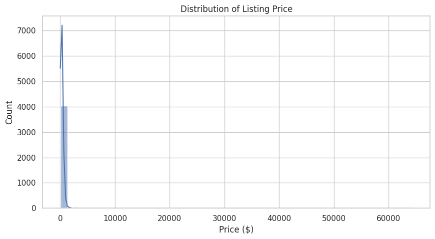
    


    

    


## Price Distribution


```python
# Numerical columns to plot distributions for

num_cols = ['price','accommodates','bedrooms','beds','bathrooms',
            'minimum_nights','maximum_nights','availability_365',
            'number_of_reviews','reviews_per_year','average_review_score']

for c in [x for x in num_cols if x in df.columns]:
    s = df[c].dropna()
    plt.figure()
    plt.hist(s, bins=20)
    save_show(f'{c} distribution (n={len(s)})')
```


    
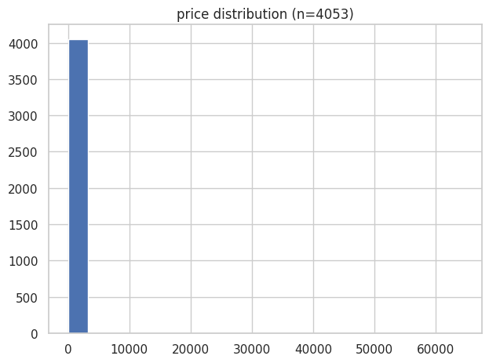
    


    
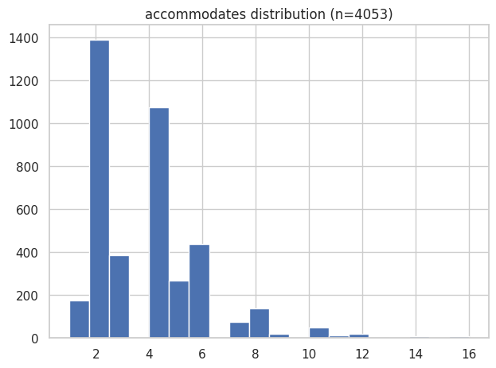
    


    
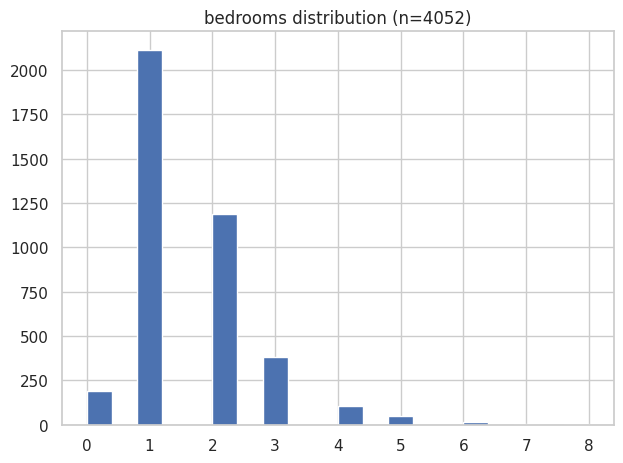
    


    
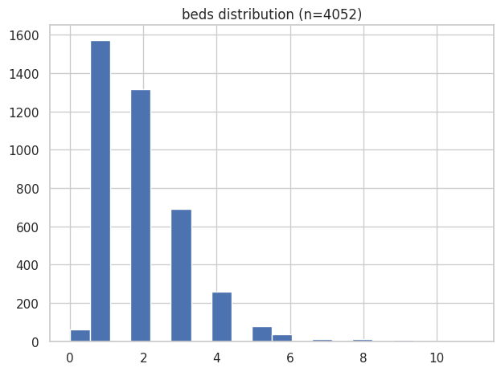
    


    
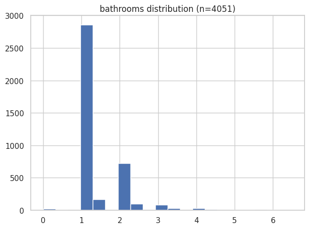
    


    
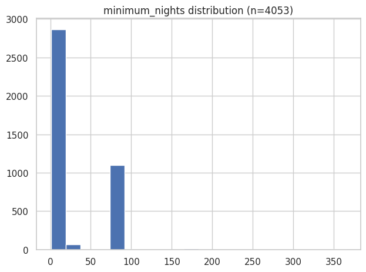
    


    

    


    
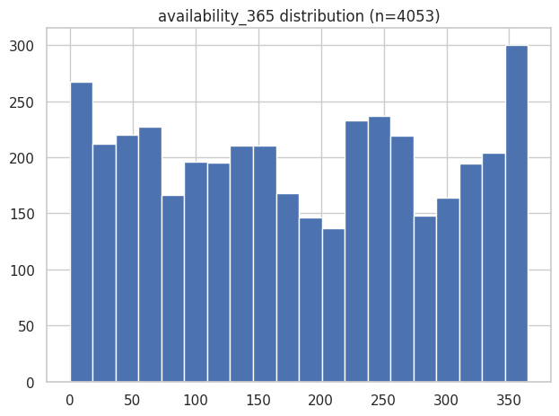
    


    
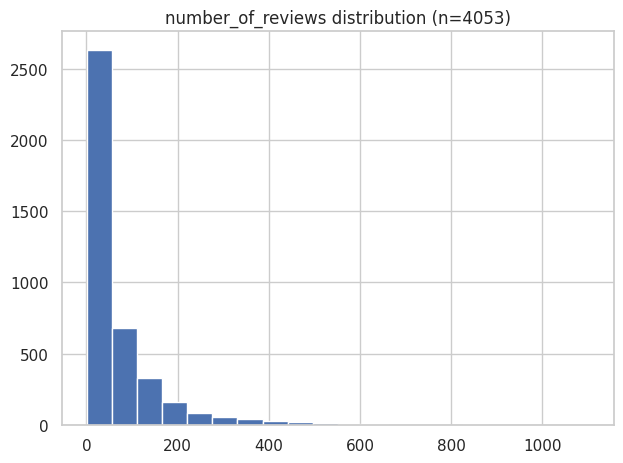
    


    
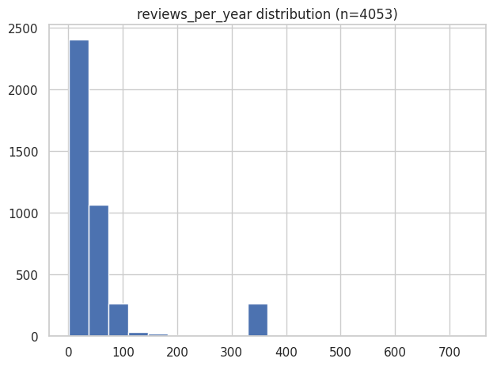
    


    
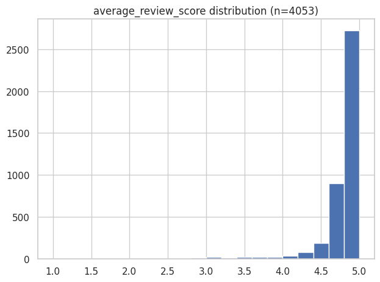
    


## Categorical Columns to Plot Distributions for


```python
#Categorical columns to plot distributions for
for c in ['room_type','property_type','neighbourhood_cleansed','host_is_superhost','instant_bookable', 'host_location_provided', 'neighborhood_has_overview', 'host_has_about']:
    if c in df.columns:
        vc = topk_counts(df[c], 15)
        plt.figure()
        plt.barh(vc.index.astype(str), vc.values)
        save_show(f'{c}: top {len(vc)}')
```


    
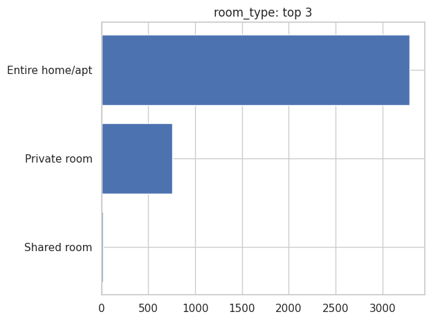
    


    
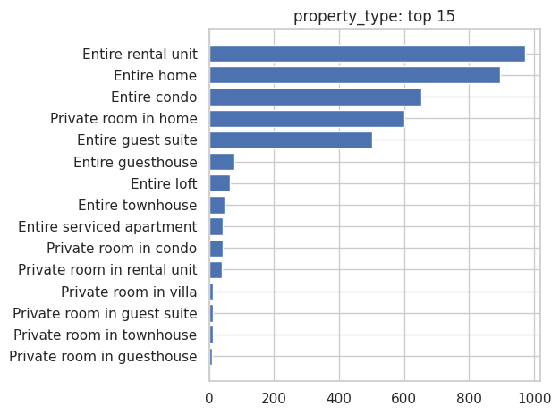
    


    
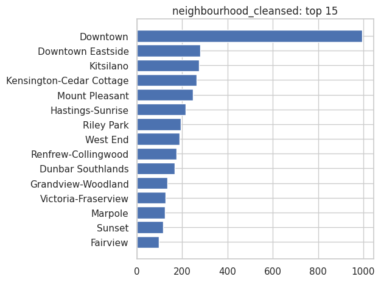
    


    
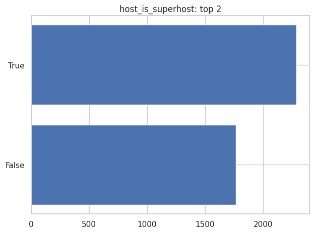
    


    
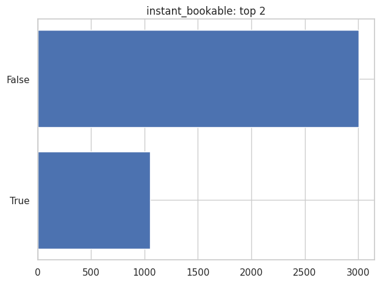
    


    
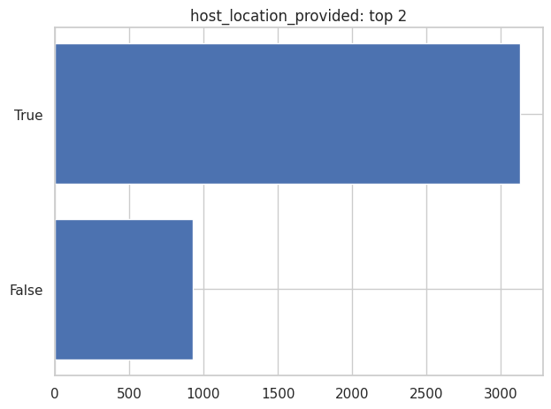
    


    
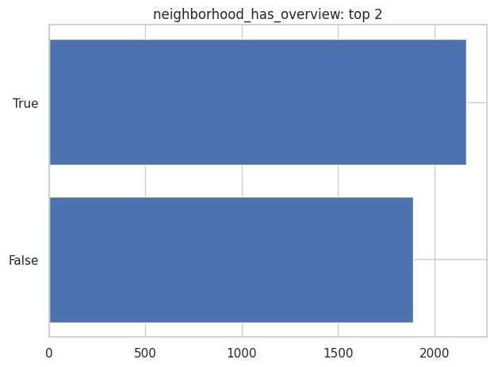
    


    
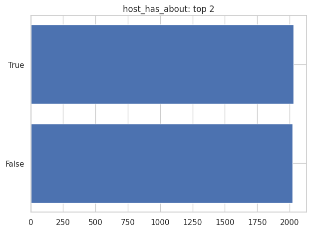
    


## Scatter plot for price and some numerical columns


```python
#Scatter plot for price and some numerical columns
pairs = [
    ('accommodates','price'),
    ('bedrooms','price'),
    ('average_review_score','price'),
    ('reviews_per_year','price')
]
for x,y in pairs:
    if x in df.columns and y in df.columns:
        d = df[[x,y]].dropna()
        plt.figure()
        plt.scatter(d[x], d[y], s=8, alpha=0.5)
        save_show(f'{y} vs {x} (n={len(d)})')

```


    
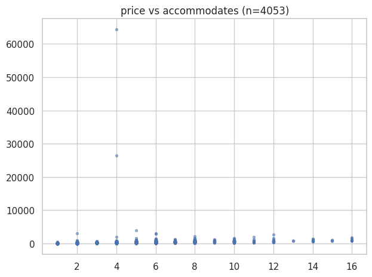
    


    
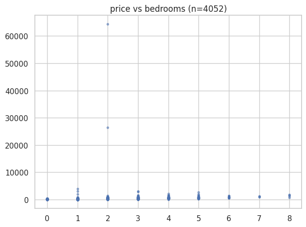
    


    
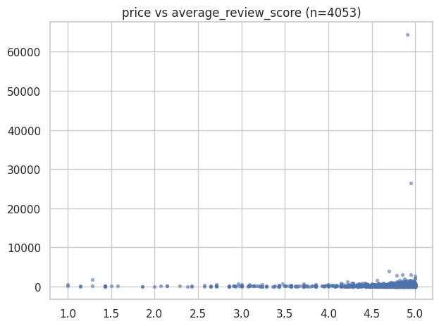
    


    

    


## Correlation Heatmap


```python
#Correlation Heatmap
focus = [c for c in [
    'price','accommodates','bedrooms','beds','bathrooms',
    'minimum_nights','maximum_nights','availability_365',
    'number_of_reviews','reviews_per_year','average_review_score',
    'estimated_occupancy_l365d','estimated_revenue_l365d', 'host_has_about', 'host_location_provided', 'neighborhood_has_overview', 'instant_bookable'
] if c in df.columns]

corr = df[focus].corr()
#Make plots larger for readability
plt.figure(figsize=(10,8))
#Change color map to 'coolwarm' for better visibility
plt.imshow(corr, interpolation='nearest', cmap='coolwarm')
plt.xticks(range(len(focus)), focus, rotation=45, ha='right')
plt.yticks(range(len(focus)), focus)
plt.colorbar()


#Change colorbar to reflect new colormap
#plt.colorbar()
save_show('Correlation matrix (numeric)')

```


    
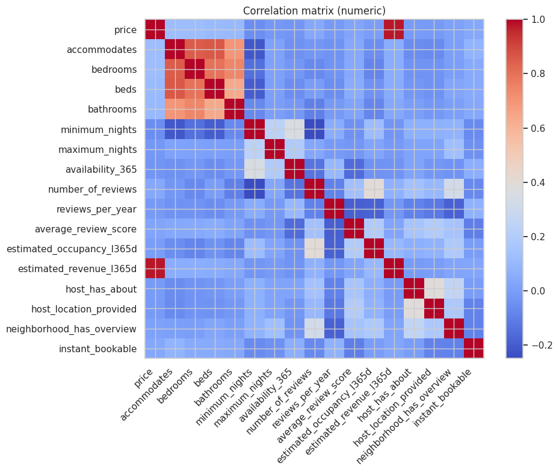
    


### Experimental Heatmap. (DONT SHOW PROF)


```python
# Different heatmap.
import matplotlib.pyplot as plt
import seaborn as sns
import pandas as pd

# Set a professional looking style
sns.set_theme(style="white")

# Define the focus columns, including your new boolean columns
focus_cols = [
    'price', 'accommodates', 'bedrooms', 'beds', 'bathrooms',
    'minimum_nights', 'maximum_nights', 'availability_365',
    'number_of_reviews', 'reviews_per_year', 'average_review_score',
    'estimated_occupancy_l365d', 'estimated_revenue_l365d',
    'host_has_about', 'host_location_provided', 'neighborhood_has_overview',
    'host_is_superhost', 'instant_bookable'
]

# Ensure all focus_cols exist in the DataFrame before proceeding
# This is a good practice to avoid errors if a column is missing
existing_focus_cols = [col for col in focus_cols if col in df.columns]

# Calculate the correlation matrix
corr = df[existing_focus_cols].corr()

# Create a mask for the upper triangle
# This helps remove redundant information since the matrix is symmetrical
mask = np.triu(np.ones_like(corr, dtype=bool))

plt.figure(figsize=(14, 12)) # Increase figure size for better readability
sns.heatmap(
    corr,
    mask=mask,               # Apply the mask to hide the upper triangle
    annot=True,              # Show the correlation values on the heatmap
    fmt=".2f",               # Format annotations to two decimal places
    cmap='coolwarm',         # Choose a diverging colormap
    vmin=-1, vmax=1,         # Ensure the color scale goes from -1 to 1
    linewidths=.5,           # Add lines between cells for clarity
    cbar_kws={"shrink": .8}  # Shrink color bar to fit
)
plt.title('Correlation Matrix of Key Variables', fontsize=18)
plt.xticks(rotation=45, ha='right', fontsize=10) # Rotate x-axis labels
plt.yticks(rotation=0, fontsize=10)             # Keep y-axis labels horizontal
plt.show()
```


    
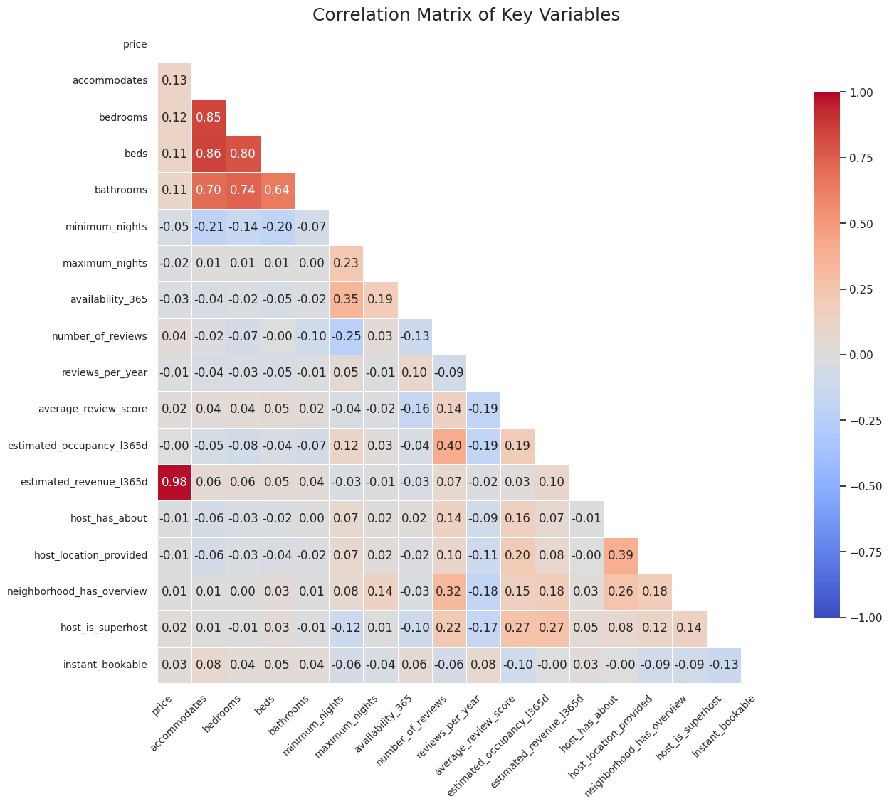
    


# 4. Statistical Analysis

## Difference between host and superhost prices


```python
from scipy import stats

#Statsistical Analysis. Difference between host and superhost prices

# 1. Create two separate groups
superhost_prices = df[df['host_is_superhost'] == True]['price']
host_prices = df[df['host_is_superhost'] == False]['price']

# 2. Perform the two-sample T-test
# We set equal_var=False because the two groups might have different variances
t_stat, p_value = stats.ttest_ind(superhost_prices, host_prices, equal_var=False)

print(f"--- Superhost Price T-Test ---")
print(f"T-statistic: {t_stat:.4f}")
print(f"P-value: {p_value:.4f}")

# 3. Interpret the result
alpha = 0.05 # Standard significance level
if p_value < alpha:
    print("Result: Reject the null hypothesis. There is a significant difference in prices between superhosts and regular hosts.")
else:
    print("Result: Fail to reject the null hypothesis. No significant difference in prices between superhosts and regular hosts.")
```

    --- Superhost Price T-Test ---
    T-statistic: 1.7520
    P-value: 0.0799
    Result: Fail to reject the null hypothesis. No significant difference in prices between superhosts and regular hosts.


## Chi Square. Association Between host_is_superhost and istant_bookable


```python
# Hypothesis test 2: Chi-Square test. Assocation between host_is_superhost and instant_bookable
# Create a contingency table
contingency_table = pd.crosstab(df['host_is_superhost'], df['instant_bookable'])


#Source: https://docs.scipy.org/doc/scipy/reference/generated/scipy.stats.chi2_contingency.html

# Perform the Chi-Square test
chi2, p_value, dof, expected = stats.chi2_contingency(contingency_table)

print(f"\nChi-squared statistic: {chi2:.4f}")
print(f"P-value: {p_value:.4f}")

# 3. Interpret the result
if p_value < alpha:
    print(f"The p-value ({p_value:.4f}) is less than {alpha}.")
    print("We reject the null hypothesis: There IS a significant association.")
else:
    print(f"The p-value ({p_value:.4f}) is greater than {alpha}.")
    print("We fail to reject the null hypothesis: There is NO significant association.")
```

    
    Chi-squared statistic: 71.5490
    P-value: 0.0000
    The p-value (0.0000) is less than 0.05.
    We reject the null hypothesis: There IS a significant association.


## Confidence Intervals. 95% CI for average review score of all listings!


```python
# 1. Get the data and key stats
scores = df['average_review_score'].dropna()
mean_score = scores.mean()
sem_score = scores.sem() # Standard Error of the Mean
confidence = 0.95
degrees_freedom = len(scores) - 1

# 2. Calculate the confidence interval
ci = stats.t.interval(
    confidence,
    degrees_freedom,
    loc=mean_score,
    scale=sem_score
)

print(f"\n--- 95% Confidence Interval for Average Review Score ---")
print(f"Mean Score: {mean_score:.3f}")
print(f"Confidence Interval: ({ci[0]:.3f}, {ci[1]:.3f})")
print(f"We are 95% confident that the true average review score for all listings is between {ci[0]:.3f} and {ci[1]:.3f}.")
```

    
    --- 95% Confidence Interval for Average Review Score ---
    Mean Score: 4.775
    Confidence Interval: (4.764, 4.786)
    We are 95% confident that the true average review score for all listings is between 4.764 and 4.786.


```python
# For price related analysis, filter out extreme outliers. Remove anything more than 20000

df = df[df['price'] < 20000]

#Quick graph to see effect of outlier removal
plt.figure(figsize=(10, 5))
sns.histplot(df['price'], bins=50, kde=True)
plt.title('Distribution of Listing Price (Outliers Removed)')
plt.xlabel('Price ($)')
plt.show()
```


    
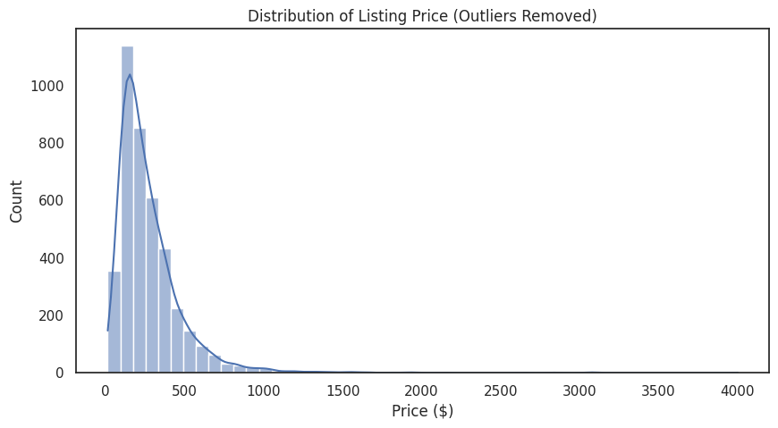
    


```python
df.info()
```

    <class 'pandas.core.frame.DataFrame'>
    Index: 4051 entries, 0 to 5536
    Data columns (total 39 columns):
     #   Column                        Non-Null Count  Dtype         
    ---  ------                        --------------  -----         
     0   id                            4051 non-null   int64         
     1   name                          4051 non-null   object        
     2   description                   4018 non-null   object        
     3   neighborhood_overview         4051 non-null   object        
     4   host_since                    4049 non-null   datetime64[ns]
     5   host_location                 4051 non-null   object        
     6   host_about                    4051 non-null   object        
     7   host_response_rate            3775 non-null   float64       
     8   host_acceptance_rate          3909 non-null   float64       
     9   host_is_superhost             4051 non-null   bool          
     10  host_neighbourhood            3887 non-null   object        
     11  host_total_listings_count     4049 non-null   float64       
     12  host_has_profile_pic          4051 non-null   bool          
     13  host_identity_verified        4051 non-null   bool          
     14  neighbourhood_cleansed        4051 non-null   object        
     15  latitude                      4051 non-null   float64       
     16  longitude                     4051 non-null   float64       
     17  property_type                 4051 non-null   object        
     18  room_type                     4051 non-null   object        
     19  accommodates                  4051 non-null   int64         
     20  bathrooms                     4049 non-null   float64       
     21  bathrooms_text                4048 non-null   object        
     22  bedrooms                      4050 non-null   float64       
     23  beds                          4050 non-null   float64       
     24  amenities                     4051 non-null   object        
     25  price                         4051 non-null   float64       
     26  minimum_nights                4051 non-null   int64         
     27  maximum_nights                4051 non-null   int64         
     28  availability_365              4051 non-null   int64         
     29  number_of_reviews             4051 non-null   int64         
     30  estimated_occupancy_l365d     4051 non-null   int64         
     31  estimated_revenue_l365d       4051 non-null   float64       
     32  instant_bookable              4051 non-null   bool          
     33  average_review_score          4051 non-null   float64       
     34  reviews_per_year              4051 non-null   float64       
     35  max_host_response_time_hours  3775 non-null   float64       
     36  host_has_about                4051 non-null   bool          
     37  neighborhood_has_overview     4051 non-null   bool          
     38  host_location_provided        4051 non-null   bool          
    dtypes: bool(7), datetime64[ns](1), float64(13), int64(7), object(11)
    memory usage: 1.0+ MB


# 5. My Tableau Dashboards but in Jupiter instead of Tableau

## I decided to recreate all my Tableau Dashboards in Jupiter for easier convience and more customization (They're still Tableau as well)

## Tableau Sheet 1. Listing and Plot Map


```python

df["price"].describe()


```


    count    4051.000000
    mean      274.532708
    std       222.127500
    min        14.000000
    25%       140.000000
    50%       218.000000
    75%       346.000000
    max      4001.000000
    Name: price, dtype: float64


### Direct Translation of Tableau Map


```python
import plotly.express as px

price_95th_percentile = df['price'].quantile(0.95)

my_custom_colors = ['lightgreen', 'darkblue', 'purple', 'orange', 'red']

fig = px.scatter_map( 
    df,
    lat="latitude",
    lon="longitude",
    color="price",
    hover_name="name",
    
    hover_data={
        "neighbourhood_cleansed": True,
        "price": ':.2f',
        "latitude": False,
        "longitude": False,
        "accommodates": ':d',          
        "bedrooms": ':d',              
        "bathrooms": ':.1f',           
        "average_review_score": ':.2f', 
        "property_type": True

    },
    
    
    color_continuous_scale=my_custom_colors,  
    range_color=[0, price_95th_percentile],   
    
    zoom=10,
    #map_provider="carto-positron"             # <--- Replaces mapbox_style
)

# Update layout for a cleaner look
fig.update_layout(
    title=f'Listing Price Map (Color Capped at 95th percentile: ${price_95th_percentile:.2f})',
    margin={"r":0, "t":30, "l":0, "b":0}
)

fig.show()
```


### Version 2: Folium Heatmap


```python
import folium
from folium.plugins import HeatMap

# 1. Create a base map centered on your data's average lat/lon
map_center = [df['latitude'].mean(), df['longitude'].mean()]
m = folium.Map(location=map_center, zoom_start=11)

# 2. Create the data for the heatmap
# We need a list of [lat, lon, weight]
# We'll use 'price' as the weight for the heat
heat_data = df[['latitude', 'longitude', 'price']].dropna().values.tolist()

# 3. Add the heatmap layer to the map
HeatMap(heat_data, radius=15).add_to(m)

# 4. Show the map
m
```


<div style="width:100%;"><div style="position:relative;width:100%;height:0;padding-bottom:60%;"><span style="color:#565656">Make this Notebook Trusted to load map: File -> Trust Notebook</span><iframe srcdoc="&lt;!DOCTYPE html&gt;
&lt;html&gt;
&lt;head&gt;

    &lt;meta http-equiv=&quot;content-type&quot; content=&quot;text/html; charset=UTF-8&quot; /&gt;
    &lt;script src=&quot;https://cdn.jsdelivr.net/npm/leaflet@1.9.3/dist/leaflet.js&quot;&gt;&lt;/script&gt;
    &lt;script src=&quot;https://code.jquery.com/jquery-3.7.1.min.js&quot;&gt;&lt;/script&gt;
    &lt;script src=&quot;https://cdn.jsdelivr.net/npm/bootstrap@5.2.2/dist/js/bootstrap.bundle.min.js&quot;&gt;&lt;/script&gt;
    &lt;script src=&quot;https://cdnjs.cloudflare.com/ajax/libs/Leaflet.awesome-markers/2.0.2/leaflet.awesome-markers.js&quot;&gt;&lt;/script&gt;
    &lt;link rel=&quot;stylesheet&quot; href=&quot;https://cdn.jsdelivr.net/npm/leaflet@1.9.3/dist/leaflet.css&quot;/&gt;
    &lt;link rel=&quot;stylesheet&quot; href=&quot;https://cdn.jsdelivr.net/npm/bootstrap@5.2.2/dist/css/bootstrap.min.css&quot;/&gt;
    &lt;link rel=&quot;stylesheet&quot; href=&quot;https://netdna.bootstrapcdn.com/bootstrap/3.0.0/css/bootstrap-glyphicons.css&quot;/&gt;
    &lt;link rel=&quot;stylesheet&quot; href=&quot;https://cdn.jsdelivr.net/npm/@fortawesome/fontawesome-free@6.2.0/css/all.min.css&quot;/&gt;
    &lt;link rel=&quot;stylesheet&quot; href=&quot;https://cdnjs.cloudflare.com/ajax/libs/Leaflet.awesome-markers/2.0.2/leaflet.awesome-markers.css&quot;/&gt;
    &lt;link rel=&quot;stylesheet&quot; href=&quot;https://cdn.jsdelivr.net/gh/python-visualization/folium/folium/templates/leaflet.awesome.rotate.min.css&quot;/&gt;

            &lt;meta name=&quot;viewport&quot; content=&quot;width=device-width,
                initial-scale=1.0, maximum-scale=1.0, user-scalable=no&quot; /&gt;
            &lt;style&gt;
                #map_a40ea56d42d02c8212b11307df50433a {
                    position: relative;
                    width: 100.0%;
                    height: 100.0%;
                    left: 0.0%;
                    top: 0.0%;
                }
                .leaflet-container { font-size: 1rem; }
            &lt;/style&gt;

            &lt;style&gt;html, body {
                width: 100%;
                height: 100%;
                margin: 0;
                padding: 0;
            }
            &lt;/style&gt;

            &lt;style&gt;#map {
                position:absolute;
                top:0;
                bottom:0;
                right:0;
                left:0;
                }
            &lt;/style&gt;

            &lt;script&gt;
                L_NO_TOUCH = false;
                L_DISABLE_3D = false;
            &lt;/script&gt;


    &lt;script src=&quot;https://cdn.jsdelivr.net/gh/python-visualization/folium@main/folium/templates/leaflet_heat.min.js&quot;&gt;&lt;/script&gt;
&lt;/head&gt;
&lt;body&gt;


            &lt;div class=&quot;folium-map&quot; id=&quot;map_a40ea56d42d02c8212b11307df50433a&quot; &gt;&lt;/div&gt;

&lt;/body&gt;
&lt;script&gt;


            var map_a40ea56d42d02c8212b11307df50433a = L.map(
                &quot;map_a40ea56d42d02c8212b11307df50433a&quot;,
                {
                    center: [49.26096242095607, -123.10988666025395],
                    crs: L.CRS.EPSG3857,
                    ...{
  &quot;zoom&quot;: 11,
  &quot;zoomControl&quot;: true,
  &quot;preferCanvas&quot;: false,
}

                }
            );


            var tile_layer_fda28761b39e8e0c9ce6eaaa79e8f4ba = L.tileLayer(
                &quot;https://tile.openstreetmap.org/{z}/{x}/{y}.png&quot;,
                {
  &quot;minZoom&quot;: 0,
  &quot;maxZoom&quot;: 19,
  &quot;maxNativeZoom&quot;: 19,
  &quot;noWrap&quot;: false,
  &quot;attribution&quot;: &quot;\u0026copy; \u003ca href=\&quot;https://www.openstreetmap.org/copyright\&quot;\u003eOpenStreetMap\u003c/a\u003e contributors&quot;,
  &quot;subdomains&quot;: &quot;abc&quot;,
  &quot;detectRetina&quot;: false,
  &quot;tms&quot;: false,
  &quot;opacity&quot;: 1,
}

            );


            tile_layer_fda28761b39e8e0c9ce6eaaa79e8f4ba.addTo(map_a40ea56d42d02c8212b11307df50433a);


            var heat_map_59c1686238fc385d428102ad2723c06d = L.heatLayer(
                [[49.24773, -123.10509, 141.0], [49.28117370605469, -123.1259307861328, 274.0], [49.26557, -123.096, 47.0], [49.27569, -123.07057, 160.0], [49.28299, -123.13008, 75.0], [49.25636, -123.08636, 90.0], [49.23361, -123.05283, 85.0], [49.26216, -123.1715, 350.0], [49.24677, -123.1048, 195.0], [49.27743, -123.11869, 199.0], [49.2729, -123.06973, 146.0], [49.28036, -123.1234, 169.0], [49.27591, -123.12359, 121.0], [49.2452, -123.16544, 158.0], [49.27936, -123.12443, 189.0], [49.26263, -123.10444, 149.0], [49.29103, -123.05782, 100.0], [49.2831284, -123.1033466, 316.0], [49.26293, -123.17143, 298.0], [49.27608, -123.12452, 175.0], [49.27634, -123.11825, 259.0], [49.28211, -123.10453, 292.0], [49.23012285582883, -123.02987849258147, 179.0], [49.284812927246094, -123.05479431152344, 285.0], [49.2828753, -123.1056654, 500.0], [49.28062, -123.11815, 119.0], [49.25099, -123.07457, 550.0], [49.278350830078125, -123.1224136352539, 260.0], [49.25759, -123.06393, 532.0], [49.27917, -123.06246, 80.0], [49.27999, -123.1075, 1014.0], [49.270655316242745, -123.18291314738148, 380.0], [49.29178, -123.14175, 148.0], [49.2506, -123.07175, 55.0], [49.27945, -123.10875, 117.0], [49.28104, -123.13621, 135.0], [49.26026, -123.18195, 153.0], [49.278350830078125, -123.1224136352539, 240.0], [49.278350830078125, -123.1224136352539, 385.0], [49.26355, -123.17326, 150.0], [49.25804, -123.12119, 84.0], [49.27073, -123.16325, 375.0], [49.25473297396569, -123.0858019825957, 137.0], [49.24803, -123.18517, 150.0], [49.27241, -123.06332, 124.0], [49.26110076904297, -123.1595458984375, 1280.0], [49.27925, -123.08814, 129.0], [49.26957, -123.04828, 161.0], [49.24965, -123.07027, 199.0], [49.26716, -123.17653, 360.0], [49.26731, -123.06909, 256.0], [49.26614, -123.06854, 417.0], [49.28361, -123.11536, 316.0], [49.28478, -123.1192, 365.0], [49.2724838256836, -123.06643676757812, 150.0], [49.28247, -123.13068, 75.0], [49.278602600097656, -123.1299057006836, 308.0], [49.24871, -123.09646, 169.0], [49.27637, -123.05049, 244.0], [49.24863, -123.09127, 82.0], [49.28707, -123.12697, 200.0], [49.252771775429096, -123.09304249989589, 108.0], [49.28167, -123.10984, 250.0], [49.28303, -123.10791, 273.0], [49.26548, -123.14579, 200.0], [49.24778, -123.09867, 250.0], [49.27781, -123.10637, 305.0], [49.27866, -123.08627, 180.0], [49.26772, -123.0975, 302.0], [49.263252, -123.164825, 136.0], [49.26057, -123.15881, 903.0], [49.2753, -123.14721, 500.0], [49.28005, -123.11659, 118.0], [49.27118, -123.12591, 110.0], [49.2655, -123.0969, 111.0], [49.26173136782594, -123.0742811232398, 100.0], [49.26597, -123.15633, 250.0], [49.2773, -123.12294, 140.0], [49.26967462014687, -123.18589752736568, 120.0], [49.28298, -123.12339, 150.0], [49.23748, -123.08735, 149.0], [49.27343301745229, -123.11737585067748, 165.0], [49.27117078425855, -123.15370976118434, 340.0], [49.28586959838867, -123.05322265625, 197.0], [49.25865, -123.12294, 80.0], [49.25222, -123.1186, 130.0], [49.28044, -123.12496, 264.0], [49.27109, -123.2088, 142.0], [49.27512, -123.15131, 600.0], [49.25572, -123.06554, 78.0], [49.27992, -123.12658, 603.0], [49.28247, -123.10342, 237.0], [49.279008265460455, -123.11849417484096, 100.0], [49.29314, -123.13535, 113.0], [49.272098541259766, -123.06197357177734, 338.0], [49.2669, -123.18107, 650.0], [49.26366, -123.18138, 174.0], [49.27914, -123.12016, 400.0], [49.24348, -123.03844, 65.0], [49.2498, -123.10378, 120.0], [49.2782, -123.10575, 293.0], [49.27899, -123.12156, 385.0], [49.24730049999999, -123.1706703, 179.0], [49.26867, -123.16656, 472.0], [49.24559, -123.04974, 44.0], [49.27656, -123.11813, 459.0], [49.29169, -123.05097, 923.0], [49.27198, -123.0681, 150.0], [49.24389, -123.0485, 65.0], [49.27166, -123.06616, 170.0], [49.2357, -123.10428, 120.0], [49.2852, -123.13391, 171.0], [49.26037, -123.10503, 122.0], [49.24625, -123.10574, 319.0], [49.25886, -123.10898, 380.0], [49.2719668, -123.0706379, 270.0], [49.26695, -123.16644, 338.0], [49.27585, -123.06803, 229.0], [49.22826, -123.03193, 179.0], [49.28409, -123.12462, 128.0], [49.28109, -123.10671, 150.0], [49.28675, -123.04766, 132.0], [49.23695, -123.03251, 84.0], [49.2748883405625, -123.14991592390604, 655.0], [49.26849, -123.09599, 85.0], [49.26424, -123.20055, 215.0], [49.26041, -123.09035, 163.0], [49.26329, -123.18427, 242.0], [49.27964782714844, -123.12403869628906, 396.0], [49.27469, -123.13217, 608.0], [49.25244, -123.0623, 90.0], [49.261467, -123.082291, 124.0], [49.27517, -123.06581, 368.0], [49.26616, -123.12985, 100.0], [49.24531, -123.09533, 179.0], [49.25872, -123.12185, 85.0], [49.28044227353764, -123.10651285109282, 243.0], [49.2827, -123.1241, 155.0], [49.27638, -123.12394, 88.0], [49.24731, -123.08777, 133.0], [49.27832, -123.12109, 129.0], [49.27012, -123.10454, 270.0], [49.27549, -123.06406, 268.0], [49.24942, -123.12413, 190.0], [49.24554, -123.05089, 192.0], [49.28941, -123.12908, 120.0], [49.27675, -123.06537, 157.0], [49.27555, -123.11307, 135.0], [49.26442, -123.19224, 1650.0], [49.25943, -123.17986, 257.0], [49.24748, -123.10906, 270.0], [49.27949322307594, -123.11875287261006, 367.0], [49.26407, -123.03992, 106.0], [49.26071, -123.09265, 682.0], [49.25076, -123.10873, 145.0], [49.24373, -123.04979, 70.0], [49.28038, -123.02865, 250.0], [49.26994, -123.17403, 998.0], [49.28113, -123.10764, 510.0], [49.28208, -123.10801, 139.0], [49.27177, -123.06063, 548.0], [49.25472, -123.03387, 50.0], [49.2482, -123.09623, 132.0], [49.26073, -123.20173, 168.0], [49.27853, -123.09265, 285.0], [49.27954, -123.0919, 177.0], [49.23443, -123.10683, 403.0], [49.25491, -123.18042, 146.0], [49.25138, -123.11911, 149.0], [49.28215210019974, -123.1071890539446, 242.0], [49.28373, -123.13267, 163.0], [49.28053, -123.02698, 220.0], [49.2308, -123.07286, 129.0], [49.26746, -123.12785, 276.0], [49.27494, -123.10012, 199.0], [49.27041565656077, -123.06965190834626, 175.0], [49.27077, -123.18088, 287.0], [49.28426, -123.02832, 287.0], [49.2725099, -123.062155, 143.0], [49.26103, -123.1857, 126.0], [49.26258, -123.18716, 148.0], [49.25031, -123.1205, 188.0], [49.25275, -123.0406, 163.0], [49.26108, -123.18723, 127.0], [49.28185, -123.10456, 231.0], [49.26023, -123.08671, 108.0], [49.28043, -123.10787, 359.0], [49.25406, -123.09324, 95.0], [49.21311, -123.11348, 58.0], [49.28253, -123.0918, 261.0], [49.25211, -123.03292, 28.0], [49.27991, -123.1054, 181.0], [49.21306, -123.11307, 45.0], [49.21295, -123.11193, 56.0], [49.21231, -123.11193, 58.0], [49.21121, -123.11208, 67.0], [49.21285, -123.11361, 148.0], [49.2792118, -123.1214803, 350.0], [49.25243, -123.0691, 42.0], [49.24963, -123.07277, 77.0], [49.26377, -123.05951, 150.0], [49.27662, -123.096, 245.0], [49.2732, -123.12485, 192.0], [49.25904, -123.12737, 263.0], [49.26132, -123.08084, 130.0], [49.25521, -123.11131, 85.0], [49.22846, -123.09686, 264.0], [49.25945, -123.09143, 180.0], [49.24067, -123.05099, 86.0], [49.28033, -123.1008, 100.0], [49.28295, -123.12323, 150.0], [49.26672, -123.16668, 266.0], [49.27377, -123.14986, 161.0], [49.27546, -123.12481, 302.0], [49.26587, -123.0999, 253.0], [49.27658896005494, -123.04991684604342, 178.0], [49.26682, -123.16654, 382.0], [49.28668, -123.13599, 188.0], [49.27523, -123.12912, 100.0], [49.28301, -123.12357, 425.0], [49.28196, -123.10734, 266.0], [49.27952, -123.12752, 300.0], [49.25315, -123.17653, 106.0], [49.2691, -123.10345, 135.0], [49.25319, -123.03326, 50.0], [49.27214050292969, -123.0706558227539, 463.0], [49.27235, -123.05231, 214.0], [49.27993, -123.11708, 213.0], [49.27779, -123.08743, 505.0], [49.25919, -123.16995, 350.0], [49.25924, -123.10539, 71.0], [49.28024, -123.04351, 122.0], [49.24616, -123.0657, 50.0], [49.26907, -123.17436, 850.0], [49.24993, -123.0749, 194.0], [49.27539, -123.13316, 99.0], [49.27017, -123.20673, 170.0], [49.28256, -123.12658, 185.0], [49.2495, -123.08574, 150.0], [49.27648, -123.04172, 223.0], [49.28692, -123.12493, 479.0], [49.25291, -123.08406, 842.0], [49.26448, -123.12735, 429.0], [49.23517, -123.19427, 206.0], [49.25394, -123.10394, 211.0], [49.26576, -123.16526, 290.0], [49.21434, -123.13249, 105.0], [49.27123, -123.12114, 220.0], [49.27754, -123.12414, 165.0], [49.25061, -123.11302, 199.0], [49.27241, -123.05731, 123.0], [49.23444, -123.1012, 260.0], [49.25977, -123.05534, 112.0], [49.26493, -123.06927, 200.0], [49.24975, -123.10195, 373.0], [49.25456, -123.03492, 57.0], [49.24775, -123.16692, 96.0], [49.28259, -123.10313, 415.0], [49.28235, -123.13587, 99.0], [49.27964, -123.10663, 264.0], [49.28378, -123.10877, 315.0], [49.27941, -123.11725, 315.0], [49.27975, -123.11984, 125.0], [49.27765, -123.13088, 140.0], [49.27236, -123.123, 369.0], [49.2611, -123.11037, 176.0], [49.25018, -123.10531, 814.0], [49.26566, -123.07181, 105.0], [49.27968, -123.1088, 270.0], [49.25868, -123.0938, 187.0], [49.27411, -123.11842, 394.0], [49.27777, -123.06221, 85.0], [49.25432, -123.12369, 356.0], [49.28953, -123.04178, 133.0], [49.23372, -123.07703, 162.0], [49.21684, -123.07936, 180.0], [49.27387, -123.06649, 93.0], [49.26639146348556, -123.06817598201324, 235.0], [49.27363, -123.06443, 103.0], [49.27033, -123.17665, 84.0], [49.2799, -123.09161, 180.0], [49.27683, -123.11942, 231.0], [49.28054, -123.06184, 126.0], [49.23441, -123.0664, 124.0], [49.27904, -123.09246, 232.0], [49.26196, -123.05811, 159.0], [49.2786, -123.10777, 440.0], [49.25423, -123.08951, 245.0], [49.2703595, -123.1012466, 219.0], [49.2715928, -123.1610614, 292.0], [49.23369, -123.06612, 40.0], [49.26716317163536, -123.09802723448364, 200.0], [49.23388, -123.06472, 45.0], [49.25332, -123.12309, 650.0], [49.27497, -123.11716, 170.0], [49.21529526928141, -123.13347751367252, 218.0], [49.264686584472656, -123.15918731689452, 603.0], [49.26446, -123.18001, 316.0], [49.24911, -123.07706, 234.0], [49.24563, -123.18412, 384.0], [49.21255, -123.0574, 72.0], [49.21121, -123.05598, 97.0], [49.23825, -123.1693, 107.0], [49.28109, -123.11987, 198.0], [49.25922018854902, -123.05974312009036, 157.0], [49.21303, -123.05597, 66.0], [49.26612, -123.03956, 135.0], [49.27775, -123.12325, 265.0], [49.26774, -123.17773, 125.0], [49.27369, -123.06303, 145.0], [49.25113, -123.11466, 150.0], [49.25377, -123.04513, 139.0], [49.27926, -123.08715, 150.0], [49.26639, -123.16389, 150.0], [49.21962, -123.09457, 179.0], [49.21308, -123.05564, 72.0], [49.26713, -123.21388, 291.0], [49.26138171648076, -123.10945879539976, 113.0], [49.27947, -123.11835, 120.0], [49.27629, -123.12508, 150.0], [49.26321, -123.16329, 75.0], [49.25117, -123.05318, 256.0], [49.279205, -123.117622, 499.0], [49.26346, -123.16109, 71.0], [49.2775, -123.13086, 140.0], [49.2745237, -123.1278967, 293.0], [49.26637, -123.12938, 600.0], [49.22821260966064, -123.11010184089852, 151.0], [49.27017, -123.15711, 513.0], [49.27165, -123.15073, 560.0], [49.25007, -123.1188, 1571.0], [49.26851, -123.17557, 214.0], [49.2878, -123.12423, 282.0], [49.26793, -123.16231, 360.0], [49.23774, -123.06741, 63.0], [49.28457, -123.04419, 261.0], [49.24942, -123.06658, 193.0], [49.21784, -123.10492, 164.0], [49.27476, -123.12499, 362.0], [49.27905, -123.11948, 100.0], [49.27857, -123.12299, 338.0], [49.27821, -123.13297, 3077.0], [49.259, -123.18672, 690.0], [49.27716, -123.12927, 189.0], [49.27691, -123.12603, 90.0], [49.2792118, -123.1214803, 461.0], [49.23653, -123.07922, 417.0], [49.28464, -123.12435, 480.0], [49.27944, -123.09981, 400.0], [49.27937, -123.1068, 197.0], [49.27797, -123.10868, 207.0], [49.28566, -123.05355, 231.0], [49.25569, -123.12535, 365.0], [49.28440984364186, -123.12249084235997, 120.0], [49.20482, -123.13547, 61.0], [49.25504334322417, -123.08631998436876, 252.0], [49.27926, -123.08806, 401.0], [49.26567, -123.1211, 474.0], [49.28716, -123.12709, 200.0], [49.27951, -123.11818, 149.0], [49.29021, -123.05265, 170.0], [49.23522, -123.07804, 130.0], [49.23711, -123.07616, 130.0], [49.28729248046875, -123.12388610839844, 546.0], [49.26681, -123.09716, 289.0], [49.27704, -123.12395, 150.0], [49.2688, -123.05555, 153.0], [49.2118, -123.11181, 94.0], [49.26504, -123.18525, 450.0], [49.26563, -123.04365, 166.0], [49.27383, -123.20694, 1005.0], [49.2793, -123.10922, 400.0], [49.26824130260767, -123.05606249657598, 149.0], [49.23802, -123.16885, 247.0], [49.21986, -123.09855, 154.0], [49.25546, -123.12465, 368.0], [49.24195, -123.0891, 45.0], [49.24025, -123.1009, 50.0], [49.21718, -123.10661, 162.0], [49.28048228905704, -123.12420001077918, 367.0], [49.27767, -123.12908, 91.0], [49.28823, -123.14223, 550.0], [49.28046, -123.12091, 399.0], [49.27738, -123.07444, 348.0], [49.24532, -123.07588, 209.0], [49.27868, -123.10592, 320.0], [49.25241, -123.09735, 220.0], [49.26082, -123.16845, 195.0], [49.27904, -123.10775, 451.0], [49.27791703199156, -123.1067437797232, 444.0], [49.28631, -123.12253, 86.0], [49.273529, -123.125443, 400.0], [49.25486, -123.12339, 190.0], [49.2798, -123.10891, 708.0], [49.25578, -123.12448, 109.0], [49.21794, -123.14169, 176.0], [49.28046893363854, -123.10769808245792, 316.0], [49.26486, -123.18136, 183.0], [49.27704, -123.12217, 140.0], [49.28045, -123.11172, 372.0], [49.27263, -123.09972, 243.0], [49.27735, -123.12718, 93.0], [49.23218, -123.14359, 65.0], [49.2706896, -123.1892737, 256.0], [49.23298, -123.09754, 47.0], [49.289, -123.04212, 267.0], [49.259, -123.16627, 246.0], [49.25986, -123.12692, 115.0], [49.26144, -123.1851, 130.0], [49.25912, -123.08006, 251.0], [49.27513115584283, -123.03999400138856, 148.0], [49.26584, -123.15036, 304.0], [49.2884, -123.12605, 105.0], [49.23139, -123.15835, 97.0], [49.25421, -123.09876, 829.0], [49.28435, -123.13874, 113.0], [49.26099, -123.10869, 77.0], [49.28072, -123.12483, 138.0], [49.27848, -123.12038, 135.0], [49.24156, -123.04932, 96.0], [49.23602, -123.12417, 215.0], [49.2802, -123.06112, 266.0], [49.23745, -123.09745, 230.0], [49.28261, -123.1029, 327.0], [49.28343179360723, -123.1067825559036, 274.0], [49.269040487804176, -123.06129164803144, 109.0], [49.24188, -123.05401, 83.0], [49.26985, -123.06766, 82.0], [49.25959, -123.18791, 112.0], [49.27813, -123.07205, 199.0], [49.26073, -123.1072, 200.0], [49.27897, -123.12625, 94.0], [49.27979, -123.12022, 120.0], [49.27524, -123.13415, 175.0], [49.2833, -123.12769, 279.0], [49.26024, -123.12837, 135.0], [49.26489, -123.15048, 233.0], [49.25331, -123.11395, 160.0], [49.2326, -123.08251, 109.0], [49.21331, -123.07769, 354.0], [49.26718, -123.16534, 157.0], [49.2466, -123.13585, 256.0], [49.27969, -123.12319, 141.0], [49.26635, -123.16716, 1157.0], [49.26831, -123.10523, 155.0], [49.27754, -123.11257, 120.0], [49.24513, -123.10495, 248.0], [49.28704, -123.13204, 141.0], [49.28254, -123.06454, 110.0], [49.28212, -123.12293, 149.0], [49.26855, -123.13106, 200.0], [49.28603, -123.12555, 108.0], [49.28124, -123.1093, 592.0], [49.27067, -123.18639, 110.0], [49.26978, -123.09867, 83.0], [49.27991, -123.10717, 621.0], [49.2599, -123.18294, 261.0], [49.27305, -123.06801, 184.0], [49.26933, -123.18303, 192.0], [49.23638, -123.10714, 295.0], [49.27411, -123.04884, 153.0], [49.28034, -123.12509, 375.0], [49.25997, -123.09464, 156.0], [49.22366, -123.14858, 180.0], [49.28939, -123.12581, 148.0], [49.27939028980365, -123.12755845798516, 332.0], [49.25985, -123.12696, 155.0], [49.26045, -123.12819, 115.0], [49.29108, -123.04144, 372.0], [49.25459, -123.04589, 136.0], [49.281, -123.12565, 73.0], [49.26163, -123.12813, 125.0], [49.2865, -123.13401, 75.0], [49.26146, -123.12623, 110.0], [49.27268, -123.12848, 191.0], [49.27759, -123.08576, 153.0], [49.26226, -123.20874, 185.0], [49.27774, -123.12774, 94.0], [49.28085, -123.02738, 120.0], [49.24684, -123.08154, 119.0], [49.26017, -123.12838, 150.0], [49.26204, -123.12803, 100.0], [49.27401, -123.14656, 327.0], [49.27899, -123.12323, 426.0], [49.20875, -123.11862, 151.0], [49.266361236572266, -123.11125946044922, 171.0], [49.27906, -123.12552, 485.0], [49.24853, -123.13645, 259.0], [49.2316, -123.0628, 341.0], [49.28572, -123.13395, 80.0], [49.27446, -123.15086, 1044.0], [49.26001, -123.12607, 110.0], [49.27783, -123.12325, 240.0], [49.23310444462189, -123.09872731566746, 149.0], [49.28463, -123.12663, 194.0], [49.27732, -123.12063, 200.0], [49.25975, -123.15536, 206.0], [49.28081, -123.12517, 328.0], [49.24032, -123.10135, 54.0], [49.26746, -123.18358, 255.0], [49.23871, -123.1462, 188.0], [49.27985, -123.08039, 240.0], [49.24922, -123.10643, 177.0], [49.27967834472656, -123.10883331298828, 605.0], [49.28642, -123.1341, 75.0], [49.28402, -123.12917, 386.0], [49.27071, -123.06682, 452.0], [49.27384567260742, -123.12692260742188, 225.0], [49.26986, -123.10616, 154.0], [49.27384567260742, -123.12692260742188, 225.0], [49.27502, -123.12715, 230.0], [49.27384567260742, -123.12692260742188, 268.0], [49.27384567260742, -123.12692260742188, 272.0], [49.27384567260742, -123.12692260742188, 395.0], [49.27539, -123.13316, 123.0], [49.27574, -123.03745, 720.0], [49.2324, -123.15844, 271.0], [49.28518, -123.13326, 72.0], [49.26357, -123.12267, 212.0], [49.24988, -123.0721, 292.0], [49.26652, -123.18185, 471.0], [49.26844, -123.109, 130.0], [49.26158, -123.12615, 100.0], [49.2733, -123.15572, 95.0], [49.2867, -123.12599, 140.0], [49.28861, -123.12006, 200.0], [49.24308, -123.17209, 234.0], [49.25586, -123.12025, 245.0], [49.24895, -123.09842, 347.0], [49.27853393554688, -123.11980438232422, 365.0], [49.27873, -123.10729, 300.0], [49.23357, -123.17007, 133.0], [49.21279, -123.11202, 156.0], [49.27757, -123.13088, 140.0], [49.21777, -123.06271, 160.0], [49.2457108, -123.101237, 339.0], [49.28342339988735, -123.10713609718051, 364.0], [49.25913, -123.08856, 99.0], [49.2424, -123.16399, 257.0], [49.27264, -123.06388, 180.0], [49.21533, -123.1207, 263.0], [49.28043310563751, -123.12473739959262, 260.0], [49.26196, -123.12665, 130.0], [49.27887, -123.10727, 525.0], [49.28078, -123.12474, 125.0], [49.2561, -123.17643, 1537.0], [49.26196, -123.12688, 115.0], [49.27696, -123.02632, 107.0], [49.23362, -123.07861, 94.0], [49.25898, -123.06895, 220.0], [49.25278, -123.11125, 400.0], [49.24383, -123.09361, 138.0], [49.26811, -123.16668, 216.0], [49.20659, -123.11822, 90.0], [49.25998, -123.12644, 120.0], [49.27906933369964, -123.1228992333382, 347.0], [49.22632, -123.11572, 127.0], [49.25997, -123.1276, 135.0], [49.2766, -123.12696, 246.0], [49.25695071312507, -123.151113482409, 600.0], [49.25431, -123.15568, 222.0], [49.28043882521028, -123.12473832943068, 307.0], [49.27834, -123.0267, 123.0], [49.27867, -123.02488, 132.0], [49.2506286215795, -123.07094615423397, 105.0], [49.21307, -123.13501, 113.0], [49.2637, -123.03999, 55.0], [49.25999, -123.12701, 110.0], [49.26186, -123.12752, 160.0], [49.28211, -123.12338, 125.0], [49.27992, -123.10749, 291.0], [49.2795, -123.12098, 35.0], [49.21378, -123.06734, 722.0], [49.27851, -123.10834, 478.0], [49.24665, -123.06903, 226.0], [49.27903, -123.1272, 400.0], [49.25997, -123.12763, 95.0], [49.24111, -123.02775, 173.0], [49.26832, -123.15837, 218.0], [49.23109, -123.03373, 223.0], [49.2781, -123.08991, 208.0], [49.28721, -123.12752, 400.0], [49.26351, -123.07732, 176.0], [49.27743, -123.12961, 224.0], [49.26177, -123.12837, 130.0], [49.2644, -123.04395, 287.0], [49.2637, -123.03999, 58.0], [49.24235, -123.18008, 189.0], [49.28796, -123.12499, 477.0], [49.26239, -123.07531, 253.0], [49.23055, -123.11086, 219.0], [49.2637, -123.03999, 50.0], [49.2246, -123.06162, 159.0], [49.27788, -123.09358, 198.0], [49.25875, -123.16869, 160.0], [49.25937, -123.07393, 172.0], [49.2749, -123.11328, 179.0], [49.25707, -123.06532, 85.0], [49.2811907, -123.0833165, 203.0], [49.23644, -123.10927, 236.0], [49.24059, -123.0787, 193.0], [49.23564, -123.11403, 95.0], [49.23596, -123.11286, 120.0], [49.27096, -123.17555, 652.0], [49.27881, -123.09893, 157.0], [49.24377, -123.0937, 168.0], [49.27763, -123.11549, 360.0], [49.27875, -123.11443, 200.0], [49.26766, -123.10797, 210.0], [49.21893, -123.04533, 237.0], [49.29007, -123.04229, 266.0], [49.27775, -123.08402, 167.0], [49.25137192081954, -123.09585109632144, 275.0], [49.26207, -123.10716, 534.0], [49.28326, -123.116547, 123.0], [49.24936, -123.10836, 178.0], [49.26558, -123.06377, 265.0], [49.27688, -123.02622, 190.0], [49.26192, -123.0744, 215.0], [49.28117, -123.09964, 115.0], [49.2758597, -123.1331378, 403.0], [49.280330237384206, -123.10681117417496, 326.0], [49.275238, -123.066353, 107.0], [49.23149, -123.02698, 142.0], [49.26088, -123.08825, 148.0], [49.277408252453405, -123.13048179712936, 280.0], [49.21219, -123.11335, 52.0], [49.23777, -123.03376, 157.0], [49.21415, -123.11351, 62.0], [49.21356, -123.11131, 49.0], [49.21206, -123.112, 54.0], [49.2796, -123.12021, 35.0], [49.290320464525706, -123.12586081085702, 299.0], [49.27672, -123.14587, 193.0], [49.21456, -123.10065, 189.0], [49.253, -123.18431, 215.0], [49.28704, -123.1321, 68.0], [49.27987, -123.12306, 103.0], [49.267016684594495, -123.05652826989416, 193.0], [49.29208210830669, -123.14210269481684, 200.0], [49.21615, -123.14643, 151.0], [49.2412888617634, -123.10184355448492, 308.0], [49.27507, -123.11667, 235.0], [49.24779510498047, -123.09845733642578, 167.0], [49.27820325841099, -123.10630200035403, 288.0], [49.25334, -123.08245, 121.0], [49.25084, -123.18862, 150.0], [49.23414, -123.04269, 671.0], [49.27854, -123.12318, 359.0], [49.26601, -123.06202, 90.0], [49.27524, -123.1295, 166.0], [49.27547, -123.12861, 343.0], [49.23119, -123.09892, 844.0], [49.23157, -123.09974, 1012.0], [49.22767, -123.03541, 713.0], [49.2789, -123.10792, 1654.0], [49.25974, -123.12675, 90.0], [49.25095, -123.18333, 165.0], [49.28029, -123.12292, 200.0], [49.28714, -123.12987, 115.0], [49.24557, -123.19187, 155.0], [49.27685, -123.03291, 73.0], [49.23892, -123.17921, 210.0], [49.23848, -123.17721, 171.0], [49.2884, -123.12755, 105.0], [49.24117, -123.02709, 95.0], [49.24687, -123.16086, 75.0], [49.27807, -123.12233, 240.0], [49.27807235717773, -123.12232971191406, 260.0], [49.27807235717773, -123.12232971191406, 260.0], [49.23486, -123.06865, 80.0], [49.27286, -123.1511, 169.0], [49.281688664710416, -123.12429447446875, 353.0], [49.28036, -123.10741, 180.0], [49.25466, -123.09249, 404.0], [49.22389, -123.13323, 1339.0], [49.26755, -123.06032, 95.0], [49.25794, -123.18397, 112.0], [49.27939, -123.1205, 35.0], [49.26523, -123.12232, 485.0], [49.24392, -123.09669, 125.0], [49.23933, -123.19086, 167.0], [49.29295, -123.04857, 141.0], [49.2809, -123.10524, 110.0], [49.28366, -123.10672, 200.0], [49.27173, -123.16328, 135.0], [49.28963, -123.13398, 149.0], [49.2834, -123.0552, 294.0], [49.27459, -123.12875, 149.0], [49.22297, -123.07906, 94.0], [49.27702, -123.06032, 333.0], [49.2745865600605, -123.13226711243992, 741.0], [49.26797, -123.17143, 580.0], [49.24424, -123.05248, 405.0], [49.25507, -123.10417, 150.0], [49.21805, -123.06224, 117.0], [49.28112, -123.10733, 165.0], [49.25643930137488, -123.16393069277234, 125.0], [49.27828, -123.1068, 349.0], [49.26811, -123.21718, 182.0], [49.27583, -123.13308, 381.0], [49.22962, -123.08003, 92.0], [49.261, -123.08707, 813.0], [49.28603, -123.12466, 319.0], [49.22962, -123.0798, 88.0], [49.27811, -123.11948, 115.0], [49.23005, -123.15891, 124.0], [49.22988, -123.11226, 242.0], [49.23677, -123.05548, 130.0], [49.27151014157821, -123.16246513077516, 430.0], [49.27043, -123.05802, 221.0], [49.22902, -123.16066, 113.0], [49.22908, -123.17645, 2125.0], [49.25414, -123.07883, 241.0], [49.22895, -123.04251, 78.0], [49.22984, -123.18895, 124.0], [49.2276, -123.08981, 138.0], [49.2781, -123.09955, 206.0], [49.23762, -123.19521, 230.0], [49.24049, -123.09494, 201.0], [49.24282836914063, -123.08840942382812, 257.0], [49.24388, -123.09462, 199.0], [49.23843129999999, -123.0380877, 321.0], [49.26665, -123.06027, 95.0], [49.2667, -123.06024, 190.0], [49.23737, -123.1949, 230.0], [49.27848, -123.10632, 391.0], [49.26672411796333, -123.13075314595385, 213.0], [49.23859, -123.19518, 171.0], [49.2778, -123.12934, 100.0], [49.2584, -123.21416, 351.0], [49.27977, -123.06266, 85.0], [49.2668562, -123.0374151, 165.0], [49.25462, -123.09514, 95.0], [49.26461, -123.1564, 209.0], [49.25358, -123.10384, 171.0], [49.28277, -123.10719, 250.0], [49.24921, -123.10359, 112.0], [49.2631197, -123.0742545, 90.0], [49.24262, -123.03018, 302.0], [49.25839, -123.14987, 236.0], [49.28435, -123.11226, 121.0], [49.28839, -123.13291, 450.0], [49.277179543909234, -123.13156297772314, 208.0], [49.27635, -123.12513, 160.0], [49.24016, -123.19655, 219.0], [49.27905, -123.11899, 319.0], [49.24088, -123.09891, 113.0], [49.28807, -123.12777, 340.0], [49.25295, -123.09351, 197.0], [49.27667, -123.1168, 138.0], [49.24678, -123.05112, 173.0], [49.25996, -123.16221, 329.0], [49.27659, -123.08946, 215.0], [49.28553828078041, -123.12381143226688, 403.0], [49.28492, -123.02658, 155.0], [49.27951, -123.10874, 314.0], [49.27962, -123.12405, 342.0], [49.27665, -123.13257, 250.0], [49.2673, -123.16752, 433.0], [49.23435, -123.06645, 76.0], [49.28717, -123.06147, 130.0], [49.27507, -123.06757, 359.0], [49.27174, -123.16352, 189.0], [49.28343762356069, -123.0911285438743, 339.0], [49.24776, -123.04677, 99.0], [49.28635, -123.12469, 319.0], [49.20915, -123.14363, 138.0], [49.27975309386889, -123.06572665595536, 157.0], [49.24755, -123.0914, 188.0], [49.28616, -123.0526, 176.0], [49.28243, -123.12295, 368.0], [49.26091, -123.09784, 233.0], [49.27839, -123.1257, 702.0], [49.28148, -123.12386, 300.0], [49.26112, -123.12836, 113.0], [49.26822, -123.13579, 130.0], [49.22417, -123.07754, 233.0], [49.29165, -123.13464, 144.0], [49.23736, -123.07747, 91.0], [49.27929, -123.11049, 217.0], [49.26745, -123.09589, 296.0], [49.26318, -123.09845, 135.0], [49.29174, -123.13352, 149.0], [49.28134, -123.06222, 114.0], [49.26327, -123.17857, 172.0], [49.27336, -123.15766, 467.0], [49.26172, -123.10788, 227.0], [49.26102, -123.20051, 303.0], [49.2769, -123.06862, 189.0], [49.27862, -123.12208, 113.0], [49.24835, -123.16907, 153.0], [49.26441, -123.15387, 119.0], [49.25413, -123.1711, 148.0], [49.26547, -123.10135, 413.0], [49.25968399022636, -123.137538369348, 167.0], [49.27502, -123.05987, 276.0], [49.25727, -123.03869, 151.0], [49.21305, -123.11729, 151.0], [49.282975, -123.1080839, 540.0], [49.27184, -123.17601, 523.0], [49.26096, -123.14625, 353.0], [49.24288, -123.07547, 204.0], [49.27952, -123.11905, 145.0], [49.26102, -123.07556, 36.0], [49.26676, -123.14633, 393.0], [49.22286, -123.11803, 91.0], [49.27592, -123.11253, 144.0], [49.23523, -123.11211, 146.0], [49.25183, -123.19204, 167.0], [49.278992, -123.107346, 335.0], [49.21428, -123.11293, 94.0], [49.26212, -123.18366, 264.0], [49.24972, -123.07057, 140.0], [49.25759760276214, -123.06802857667208, 143.0], [49.27805, -123.0853, 236.0], [49.27751, -123.11728, 75.0], [49.27297, -123.12664, 130.0], [49.28421, -123.04696, 508.0], [49.27967834472656, -123.10883331298828, 490.0], [49.26424, -123.0995, 367.0], [49.23534, -123.10049, 489.0], [49.23726, -123.18148, 817.0], [49.25278, -123.08373, 205.0], [49.27847, -123.12381, 551.0], [49.25402, -123.04108, 139.0], [49.27427, -123.12573, 200.0], [49.25319, -123.08629, 199.0], [49.28322, -123.13008, 79.0], [49.27159, -123.16076, 100.0], [49.23529, -123.03426, 156.0], [49.28185, -123.1083, 656.0], [49.25103, -123.06134, 289.0], [49.25301361083984, -123.10452270507812, 203.0], [49.28049, -123.12481, 186.0], [49.21055, -123.13338, 122.0], [49.28854, -123.12238, 292.0], [49.28231826705319, -123.08339708360154, 245.0], [49.24029, -123.09964, 172.0], [49.26615, -123.057, 226.0], [49.27589, -123.13115, 175.0], [49.24011, -123.04379, 109.0], [49.25874710083008, -123.06147003173828, 126.0], [49.28159, -123.10414, 291.0], [49.25078, -123.11917, 238.0], [49.21436, -123.0963, 137.0], [49.27796, -123.10749, 592.0], [49.26871, -123.18393, 230.0], [49.27393057794724, -123.07363901915846, 155.0], [49.24851, -123.07014, 98.0], [49.26342, -123.07864, 100.0], [49.28866, -123.12936, 131.0], [49.28567, -123.13989, 309.0], [49.27976, -123.08836, 298.0], [49.27417, -123.11659, 235.0], [49.28151, -123.10367, 110.0], [49.27495193481445, -123.11550903320312, 145.0], [49.2557, -123.04308, 170.0], [49.25009, -123.06371, 102.0], [49.258474, -123.124651, 108.0], [49.26744, -123.09784, 293.0], [49.2541995, -123.0852983, 534.0], [49.27795, -123.12939, 101.0], [49.2112400444456, -123.14313478767872, 487.0], [49.24027, -123.10175, 74.0], [49.23838, -123.1017, 76.0], [49.27727, -123.12768, 209.0], [49.22158, -123.05063, 135.0], [49.2783, -123.10743, 656.0], [49.26387770537913, -123.12899823486734, 593.0], [49.2789066, -123.1079972, 384.0], [49.2339180314603, -123.193582128364, 219.0], [49.27918192875215, -123.12526361511496, 356.0], [49.25956, -123.18429, 274.0], [49.27822, -123.04075, 203.0], [49.27373, -123.1266, 60.0], [49.27588, -123.09249, 249.0], [49.27301, -123.15554, 449.0], [49.2307, -123.05101, 326.0], [49.28405, -123.12374, 150.0], [49.27273, -123.15974, 419.0], [49.27355, -123.12766, 356.0], [49.27527, -123.12749, 386.0], [49.25172, -123.08561, 71.0], [49.27451, -123.1133, 970.0], [49.27526, -123.11615, 130.0], [49.27521, -123.1258, 189.0], [49.279301, -123.107849, 521.0], [49.2787, -123.1082, 561.0], [49.2224, -123.03965, 201.0], [49.27087, -123.16124, 88.0], [49.28038, -123.10965, 671.0], [49.26956923011597, -123.1815233230591, 193.0], [49.28399, -123.10693, 417.0], [49.23342, -123.16456, 183.0], [49.2368, -123.18303, 317.0], [49.26591033811499, -123.18384921098168, 894.0], [49.23564, -123.08205, 165.0], [49.26732, -123.09615, 255.0], [49.23472, -123.05742, 382.0], [49.23671, -123.09906, 121.0], [49.25152, -123.12495, 95.0], [49.27387, -123.13053, 129.0], [49.25331, -123.03339, 29.0], [49.26619081259344, -123.1475665057771, 416.0], [49.26581, -123.11311, 849.0], [49.28009, -123.10731, 891.0], [49.27891, -123.10844, 418.0], [49.24854, -123.0455, 281.0], [49.2777, -123.09292, 340.0], [49.28763, -123.12287, 333.0], [49.28033, -123.10778, 300.0], [49.27274, -123.12007, 233.0], [49.27967834472656, -123.10883331298828, 716.0], [49.24159, -123.07943, 310.0], [49.28902, -123.0515, 125.0], [49.27831, -123.1212, 310.0], [49.25536, -123.18389, 75.0], [49.27599, -123.13017, 192.0], [49.25609, -123.18397, 59.0], [49.25349, -123.10867, 152.0], [49.24554, -123.09304, 218.0], [49.27804, -123.02883, 327.0], [49.27999, -123.10845, 608.0], [49.28157, -123.10383, 367.0], [49.28088194735095, -123.10958031356904, 225.0], [49.2810173, -123.10638428, 254.0], [49.2787, -123.12266, 210.0], [49.25527, -123.18372, 71.0], [49.26874762662502, -123.06792646257676, 203.0], [49.2593, -123.07432, 36.0], [49.28041611046187, -123.10660374054882, 361.0], [49.23806, -123.17914, 60.0], [49.26523, -123.10084, 286.0], [49.21569, -123.12049, 395.0], [49.25291, -123.12936, 170.0], [49.24876, -123.04477, 776.0], [49.2779605945692, -123.10832738820451, 591.0], [49.25663, -123.18622, 72.0], [49.27897, -123.12185, 385.0], [49.24492, -123.16816, 128.0], [49.21144, -123.06261, 515.0], [49.28368, -123.11152, 210.0], [49.28101, -123.10539, 132.0], [49.27897, -123.10972, 213.0], [49.27807235717773, -123.12232971191406, 240.0], [49.28836068090459, -123.12271305857588, 474.0], [49.23471, -123.10044, 170.0], [49.27833, -123.12235, 292.0], [49.27996, -123.11001, 378.0], [49.28221, -123.10328, 121.0], [49.27495, -123.11642, 168.0], [49.22587, -123.12018, 85.0], [49.26803, -123.14771, 279.0], [49.25931167602539, -123.16561126708984, 235.0], [49.26305608307229, -123.18502159118432, 248.0], [49.25248, -123.07473, 163.0], [49.25081, -123.07603, 122.0], [49.27432831036353, -123.13208190595664, 265.0], [49.26751, -123.18195, 190.0], [49.2149223596695, -123.09458120326798, 139.0], [49.282, -123.12577, 100.0], [49.28108, -123.08976, 115.0], [49.2863, -123.13084, 150.0], [49.26511, -123.15657, 536.0], [49.26115, -123.11512, 189.0], [49.27466, -123.11493, 166.0], [49.20296, -123.1334, 109.0], [49.27533, -123.12906, 153.0], [49.28436, -123.11689, 108.0], [49.26158, -123.08246, 135.0], [49.23972, -123.15498, 235.0], [49.27465, -123.12995, 600.0], [49.23854, -123.05431, 302.0], [49.2763, -123.12921, 470.0], [49.21246, -123.12174, 141.0], [49.28852, -123.12402, 129.0], [49.23680115, -123.1269989, 218.0], [49.24775, -123.18042, 184.0], [49.2772, -123.12207, 193.0], [49.28677, -123.13081, 111.0], [49.2812, -123.12689, 561.0], [49.2817, -123.1244, 105.0], [49.28683, -123.13209, 115.0], [49.27701, -123.12065, 143.0], [49.25495, -123.03506, 47.0], [49.24245, -123.08382, 113.0], [49.27825, -123.12111, 383.0], [49.26285, -123.07554, 250.0], [49.281727, -123.104233, 256.0], [49.28131, -123.10368, 375.0], [49.25566, -123.10702, 73.0], [49.25334, -123.11394, 175.0], [49.25371, -123.08996, 108.0], [49.246829986572266, -123.02652740478516, 98.0], [49.2614, -123.16641, 130.0], [49.27057, -123.0601, 222.0], [49.27986, -123.10879, 565.0], [49.27766, -123.08683, 94.0], [49.22298, -123.13857, 64.0], [49.28668, -123.13184, 163.0], [49.28197, -123.08214, 206.0], [49.27342, -123.12829, 130.0], [49.28948, -123.13273, 109.0], [49.27882, -123.10927, 472.0], [49.25957, -123.06068, 112.0], [49.28012, -123.11698, 135.0], [49.27741, -123.08407, 208.0], [49.24574, -123.0609, 71.0], [49.25457, -123.09779, 214.0], [49.28039, -123.11741, 110.0], [49.28178, -123.12614, 145.0], [49.22970199584961, -123.17666625976562, 867.0], [49.28181, -123.10601, 135.0], [49.25898, -123.16179, 208.0], [49.2795, -123.12002, 285.0], [49.28416, -123.12736, 335.0], [49.282803065323, -123.12551106867932, 378.0], [49.24605, -123.08217, 181.0], [49.28249, -123.10331, 140.0], [49.26641, -123.09584, 204.0], [49.28144, -123.12445, 111.0], [49.2577, -123.07283, 258.0], [49.28051, -123.10771, 253.0], [49.2795, -123.1074, 342.0], [49.25364, -123.05425, 228.0], [49.27346, -123.14844, 428.0], [49.28025, -123.11069, 355.0], [49.25119, -123.10458, 277.0], [49.28076548101497, -123.10037703420996, 405.0], [49.21267, -123.1217, 253.0], [49.25202, -123.08033, 328.0], [49.27793543838386, -123.11855213516664, 546.0], [49.25612, -123.1197, 197.0], [49.27747, -123.09852, 110.0], [49.274403, -123.130981, 91.0], [49.25707, -123.17826, 150.0], [49.257, -123.17841, 225.0], [49.28644, -123.1153, 300.0], [49.24946, -123.06599, 233.0], [49.25597, -123.11363, 180.0], [49.26993, -123.18599, 167.0], [49.2611, -123.08638, 231.0], [49.28006, -123.1232, 382.0], [49.25623764327153, -123.0277770222676, 304.0], [49.2648, -123.10051, 293.0], [49.28406, -123.12215, 530.0], [49.2538, -123.05586, 204.0], [49.24945, -123.1176, 120.0], [49.23512, -123.08339, 340.0], [49.27366, -123.12879, 340.0], [49.24542, -123.10349, 154.0], [49.26016, -123.12614, 90.0], [49.28406, -123.12878, 88.0], [49.26161, -123.10126, 140.0], [49.21604, -123.07046, 225.0], [49.22067, -123.13884, 79.0], [49.26778682216457, -123.13041937916836, 3086.0], [49.28406, -123.12878, 130.0], [49.28406, -123.12878, 107.0], [49.27965, -123.10892, 501.0], [49.212135, -123.142746, 148.0], [49.28406, -123.12878, 139.0], [49.27294, -123.12649, 158.0], [49.27148289942687, -123.04100473352906, 93.0], [49.2527, -123.062, 192.0], [49.27871770749228, -123.09961626552035, 328.0], [49.27618, -123.12412, 175.0], [49.27807, -123.12173, 570.0], [49.27455, -123.13219, 119.0], [49.265, -123.15854, 131.0], [49.271591, -123.161057, 359.0], [49.27857, -123.12364, 341.0], [49.25766, -123.1252, 77.0], [49.2771, -123.06348, 261.0], [49.2868, -123.12484, 259.0], [49.23708, -123.16252, 326.0], [49.29436, -123.13473, 200.0], [49.2752, -123.09992, 384.0], [49.21841, -123.0756, 152.0], [49.27763, -123.02775, 167.0], [49.25875, -123.11044, 154.0], [49.26928, -123.13215, 95.0], [49.26148, -123.08115, 343.0], [49.27903, -123.10124, 228.0], [49.23547, -123.11427, 95.0], [49.27459, -123.1455, 952.0], [49.29073, -123.12754, 108.0], [49.26779, -123.17905, 64.0], [49.28185, -123.12644, 160.0], [49.28126, -123.10823, 241.0], [49.24789, -123.05732, 278.0], [49.2779, -123.12296, 388.0], [49.21267, -123.06414, 101.0], [49.28644, -123.1153, 195.0], [49.21806, -123.14074, 359.0], [49.28021, -123.10461, 143.0], [49.24176, -123.08412, 147.0], [49.26452, -123.10107, 176.0], [49.23208, -123.08063, 89.0], [49.29271, -123.13453, 200.0], [49.25066, -123.16999, 211.0], [49.28696, -123.05642, 1185.0], [49.246181, -123.101997, 109.0], [49.277130126953125, -123.1286392211914, 165.0], [49.2633, -123.14727, 225.0], [49.28344, -123.10375, 120.0], [49.28018, -123.12502, 125.0], [49.25105, -123.1492, 486.0], [49.275593, -123.037743, 168.0], [49.23692, -123.16501, 167.0], [49.24824, -123.09289, 276.0], [49.2928, -123.13653, 403.0], [49.29411, -123.13638, 200.0], [49.29217, -123.13457, 200.0], [49.279781, -123.106384, 165.0], [49.23233, -123.04858, 178.0], [49.21851, -123.07433, 158.0], [49.26291, -123.04073, 50.0], [49.22013, -123.07263, 143.0], [49.26462, -123.04109, 50.0], [49.25973, -123.06928, 183.0], [49.24838, -123.17097, 176.0], [49.27515, -123.11137, 600.0], [49.2589, -123.1645, 240.0], [49.28093, -123.13215, 99.0], [49.2886, -123.13022, 150.0], [49.28108, -123.13112, 125.0], [49.28391, -123.12485, 272.0], [49.29419, -123.13586, 158.0], [49.24943, -123.08702, 208.0], [49.272385, -123.159279, 350.0], [49.27927321799798, -123.10776764076348, 145.0], [49.21484756469727, -123.07687377929688, 65.0], [49.21484756469727, -123.07687377929688, 65.0], [49.21766, -123.11684, 175.0], [49.27973, -123.07267, 117.0], [49.26481, -123.08488, 168.0], [49.28012, -123.10545, 277.0], [49.29363, -123.13651, 200.0], [49.21683, -123.14906, 387.0], [49.27652, -123.07521, 258.0], [49.28696, -123.12298, 222.0], [49.28093, -123.13129, 122.0], [49.28108, -123.13281, 105.0], [49.2302182021809, -123.04868022168148, 525.0], [49.28269, -123.13118, 145.0], [49.28343, -123.1279, 95.0], [49.229675, -123.13176, 226.0], [49.283863, -123.135788, 239.0], [49.22013, -123.07361, 185.0], [49.28341, -123.12966, 88.0], [49.28268, -123.13277, 125.0], [49.24869, -123.10502, 241.0], [49.26102, -123.06448, 144.0], [49.28791304946223, -123.12468598957108, 1086.0], [49.28012, -123.11807, 177.0], [49.27378, -123.11588, 238.0], [49.21476, -123.09021, 269.0], [49.25619, -123.07367, 576.0], [49.27883911, -123.10739899, 287.0], [49.28384, -123.12371, 143.0], [49.27799, -123.11139, 145.0], [49.28028, -123.10621, 333.0], [49.20227, -123.13412, 80.0], [49.21478, -123.14897, 88.0], [49.26661, -123.0567, 389.0], [49.26571, -123.05677, 175.0], [49.21473, -123.09433, 134.0], [49.26296, -123.10715, 758.0], [49.27796, -123.11853, 955.0], [49.25503, -123.07242, 380.0], [49.240516662597656, -123.04491424560548, 156.0], [49.22589, -123.05035, 101.0], [49.24014, -123.05817, 78.0], [49.27876706409901, -123.1075405329466, 672.0], [49.28055410062965, -123.12458890636408, 220.0], [49.2759, -123.11432, 151.0], [49.27398, -123.11435, 168.0], [49.26075, -123.07016, 36.0], [49.28065, -123.07268, 634.0], [49.280106, -123.108513, 200.0], [49.23929, -123.0323, 95.0], [49.22643, -123.09187, 234.0], [49.26918, -123.03743, 42.0], [49.27926, -123.11004, 364.0], [49.27813, -123.12249, 313.0], [49.26862, -123.16129, 338.0], [49.22571, -123.0248, 193.0], [49.28856, -123.05462, 180.0], [49.25923, -123.09073, 209.0], [49.28193, -123.08341, 203.0], [49.26059, -123.08626, 221.0], [49.278175556128815, -123.1205096241264, 389.0], [49.28981, -123.04691, 135.0], [49.27804, -123.12067, 442.0], [49.27885, -123.10595, 333.0], [49.271172, -123.176331, 350.0], [49.269785, -123.0641753, 188.0], [49.27933264408775, -123.1099990981301, 533.0], [49.20967, -123.14499, 117.0], [49.27497, -123.1168, 198.0], [49.27846, -123.10652, 324.0], [49.23589442335483, -123.07605636738684, 118.0], [49.2805, -123.10714, 333.0], [49.26018, -123.1552, 125.0], [49.23888, -123.08173, 219.0], [49.28001, -123.12241, 119.0], [49.2814, -123.1179, 416.0], [49.26313, -123.17929, 95.0], [49.23614, -123.0482, 79.0], [49.279301, -123.107849, 423.0], [49.27418, -123.11587, 200.0], [49.27370181446431, -123.12821724602624, 289.0], [49.2781, -123.10615, 335.0], [49.23859, -123.05309, 95.0], [49.28359, -123.10402, 423.0], [49.275428771972656, -123.1332778930664, 800.0], [49.28321, -123.10242, 375.0], [49.2466, -123.06222, 106.0], [49.21847, -123.09666, 669.0], [49.24671, -123.05463, 195.0], [49.280945, -123.124832, 140.0], [49.2711, -123.03672, 212.0], [49.28112, -123.10627, 229.0], [49.28335, -123.10424, 258.0], [49.29081, -123.04819, 163.0], [49.2446, -123.10432, 154.0], [49.26975, -123.14841, 140.0], [49.272188718408216, -123.10244852325776, 314.0], [49.28045, -123.126, 120.0], [49.25254, -123.11116, 271.0], [49.26742, -123.09996, 100.0], [49.27995199999999, -123.1074082, 394.0], [49.278891799880014, -123.1099067793186, 582.0], [49.26004, -123.183, 141.0], [49.28224, -123.02616, 298.0], [49.27389, -123.12902, 344.0], [49.28877, -123.13182, 118.0], [49.26749, -123.04195, 244.0], [49.22765212917798, -123.18411766910712, 170.0], [49.278488, -123.129669, 263.0], [49.2812121, -123.1251379, 386.0], [49.271198, -123.176323, 350.0], [49.278667, -123.12056, 120.0], [49.242146, -123.183434, 303.0], [49.26872622933283, -123.14215691217196, 372.0], [49.24686, -123.02656, 373.0], [49.27027, -123.10973, 275.0], [49.27429, -123.11537, 203.0], [49.26803, -123.11805, 608.0], [49.278667, -123.12056, 100.0], [49.2678, -123.10022, 318.0], [49.262623, -123.073257, 110.0], [49.27372, -123.14707, 728.0], [49.27699, -123.09089, 193.0], [49.283146, -123.103371, 298.0], [49.27509, -123.11849, 455.0], [49.27151, -123.16727, 330.0], [49.22012, -123.05567, 73.0], [49.26854, -123.10974, 275.0], [49.278992, -123.108124, 438.0], [49.29231, -123.13646, 200.0], [49.21975, -123.10647, 133.0], [49.23862, -123.05881, 152.0], [49.278839111328125, -123.1073989868164, 472.0], [49.25384, -123.11282, 225.0], [49.24668502807617, -123.10363006591795, 247.0], [49.27784, -123.12782, 251.0], [49.28579, -123.12372, 274.0], [49.24668, -123.09273, 204.0], [49.270973, -123.148743, 566.0], [49.26946, -123.10007, 321.0], [49.26969, -123.10193, 314.0], [49.27004, -123.10029, 264.0], [49.26779, -123.10126, 212.0], [49.26434, -123.03881, 63.0], [49.27717, -123.12793, 187.0], [49.24306, -123.06606, 245.0], [49.24176, -123.05637, 125.0], [49.26672, -123.17683, 490.0], [49.24977856089216, -123.051698163158, 229.0], [49.26473, -123.13159, 220.0], [49.26039, -123.07146, 245.0], [49.23287, -123.03256, 210.0], [49.26072, -123.08679, 544.0], [49.27948, -123.12846, 360.0], [49.2502, -123.04452, 159.0], [49.28157, -123.10425, 404.0], [49.26944, -123.17919, 85.0], [49.2840690612793, -123.1290283203125, 108.0], [49.22959, -123.02697, 293.0], [49.2147, -123.14397, 156.0], [49.2840690612793, -123.1290283203125, 125.0], [49.27991, -123.10842, 525.0], [49.251207520783126, -123.11359128446576, 228.0], [49.278839, -123.107399, 456.0], [49.24713, -123.03256, 168.0], [49.25062, -123.05418, 116.0], [49.27325, -123.07023, 226.0], [49.27738, -123.10027, 200.0], [49.28027, -123.12401, 189.0], [49.28117, -123.12637, 125.0], [49.25936, -123.18241, 178.0], [49.2498, -123.05363, 162.0], [49.226768, -123.071358, 125.0], [49.27231, -123.14955, 270.0], [49.251869, -123.07547, 202.0], [49.251869, -123.07547, 213.0], [49.251869, -123.07547, 161.0], [49.28545, -123.12414, 158.0], [49.27680587768555, -123.1292495727539, 240.0], [49.27680587768555, -123.1292495727539, 260.0], [49.27680587768555, -123.1292495727539, 385.0], [49.28429, -123.13437, 200.0], [49.27680587768555, -123.1292495727539, 240.0], [49.27680587768555, -123.1292495727539, 260.0], [49.29246, -123.13475, 200.0], [49.27786, -123.11915, 325.0], [49.29046, -123.04278, 374.0], [49.26093, -123.10725, 533.0], [49.27852, -123.10683, 649.0], [49.26881, -123.10947, 122.0], [49.26519, -123.17573, 442.0], [49.27846, -123.12076, 365.0], [49.24949, -123.05988, 137.0], [49.25316, -123.09006, 260.0], [49.27995199999999, -123.1074082, 402.0], [49.27197, -123.06091, 315.0], [49.2742, -123.11429, 131.0], [49.25382, -123.03675, 250.0], [49.26581, -123.09625, 437.0], [49.28649, -123.12461, 346.0], [49.2759236190407, -123.10213336878662, 368.0], [49.28042, -123.12475, 589.0], [49.27981, -123.10838, 393.0], [49.23598, -123.04825, 172.0], [49.2754303, -123.1332786, 452.0], [49.27797, -123.03602, 289.0], [49.27052, -123.10956, 158.0], [49.27373, -123.11609, 250.0], [49.26145, -123.17353, 370.0], [49.25136, -123.03416, 212.0], [49.27556, -123.11598, 152.0], [49.27681, -123.12711, 281.0], [49.27595, -123.12827, 192.0], [49.26192, -123.03705, 445.0], [49.25173, -123.07252, 399.0], [49.21696, -123.1139, 281.0], [49.28827910504022, -123.12354171177466, 4001.0], [49.24384, -123.08696, 190.0], [49.274239, -123.125465, 126.0], [49.2702, -123.16161, 90.0], [49.255, -123.07054, 202.0], [49.28843, -123.12406, 377.0], [49.27659, -123.06246, 125.0], [49.26604, -123.10004, 143.0], [49.275288, -123.115334, 293.0], [49.27729, -123.12597, 102.0], [49.22839, -123.06437, 85.0], [49.27928, -123.1249, 99.0], [49.22852, -123.06424, 122.0], [49.27936, -123.11803, 295.0], [49.27930069, -123.10700226, 401.0], [49.27125, -123.1498, 1430.0], [49.27538, -123.11415, 250.0], [49.27502, -123.12242, 239.0], [49.22251, -123.12757, 95.0], [49.27935, -123.10834, 372.0], [49.2473, -123.02912, 388.0], [49.281239, -123.12545, 397.0], [49.27005, -123.10171, 74.0], [49.28935, -123.12272, 396.0], [49.2797209, -123.1088738, 428.0], [49.24213069732027, -123.0421808200668, 153.0], [49.28766, -123.14036, 147.0], [49.2793, -123.10795, 266.0], [49.27754, -123.10042, 279.0], [49.28378, -123.10693, 280.0], [49.28002755575413, -123.12537889523058, 380.0], [49.283524320173576, -123.10432173256105, 110.0], [49.28884, -123.12675, 150.0], [49.23203, -123.09876, 234.0], [49.278, -123.12599, 150.0], [49.26782, -123.1734, 400.0], [49.23381, -123.19242, 103.0], [49.23349, -123.19252, 93.0], [49.26092, -123.08867, 419.0], [49.28421, -123.05834, 165.0], [49.23394, -123.06891, 80.0], [49.25846, -123.15491, 146.0], [49.27838, -123.10661, 463.0], [49.27841, -123.10618, 421.0], [49.23562, -123.19262, 75.0], [49.240989685058594, -123.08826446533205, 121.0], [49.23486, -123.19451, 75.0], [49.25469, -123.11014, 925.0], [49.25313, -123.08254, 110.0], [49.27811, -123.12212, 325.0], [49.28038, -123.10859, 496.0], [49.27873, -123.10688, 238.0], [49.28002, -123.10582, 223.0], [49.27634, -123.12594, 321.0], [49.27515, -123.05531, 99.0], [49.27538, -123.12665, 130.0], [49.22626, -123.08721, 160.0], [49.2787, -123.10715, 451.0], [49.27579, -123.12648, 171.0], [49.28235, -123.12427, 201.0], [49.28059, -123.09934, 240.0], [49.27818, -123.12246, 343.0], [49.2799787, -123.1266864, 230.0], [49.28212, -123.08236, 219.0], [49.25772, -123.1667, 280.0], [49.26142, -123.08861, 132.0], [49.27111074233997, -123.1602433067169, 301.0], [49.23492, -123.08652, 126.0], [49.2342, -123.08449, 119.0], [49.23206, -123.04752, 104.0], [49.21025, -123.13411, 146.0], [49.26702374731058, -123.03910863754602, 76.0], [49.26728, -123.11363, 160.0], [49.22287, -123.04107, 204.0], [49.27992, -123.12284, 245.0], [49.253902, -123.165993, 202.0], [49.25564, -123.10419, 246.0], [49.25953, -123.10567, 500.0], [49.264004, -123.121536, 215.0], [49.28154, -123.10701, 200.0], [49.2078967264244, -123.12633990790576, 143.0], [49.28111, -123.13672, 266.0], [49.279823, -123.10849, 453.0], [49.25137729999999, -123.0993979, 204.0], [49.23386, -123.18912, 178.0], [49.272854499014, -123.02815181189428, 318.0], [49.2369, -123.155678, 170.0], [49.26727, -123.14891, 336.0], [49.27039, -123.11108, 282.0], [49.2374, -123.16893, 185.0], [49.27306, -123.15072, 495.0], [49.27944, -123.10722, 1328.0], [49.25239, -123.06405, 115.0], [49.28068, -123.12433, 188.0], [49.29158, -123.13427, 165.0], [49.24939, -123.06427, 135.0], [49.281181, -123.12558, 305.0], [49.28478, -123.02852, 126.0], [49.27547, -123.02882, 204.0], [49.25585, -123.11175, 205.0], [49.28010559082031, -123.10851287841795, 257.0], [49.278812, -123.09893, 389.0], [49.279613, -123.124092, 208.0], [49.23302636598175, -123.06821170080114, 612.0], [49.27831211091659, -123.1079287151696, 335.0], [49.26006, -123.1636, 120.0], [49.28751, -123.12616, 284.0], [49.2767, -123.02491, 81.0], [49.24876, -123.08629, 558.0], [49.27822, -123.10869, 461.0], [49.2784951, -123.1296296, 360.0], [49.27449, -123.12221, 242.0], [49.23886, -123.06527, 255.0], [49.27895830650945, -123.10859247168388, 298.0], [49.274548, -123.127823, 344.0], [49.279212, -123.1214878, 273.0], [49.27995, -123.1226, 315.0], [49.28554916381836, -123.12384796142578, 169.0], [49.27413079999999, -123.1188715, 170.0], [49.27929, -123.12049, 600.0], [49.27559, -123.11814, 185.0], [49.28218, -123.1066, 210.0], [49.26858, -123.10962, 1037.0], [49.2840227177156, -123.12670045289128, 105.0], [49.26216428878515, -123.07542039714656, 97.0], [49.25424, -123.07215, 90.0], [49.277103, -123.128587, 115.0], [49.24442, -123.09038, 572.0], [49.27748233160327, -123.12795601208448, 325.0], [49.26946, -123.10095, 293.0], [49.24516, -123.09705, 250.0], [49.28004, -123.10649, 482.0], [49.21678, -123.0984, 139.0], [49.28809643361038, -123.1233687967007, 321.0], [49.27585, -123.1317, 139.0], [49.2340869, -123.1748362, 191.0], [49.25204, -123.07269, 122.0], [49.2130759, -123.1188481, 220.0], [49.27293, -123.1263, 260.0], [49.25407, -123.05079, 139.0], [49.23880253867669, -123.18772383034228, 209.0], [49.27664, -123.10189, 275.0], [49.27816, -123.10682, 400.0], [49.25521, -123.09996, 244.0], [49.2362691, -123.1886894, 91.0], [49.27936, -123.12872, 438.0], [49.20538, -123.03916, 89.0], [49.27103, -123.05615, 153.0], [49.28013, -123.10564, 342.0], [49.262, -123.19873, 714.0], [49.27845, -123.10952, 411.0], [49.22111, -123.13951, 55.0], [49.28499, -123.11303, 235.0], [49.2814341, -123.1251497, 250.0], [49.29225, -123.13406, 280.0], [49.27056424976861, -123.14704908116254, 327.0], [49.261087, -123.1475952, 450.0], [49.25492934018106, -123.05510358589068, 268.0], [49.22815, -123.03142, 179.0], [49.22784, -123.03209, 179.0], [49.25377, -123.07913, 441.0], [49.27842, -123.10661, 105.0], [49.25852, -123.0783, 129.0], [49.28091, -123.10855, 1089.0], [49.25501047657751, -123.04057089429774, 256.0], [49.27082, -123.06302, 170.0], [49.27239, -123.06225, 96.0], [49.27859, -123.10759, 277.0], [49.26953, -123.18824, 243.0], [49.25288, -123.05982, 282.0], [49.27776, -123.12797, 293.0], [49.27681, -123.12711, 294.0], [49.2592691, -123.1662046, 470.0], [49.28120041, -123.08300018, 250.0], [49.27596299003546, -123.12780558011984, 486.0], [49.27825, -123.10897, 279.0], [49.27486, -123.12695, 138.0], [49.2867, -123.12244, 427.0], [49.28240581200244, -123.1033614184367, 365.0], [49.2866, -123.12427, 321.0], [49.27849, -123.12056, 267.0], [49.2316, -123.07642, 540.0], [49.27639394461648, -123.1339965915638, 475.0], [49.24222, -123.13181, 116.0], [49.2788, -123.12353, 417.0], [49.24644, -123.16283, 221.0], [49.22122, -123.13905, 60.0], [49.25694, -123.1917, 119.0], [49.2293099, -123.0740776, 122.0], [49.27601, -123.06196, 90.0], [49.27982, -123.10877, 500.0], [49.28210117916591, -123.12442108337942, 70.0], [49.2588, -123.1129, 72.0], [49.25923, -123.11318, 63.0], [49.22115, -123.0355, 181.0], [49.27795, -123.10663, 591.0], [49.2304791887396, -123.18277927577113, 368.0], [49.260925462746606, -123.16779680094524, 468.0], [49.2811907, -123.0833165, 293.0], [49.26012, -123.11318, 60.0], [49.28333, -123.10374, 365.0], [49.2789066, -123.1079972, 748.0], [49.280378331610905, -123.12240686131214, 414.0], [49.27765, -123.09842, 224.0], [49.27822, -123.10884, 250.0], [49.24563, -123.0335, 284.0], [49.27919, -123.13501, 287.0], [49.28770830000001, -123.1267022, 116.0], [49.2302198, -123.1071646, 175.0], [49.27546, -123.13177, 142.0], [49.2695474, -123.1100617, 109.0], [49.28145, -123.10438, 255.0], [49.25375, -123.10959, 102.0], [49.24432, -123.10309, 22.0], [49.2750616, -123.0664113, 296.0], [49.2792118, -123.1214803, 299.0], [49.24515, -123.06148, 149.0], [49.279495, -123.107396, 958.0], [49.2510249, -123.107348, 85.0], [49.2814341, -123.1251497, 130.0], [49.2601, -123.07029, 193.0], [49.2792813, -123.1065474, 249.0], [49.23383, -123.06201, 154.0], [49.26481270554963, -123.10073666904502, 247.0], [49.25908, -123.21191, 205.0], [49.27736, -123.11887, 283.0], [49.2369005, -123.1556804, 170.0], [49.2915, -123.13433, 144.0], [49.26631, -123.09891, 527.0], [49.21318, -123.10445, 302.0], [49.2410339, -123.0760858, 81.0], [49.27774, -123.12797, 125.0], [49.26902, -123.14782, 127.0], [49.26286646190723, -123.10040635705202, 146.0], [49.2677, -123.16022, 1116.0], [49.28529, -123.12843, 88.0], [49.23052, -123.05664, 116.0], [49.28183, -123.10474, 271.0], [49.2445, -123.08716, 605.0], [49.27835, -123.12893, 100.0], [49.27937, -123.10843, 458.0], [49.27538, -123.12691, 350.0], [49.28624586734994, -123.12902281234015, 729.0], [49.23408, -123.06162, 90.0], [49.27226599999999, -123.1523703, 272.0], [49.245349324119104, -123.06815665215257, 373.0], [49.25746, -123.1822, 226.0], [49.25689, -123.12505, 160.0], [49.27868, -123.10825, 697.0], [49.25436, -123.07407, 92.0], [49.25916, -123.10919, 175.0], [49.2596079, -123.1102483, 270.0], [49.234, -123.06169, 66.0], [49.23408, -123.06201, 78.0], [49.21665, -123.13265, 307.0], [49.27428, -123.12665, 128.0], [49.28024, -123.11693, 159.0], [49.2588, -123.15313, 211.0], [49.28642, -123.12405, 333.0], [49.25551, -123.10429, 175.0], [49.28038, -123.13449, 174.0], [49.25481, -123.09012, 150.0], [49.23561, -123.08572, 184.0], [49.2554, -123.1908, 270.0], [49.2369961, -123.0710575, 164.0], [49.21309, -123.12802, 166.0], [49.2826264, -123.106234, 94.0], [49.231, -123.02571, 187.0], [49.2312, -123.1629, 130.0], [49.28181, -123.13104, 75.0], [49.2534866, -123.1015492, 132.0], [49.27874281025954, -123.10733462698364, 170.0], [49.260389272969846, -123.0930430977194, 123.0], [49.26105, -123.18639, 309.0], [49.25922, -123.10925, 160.0], [49.27461, -123.13199, 139.0], [49.222693250777375, -123.08231008537102, 180.0], [49.26850834744048, -123.05471140891314, 129.0], [49.28344, -123.10905, 264.0], [49.23082657572055, -123.06884329259032, 241.0], [49.27662738212916, -123.13447364462571, 2626.0], [49.226358343012286, -123.0675980625656, 438.0], [49.25285669204549, -123.08732249025216, 411.0], [49.24951, -123.03699, 170.0], [49.26051, -123.11124, 160.0], [49.21891, -123.14209, 367.0], [49.25146, -123.0503, 266.0], [49.25989, -123.10937, 230.0], [49.26037, -123.11118, 175.0], [49.27979, -123.1168, 185.0], [49.2598, -123.10894, 350.0], [49.25949, -123.10944, 160.0], [49.28014, -123.12195, 282.0], [49.28121, -123.08277, 249.0], [49.25179, -123.10887, 132.0], [49.27894, -123.12771, 675.0], [49.24481309999999, -123.0808711, 143.0], [49.27935304172432, -123.10657690429916, 644.0], [49.2796404, -123.1088566, 436.0], [49.2813495, -123.0827452, 150.0], [49.21288, -123.12334, 193.0], [49.25966, -123.12825, 120.0], [49.25482, -123.12428, 132.0], [49.25167, -123.08433, 219.0], [49.24813, -123.0908, 173.0], [49.27191, -123.10535, 442.0], [49.21617, -123.1324, 188.0], [49.22461, -123.06656, 378.0], [49.23781, -123.17386, 119.0], [49.27234742089277, -123.07175565753724, 108.0], [49.2649898, -123.0864467, 208.0], [49.26068, -123.16454, 266.0], [49.2381, -123.17274, 100.0], [49.264694984626246, -123.15630309283732, 392.0], [49.26264, -123.19019, 288.0], [49.27771, -123.12943, 299.0], [49.2931624, -123.1353359, 160.0], [49.206892863993474, -123.05550584615976, 99.0], [49.27701, -123.10062, 193.0], [49.27608, -123.11463, 200.0], [49.24556, -123.10977, 103.0], [49.26555312362871, -123.09913825886076, 439.0], [49.27846049999999, -123.0349877, 76.0], [49.2823, -123.06708, 317.0], [49.27822, -123.10873, 559.0], [49.27688, -123.06439, 204.0], [49.2441317, -123.096295, 261.0], [49.28308, -123.1175, 105.0], [49.2203821, -123.1015606, 518.0], [49.25186, -123.07464, 534.0], [49.22568, -123.03173, 204.0], [49.28046, -123.12604, 252.0], [49.2749198, -123.1150309, 166.0], [49.26916, -123.14645, 132.0], [49.26274, -123.2033, 238.0], [49.26052, -123.13973, 151.0], [49.2792813, -123.1065474, 300.0], [49.27981, -123.10768, 292.0], [49.27849440819956, -123.10555621379544, 328.0], [49.2595, -123.08263, 178.0], [49.2694, -123.20546, 155.0], [49.26723, -123.12758, 268.0], [49.27976, -123.09797, 88.0], [49.28175129790685, -123.12380951463804, 135.0], [49.2792118, -123.1214803, 302.0], [49.26499, -123.06323, 176.0], [49.229386, -123.0775235, 145.0], [49.267, -123.09922, 133.0], [49.27964, -123.10886, 451.0], [49.26091, -123.1646, 808.0], [49.27538, -123.11654, 145.0], [49.23748, -123.05686, 199.0], [49.27915755148355, -123.10919717459076, 336.0], [49.27342, -123.12853, 320.0], [49.2784951, -123.1296296, 362.0], [49.279448, -123.107321, 442.0], [49.25932563606118, -123.1962105101176, 163.0], [49.25066, -123.08516, 138.0], [49.2792118, -123.1214803, 176.0], [49.27485, -123.1165, 390.0], [49.26606, -123.1293, 1020.0], [49.2796404, -123.1088566, 434.0], [49.2788408, -123.107399, 485.0], [49.26135, -123.14959, 264.0], [49.2745482, -123.127821, 194.0], [49.27169, -123.06419, 212.0], [49.2801668, -123.1079339, 325.0], [49.2792118, -123.1214803, 250.0], [49.28323, -123.0501, 133.0], [49.269785229393975, -123.10053143086964, 153.0], [49.28031, -123.10536, 306.0], [49.26982, -123.18107, 55.0], [49.278, -123.10719, 303.0], [49.23099, -123.16156, 110.0], [49.2817756, -123.1239209, 130.0], [49.29434, -123.13418, 200.0], [49.29253, -123.13437, 200.0], [49.23287, -123.16151, 119.0], [49.221041347900375, -123.07072343224851, 238.0], [49.25227, -123.06826, 188.0], [49.2819096, -123.0899554, 594.0], [49.27281, -123.14891, 292.0], [49.2695, -123.10201, 139.0], [49.2670286, -123.1763081, 279.0], [49.27521, -123.12681, 339.0], [49.28145247840726, -123.13517703280418, 90.0], [49.27484, -123.1287, 652.0], [49.2156, -123.09924, 95.0], [49.25856, -123.11348, 64.0], [49.26066, -123.11328, 60.0], [49.2621141, -123.0995228, 135.0], [49.27817, -123.12811, 95.0], [49.27056185181437, -123.10888995328855, 304.0], [49.27293, -123.12593, 399.0], [49.23088, -123.1628, 123.0], [49.26774590831524, -123.06795275255465, 123.0], [49.27294, -123.15209, 329.0], [49.27489, -123.15012, 249.0], [49.27891, -123.108, 430.0], [49.23185, -123.19026, 692.0], [49.282201643593226, -123.1068379818182, 286.0], [49.26546, -123.06801, 172.0], [49.27891, -123.108, 407.0], [49.2606, -123.11332, 72.0], [49.27843, -123.10064, 253.0], [49.23787, -123.03043, 359.0], [49.25662525995227, -123.06525658217512, 152.0], [49.2758164, -123.1331275, 370.0], [49.2749, -123.12689, 374.0], [49.2913283517079, -123.1391709276474, 86.0], [49.27475, -123.12872, 448.0], [49.27829, -123.10716, 411.0], [49.2764484, -123.0994338, 326.0], [49.28219, -123.12406, 615.0], [49.25453, -123.16994, 224.0], [49.22038, -123.11824, 130.0], [49.23569, -123.15089, 229.0], [49.279212, -123.1214878, 381.0], [49.28035, -123.10905, 491.0], [49.2548729, -123.1044101, 196.0], [49.23291, -123.13065, 1062.0], [49.27812, -123.09959, 185.0], [49.27072703069447, -123.15830730177812, 120.0], [49.23462, -123.05973, 842.0], [49.27220154, -123.15100098, 307.0], [49.26418, -123.18777, 243.0], [49.24411, -123.19671, 250.0], [49.24618220397044, -123.04023048072068, 119.0], [49.21853, -123.06572, 216.0], [49.28192, -123.10258, 315.0], [49.25168, -123.0508, 436.0], [49.2779918, -123.1187862, 161.0], [49.25514207538108, -123.09946220622945, 128.0], [49.23019, -123.05503, 282.0], [49.2454134, -123.0685798, 250.0], [49.27059760410983, -123.17827281822032, 146.0], [49.25824985511523, -123.11434319167957, 252.0], [49.26904, -123.10117, 361.0], [49.28057, -123.10079, 199.0], [49.2801668, -123.1079339, 143.0], [49.26918262894002, -123.10237257652, 200.0], [49.2796505, -123.1001372, 261.0], [49.28688078873269, -123.06167976121984, 200.0], [49.26346, -123.15545, 84.0], [49.25320249471393, -123.1718400918512, 167.0], [49.2798, -123.12078, 341.0], [49.2792734, -123.1244028, 220.0], [49.28738120000001, -123.1237839, 350.0], [49.23443, -123.06008, 326.0], [49.23369, -123.09988, 250.0], [49.25878909999999, -123.0630183, 110.0], [49.270504297760574, -123.03211725068702, 271.0], [49.24589, -123.03721, 247.0], [49.26001, -123.14852, 194.0], [49.2781168, -123.0995864, 211.0], [49.28225019470966, -123.12580580518916, 350.0], [49.27704, -123.12338, 260.0], [49.27865, -123.12334, 405.0], [49.2739053, -123.126715, 248.0], [49.2739053, -123.126715, 395.0], [49.27329, -123.12572, 395.0], [49.2739053, -123.126715, 395.0], [49.2764611, -123.1295442, 385.0], [49.2764611, -123.1295442, 385.0], [49.2764611, -123.1295442, 260.0], [49.27718, -123.12843, 260.0], [49.2764611, -123.1295442, 240.0], [49.2764611, -123.1295442, 240.0], [49.2492167, -123.0628087, 184.0], [49.26147311835921, -123.09071133439328, 255.0], [49.26160155651408, -123.08955123972034, 212.0], [49.28738120000001, -123.1237839, 1237.0], [49.23684715597357, -123.03132829056456, 180.0], [49.25848542147232, -123.11181690595863, 58.0], [49.27997686068157, -123.09242441099752, 930.0], [49.27902903761153, -123.12085266982348, 792.0], [49.2784951, -123.1296296, 160.0], [49.25321, -123.18779, 207.0], [49.28115572187424, -123.08281660079956, 225.0], [49.29097600000001, -123.141557, 110.0], [49.27687570000001, -123.1272035, 299.0], [49.25889, -123.11339, 58.0], [49.24946250086645, -123.04893857581447, 126.0], [49.23225919999999, -123.10178, 244.0], [49.27306, -123.12138, 74.0], [49.24237532124759, -123.04880713507512, 80.0], [49.27517830856432, -123.1330950499838, 720.0], [49.28763, -123.12775, 130.0], [49.29133348523188, -123.13283616922928, 149.0], [49.2681930069661, -123.09632285575964, 166.0], [49.277722394562446, -123.13075883133207, 337.0], [49.28066, -123.123, 409.0], [49.27964, -123.10886, 445.0], [49.27454, -123.12782, 380.0], [49.24908, -123.09919, 98.0], [49.2783619, -123.1269471, 104.0], [49.255786512945726, -123.10526406213285, 119.0], [49.20772372435172, -123.11831602659676, 224.0], [49.2883, -123.04562, 650.0], [49.27883660744149, -123.1077826232788, 649.0], [49.27752218193026, -123.05715206571274, 475.0], [49.241305845888334, -123.18757557964432, 368.0], [49.23786765686442, -123.1483505542135, 1029.0], [49.24870079291525, -123.10519754419929, 228.0], [49.27254047732214, -123.1510027395483, 421.0], [49.25454390541753, -123.09751615026244, 385.0], [49.26165149570996, -123.11075722510184, 150.0], [49.28551299999999, -123.0631241, 243.0], [49.26523, -123.09067, 83.0], [49.273523753535656, -123.12877955873374, 207.0], [49.2626296, -123.2035511, 522.0], [49.27078696459408, -123.06434646311432, 357.0], [49.28015327838457, -123.10559817552732, 472.0], [49.2746415, -123.1151479, 215.0], [49.25676, -123.16935, 255.0], [49.26663, -123.11213, 156.0], [49.24722, -123.03336, 135.0], [49.25462635359887, -123.1781315435848, 235.0], [49.26417, -123.16375, 120.0], [49.27812, -123.09959, 387.0], [49.27909, -123.02518, 367.0], [49.28229702800676, -123.12440137923724, 351.0], [49.21857834185587, -123.0685382954826, 530.0], [49.27962615914464, -123.1071744589632, 740.0], [49.2683, -123.1866, 100.0], [49.2792813, -123.1065474, 277.0], [49.26211826283791, -123.1687862924164, 273.0], [49.21166, -123.13538, 91.0], [49.25983872853498, -123.1472222715895, 242.0], [49.25066, -123.08729, 90.0], [49.27884536656914, -123.10729511082172, 404.0], [49.27369729999999, -123.1179254, 250.0], [49.27052, -123.13963, 1000.0], [49.26677, -123.09717, 281.0], [49.2874104, -123.1283507, 179.0], [49.25777593973691, -123.17098531248698, 220.0], [49.25752, -123.07865, 243.0], [49.2792813, -123.1065474, 312.0], [49.25843589999999, -123.0831256, 400.0], [49.27098, -123.17915, 395.0], [49.25729, -123.1062, 414.0], [49.26797, -123.10201, 447.0], [49.2754436, -123.0562554, 326.0], [49.23841147922474, -123.08005562083171, 268.0], [49.27818830335266, -123.10618421785864, 345.0], [49.28185035647486, -123.08430046872748, 394.0], [49.27813309263449, -123.12090753989486, 587.0], [49.27242, -123.16157, 272.0], [49.28028, -123.12615, 276.0], [49.27989098068639, -123.10843588465576, 483.0], [49.25857680929734, -123.16902150856416, 347.0], [49.27958440679424, -123.1087493116394, 536.0], [49.27893130243866, -123.11891397104922, 230.0], [49.25316299805223, -123.09149307386028, 139.0], [49.26331, -123.04762, 121.0], [49.2282126, -123.0741579, 262.0], [49.2793, -123.0458921, 194.0], [49.22640902838729, -123.1273511506561, 212.0], [49.2278187, -123.1264729, 266.0], [49.24218542191133, -123.15702763424883, 820.0], [49.24220208790547, -123.15549599691028, 115.0], [49.24232, -123.15696, 153.0], [49.269237060305386, -123.1022273255215, 374.0], [49.25487, -123.09203, 200.0], [49.26306918928933, -123.08062793044432, 183.0], [49.27812, -123.09959, 472.0], [49.27812828240459, -123.13160814082153, 155.0], [49.226154450441385, -123.13484790098066, 457.0], [49.2250534, -123.1337274, 229.0], [49.22405, -123.13269, 253.0], [49.23156335732082, -123.16104209074994, 116.0], [49.23120577550485, -123.15841104745856, 123.0], [49.2811822, -123.1252069, 353.0], [49.26814278156622, -123.17924327968048, 75.0], [49.27975, -123.108, 160.0], [49.26764887541821, -123.17911753620936, 66.0], [49.25253293928424, -123.04086363092703, 147.0], [49.26156618716595, -123.10279499506296, 75.0], [49.26605168408875, -123.15714507941324, 142.0], [49.281486392390846, -123.10320564985967, 225.0], [49.2653491411627, -123.15705444738616, 143.0], [49.22659, -123.14977, 119.0], [49.24989967656687, -123.0803112096072, 382.0], [49.2606, -123.18542, 241.0], [49.26041, -123.13979, 65.0], [49.26222136910896, -123.1390883912723, 113.0], [49.26260996657519, -123.14094635005088, 216.0], [49.2793016, -123.1078507, 543.0], [49.2801052, -123.1085108, 359.0], [49.23821149230794, -123.0378419905901, 231.0], [49.25443847143546, -123.19192726466896, 288.0], [49.27607, -123.13118, 132.0], [49.27804, -123.13049, 293.0], [49.2771293, -123.1286393, 106.0], [49.27543, -123.13328, 213.0], [49.241185469667975, -123.07612784206869, 87.0], [49.27716, -123.12547, 395.0], [49.26714, -123.18172, 264.0], [49.26519570387431, -123.0814193691216, 358.0], [49.22436822477294, -123.1483321424042, 253.0], [49.225939025528426, -123.0591577614967, 135.0], [49.23815418140816, -123.04797185006647, 135.0], [49.2445321, -123.0724533, 190.0], [49.2777106, -123.1210817, 149.0], [49.27847031928973, -123.10962041193086, 526.0], [49.23974809920286, -123.0490654603322, 113.0], [49.2317086, -123.0352101, 162.0], [49.21484552448528, -123.07687047868968, 65.0], [49.2148455, -123.0768704, 165.0], [49.25985334645053, -123.06919295337616, 150.0], [49.21406371291576, -123.11533481771478, 170.0], [49.26679084114537, -123.097385215799, 201.0], [49.25344579999999, -123.1695418, 376.0], [49.27769, -123.05262, 188.0], [49.21547, -123.1154, 165.0], [49.2808843, -123.0847274, 282.0], [49.25266, -123.05175, 130.0], [49.25362, -123.05191, 122.0], [49.21672737927383, -123.1472698671405, 140.0], [49.24438418434126, -123.0640044133618, 91.0], [49.2384675, -123.1525961, 136.0], [49.28281030000001, -123.1041151, 415.0], [49.27071, -123.06161, 207.0], [49.28077, -123.12448, 594.0], [49.28687, -123.02777, 146.0], [49.28738120000001, -123.1237839, 543.0], [49.27792639058237, -123.12571885329412, 164.0], [49.22431197669724, -123.1485861172718, 127.0], [49.23098508112514, -123.05089720987152, 150.0], [49.27743, -123.12033, 552.0], [49.278519009888775, -123.10843048063266, 500.0], [49.24892642043415, -123.18507074360288, 685.0], [49.24359683466541, -123.0823021695654, 219.0], [49.27398, -123.065, 540.0], [49.26184780725734, -123.20461288544764, 457.0], [49.21386234216544, -123.10418166032714, 172.0], [49.24676, -123.07402, 366.0], [49.268328379197015, -123.06119328580068, 180.0], [49.2186232, -123.0766947, 57.0], [49.27798075483952, -123.10644873207536, 446.0], [49.2773020368728, -123.12879087682325, 159.0], [49.27916980473671, -123.12141592698364, 342.0], [49.27415318296045, -123.12481218070737, 318.0], [49.25618785246108, -123.0955401970073, 264.0], [49.26377888310059, -123.17628892829492, 315.0], [49.2788408, -123.107399, 362.0], [49.2583823880152, -123.0994198506696, 281.0], [49.2745237, -123.1278967, 370.0], [49.289563013075856, -123.04344236612005, 557.0], [49.25080832100776, -123.18566328777648, 799.0], [49.22766707229428, -123.16973991451052, 178.0], [49.26579, -123.06925, 569.0], [49.22050948360762, -123.07428870253496, 563.0], [49.21102, -123.13271, 55.0], [49.24630142283143, -123.11614204198122, 163.0], [49.21108591813388, -123.13085959377648, 76.0], [49.2869564, -123.0505634, 135.0], [49.27606908313098, -123.06941091856586, 500.0], [49.24027, -123.16939, 62.0], [49.2778, -123.06799, 351.0], [49.24722348495441, -123.09708742691944, 522.0], [49.27933219864656, -123.12484097360044, 333.0], [49.278935794451264, -123.12357223199444, 301.0], [49.26805, -123.1024, 324.0], [49.28375159004672, -123.02501558904844, 229.0], [49.28302683891384, -123.0898049309342, 655.0], [49.26911700038028, -123.17908289696072, 50.0], [49.28294, -123.04785, 491.0], [49.22743895696125, -123.09985836370603, 210.0], [49.28470085585048, -123.13570738001393, 86.0], [49.25977, -123.12676, 81.0], [49.28152, -123.12429, 257.0], [49.25293, -123.09138, 1800.0], [49.24302, -123.07182, 203.0], [49.214845523954665, -123.07687047868968, 165.0], [49.2650144, -123.2125948, 226.0], [49.24595255996018, -123.07985824671664, 360.0], [49.27951186656971, -123.1190822412532, 314.0], [49.25858698360783, -123.16588141936568, 915.0], [49.25416, -123.18158, 147.0], [49.28073047875095, -123.12343789530124, 328.0], [49.2788121, -123.0989279, 259.0], [49.22891043137055, -123.10442060187542, 185.0], [49.26327, -123.19867, 190.0], [49.27950591206025, -123.09833037775488, 220.0], [49.28227, -123.10652, 379.0], [49.2307938, -123.0246515, 127.0], [49.27260710429327, -123.06359080274903, 197.0], [49.244186580444406, -123.041752591965, 118.0], [49.27964, -123.10886, 407.0], [49.26798, -123.0678, 133.0], [49.277579108659125, -123.12040771741069, 200.0], [49.22793205814214, -123.0978714433056, 156.0], [49.281540219790415, -123.12384635210036, 92.0], [49.24762, -123.16338, 115.0], [49.24884, -123.16406, 155.0], [49.279911662485766, -123.1087685262095, 367.0], [49.25479, -123.08996, 138.0], [49.2621, -123.17821, 525.0], [49.2691281595944, -123.10223734513072, 132.0], [49.2170774, -123.1054095, 250.0], [49.2745482, -123.127821, 315.0], [49.2811907, -123.0833165, 280.0], [49.225133667970326, -123.06830656427816, 95.0], [49.25009661657129, -123.06124726142836, 338.0], [49.240129344503856, -123.05742896369738, 650.0], [49.280157659362445, -123.11803921481936, 450.0], [49.2788408, -123.107399, 213.0], [49.2714424, -123.0611044, 156.0], [49.25537, -123.07855, 434.0], [49.27097269999999, -123.1487388, 658.0], [49.26598, -123.15477, 144.0], [49.24097, -123.07327, 134.0], [49.26290360558141, -123.13199601041724, 29.0], [49.27945, -123.11171, 120.0], [49.2567578, -123.1889533, 98.0], [49.27662, -123.12398, 212.0], [49.2877525, -123.1342747, 152.0], [49.28545270000001, -123.0242302, 667.0], [49.27893809661893, -123.1080171995487, 624.0], [49.2802240335519, -123.12428152327166, 200.0], [49.2596863, -123.1858627, 264.0], [49.2477492, -123.1647266, 148.0], [49.28244030531319, -123.1036036359465, 201.0], [49.275543063033474, -123.12880736320436, 282.0], [49.2557244, -123.0914537, 347.0], [49.2802, -123.12667, 587.0], [49.2317, -123.10338, 133.0], [49.26946, -123.16713, 497.0], [49.23624288848176, -123.1397067075102, 525.0], [49.22410427453697, -123.09864178750796, 201.0], [49.26770868516975, -123.1022337755622, 120.0], [49.2107928, -123.1445312, 108.0], [49.2406999, -123.1775982, 249.0], [49.28135617010932, -123.12964781635374, 206.0], [49.26095422292863, -123.09884290833934, 123.0], [49.2526444421465, -123.0764202780165, 270.0], [49.25165, -123.08301, 131.0], [49.27741, -123.09869, 217.0], [49.214691366013575, -123.10406399990276, 135.0], [49.28208071524045, -123.04811917130183, 150.0], [49.26524, -123.07026, 593.0], [49.28144, -123.08434, 361.0], [49.26928109799148, -123.185010440879, 401.0], [49.2734258, -123.1199119, 391.0], [49.28989590713851, -123.13270775995994, 165.0], [49.25283869499224, -123.08984385731851, 100.0], [49.28307298133147, -123.10812681534424, 640.0], [49.26484, -123.07722, 163.0], [49.23319906647178, -123.08812671311794, 155.0], [49.25425065727246, -123.02539492166996, 490.0], [49.23026, -123.1347, 307.0], [49.2628679040833, -123.17967588813308, 549.0], [49.28059324740426, -123.10776146223598, 194.0], [49.2505714, -123.104612, 350.0], [49.28606, -123.12608, 169.0], [49.2621295, -123.1006343, 228.0], [49.21037, -123.06435, 515.0], [49.27467919408761, -123.13431288585724, 219.0], [49.24301052259365, -123.0717243671808, 298.0], [49.28251262218447, -123.10331169515848, 322.0], [49.28480090625892, -123.12264435345006, 390.0], [49.27536089205516, -123.12103031887663, 505.0], [49.27142965519638, -123.05671182682858, 352.0], [49.27494, -123.12291, 139.0], [49.26616442263449, -123.1729171049037, 150.0], [49.2811822, -123.1252069, 450.0], [49.2620311218629, -123.13202746760813, 152.0], [49.28230301884291, -123.12557804231837, 1395.0], [49.24401, -123.13522, 254.0], [49.28126, -123.10751, 181.0], [49.216903885510455, -123.14373108772875, 166.0], [49.210330149517546, -123.0634324999744, 506.0], [49.282001960537045, -123.10494447945123, 149.0], [49.23944, -123.06511, 120.0], [49.24747, -123.18547, 227.0], [49.21445, -123.1308775, 300.0], [49.2210899, -123.0805867, 162.0], [49.25966343976348, -123.20867083626666, 578.0], [49.23792532072255, -123.09601331899256, 149.0], [49.2597912, -123.0569378, 336.0], [49.21922, -123.05171, 143.0], [49.27961029999999, -123.1240422, 338.0], [49.27496, -123.12795, 652.0], [49.2388636729292, -123.15005595185649, 250.0], [49.2818215, -123.1041773, 209.0], [49.228742865200445, -123.06053683161736, 104.0], [49.253089388227856, -123.02580052595536, 268.0], [49.27063000850254, -123.15069669122768, 900.0], [49.26581174250252, -123.16691295281892, 724.0], [49.277863791108985, -123.10764591279629, 328.0], [49.25377, -123.05524, 262.0], [49.26964, -123.13524, 292.0], [49.25932179290139, -123.0644820423279, 511.0], [49.279, -123.12019, 452.0], [49.281376954354656, -123.02776981174608, 400.0], [49.2745482, -123.127821, 200.0], [49.257219723331175, -123.1624471449829, 648.0], [49.2605476, -123.1406583, 193.0], [49.28001979964178, -123.10986882607094, 379.0], [49.2566251, -123.1743687, 586.0], [49.24441436302679, -123.06156557586394, 110.0], [49.214071053406464, -123.10010862768378, 476.0], [49.27518763406278, -123.12820786849252, 158.0], [49.22710559999999, -123.1175395, 70.0], [49.285579674305815, -123.1221502376846, 283.0], [49.2559164, -123.1743876, 255.0], [49.21296845314023, -123.135390585301, 148.0], [49.21067, -123.13284, 63.0], [49.2559164, -123.1743876, 255.0], [49.2559164, -123.1743876, 246.0], [49.2775648, -123.1273401, 55.0], [49.2686718, -123.0394189, 196.0], [49.26598, -123.09976, 320.0], [49.24181059069666, -123.14461126654268, 321.0], [49.28135115602552, -123.10370837204728, 517.0], [49.275821158071686, -123.11411663889884, 150.0], [49.21134078943948, -123.13206061720848, 63.0], [49.20835, -123.12158, 137.0], [49.21962105203232, -123.10383402826784, 170.0], [49.22495, -123.06707, 264.0], [49.2754007347002, -123.11694696602132, 115.0], [49.277673541728255, -123.10713447911009, 188.0], [49.23383009703938, -123.07369776070118, 265.0], [49.29171542567345, -123.13987774602806, 80.0], [49.25471, -123.05513, 143.0], [49.27026964125709, -123.05715255439284, 232.0], [49.25766766748557, -123.10492695361935, 119.0], [49.25795172965554, -123.1629524058301, 545.0], [49.2788408, -123.107399, 440.0], [49.28134, -123.09322, 346.0], [49.26801, -123.1024, 107.0], [49.23297, -123.05279, 141.0], [49.26761, -123.09649, 296.0], [49.2788408, -123.107399, 322.0], [49.23744, -123.17619, 170.0], [49.226814495139976, -123.1140143480322, 225.0], [49.26372, -123.06678, 457.0], [49.25537, -123.09833, 174.0], [49.25875, -123.07181, 123.0], [49.2495395, -123.0899101, 96.0], [49.22440567525131, -123.13150252623724, 186.0], [49.27867150790426, -123.128222511061, 55.0], [49.2760138208724, -123.1172312209896, 140.0], [49.271520022202814, -123.15184194597018, 369.0], [49.26488800543703, -123.14631809427024, 118.0], [49.28798797153619, -123.12264352430736, 350.0], [49.230365522239374, -123.10256068381526, 274.0], [49.27824189130892, -123.12951989471912, 140.0], [49.26022, -123.07107, 262.0], [49.27482607398765, -123.12671071592416, 558.0], [49.27027469999999, -123.0666603, 197.0], [49.23665093462418, -123.1071597633446, 813.0], [49.282348453233126, -123.12577088916196, 499.0], [49.27860664240767, -123.12863009977691, 134.0], [49.26839, -123.11114, 485.0], [49.21624709412279, -123.06960959962656, 170.0], [49.26841, -123.16835, 347.0], [49.28221, -123.10571, 285.0], [49.26317029710342, -123.19932079744729, 211.0], [49.21777765349204, -123.18329070178166, 565.0], [49.27832937157617, -123.12250299336728, 380.0], [49.27701, -123.02474, 117.0], [49.2877106975052, -123.04735171684176, 165.0], [49.27548, -123.12709, 451.0], [49.2796404, -123.1088566, 664.0], [49.2574967, -123.1778547, 229.0], [49.24502226606001, -123.03529793323086, 186.0], [49.21677269876705, -123.18083867835912, 174.0], [49.242463, -123.1201642, 408.0], [49.27818, -123.11303, 260.0], [49.262359769907285, -123.128688657329, 170.0], [49.26073961039889, -123.1287163926834, 155.0], [49.2792118, -123.1214803, 273.0], [49.26244003409613, -123.12869382443004, 195.0], [49.262453217099896, -123.13009436613522, 129.0], [49.26211, -123.12877, 177.0], [49.27891, -123.10051, 207.0], [49.25033, -123.11916, 322.0], [49.24985399663196, -123.08997615033314, 266.0], [49.27734, -123.06506, 128.0], [49.2159724, -123.096912, 92.0], [49.26180707003861, -123.16653182252828, 523.0], [49.23477193928905, -123.06853133298026, 371.0], [49.28212, -123.10722, 329.0], [49.21208, -123.13275, 63.0], [49.26875529140866, -123.15516869590164, 120.0], [49.2375357, -123.1813401, 81.0], [49.2535476492465, -123.18631789064582, 139.0], [49.25353756363869, -123.1878025633502, 256.0], [49.2445465, -123.0569004, 364.0], [49.25989426547406, -123.0777137044372, 129.0], [49.26221, -123.129, 141.0], [49.26095634509051, -123.12862589515234, 133.0], [49.26244, -123.1289, 121.0], [49.2759405, -123.0650685, 93.0], [49.2366451, -123.1049044, 297.0], [49.27262776567, -123.14927338481132, 229.0], [49.22909979973743, -123.1277120775232, 334.0], [49.2789066, -123.1079972, 706.0], [49.21397, -123.10406, 365.0], [49.2375357, -123.1813401, 148.0], [49.27850064177793, -123.10793282698364, 423.0], [49.2602539, -123.1677054, 110.0], [49.26242, -123.09854, 197.0], [49.26572, -123.09936, 192.0], [49.26415, -123.05918, 186.0], [49.2759405, -123.0650685, 97.0], [49.2811822, -123.1252069, 150.0], [49.26253779519261, -123.1305227612917, 218.0], [49.24523971890383, -123.10298161949386, 450.0], [49.27450722558135, -123.04153517742772, 435.0], [49.28296646574844, -123.10231393513315, 298.0], [49.2271414, -123.1055932, 124.0], [49.22665, -123.15138, 206.0], [49.2796404, -123.1088566, 525.0], [49.27899, -123.12841, 508.0], [49.21186, -123.1308, 63.0], [49.26508092881237, -123.03654978829242, 207.0], [49.2375357, -123.1813401, 80.0], [49.26951364850788, -123.10183767974432, 247.0], [49.25364, -123.09342, 225.0], [49.2627453483988, -123.16158161218176, 79.0], [49.22687033628926, -123.12978598025788, 675.0], [49.279388, -123.108551, 396.0], [49.27381, -123.0306, 283.0], [49.25671, -123.03183, 92.0], [49.26889034783514, -123.14947200180964, 266.0], [49.24175, -123.0473, 409.0], [49.2787, -123.12039, 221.0], [49.2311135, -123.1859527, 228.0], [49.26596439999999, -123.0304005, 127.0], [49.2824477, -123.1034094, 462.0], [49.2758162, -123.1331276, 667.0], [49.24482, -123.13838, 533.0], [49.2715819, -123.0422437, 257.0], [49.25729087719319, -123.03189050492948, 130.0], [49.26569196487912, -123.17069222100692, 240.0], [49.21730118446639, -123.08157216557753, 194.0], [49.22999586660469, -123.095014314649, 113.0], [49.25469, -123.11775, 132.0], [49.25698, -123.14648, 200.0], [49.24713528171229, -123.07867133304076, 204.0], [49.2387173, -123.0563298, 179.0], [49.28185, -123.1045634, 198.0], [49.23655, -123.19493, 604.0], [49.278668003013735, -123.10924846402214, 319.0], [49.2745482, -123.127821, 349.0], [49.28086, -123.10795, 567.0], [49.25515, -123.04374, 213.0], [49.27890439999999, -123.0533665, 179.0], [49.279393323138216, -123.10674686703352, 498.0], [49.28804, -123.12304, 907.0], [49.27908, -123.03395, 127.0], [49.28104000890981, -123.13609183082492, 76.0], [49.2782, -123.10897, 350.0], [49.29374547608589, -123.13611244204992, 200.0], [49.24772385287576, -123.07807417535672, 372.0], [49.27701, -123.1073, 500.0], [49.2745237, -123.1278967, 426.0], [49.28953, -123.13004, 835.0], [49.26051331047712, -123.0750059772908, 88.0], [49.2796404, -123.1088566, 310.0], [49.264678606479606, -123.1686516151694, 849.0], [49.2876926864676, -123.12471944978974, 491.0], [49.2838, -123.10741, 373.0], [49.24023, -123.02672, 233.0], [49.2148455, -123.0768704, 130.0], [49.24074887905587, -123.06015389206544, 122.0], [49.2148455, -123.0768704, 165.0], [49.234831828048144, -123.15181905727988, 122.0], [49.21176, -123.15068, 432.0], [49.27115447729934, -123.14583598069802, 118.0], [49.2473215, -123.0342498, 352.0], [49.27057711819948, -123.04013918208476, 171.0], [49.23678649414119, -123.0537334944764, 180.0], [49.2695803, -123.1092586, 347.0], [49.278734, -123.1073922, 338.0], [49.2810099168891, -123.10631071534422, 218.0], [49.2528424540169, -123.09008252429216, 85.0], [49.2754303, -123.1332786, 165.0], [49.2738282, -123.1237828, 179.0], [49.28401, -123.09688, 203.0], [49.2795653, -123.1197934, 208.0], [49.28032248719649, -123.12184371211144, 190.0], [49.23606636737348, -123.18347249981385, 142.0], [49.26775, -123.1002, 278.0], [49.28231799486901, -123.08165697261458, 202.0], [49.27772, -123.1286, 329.0], [49.22476, -123.0884, 108.0], [49.27972, -123.10887, 327.0], [49.28017000940641, -123.10472195797551, 425.0], [49.26695720292834, -123.09580592342722, 225.0], [49.2611101, -123.188262, 225.0], [49.2836879, -123.1226001, 139.0], [49.215781944928985, -123.12355926844742, 492.0], [49.28285, -123.0565, 97.0], [49.27989, -123.10864, 297.0], [49.25987904643546, -123.14924116442292, 128.0], [49.27754060551062, -123.12910927965248, 458.0], [49.24813645059127, -123.0245450614564, 364.0], [49.27763, -123.13047, 399.0], [49.277420588495, -123.11892568878096, 400.0], [49.21489529164872, -123.08938232239552, 277.0], [49.26784610084316, -123.1017177700253, 394.0], [49.25859, -123.15058, 158.0], [49.25521, -123.09039, 192.0], [49.235410188677, -123.13495571244552, 169.0], [49.27414, -123.11596, 182.0], [49.28021666524389, -123.12464389884153, 305.0], [49.25321, -123.09163, 85.0], [49.27822773489868, -123.12096101047496, 364.0], [49.26463, -123.1608, 190.0], [49.22355, -123.07734, 84.0], [49.26625364090806, -123.16238194102328, 162.0], [49.27654077791747, -123.12793955140268, 92.0], [49.21179178882182, -123.14427290766832, 62.0], [49.21370996240442, -123.06610696813551, 318.0], [49.24516, -123.0241, 64.0], [49.28618566036925, -123.12433992808762, 414.0], [49.2229554962923, -123.03727727586802, 742.0], [49.26849601495911, -123.10981144275696, 121.0], [49.26058200023194, -123.13951234064776, 132.0], [49.24158881288528, -123.1941909071127, 202.0], [49.24033778141245, -123.19562303358784, 143.0], [49.242100958478815, -123.19434111598784, 202.0], [49.22515, -123.08222, 160.0], [49.22992250750824, -123.0662381585856, 149.0], [49.24029, -123.19577, 242.0], [49.24008103419355, -123.19585839653774, 390.0], [49.25214, -123.08469, 81.0], [49.21436, -123.0777, 165.0], [49.27771546646184, -123.10844977886656, 503.0], [49.27464349504058, -123.1318493013276, 187.0], [49.28369566236759, -123.10900781438426, 325.0], [49.26976089999999, -123.0478364, 162.0], [49.2606906680311, -123.0996450806094, 38.0], [49.2676, -123.10077, 447.0], [49.27735942158801, -123.13111376268095, 164.0], [49.27969543103557, -123.1266195073937, 503.0], [49.282279091628766, -123.1371514770682, 66.0], [49.28022, -123.10916, 704.0], [49.27719, -123.12448, 299.0], [49.26041, -123.0606, 146.0], [49.21456, -123.10046, 494.0], [49.22853264218504, -123.15014831448882, 152.0], [49.28396, -123.107, 622.0], [49.22917, -123.07647, 367.0], [49.24506, -123.04283, 265.0], [49.2335, -123.0459, 166.0], [49.2668144, -123.0438818, 120.0], [49.2799555, -123.0348714, 527.0], [49.2796404, -123.1088566, 690.0], [49.28646170601512, -123.12426096002449, 239.0], [49.27755324377453, -123.13116128372548, 315.0], [49.2336718, -123.0591527, 1541.0], [49.22160310796632, -123.09394443031488, 88.0], [49.2813248, -123.1240509, 129.0], [49.21703, -123.10703, 395.0], [49.25754, -123.03605, 275.0], [49.2811219, -123.1062678, 135.0], [49.2695672774688, -123.07440036868124, 263.0], [49.23440082203992, -123.06161175017024, 224.0], [49.22396670347913, -123.1405466408159, 383.0], [49.27073, -123.07419, 143.0], [49.27949, -123.11722, 443.0], [49.28085726609777, -123.1261843156238, 125.0], [49.2781168, -123.0995864, 192.0], [49.2301462, -123.1069763, 290.0], [49.28224418276974, -123.12620793138034, 120.0], [49.25307, -123.15608, 953.0], [49.2746415, -123.1151479, 115.0], [49.24373802711063, -123.094598610716, 139.0], [49.21648, -123.10442, 539.0], [49.26424929505056, -123.21052085513628, 175.0], [49.2718818, -123.060595, 149.0], [49.27003034659332, -123.14965054748777, 266.0], [49.2803, -123.08397, 271.0], [49.27848030000001, -123.1149438, 147.0], [49.278, -123.11501, 365.0], [49.26347504761133, -123.17198960750976, 143.0], [49.23789, -123.1384, 206.0], [49.23729900000001, -123.0263601, 362.0], [49.2653542, -123.0997137, 119.0], [49.28214776575592, -123.10572829110866, 189.0], [49.2227039, -123.0915364, 439.0], [49.22013, -123.094, 65.0], [49.22909, -123.02814, 178.0], [49.25841300567189, -123.0994894606621, 120.0], [49.2123666, -123.1284158, 172.0], [49.2853077, -123.1182531, 334.0], [49.24813049521117, -123.11588656157254, 105.0], [49.2065, -123.03016, 309.0], [49.2811822, -123.1252069, 347.0], [49.20871723030312, -123.13920371450556, 295.0], [49.2524226, -123.1565967, 420.0], [49.22796, -123.16394, 225.0], [49.28629, -123.12578, 496.0], [49.25241162778436, -123.1142285213708, 108.0], [49.27191045944634, -123.05746887910016, 100.0], [49.2784993, -123.1178507, 150.0], [49.27537, -123.06498, 131.0], [49.234710849462, -123.15270895043524, 142.0], [49.22687309961468, -123.05459991472736, 127.0], [49.2781168, -123.0995864, 250.0], [49.2811219, -123.1062678, 280.0], [49.27952440191378, -123.10556434612931, 364.0], [49.25307, -123.03386, 27.0], [49.26612328949828, -123.15531971383744, 137.0], [49.26158124033017, -123.10011669239732, 242.0], [49.22522, -123.11725, 464.0], [49.26033, -123.09694, 221.0], [49.278734, -123.1073922, 439.0], [49.243263348346936, -123.0290298100618, 215.0], [49.23626, -123.18194, 645.0], [49.26719700466305, -123.16716298993968, 217.0], [49.27964, -123.10886, 407.0], [49.22471815080233, -123.11854947726748, 163.0], [49.227938572918426, -123.0947056529332, 166.0], [49.2287398, -123.0659539, 292.0], [49.2840752737184, -123.10992082580924, 509.0], [49.278357, -123.119901, 328.0], [49.2574967, -123.1778547, 142.0], [49.22548242860228, -123.1064485089736, 180.0], [49.25958, -123.11221, 105.0], [49.224343500455696, -123.134913017863, 400.0], [49.2703259, -123.1012376, 285.0], [49.2788121, -123.0989279, 210.0], [49.22222, -123.07471, 211.0], [49.278025245133165, -123.10697770260438, 399.0], [49.260387330140986, -123.11313151177822, 70.0], [49.24989, -123.07931, 380.0], [49.2788407, -123.1074143, 267.0], [49.26196675477725, -123.21276697674044, 278.0], [49.26107, -123.13039, 126.0], [49.242204425145, -123.0846571739595, 190.0], [49.28073176718579, -123.10780428694522, 651.0], [49.25958, -123.11221, 55.0], [49.23402, -123.07126, 231.0], [49.2538722, -123.0342978, 40.0], [49.28163054963971, -123.12423209412368, 321.0], [49.27898502454085, -123.10010939283396, 382.0], [49.25958, -123.11221, 120.0], [49.2595827, -123.1122044, 120.0], [49.23082, -123.07832, 291.0], [49.27886137525479, -123.11784264142436, 141.0], [49.27268855704381, -123.16205521215424, 360.0], [49.263626292952814, -123.13362898685622, 132.0], [49.28003, -123.12662, 368.0], [49.24113159974447, -123.17701867295008, 399.0], [49.2811822, -123.1252069, 391.0], [49.22555, -123.06353, 758.0], [49.22113, -123.06079, 73.0], [49.2817653, -123.1239539, 139.0], [49.25621, -123.16656, 1169.0], [49.22402953405324, -123.13468924762306, 273.0], [49.26030201202092, -123.1129907915476, 130.0], [49.28009, -123.11007, 1014.0], [49.20914, -123.12726, 81.0], [49.22114533954637, -123.08080190194764, 237.0], [49.22922, -123.14987, 141.0], [49.2528536, -123.0775016, 734.0], [49.21235885681317, -123.14374836391733, 86.0], [49.23018121453151, -123.1501810358596, 160.0], [49.27884, -123.10741, 320.0], [49.213290276240365, -123.1104089223326, 175.0], [49.2805916, -123.1174384, 668.0], [49.25338, -123.04571, 171.0], [49.2789049, -123.1079968, 365.0], [49.2656070321803, -123.15668737015366, 159.0], [49.26075005562639, -123.10469325757896, 63.0], [49.284276432896206, -123.03029070364732, 66.0], [49.26364664156223, -123.14038235922246, 449.0], [49.22354965579258, -123.06504322354805, 138.0], [49.281249, -123.0833468, 160.0], [49.20727, -123.05525, 254.0], [49.27513299343349, -123.15077948874848, 317.0], [49.26627, -123.17965, 158.0], [49.27266, -123.1492, 525.0], [49.27704635736956, -123.115726879546, 200.0], [49.2788407, -123.1074143, 2841.0], [49.27151, -123.17849, 295.0], [49.27970801085617, -123.10010142624375, 342.0], [49.279039947323206, -123.13076140099125, 277.0], [49.27887, -123.10785, 387.0], [49.27501344926701, -123.05868376993249, 61.0], [49.27883802109212, -123.1077974232788, 323.0], [49.24383784838616, -123.06804655009364, 285.0], [49.22859139699879, -123.07037680291248, 458.0], [49.25457949154716, -123.1849328729969, 75.0], [49.27350543402832, -123.20709930982866, 1939.0], [49.264058, -123.0900474, 146.0], [49.27191543123004, -123.1287409448532, 319.0], [49.26616, -123.20116, 308.0], [49.211726, -123.1271005, 587.0], [49.26077054182762, -123.14145575139112, 260.0], [49.23902, -123.15815, 138.0], [49.2482476565131, -123.09755320279524, 126.0], [49.282975, -123.1080839, 481.0], [49.23792413380606, -123.16003130317053, 160.0], [49.2445987026603, -123.03871844063109, 120.0], [49.27738842758093, -123.12583030236917, 190.0], [49.20430628442175, -123.03097558225744, 110.0], [49.28454222111807, -123.03059104871488, 45.0], [49.28419, -123.12399, 297.0], [49.2706637, -123.0474775, 865.0], [49.27575, -123.12903, 269.0], [49.21566, -123.09075, 125.0], [49.28036663061191, -123.1208534966076, 471.0], [49.283488298741965, -123.107187655202, 323.0], [49.23939683633174, -123.1584424307786, 148.0], [49.2743, -123.100319, 139.0], [49.23966077397047, -123.15859867925924, 160.0], [49.2811219, -123.1062678, 301.0], [49.22463221958961, -123.11903255352426, 131.0], [49.24739577654619, -123.07365304216944, 425.0], [49.27913573634915, -123.10806646933132, 1173.0], [49.27524579709921, -123.1005380392868, 262.0], [49.2745482, -123.127821, 332.0], [49.28106691823261, -123.12559984507092, 527.0], [49.26181, -123.14099, 216.0], [49.25183215271546, -123.10940627116396, 196.0], [49.26276127792641, -123.0912896990776, 154.0], [49.28082997916784, -123.10950084862152, 701.0], [49.2455004, -123.1957206, 206.0], [49.26536, -123.13255, 120.0], [49.28212, -123.10503, 283.0], [49.26540525255359, -123.13368262019988, 130.0], [49.27889, -123.12042, 367.0], [49.2799615610507, -123.12223379234575, 462.0], [49.2813495, -123.0827452, 192.0], [49.27687570000001, -123.1272035, 270.0], [49.243564019317375, -123.16387640872902, 292.0], [49.23680334342745, -123.16382370382912, 121.0], [49.261927570116136, -123.04323864250746, 53.0], [49.2129038, -123.1382953, 142.0], [49.2779918, -123.1187862, 100.0], [49.26625, -123.17936, 323.0], [49.24079, -123.05164, 148.0], [49.28036, -123.10536, 394.0], [49.26064075901273, -123.11277014418208, 97.0], [49.2801052, -123.1085108, 450.0], [49.2572078, -123.1746488, 215.0], [49.2572078, -123.1746488, 215.0], [49.254541, -123.1194777, 682.0], [49.25958, -123.11221, 97.0], [49.240220507390944, -123.09672217378444, 167.0], [49.23347236914454, -123.1871706096896, 158.0], [49.26003, -123.11121, 50.0], [49.25842, -123.11163, 85.0], [49.26627898663651, -123.0952089769599, 158.0], [49.26653, -123.09903, 135.0], [49.23955, -123.13902, 706.0], [49.270983, -123.1854571, 219.0], [49.2812772, -123.083988, 197.0], [49.27522950283302, -123.13034968259991, 283.0], [49.25879, -123.08656, 317.0], [49.27109, -123.04934, 207.0], [49.271157974225616, -123.14638039165808, 130.0], [49.288447324789615, -123.1252990539586, 204.0], [49.2050494, -123.0331997, 100.0], [49.28808255423153, -123.04696623834823, 498.0], [49.23969194378114, -123.1910701793303, 238.0], [49.2127028, -123.0759535, 206.0], [49.213445, -123.038707, 217.0], [49.27649287284336, -123.12791781099422, 110.0], [49.2772956, -123.0907408, 251.0], [49.25445043489149, -123.07711769713926, 179.0], [49.26037959284833, -123.17989040666096, 348.0], [49.25751710343514, -123.1989611512184, 372.0], [49.2126806, -123.0762659, 132.0], [49.25952, -123.09835, 148.0], [49.28482081363411, -123.12815861915789, 75.0], [49.27812535301224, -123.10909082548623, 345.0], [49.27485992704031, -123.12662845982815, 678.0], [49.2745482, -123.127821, 153.0], [49.2532, -123.10981, 1512.0], [49.260610643787984, -123.09829417252678, 141.0], [49.25963802530834, -123.1000855195306, 31.0], [49.243719684620565, -123.16577292944224, 306.0], [49.27798, -123.10651, 273.0], [49.2493844, -123.0290498, 202.0], [49.2747, -123.13253, 380.0], [49.2770957, -123.1220083, 134.0], [49.23844523856544, -123.18021648458604, 800.0], [49.27844, -123.09762, 354.0], [49.28561743738523, -123.05035626938852, 85.0], [49.20782, -123.13883, 191.0], [49.22303691967758, -123.06912370949767, 144.0], [49.22279342977593, -123.06706765598268, 149.0], [49.26514, -123.0473, 379.0], [49.2801668, -123.1079339, 316.0], [49.25609, -123.17523, 429.0], [49.2779918, -123.1187862, 49.0], [49.26447440337172, -123.13243491135962, 140.0], [49.27823866015196, -123.1285915367772, 419.0], [49.2783547493445, -123.0865016207099, 165.0], [49.27485537979777, -123.1268255119657, 255.0], [49.2737, -123.12679, 213.0], [49.28685154384082, -123.12293901436144, 403.0], [49.25941827718774, -123.16833705199063, 250.0], [49.2143, -123.13657, 204.0], [49.22613845960533, -123.0722427277117, 285.0], [49.25886246486935, -123.11350520655208, 55.0], [49.27884885037038, -123.11004166060007, 795.0], [49.26207695069401, -123.21435227028324, 572.0], [49.2663084, -123.1395461, 109.0], [49.27474, -123.13391, 104.0], [49.22939, -123.10996, 928.0], [49.23469, -123.11071, 214.0], [49.2342281, -123.1117892, 199.0], [49.277, -123.09845, 207.0], [49.25919845154319, -123.11315158915428, 97.0], [49.27569, -123.11597, 198.0], [49.28083, -123.12735, 503.0], [49.2790338, -123.1080118, 396.0], [49.27586, -123.13312, 318.0], [49.2330864, -123.0238643, 259.0], [49.21358799999999, -123.1121932, 87.0], [49.27965, -123.10878, 332.0], [49.23233720636371, -123.0447332561016, 223.0], [49.2796404, -123.1088566, 160.0], [49.2790338, -123.1080118, 698.0], [49.209001449607605, -123.13922319860578, 162.0], [49.27995199999999, -123.1074082, 1915.0], [49.27658994757759, -123.1319760874449, 369.0], [49.25294, -123.0324, 27.0], [49.21567177011173, -123.0829865880152, 192.0], [49.25980145045229, -123.13062748030354, 234.0], [49.23619156470863, -123.1717344140878, 201.0], [49.284014706817246, -123.1088065356016, 371.0], [49.2796404, -123.1088566, 831.0], [49.28738120000001, -123.1237839, 1044.0], [49.27255664453436, -123.04590688277185, 66.0], [49.2325537, -123.1864438, 192.0], [49.27832994622448, -123.10777511808595, 313.0], [49.27921, -123.12148, 310.0], [49.26978650614108, -123.07269703580856, 71.0], [49.2790338, -123.1080118, 498.0], [49.2504061, -123.0524518, 719.0], [49.24254, -123.095, 304.0], [49.2715, -123.04947, 131.0], [49.271667667446856, -123.10114265118747, 362.0], [49.275595704011785, -123.12513859411064, 173.0], [49.28499660000001, -123.0273793, 573.0], [49.2815569372355, -123.10408776317593, 231.0], [49.20771, -123.13585, 56.0], [49.24121390517225, -123.08770716480008, 207.0], [49.23274740523031, -123.07706026024844, 140.0], [49.2796404, -123.1088566, 352.0], [49.28066037411578, -123.08328792115913, 248.0], [49.283282449425954, -123.0614808673795, 86.0], [49.27543318993463, -123.13217948477536, 333.0], [49.23899867811193, -123.09600141890527, 149.0], [49.27792260036272, -123.10844425210396, 259.0], [49.27818, -123.10652, 429.0], [49.27966710274716, -123.08128874748944, 245.0], [49.2083628, -123.1329584, 162.0], [49.27847725748895, -123.0999691620592, 399.0], [49.279448, -123.107321, 318.0], [49.22636771883012, -123.02727510813344, 578.0], [49.279173779400814, -123.10636849298044, 292.0], [49.2598501, -123.1735014, 632.0], [49.27749, -123.12734, 233.0], [49.24822, -123.05454, 331.0], [49.2415058, -123.0889846, 257.0], [49.27823238429222, -123.12201688186867, 250.0], [49.2550557, -123.0543513, 279.0], [49.27184, -123.0366, 201.0], [49.223097940145614, -123.0437924165391, 299.0], [49.24491246406861, -123.02889001223473, 603.0], [49.26419354998841, -123.21493781291156, 73.0], [49.2704783, -123.1022245, 298.0], [49.23411, -123.1391, 304.0], [49.2853077, -123.1182531, 392.0], [49.24320399104958, -123.04728191945986, 70.0], [49.23881786061803, -123.19586768746376, 187.0], [49.23053928798913, -123.05641125972154, 337.0], [49.24588, -123.18673, 407.0], [49.26360065651214, -123.20126175889853, 300.0], [49.25779084423324, -123.18084252747, 147.0], [49.2915864, -123.1327845, 117.0], [49.2801668, -123.1079339, 324.0], [49.2768328, -123.1301995, 335.0], [49.23671518018479, -123.18020295384088, 324.0], [49.27792, -123.10815, 388.0], [49.216947, -123.1059528, 181.0], [49.25586, -123.10415, 263.0], [49.284984378377786, -123.02561780827564, 149.0], [49.25664, -123.18175, 132.0], [49.282975, -123.1080839, 274.0], [49.25731, -123.15396, 117.0], [49.2521808, -123.1865952, 222.0], [49.22588873259307, -123.116841255098, 243.0], [49.280443390137314, -123.12407607063818, 297.0], [49.2132045, -123.1308728, 133.0], [49.22112274940855, -123.05938942904994, 72.0], [49.24444, -123.17098, 248.0], [49.25908, -123.15463, 130.0], [49.27139, -123.15488, 444.0], [49.2126399, -123.077972, 515.0], [49.22043, -123.03814, 237.0], [49.24605, -123.0436091, 319.0], [49.2126, -123.12136, 143.0], [49.26221626527005, -123.07156509510688, 225.0], [49.279835649249655, -123.1084390277418, 299.0], [49.2145, -123.13734, 511.0], [49.27610808294512, -123.12982144580724, 332.0], [49.27656169873504, -123.11787269176608, 87.0], [49.25931, -123.07128, 121.0], [49.28417, -123.10721, 281.0], [49.28619, -123.12433, 341.0], [49.25317970965855, -123.02936645875596, 199.0], [49.27155, -123.04828, 151.0], [49.27507750337374, -123.12879133296404, 343.0], [49.261, -123.13044, 235.0], [49.27624, -123.13301, 300.0], [49.29262, -123.13629, 168.0], [49.24681530869534, -123.09013685142097, 80.0], [49.27935044605829, -123.04649281886142, 58.0], [49.2145525, -123.1017007, 386.0], [49.278800501286575, -123.04564953984296, 58.0], [49.28738120000001, -123.1237839, 300.0], [49.27530689994207, -123.0306354025254, 207.0], [49.21948, -123.05885, 85.0], [49.2653542, -123.0997137, 352.0], [49.28159435815671, -123.10448218966091, 537.0], [49.24979, -123.0694, 353.0], [49.2830217, -123.108022, 350.0], [49.21215, -123.08192, 166.0], [49.2226, -123.06884, 240.0], [49.23642, -123.07674, 180.0], [49.21423, -123.10025, 593.0], [49.22057389710699, -123.11934652878968, 184.0], [49.26648, -123.20643, 49.0], [49.25969, -123.08029, 125.0], [49.2788407, -123.1074143, 400.0], [49.23551, -123.13487, 189.0], [49.23022449538428, -123.15021870715356, 140.0], [49.28064, -123.12535, 300.0], [49.25527296593171, -123.12726279230812, 284.0], [49.26547115658249, -123.06131064891817, 168.0], [49.23402, -123.06534, 245.0], [49.28242, -123.10916, 429.0], [49.23661916905624, -123.11251888691504, 170.0], [49.28013051265312, -123.10540318938128, 320.0], [49.23533, -123.14886, 80.0], [49.2873497, -123.1282897, 699.0], [49.26451, -123.2082, 42.0], [49.28229, -123.12539, 384.0], [49.2655, -123.04639, 243.0], [49.25280106024037, -123.09727032799968, 238.0], [49.277565908308986, -123.1306941715751, 111.0], [49.2800521526399, -123.1175605565026, 275.0], [49.23720582445016, -123.18578995764254, 611.0], [49.26478678398279, -123.12992741193248, 165.0], [49.28427, -123.03061, 53.0], [49.25163105654381, -123.19042706023971, 49.0], [49.2785407, -123.1296198, 621.0], [49.2889808, -123.0497279, 216.0], [49.2543616, -123.1044736, 133.0], [49.275967354138224, -123.11485231605688, 160.0], [49.27916, -123.02762, 40.0], [49.28158, -123.1262, 382.0], [49.24160609056026, -123.05872386816678, 110.0], [49.25189437794585, -123.15551043577186, 475.0], [49.27800931952573, -123.126471285089, 377.0], [49.2466276, -123.1327158, 1170.0], [49.21931240013686, -123.05616555040784, 142.0], [49.26123304612064, -123.19055112175192, 654.0], [49.26462711710808, -123.1003917075543, 293.0], [49.28153, -123.10427, 405.0], [49.25824019127446, -123.18976930793455, 270.0], [49.20984531311076, -123.14417101575948, 56.0], [49.27628228299566, -123.03764778850136, 161.0], [49.26218, -123.17485, 219.0], [49.27805593850282, -123.0876575810234, 150.0], [49.27858378129883, -123.02717911707217, 44.0], [49.2295715469967, -123.0339063713701, 221.0], [49.2086541, -123.1265877, 411.0], [49.2383241, -123.1743199, 408.0], [49.27037594019368, -123.14578528478556, 160.0], [49.20960350280558, -123.12753095426284, 158.0], [49.2801052, -123.1085108, 368.0], [49.28164433591117, -123.04613642022451, 182.0], [49.28130819376385, -123.02486673011558, 198.0], [49.26379, -123.04161, 44.0], [49.23389187331842, -123.11087439982002, 175.0], [49.26081, -123.14107, 56.0], [49.26195155112324, -123.13894674453128, 73.0], [49.26053, -123.14027, 172.0], [49.27860909105022, -123.11903978564864, 124.0], [49.20771, -123.13585, 54.0], [49.25589919999999, -123.1022981, 404.0], [49.27647, -123.03185, 120.0], [49.261239191459744, -123.07530186200424, 80.0], [49.26893926591254, -123.14609868240323, 112.0], [49.26153, -123.1029, 166.0], [49.27892026593734, -123.04584060366298, 66.0], [49.2792813, -123.1065474, 333.0], [49.25952, -123.07334, 80.0], [49.2818603, -123.0559043, 202.0], [49.27991750718215, -123.10763414943696, 297.0], [49.24429, -123.04127, 397.0], [49.24993, -123.05777, 45.0], [49.21389719729062, -123.14560679762224, 225.0], [49.22850157289503, -123.06909755403376, 306.0], [49.2507664276416, -123.05167320092606, 202.0], [49.27289098263654, -123.0464377160788, 66.0], [49.27845, -123.10848, 793.0], [49.2801668, -123.1079339, 601.0], [49.23134, -123.15856, 127.0], [49.27148, -123.15002, 417.0], [49.22828998442376, -123.09826853432502, 238.0], [49.22584328998043, -123.09838056699272, 325.0], [49.28428, -123.03065, 58.0], [49.2513285, -123.1932249, 336.0], [49.27860636482898, -123.12202307909402, 303.0], [49.27903, -123.10801, 464.0], [49.2616490605781, -123.07536941337094, 216.0], [49.27135979171071, -123.05848874749844, 212.0], [49.2774284, -123.1167208, 590.0], [49.21425, -123.1335, 174.0], [49.25752, -123.15478, 63.0], [49.25751, -123.15275, 64.0], [49.28682, -123.12463, 1420.0], [49.2658188585262, -123.08712580191794, 191.0], [49.27852060418543, -123.11589251956774, 946.0], [49.2629356, -123.1484174, 345.0], [49.258467, -123.0711993, 108.0], [49.26034, -123.07676, 85.0], [49.24209168408733, -123.0522484704852, 148.0], [49.28409, -123.12396, 369.0], [49.22504758869071, -123.10032543818348, 147.0], [49.2328817, -123.0739072, 260.0], [49.23701579999999, -123.1297522, 227.0], [49.24315439362705, -123.10363332933416, 248.0], [49.21522103930829, -123.0729043607076, 159.0], [49.27688, -123.1272, 223.0], [49.27543127387628, -123.12733557437598, 656.0], [49.27908, -123.10741, 428.0], [49.27704255479342, -123.1178217398664, 678.0], [49.27743, -123.11672, 972.0], [49.27641, -123.11735, 884.0], [49.2706831, -123.103806, 145.0], [49.28129139236802, -123.13099110259908, 170.0], [49.253819876006645, -123.10066443455462, 375.0], [49.25281, -123.09051, 135.0], [49.22471213555657, -123.10372930053153, 527.0], [49.2745482, -123.127821, 295.0], [49.27735, -123.13164, 14.0], [49.27893, -123.05382, 193.0], [49.23125989992763, -123.14489434240188, 306.0], [49.210169839244045, -123.06245950769438, 238.0], [49.25786109699494, -123.189995523816, 103.0], [49.26377, -123.10044, 283.0], [49.22547229389514, -123.15745536653154, 538.0], [49.27496, -123.13392, 707.0], [49.22703191289089, -123.06178692531827, 213.0], [49.22852963923577, -123.12810723046128, 315.0], [49.25679, -123.15942, 591.0], [49.27488, -123.10135, 366.0], [49.24956319690416, -123.0731998919878, 643.0], [49.21130915796726, -123.09849291676925, 265.0], [49.26994860029482, -123.10406660768966, 299.0], [49.21921, -123.12923, 222.0], [49.23650109201432, -123.05310014321309, 158.0], [49.26297285961259, -123.19090593606234, 311.0], [49.2254857, -123.0299382, 357.0], [49.21794, -123.08898, 208.0], [49.25767300433186, -123.13669944582423, 797.0], [49.25742, -123.07964, 141.0], [49.276400621384894, -123.13233889573344, 261.0], [49.27950835953049, -123.10822311549742, 546.0], [49.27816, -123.12267, 419.0], [49.27527, -123.13345, 283.0], [49.27756946382965, -123.04526764130658, 80.0], [49.28126, -123.12519, 200.0], [49.24210530915451, -123.0295583825572, 139.0], [49.22072, -123.05157, 112.0], [49.23548718562476, -123.20273179999998, 129.0], [49.27743, -123.11672, 1017.0], [49.2207334, -123.0953974, 147.0], [49.27156160118375, -123.1019310154522, 450.0], [49.29298, -123.13615, 132.0], [49.277937668662894, -123.108420813505, 402.0], [49.25328965265889, -123.09003936812218, 125.0], [49.26863, -123.06045, 186.0], [49.255040745876784, -123.09026073773572, 99.0], [49.23542034673201, -123.16413550040932, 255.0], [49.285329578969936, -123.12232407856554, 500.0], [49.25374236026501, -123.09198685537764, 140.0], [49.25366, -123.08989, 125.0], [49.24214567692175, -123.16042363604625, 369.0], [49.27966279360465, -123.12406902209015, 366.0], [49.23548718562476, -123.20273179999998, 134.0], [49.27434, -123.05215, 232.0], [49.28589, -123.0245, 41.0], [49.25432973664845, -123.05520953989377, 335.0], [49.26609, -123.20598, 40.0], [49.28523052918777, -123.02838963054135, 53.0], [49.2694581, -123.1815889, 354.0], [49.276167790567904, -123.13218988536988, 750.0], [49.28753, -123.02422, 41.0], [49.28601, -123.11938, 1010.0], [49.2703602, -123.1012457, 325.0], [49.25513, -123.08984, 150.0], [49.26439608716503, -123.20768170086542, 52.0], [49.23477, -123.08661, 117.0], [49.28209300490028, -123.10724601838535, 211.0], [49.28047, -123.1063, 346.0], [49.28068, -123.08241, 297.0], [49.2438537738162, -123.19082713404109, 138.0], [49.25553978857604, -123.1571977647025, 202.0], [49.22165, -123.06404, 248.0], [49.22509711655421, -123.09929081411276, 120.0], [49.21226, -123.12051, 295.0], [49.21853923366014, -123.1467366165656, 154.0], [49.2848, -123.11943, 393.0], [49.21123, -123.13887, 232.0], [49.2818215, -123.1041773, 248.0], [49.26923, -123.1059, 200.0], [49.2543538157483, -123.11119944724184, 357.0], [49.27547803315248, -123.1286587588602, 123.0], [49.2353786674102, -123.0460552359643, 82.0], [49.28993, -123.04576, 450.0], [49.28463070969722, -123.11932441265918, 212.0], [49.23264780421925, -123.0327782136197, 170.0], [49.2144924, -123.137297, 144.0], [49.25583, -123.14595, 282.0], [49.26455377714613, -123.10353516267703, 1334.0], [49.2805565287812, -123.08415631534596, 224.0], [49.266912, -123.0431671, 150.0], [49.22684627440954, -123.03716144402314, 161.0], [49.23117785440008, -123.06052960620966, 304.0], [49.2295934, -123.1152661, 147.0], [49.2295934, -123.1152661, 115.0], [49.2295934, -123.1152661, 104.0], [49.25451125563041, -123.12780733511892, 258.0], [49.27586938119828, -123.12687402632908, 263.0], [49.2295934, -123.1152661, 133.0], [49.23898879999999, -123.1538377, 218.0], [49.267596636435066, -123.11186900740957, 970.0], [49.2660813256188, -123.16433304903173, 414.0], [49.25828233809679, -123.13049982262874, 236.0], [49.27894, -123.07019, 414.0], [49.2101, -123.064, 118.0], [49.2295934, -123.1152661, 105.0], [49.265410603055344, -123.14925117461928, 462.0], [49.25248, -123.07264, 367.0], [49.27875699131156, -123.10573640571752, 398.0], [49.28271620841572, -123.1069914124328, 255.0], [49.24282, -123.08816, 112.0], [49.2790338, -123.1080118, 487.0], [49.28044, -123.11104, 353.0], [49.23374, -123.07895, 94.0], [49.2784517, -123.1150098, 130.0], [49.27892685303338, -123.10048954934186, 422.0], [49.28856901317939, -123.12326318639086, 204.0], [49.28153, -123.10318, 552.0], [49.27937596706055, -123.13024862294724, 359.0], [49.2486568712488, -123.10361427418036, 157.0], [49.24768391634662, -123.10140186973015, 276.0], [49.27884, -123.10741, 493.0], [49.2290323, -123.028153, 171.0], [49.2275267, -123.0394676, 540.0], [49.2183617, -123.0723689, 177.0], [49.28060210408464, -123.08316306045651, 290.0], [49.21961469340916, -123.06968584656715, 189.0], [49.27517830856432, -123.13312839629516, 405.0], [49.27948, -123.11726, 150.0], [49.2710131268288, -123.04116971819197, 339.0], [49.28003169999999, -123.1266181, 541.0], [49.2813248, -123.1240509, 115.0], [49.26485, -123.08491, 258.0], [49.27716049879125, -123.1222825880838, 600.0], [49.23071, -123.06499, 196.0], [49.22989, -123.10943, 734.0], [49.236967, -123.075928, 504.0], [49.27259, -123.10225, 507.0], [49.22355160097211, -123.10076554955536, 118.0], [49.25448345001255, -123.09314767035802, 158.0], [49.28582998429878, -123.03035749435524, 58.0], [49.23924028903768, -123.15964751402424, 163.0], [49.28815, -123.12495, 405.0], [49.25184, -123.14001, 192.0], [49.27104255485765, -123.04132724579505, 125.0], [49.289594, -123.1268011, 202.0], [49.27744282425721, -123.02916520229046, 49.0], [49.21488, -123.12311, 129.0], [49.27951, -123.10744, 142.0], [49.24794, -123.08999, 88.0], [49.275330882512165, -123.11432652206452, 176.0], [49.28005096770986, -123.12581274658442, 640.0], [49.22926, -123.13814, 334.0], [49.2468, -123.15065, 362.0], [49.24180524077696, -123.10476262286744, 157.0], [49.2251955, -123.089493, 114.0], [49.27858740000001, -123.0913581, 247.0], [49.23217785947868, -123.03147701550844, 203.0], [49.27929, -123.08814, 312.0], [49.24815533229125, -123.08807521582806, 88.0], [49.26895176434507, -123.0543003903047, 182.0], [49.21912, -123.08821, 304.0], [49.25884, -123.08014, 105.0], [49.2164571692652, -123.12613660360206, 177.0], [49.29108787519292, -123.0483910729285, 240.0], [49.278358, -123.119904, 346.0], [49.24401879542031, -123.0323361427732, 108.0], [49.279587797747645, -123.1205600062686, 353.0], [49.28928803164434, -123.125851303339, 139.0], [49.2582361, -123.1368624, 86.0], [49.2548438, -123.0562322, 187.0], [49.26754, -123.09723, 158.0], [49.231716809235714, -123.06197588448012, 266.0], [49.2313, -123.06142, 171.0], [49.29119042991613, -123.04881246712225, 109.0], [49.2769282, -123.0686428, 207.0], [49.26297, -123.1983, 524.0], [49.21661190276416, -123.12474685540282, 358.0], [49.26322, -123.13214, 132.0], [49.252014, -123.0243408, 193.0], [49.21535890121415, -123.12618838310956, 84.0], [49.21528, -123.12607, 99.0], [49.21471350742923, -123.12583666962152, 88.0], [49.28912, -123.04759, 286.0], [49.21602, -123.05152, 475.0], [49.27957, -123.1084, 234.0], [49.29071904045337, -123.13206104930552, 867.0], [49.28947741571416, -123.04895397429712, 249.0], [49.2743748, -123.0398552, 611.0], [49.23525, -123.14802, 177.0], [49.23593744131026, -123.14943444521164, 168.0], [49.23550586781721, -123.14989770456276, 149.0], [49.23451016578027, -123.1477284141236, 204.0], [49.25374026708051, -123.05557987434928, 145.0], [49.268071386308456, -123.17203603279346, 565.0], [49.2215759, -123.0471647, 218.0], [49.26619, -123.15499, 32.0], [49.22763, -123.10295, 282.0], [49.28291751640908, -123.1270136419656, 27.0], [49.24366048001755, -123.1933369218895, 206.0], [49.23935052994841, -123.15757982724782, 125.0], [49.27779352267196, -123.09847689466908, 219.0], [49.28276, -123.04533, 188.0], [49.2695849, -123.1080183, 276.0], [49.2631795, -123.043048, 51.0], [49.2309, -123.07107, 182.0], [49.22719892687794, -123.18268374980616, 228.0], [49.27911, -123.10836, 240.0], [49.2792132, -123.0718046, 241.0], [49.29101102886106, -123.04686287329616, 120.0], [49.24228, -123.0844, 142.0], [49.2314, -123.0611054, 195.0], [49.24044139999999, -123.0798184, 233.0], [49.24506, -123.09499, 80.0], [49.2345642, -123.1934634, 94.0], [49.25498615379118, -123.0368556465901, 110.0], [49.28139176634874, -123.10372312016425, 524.0], [49.28772441453134, -123.0525708358478, 132.0], [49.25518009095156, -123.15754147547185, 268.0], [49.2797868, -123.1257595, 700.0], [49.28650068366004, -123.12364041474402, 364.0], [49.2141, -123.0889, 230.0], [49.27344973537693, -123.04317296048748, 175.0], [49.2155376, -123.1332943, 146.0], [49.23941, -123.08591, 489.0], [49.2679574, -123.1140219, 230.0], [49.222620400432, -123.09305961542752, 250.0], [49.283585442099714, -123.10677632459142, 365.0], [49.27931, -123.10661, 326.0], [49.26602717803861, -123.1186220694613, 624.0], [49.26638416589876, -123.0471810949783, 149.0], [49.2830266, -123.1079137, 590.0], [49.2498462025532, -123.18209623062148, 355.0], [49.2823339, -123.0922754, 210.0], [49.25851893391844, -123.07891442609086, 62.0], [49.28897, -123.05059, 513.0], [49.27996302877482, -123.1082508818171, 276.0], [49.27979, -123.10803, 326.0], [49.26914, -123.10176, 148.0], [49.2884479, -123.0450044, 147.0], [49.2473979, -123.1029075, 190.0], [49.23900535183198, -123.19377771054565, 186.0], [49.25321, -123.17191, 147.0], [49.26615, -123.15653, 119.0], [49.279948773262845, -123.10752515873368, 281.0], [49.285688002180585, -123.03013730329316, 48.0], [49.24929, -123.10927, 444.0], [49.27948, -123.10915, 594.0], [49.2792118, -123.1214803, 688.0], [49.28107127755324, -123.12560540868267, 306.0], [49.278892, -123.1074245, 310.0], [49.25906996376977, -123.07351081565484, 78.0], [49.24759304653545, -123.101841649635, 178.0], [49.27880297871519, -123.12264069163756, 310.0], [49.24881, -123.08553, 173.0], [49.25879764180701, -123.07815055164076, 80.0], [49.25842378658482, -123.078213018929, 105.0], [49.22980446858751, -123.04384537237796, 110.0], [49.26221, -123.04214, 40.0], [49.26438, -123.11982, 259.0], [49.2781168, -123.0995864, 177.0], [49.26186, -123.1306, 115.0], [49.27936, -123.12932, 402.0], [49.260576827874914, -123.07902024068012, 71.0], [49.27775003988644, -123.10831739909476, 170.0], [49.2801499152628, -123.10678624867116, 280.0], [49.2778874093876, -123.09028564853767, 265.0], [49.27939200657583, -123.10712788095093, 264.0], [49.27972, -123.10848, 402.0], [49.25971, -123.07831, 70.0], [49.26898044731669, -123.10113843530416, 321.0], [49.21159, -123.08369, 223.0], [49.23188, -123.07265, 270.0], [49.273973274339646, -123.05092428462952, 197.0], [49.2356933, -123.0636945, 218.0], [49.2813495, -123.0827452, 208.0], [49.27455304751856, -123.14952201747673, 354.0], [49.226635410244114, -123.10003807823544, 170.0], [49.26869, -123.05368, 147.0], [49.27954, -123.13308, 767.0], [49.284, -123.10757, 250.0], [49.23381, -123.04823, 182.0], [49.2476, -123.13114, 1220.0], [49.24040614769315, -123.08846336350844, 258.0], [49.2796404, -123.1088566, 694.0], [49.28362, -123.09715, 103.0], [49.26806, -123.10045, 475.0], [49.28390612071301, -123.10710222510713, 481.0], [49.288085887130016, -123.04874258606264, 148.0], [49.28989, -123.04782, 203.0], [49.2254806, -123.1498017, 311.0], [49.2842686704567, -123.04523908724568, 315.0], [49.256967381120205, -123.11004306931152, 479.0], [49.2827083576974, -123.0436667355975, 270.0], [49.2266606, -123.0734857, 285.0], [49.23315, -123.04389, 127.0], [49.21179516666928, -123.11203315960074, 251.0], [49.21003, -123.12871, 580.0], [49.2830266, -123.1079137, 334.0], [49.21409085452737, -123.06345997978028, 210.0], [49.233174199767205, -123.08477063121336, 162.0], [49.27839, -123.10646, 430.0], [49.28417824210487, -123.10766797879502, 655.0], [49.2571508, -123.1858825, 473.0], [49.28142044803419, -123.10768388251437, 428.0], [49.2574, -123.16836, 156.0], [49.2558926, -123.0979723, 225.0], [49.24405, -123.0856, 90.0], [49.2830217, -123.108022, 321.0], [49.26346982370892, -123.16980172325654, 178.0], [49.249427128738745, -123.05946675363136, 227.0], [49.2511911100728, -123.15291860858837, 182.0], [49.26030096718556, -123.20410706883894, 132.0], [49.28334438678134, -123.10301734402762, 305.0], [49.27948, -123.10759, 453.0], [49.21365, -123.06221, 118.0], [49.22218, -123.06114, 221.0], [49.21533, -123.08936, 203.0], [49.22471, -123.04793, 178.0], [49.26663582311181, -123.06522466242312, 95.0], [49.256380535448734, -123.09738218690164, 100.0], [49.26085498786463, -123.16638861586053, 247.0], [49.2480126, -123.1325815, 333.0], [49.22489911344087, -123.10029984551872, 133.0], [49.25881, -123.08196, 203.0], [49.2785146, -123.1296779, 316.0], [49.24431840704867, -123.06213740410088, 391.0], [49.25696382922164, -123.15087383189548, 231.0], [49.26879, -123.06043, 120.0], [49.27719, -123.04759, 45.0], [49.27729, -123.04604, 55.0], [49.255433236137954, -123.05662801546389, 271.0], [49.2651896, -123.1983283, 1208.0], [49.27963, -123.12051, 252.0], [49.2826878516812, -123.12663920223712, 377.0], [49.2885128, -123.1311775, 333.0], [49.2604, -123.08185, 160.0], [49.22459, -123.09915, 161.0], [49.23028, -123.05316, 300.0], [49.26853544589978, -123.06865747075048, 203.0], [49.2519716, -123.1007122, 163.0], [49.27609, -123.05186, 222.0], [49.254479997884935, -123.04329922114414, 217.0], [49.277809347482936, -123.13071428690546, 237.0], [49.2772328, -123.0854798, 190.0], [49.27892186168307, -123.12621214021183, 456.0], [49.26786, -123.09742, 285.0], [49.26041332989824, -123.2032104100525, 132.0], [49.277152737746334, -123.04615817278857, 53.0], [49.2781, -123.12618, 580.0], [49.277850303320015, -123.10792865728284, 150.0], [49.21736940779989, -123.15301331915865, 202.0], [49.24528267009817, -123.10492847226224, 259.0], [49.241759782478034, -123.1307630957712, 259.0], [49.2612, -123.08356, 156.0], [49.239407, -123.1534003, 111.0], [49.239407, -123.1534003, 116.0], [49.2451744883813, -123.08729924357044, 155.0], [49.27989, -123.08607, 433.0], [49.25222, -123.10168, 192.0], [49.21480807, -123.10297776, 260.0], [49.2824477, -123.1034094, 446.0], [49.28351798221978, -123.10911239187922, 356.0], [49.24550003130257, -123.14386843324628, 245.0], [49.26007990934616, -123.08540432327736, 105.0], [49.26302, -123.03421, 197.0], [49.2768328, -123.1301995, 292.0], [49.25299947519449, -123.18037665142448, 211.0], [49.2812588, -123.1251883, 449.0], [49.227946228087546, -123.0640674562085, 276.0], [49.22346132911754, -123.05623330864243, 86.0], [49.28735, -123.12534, 238.0], [49.22330963481206, -123.09476687260378, 293.0], [49.2559368, -123.153214, 204.0], [49.24519807147924, -123.10303023954344, 810.0], [49.28969, -123.04393, 585.0], [49.27825, -123.10545, 372.0], [49.2792301981785, -123.1186648713765, 468.0], [49.24672, -123.1178, 350.0], [49.27812, -123.09959, 286.0], [49.23024, -123.17634, 200.0], [49.2255, -123.04671, 139.0], [49.24284, -123.17284, 189.0], [49.26542209999999, -123.2146684, 271.0], [49.24998006185695, -123.05638410151003, 243.0], [49.22763472610595, -123.08401310178742, 217.0], [49.2391553, -123.162882, 139.0], [49.22362, -123.10072, 109.0], [49.2430469, -123.1696175, 160.0], [49.2836, -123.10298, 190.0], [49.2528127754238, -123.09189036700516, 118.0], [49.24986, -123.10772, 588.0], [49.28007720366895, -123.10846788465577, 413.0], [49.28415, -123.10383, 132.0], [49.28188, -123.10763, 685.0], [49.25993, -123.07556, 233.0], [49.26489298, -123.17311551, 490.0], [49.2632323, -123.1605284, 378.0], [49.27969, -123.10911, 828.0], [49.28549109999999, -123.1363537, 776.0], [49.2391553, -123.162882, 165.0], [49.2830266, -123.1079137, 250.0], [49.26997, -123.21088, 351.0], [49.2521871, -123.1810779, 88.0], [49.28133725551807, -123.0253821620842, 519.0], [49.2575000739837, -123.08690617610316, 383.0], [49.266816660798334, -123.16423339521516, 99.0], [49.23595640000001, -123.1847655, 518.0], [49.28621, -123.06248, 284.0], [49.25532422428242, -123.08867477725914, 97.0], [49.25926, -123.15265, 74.0], [49.24888, -123.09466, 255.0], [49.27067, -123.05369, 180.0], [49.2680101, -123.1605681, 274.0], [49.2225816, -123.1293581, 888.0], [49.2133054, -123.141141, 162.0], [49.2801006060424, -123.10722384138904, 201.0], [49.22346, -123.03262, 184.0], [49.27974144223312, -123.12256544372562, 403.0], [49.22275, -123.10426, 349.0], [49.23257, -123.08582, 162.0], [49.25686, -123.11397, 199.0], [49.27999, -123.02938, 191.0], [49.28162, -123.12618, 347.0], [49.2648907, -123.1788728, 175.0], [49.24849, -123.07192, 269.0], [49.24244225421301, -123.08738200668142, 451.0], [49.27708, -123.13192, 144.0], [49.28304308523051, -123.12444934251026, 319.0], [49.23081, -123.10331, 150.0], [49.25905876571355, -123.11349707015448, 299.0], [49.27979, -123.10637, 210.0], [49.26835, -123.1587, 823.0], [49.273987101241886, -123.15005232060383, 162.0], [49.278892, -123.1074245, 547.0], [49.2228292, -123.1560296, 98.0], [49.28022, -123.12629, 440.0], [49.27781944660448, -123.10683663239776, 347.0], [49.28852777904101, -123.1311627188334, 86.0], [49.24091252658836, -123.02888189090294, 179.0], [49.26651544893802, -123.14442271524146, 187.0], [49.2854, -123.11404, 105.0], [49.26399, -123.12159, 453.0], [49.26322, -123.14397, 536.0], [49.27706, -123.03451, 163.0], [49.2726319, -123.1417658, 254.0], [49.21323945106219, -123.13565503957952, 380.0], [49.25625457049061, -123.1188554232788, 100.0], [49.25253, -123.13516, 159.0], [49.23612, -123.07944, 222.0], [49.24606, -123.06825, 129.0], [49.25354086050011, -123.0739962872899, 350.0], [49.28037888034696, -123.10814931199712, 223.0], [49.2562974, -123.1215024, 442.0], [49.24128, -123.05986, 238.0], [49.26215, -123.0861, 168.0], [49.2544342, -123.1052002, 154.0], [49.28062051523745, -123.1248244288414, 170.0], [49.247579643747855, -123.06609289633307, 140.0], [49.28044396625448, -123.10593859813125, 339.0], [49.27837, -123.10691, 350.0], [49.28698346132487, -123.12989012743324, 110.0], [49.23737, -123.07658, 223.0], [49.24366153653239, -123.03421579659404, 249.0], [49.26590552959323, -123.03865785664397, 166.0], [49.2745, -123.1494, 144.0], [49.26924, -123.10027, 152.0], [49.23169, -123.04839, 218.0], [49.2451868, -123.0881779, 197.0], [49.27866635523634, -123.10980168993176, 385.0], [49.25575946351218, -123.03302412020656, 297.0], [49.27838, -123.10947, 344.0], [49.27549, -123.12712, 397.0], [49.217391639423376, -123.0461786380719, 91.0], [49.2652893, -123.1475906, 180.0], [49.25076, -123.13918, 135.0], [49.21643, -123.14839, 255.0], [49.22257125228107, -123.125374099725, 190.0], [49.27926633382737, -123.08552597628508, 275.0], [49.21644684604114, -123.10438964449472, 184.0], [49.26778, -123.10074, 401.0], [49.26101, -123.07481, 226.0], [49.27783516467269, -123.12093785662232, 200.0], [49.23382, -123.05219, 358.0], [49.2792813, -123.1065474, 502.0], [49.2889889, -123.0507691, 537.0], [49.25258169099386, -123.18397375167704, 163.0], [49.279945869718034, -123.10691330947192, 407.0], [49.25105, -123.02843, 180.0], [49.28226, -123.12619, 502.0], [49.28845, -123.12429, 327.0], [49.22367691997985, -123.09122783993132, 223.0], [49.26550378930119, -123.11195943294337, 246.0], [49.28130729, -123.12526859, 118.0], [49.24587553819291, -123.15971918802704, 395.0], [49.2802381957579, -123.0881867185235, 180.0], [49.2792813, -123.1065474, 450.0], [49.2792813, -123.1065474, 497.0], [49.2767864, -123.1271333, 216.0], [49.25833, -123.07841, 360.0], [49.25078076268513, -123.13753924331527, 137.0], [49.24867, -123.13794, 135.0], [49.27962, -123.10871, 599.0], [49.27944334179332, -123.12557363488357, 100.0], [49.28383, -123.12244, 567.0], [49.2707, -123.17524, 405.0], [49.24854143522394, -123.03164159365318, 140.0], [49.2125947, -123.0621514, 407.0], [49.27886, -123.10738, 260.0], [49.2790338, -123.1080118, 430.0], [49.226730229332304, -123.09518285266556, 138.0], [49.27966839657904, -123.10898534603272, 612.0], [49.24493, -123.06267, 113.0], [49.221046310774746, -123.13992950162998, 720.0], [49.278892, -123.1074245, 607.0], [49.22681497308588, -123.14976084977388, 127.0], [49.28620561177905, -123.13988568224352, 304.0], [49.21487999903885, -123.13643399196329, 105.0], [49.28036, -123.10966, 400.0], [49.27843, -123.10924, 279.0], [49.28671, -123.14047, 178.0], [49.24039, -123.18121, 144.0], [49.28197, -123.10262, 401.0], [49.23126, -123.06161, 404.0], [49.24896, -123.19076, 179.0], [49.27046078324114, -123.10093871343123, 297.0], [49.25912, -123.07659, 117.0], [49.26024245600112, -123.07999393236932, 98.0], [49.21836, -123.14502, 278.0], [49.28699207900736, -123.1407584946818, 148.0], [49.25986, -123.07832, 75.0], [49.2781279, -123.0865792, 266.0], [49.25476, -123.09194, 89.0], [49.27938140634984, -123.12997174344665, 265.0], [49.2797209, -123.1088738, 494.0], [49.26118, -123.20282, 51.0], [49.28047072888864, -123.10835385697088, 330.0], [49.26211, -123.19152, 75.0], [49.27411, -123.14964, 582.0], [49.22269, -123.12209, 168.0], [49.22599, -123.1244, 252.0], [49.24142, -123.04232, 256.0], [49.27838, -123.1064, 1093.0], [49.26166, -123.14722, 323.0], [49.28798247085859, -123.02557965143048, 95.0], [49.2787317035503, -123.10983062229724, 265.0], [49.22263, -123.09423, 213.0], [49.25569229193335, -123.1729664048512, 163.0], [49.24845, -123.07292, 131.0], [49.25063, -123.13788, 151.0], [49.26974680000001, -123.0612864, 90.0], [49.282550835562326, -123.12458530150074, 162.0], [49.24916270016725, -123.03255004288368, 391.0], [49.2432656, -123.0629495, 358.0], [49.24198, -123.02898, 234.0], [49.28228, -123.10553, 272.0], [49.27889, -123.10742, 612.0], [49.28318, -123.0276, 51.0], [49.26385, -123.08442, 218.0], [49.27381, -123.12807, 296.0], [49.22769, -123.14916, 131.0], [49.27513, -123.12335, 328.0], [49.26282, -123.17427, 282.0], [49.23329, -123.18161, 188.0], [49.2549, -123.18347, 89.0], [49.28337, -123.10704, 586.0], [49.24617, -123.03903, 190.0], [49.25183, -123.18484, 225.0], [49.25288, -123.10399, 206.0], [49.27251880000001, -123.0510318, 137.0], [49.2903, -123.0457, 208.0], [49.23831, -123.0704, 190.0], [49.2812121, -123.1251379, 517.0], [49.23693, -123.04363, 128.0], [49.27964, -123.10886, 310.0], [49.27764, -123.12932, 294.0], [49.2632, -123.0846, 148.0], [49.28255, -123.13597, 300.0], [49.26022, -123.11314, 95.0], [49.24866, -123.18042, 170.0], [49.24906, -123.0988, 155.0], [49.25956125088212, -123.11229441314934, 85.0], [49.2233563, -123.0414102, 280.0], [49.25763, -123.166, 558.0], [49.24878, -123.17837, 113.0], [49.27594627783667, -123.13064527394502, 263.0], [49.24829, -123.17828, 113.0], [49.24871769192236, -123.02678391337396, 467.0], [49.2242235910381, -123.15091062466588, 212.0], [49.27961029999999, -123.1240422, 277.0], [49.26051409999999, -123.1406784, 342.0], [49.2560355, -123.1392315, 177.0], [49.2588156836591, -123.11103903150888, 95.0], [49.2599925863472, -123.11323268150912, 60.0], [49.247620887459554, -123.093783999123, 168.0], [49.278431069990326, -123.11095741283994, 466.0], [49.278892, -123.1074245, 426.0], [49.25041757280151, -123.09799138055024, 540.0], [49.27924, -123.12505, 186.0], [49.2801, -123.12103, 348.0], [49.2319166, -123.0262771, 89.0], [49.28032, -123.12296, 270.0], [49.288131261199, -123.12910299091138, 762.0], [49.24169, -123.09216, 204.0], [49.2823, -123.10521, 297.0], [49.28407781468727, -123.10823217316712, 213.0], [49.27907950492694, -123.10837417096852, 298.0], [49.23811, -123.04479, 179.0], [49.27571, -123.12673, 439.0], [49.24465, -123.05301, 269.0], [49.23994023775287, -123.17573103804764, 192.0], [49.26392, -123.16965, 263.0], [49.26814061725438, -123.102182903023, 65.0], [49.28838, -123.12443, 327.0], [49.23614, -123.04674, 98.0], [49.255494177057926, -123.11955425965736, 254.0], [49.27847, -123.10933, 423.0], [49.2792813, -123.1065474, 344.0], [49.26373, -123.20128, 48.0], [49.25601, -123.11039, 478.0], [49.25991, -123.11113, 60.0], [49.25872363104567, -123.1470524892211, 477.0], [49.25752029487084, -123.187345903759, 327.0], [49.26079, -123.07714, 103.0], [49.2354912, -123.0349881, 203.0], [49.285, -123.13345, 117.0], [49.2225, -123.0688, 103.0], [49.287762092730986, -123.04611390502043, 93.0], [49.23174, -123.04733, 125.0], [49.25907, -123.11308, 69.0], [49.22251, -123.06729, 98.0], [49.22253, -123.06818, 97.0], [49.27902056338722, -123.10731019824745, 221.0], [49.2823602536436, -123.1045329276648, 162.0], [49.239513226414985, -123.17384662286617, 171.0], [49.23846, -123.04895, 260.0], [49.26267201519125, -123.17438371752382, 214.0], [49.26810392205688, -123.04301566531142, 119.0], [49.25838, -123.07903, 70.0], [49.243315147433606, -123.19028612354532, 394.0], [49.274842684233896, -123.1515419407345, 144.0], [49.27456135262709, -123.14959163731372, 274.0], [49.25299, -123.09179, 83.0], [49.27965545332207, -123.10816310668724, 593.0], [49.278892, -123.1074245, 335.0], [49.2374, -123.17421, 260.0], [49.214513244609655, -123.08304097308704, 365.0], [49.28234, -123.10562, 379.0], [49.2792813, -123.1065474, 242.0], [49.26049435721773, -123.11143429125306, 95.0], [49.26033420067662, -123.11112410125934, 105.0], [49.28053, -123.12608, 299.0], [49.27838132038647, -123.10752270577396, 558.0], [49.27667, -123.1264, 298.0], [49.225693512630194, -123.02878038829816, 398.0], [49.23693, -123.09617, 272.0], [49.2801052, -123.1085108, 404.0], [49.279212, -123.1214878, 365.0], [49.25347830084026, -123.19021160115628, 1010.0], [49.27943, -123.06652, 113.0], [49.26931678307393, -123.04606444898478, 152.0], [49.25898, -123.07678, 80.0], [49.26052, -123.07696, 97.0], [49.26204303543876, -123.19316107956752, 180.0], [49.27815969379916, -123.08695299857462, 424.0], [49.23056, -123.03415, 318.0], [49.27585699999999, -123.0621728, 133.0], [49.2796404, -123.1088566, 340.0], [49.25291439796388, -123.08984733240048, 103.0], [49.2535292, -123.1777653, 671.0], [49.26041, -123.08773, 482.0], [49.28032, -123.12084, 609.0], [49.2829, -123.0645, 317.0], [49.2794947, -123.1073961, 343.0], [49.26066, -123.11288, 80.0], [49.28768460000001, -123.131099, 486.0], [49.275366948497165, -123.11627100287336, 352.0], [49.2560383, -123.1533138, 281.0], [49.26083010025214, -123.11132198059342, 65.0], [49.2830232884649, -123.0467383177793, 86.0], [49.28768460000001, -123.131099, 452.0], [49.278892, -123.1074245, 258.0], [49.28015, -123.11, 298.0], [49.26724344521364, -123.04457705858016, 178.0], [49.21489431911643, -123.1357505540356, 51.0], [49.27604812420728, -123.1495412555215, 178.0], [49.25312693665615, -123.09036437785018, 105.0], [49.233996983899374, -123.06638193639436, 223.0], [49.25488113002012, -123.09053895767086, 86.0], [49.2812297, -123.0839677, 257.0], [49.25903077920913, -123.07708717117124, 114.0], [49.259, -123.08024, 101.0], [49.21422, -123.11872, 117.0], [49.21272, -123.08737, 707.0], [49.2502374, -123.0543934, 137.0], [49.260263, -123.1995054, 277.0], [49.2318135, -123.0238771, 255.0], [49.26089, -123.07719, 100.0], [49.2129420594928, -123.14287969625924, 136.0], [49.2541305, -123.1114312, 199.0], [49.27683, -123.1302, 343.0], [49.2767864, -123.1271333, 285.0], [49.2290456, -123.0992711, 155.0], [49.25669, -123.16138, 168.0], [49.2830266, -123.1079137, 347.0], [49.26065, -123.0788, 71.0], [49.26074123996957, -123.07715408815676, 100.0], [49.26104, -123.08605, 159.0], [49.27572, -123.12303, 1295.0], [49.257430455399614, -123.1754730383823, 315.0], [49.26057269051737, -123.1130100559163, 95.0], [49.26080006873591, -123.11110363389416, 105.0], [49.2593, -123.11099, 60.0], [49.28106702686573, -123.13451034963582, 299.0], [49.279531682991696, -123.08810526571295, 270.0], [49.21657155302477, -123.1263892154682, 288.0], [49.2714282, -123.058349, 91.0], [49.28017583875095, -123.12298026216844, 150.0], [49.23779474283918, -123.17259531925644, 102.0], [49.228624666309074, -123.03357743689372, 269.0], [49.2159, -123.12008, 225.0], [49.21999, -123.0521, 182.0], [49.22979952092937, -123.13014460812175, 138.0], [49.27773128299667, -123.12312196313296, 313.0], [49.22948, -123.12893, 146.0], [49.28753313870703, -123.13278372468837, 294.0], [49.21674050000001, -123.0742197, 295.0], [49.237923789179575, -123.19411621795672, 277.0], [49.28001, -123.10721, 413.0], [49.24907736574369, -123.13638291597084, 285.0], [49.2293499880734, -123.13062918342294, 131.0], [49.22751321396836, -123.1301009249626, 163.0], [49.22763, -123.13074, 113.0], [49.22960098563826, -123.12931580136122, 97.0], [49.22978639614863, -123.12999777131188, 97.0], [49.27783, -123.10679, 257.0], [49.28555, -123.13732, 376.0], [49.27853404780663, -123.10799363096854, 315.0], [49.27915235498251, -123.09908921944884, 245.0], [49.219988887637406, -123.06664114183415, 317.0], [49.286882537858375, -123.12907044018984, 250.0], [49.259672429747496, -123.07828886413331, 88.0], [49.22151, -123.12963, 618.0], [49.28383148867788, -123.10709143794745, 92.0], [49.2688, -123.14607, 98.0], [49.27076605826933, -123.14760181746804, 149.0], [49.22343282177121, -123.10200914740562, 132.0], [49.26864501278656, -123.14779096379824, 121.0], [49.28092022490857, -123.12559647629152, 179.0], [49.28254804310032, -123.13036646693946, 278.0], [49.24688, -123.1211, 311.0], [49.28062, -123.12459, 500.0], [49.27075, -123.14786, 146.0], [49.27865, -123.10679, 369.0], [49.2790597, -123.1079516, 373.0], [49.27927, -123.1333, 906.0], [49.281268222314445, -123.0245364241096, 818.0], [49.23113394487893, -123.07887863961368, 116.0], [49.2785407, -123.1296197, 324.0], [49.25846, -123.07949, 105.0], [49.24505, -123.04004, 233.0], [49.27541417212676, -123.12800797739489, 745.0], [49.25142, -123.09824, 223.0], [49.27570685620825, -123.1284411017832, 322.0], [49.27996, -123.10995, 630.0], [49.278892, -123.1074245, 283.0], [49.22318078365152, -123.03946300966092, 792.0], [49.278892, -123.1074245, 292.0], [49.26100882169829, -123.07848244074124, 97.0], [49.2812, -123.02466, 817.0], [49.28104, -123.10882, 270.0], [49.278758788429705, -123.1088429165649, 521.0], [49.23382, -123.18465, 818.0], [49.2674442, -123.113674, 150.0], [49.28083839284412, -123.08222644373808, 237.0], [49.2239449, -123.1002322, 245.0], [49.2599471, -123.1785103, 200.0], [49.21421, -123.08917, 185.0], [49.22224, -123.0782, 143.0], [49.28774889848186, -123.12267625745469, 312.0], [49.25908, -123.07675, 96.0], [49.25779088249536, -123.0716422797272, 159.0], [49.22382205196976, -123.08318283618628, 198.0], [49.242890193559504, -123.12927362761688, 61.0], [49.28026110923481, -123.10719606610084, 352.0], [49.24566867234896, -123.16203725276984, 740.0], [49.28056, -123.10825, 340.0], [49.27970378169448, -123.10924319871263, 354.0], [49.2331549, -123.1907059, 139.0], [49.28054978917291, -123.12631899263089, 321.0], [49.28336, -123.10878, 492.0], [49.27837230157893, -123.03551386398492, 140.0], [49.24511, -123.09207, 188.0], [49.2812121, -123.1251379, 436.0], [49.260263, -123.1995054, 178.0], [49.27739, -123.08501, 369.0], [49.2867256154809, -123.12309717586272, 328.0], [49.277814461811694, -123.10710846649988, 182.0], [49.24017, -123.19148, 714.0], [49.2136681, -123.0883761, 405.0], [49.22465409024501, -123.06692051286198, 105.0], [49.25462810863273, -123.185216434163, 440.0], [49.23123, -123.05718, 107.0], [49.27889, -123.10742, 555.0], [49.278892, -123.1074245, 353.0], [49.279075866891816, -123.12176185102852, 265.0], [49.25526560096695, -123.1382958216684, 172.0], [49.25698, -123.14034, 210.0], [49.2791, -123.10852, 382.0], [49.27752, -123.12946, 214.0], [49.21543576948076, -123.05637413837788, 194.0], [49.25587485308395, -123.19195202541948, 419.0], [49.25876, -123.07724, 85.0], [49.23117, -123.14405, 386.0], [49.2613303, -123.0867445, 258.0], [49.25572, -123.06697, 131.0], [49.26307, -123.19991, 178.0], [49.2830266, -123.1079137, 599.0], [49.2799787, -123.1266864, 491.0], [49.28037163066612, -123.10716274412802, 456.0], [49.28258648180259, -123.1085841063658, 356.0], [49.214150945603805, -123.0761671466868, 148.0], [49.24232, -123.17432, 186.0], [49.25602, -123.09422, 168.0], [49.2831476, -123.1032412, 190.0], [49.27678, -123.13391, 458.0], [49.2758162, -123.1331276, 436.0], [49.2812934, -123.1062025, 322.0], [49.29075666236104, -123.04333383807464, 225.0], [49.2569272, -123.1477261, 508.0], [49.22019230402111, -123.06444192915843, 178.0], [49.278912, -123.1231549, 119.0], [49.278912, -123.1231549, 117.0], [49.278912, -123.1231549, 117.0], [49.2494115, -123.0596268, 107.0], [49.25601621824379, -123.075927180564, 159.0], [49.27992, -123.10775, 330.0], [49.23219366502119, -123.07499630648464, 118.0], [49.218227810417055, -123.11763792171053, 165.0], [49.2175349, -123.0424041, 439.0], [49.24633692510578, -123.1354764215226, 950.0], [49.2904373, -123.0435601, 242.0], [49.26796797129058, -123.10028214160928, 208.0], [49.24018, -123.09729, 390.0], [49.27101, -123.0373, 320.0], [49.24557, -123.04118, 307.0], [49.27823, -123.128, 280.0], [49.278892, -123.1074245, 448.0], [49.2190707, -123.1380422, 158.0], [49.21907, -123.13804, 184.0], [49.21907, -123.13804, 268.0], [49.2812772, -123.083988, 306.0], [49.2792118, -123.1214803, 363.0], [49.28370143148131, -123.1086647950258, 361.0], [49.2830266, -123.1079137, 343.0], [49.27927796128085, -123.10688201473698, 255.0], [49.25825, -123.20092, 530.0], [49.28851670166737, -123.1226710222609, 218.0], [49.26927407956842, -123.10903520793455, 418.0], [49.27998340870018, -123.10839194551244, 592.0], [49.26333789480911, -123.08438530279952, 117.0], [49.25754497637091, -123.15426632407626, 101.0], [49.23972, -123.03593, 185.0], [49.2788, -123.12769, 296.0], [49.25021, -123.0656, 156.0], [49.22029269999999, -123.0806834, 436.0], [49.2830266, -123.1079137, 254.0], [49.28388823758405, -123.10841986008693, 590.0], [49.27059, -123.06099, 176.0], [49.27889, -123.10742, 513.0], [49.26866, -123.16251, 463.0], [49.242169, -123.0690543, 178.0], [49.25616, -123.0291, 833.0], [49.26648, -123.04494, 288.0], [49.24718, -123.1664, 606.0], [49.2599672, -123.0870516, 161.0], [49.23053, -123.0641, 233.0], [49.278892, -123.1074245, 469.0], [49.23609, -123.10593, 245.0], [49.25490806952052, -123.09957214484407, 660.0], [49.27885, -123.10011, 352.0], [49.26574756266572, -123.02905102740245, 180.0], [49.2792118, -123.1214803, 271.0], [49.23840310583715, -123.16650633832069, 288.0], [49.23072, -123.11151, 777.0], [49.27834, -123.10698, 271.0], [49.2487708, -123.0905496, 280.0], [49.24768, -123.09019, 207.0], [49.2689437, -123.1011312, 460.0], [49.282978, -123.1081294, 602.0], [49.2799787, -123.1266864, 537.0], [49.27905970990176, -123.1079515814781, 380.0], [49.27884917653008, -123.12273489312048, 295.0], [49.2830266, -123.1079137, 415.0], [49.23502, -123.19487, 152.0], [49.23502, -123.19487, 220.0], [49.23502, -123.19487, 222.0], [49.23502, -123.19487, 115.0], [49.23502, -123.19487, 609.0], [49.2792813, -123.1065474, 432.0], [49.21418, -123.07487, 122.0], [49.28319, -123.10885, 490.0], [49.26172, -123.1459, 315.0], [49.22502, -123.05011, 231.0], [49.27889, -123.10743, 559.0], [49.25328, -123.16511, 788.0], [49.2338, -123.08648, 112.0], [49.2455054, -123.0270033, 153.0], [49.28522, -123.02825, 453.0], [49.22962, -123.12609, 635.0], [49.27955, -123.10643, 476.0], [49.23389412428087, -123.0839060949262, 295.0], [49.25558433146507, -123.08981988255788, 175.0], [49.21941, -123.14718, 162.0], [49.2601034, -123.0894188, 164.0], [49.24108680646345, -123.19151726462904, 245.0], [49.24927360255683, -123.05240133972356, 312.0], [49.255534333634415, -123.04792228714464, 225.0], [49.2797209, -123.1088738, 438.0], [49.27849, -123.1072, 387.0], [49.2784076, -123.1195028, 475.0], [49.221443161623824, -123.05358705019476, 465.0], [49.27906240000001, -123.1079045, 243.0], [49.2830266, -123.1079137, 487.0], [49.27892757577945, -123.107762764697, 207.0], [49.2260277, -123.1071531, 619.0], [49.22134665302087, -123.1297106668353, 857.0], [49.27824, -123.10633, 511.0], [49.2314, -123.05443, 316.0], [49.23672, -123.18652, 787.0], [49.23672, -123.18652, 137.0], [49.23672, -123.18652, 137.0], [49.2767864, -123.1271333, 233.0], [49.23672, -123.18652, 394.0], [49.23672, -123.18652, 132.0], [49.23672, -123.18652, 133.0], [49.23672, -123.18652, 132.0], [49.260869, -123.177772, 123.0], [49.23672, -123.18652, 133.0], [49.24590657834574, -123.10524728817587, 155.0], [49.27854677011944, -123.12468903512467, 464.0], [49.25113947450303, -123.0505371747214, 161.0], [49.27124, -123.04753, 236.0], [49.214808, -123.1029776, 328.0], [49.24967, -123.0335, 117.0], [49.2643360303694, -123.0560164205622, 121.0], [49.22312092869235, -123.10024745748257, 174.0], [49.2108344, -123.0590324, 209.0], [49.28393772202684, -123.0905789433323, 258.0], [49.26958884876627, -123.21625910709282, 84.0], [49.25454293690006, -123.02684818059603, 321.0], [49.20901426627631, -123.06804972305466, 194.0], [49.27891, -123.12291, 359.0], [49.2786128831295, -123.1234334428292, 428.0], [49.22153, -123.05169, 119.0], [49.23265286990849, -123.0336333772208, 681.0], [49.26716, -123.18288, 642.0], [49.27036, -123.10125, 255.0], [49.279212, -123.1214878, 341.0], [49.23117, -123.02596, 182.0], [49.2348751, -123.1116982, 180.0], [49.251, -123.18704, 593.0], [49.27551, -123.06655, 360.0], [49.2113516, -123.1490154, 256.0], [49.2211513277587, -123.05363657756376, 142.0], [49.2524138, -123.0622389, 496.0], [49.22856717731816, -123.11487603862304, 261.0], [49.26752, -123.05584, 673.0], [49.26164, -123.05116, 348.0], [49.275172, -123.150361, 136.0], [49.2295901, -123.1150477, 173.0], [49.27869945240974, -123.10816519765515, 499.0], [49.26985680450502, -123.10078614436352, 498.0], [49.21385, -123.13846, 120.0], [49.20913, -123.05759, 678.0], [49.2545, -123.18235, 113.0], [49.280773430717055, -123.12315395430512, 310.0], [49.248118, -123.0269381, 132.0], [49.280277699661376, -123.12558957702922, 386.0], [49.27916, -123.10624, 380.0], [49.28614, -123.11913, 295.0], [49.27892, -123.10777, 266.0], [49.21548, -123.15001, 541.0], [49.25087921462663, -123.10044340280744, 237.0], [49.25151, -123.07487, 636.0], [49.2794947, -123.1073961, 274.0], [49.27480368335948, -123.09284254404102, 117.0], [49.21777886000332, -123.0429844558239, 374.0], [49.25317, -123.02953, 129.0], [49.2808, -123.1038, 304.0], [49.21762, -123.15221, 379.0], [49.27879, -123.10792, 497.0], [49.27487279666544, -123.02396485131226, 287.0], [49.25408, -123.0996, 283.0], [49.21224, -123.12675, 224.0], [49.2176864, -123.0431669, 277.0], [49.26248, -123.05155, 201.0], [49.27884, -123.10741, 317.0], [49.28376138774599, -123.10748344003144, 1048.0], [49.27882079591235, -123.1072587733025, 405.0], [49.28303, -123.10791, 212.0], [49.274180983823285, -123.15106126109188, 157.0], [49.21437, -123.06161, 254.0], [49.267442, -123.0561955, 291.0], [49.25018, -123.19161, 252.0], [49.25195, -123.11929, 205.0], [49.27754, -123.12877, 406.0], [49.27506, -123.13217, 349.0], [49.2342272, -123.1117214, 186.0], [49.26299263584623, -123.20148800439192, 69.0], [49.2562, -123.14575, 219.0], [49.247839176752926, -123.16492907702924, 165.0], [49.23624051117564, -123.13638412310615, 336.0], [49.28842, -123.12417, 429.0], [49.24432, -123.15907, 369.0], [49.27870702384611, -123.03904289945656, 559.0], [49.26676, -123.20999, 216.0], [49.22477, -123.18941, 85.0], [49.27499, -123.0459, 174.0], [49.2812934, -123.1062025, 286.0], [49.24708801886744, -123.06836516593636, 253.0], [49.26459346306029, -123.0398003384471, 133.0], [49.27303, -123.22306, 239.0], [49.20775, -123.06805, 186.0], [49.2751451528423, -123.22291047698684, 217.0], [49.23501, -123.11013, 398.0], [49.273075284009536, -123.22309966242744, 151.0], [49.27295077142088, -123.22245043936492, 186.0], [49.27331690878313, -123.22158427015316, 156.0], [49.279492419682605, -123.12159529143608, 285.0], [49.26306, -123.20179, 62.0], [49.2140269, -123.1093788, 479.0], [49.26195, -123.17367, 179.0], [49.21108, -123.12059, 176.0], [49.27611, -123.13396, 185.0], [49.2405048, -123.1428277, 792.0], [49.2770040692599, -123.09287286754392, 150.0], [49.2873366, -123.1238347, 308.0], [49.28010962524808, -123.12141576789024, 266.0], [49.27946, -123.12259, 247.0], [49.23944, -123.08531, 218.0], [49.26545, -123.0434, 569.0], [49.26743, -123.05863, 124.0], [49.2788408, -123.1074066, 477.0], [49.28019, -123.12182, 425.0], [49.27898, -123.125, 330.0], [49.27929125185733, -123.12279403822602, 238.0], [49.28059, -123.12528, 308.0], [49.25126, -123.18032, 597.0], [49.27977, -123.10907, 538.0], [49.21426, -123.1203, 146.0], [49.22617, -123.18976, 90.0], [49.22498, -123.18813, 100.0], [49.22659, -123.18979, 296.0], [49.27559, -123.09402, 92.0], [49.279212, -123.1214878, 264.0], [49.27964890000001, -123.1240905, 321.0], [49.27372, -123.04717, 212.0], [49.28022, -123.10674, 314.0], [49.26324, -123.20135, 87.0], [49.2788408, -123.1074066, 506.0], [49.22689, -123.17154, 149.0], [49.22695, -123.17206, 149.0], [49.2831284, -123.1033466, 178.0], [49.22888, -123.17196, 135.0], [49.27974, -123.10813, 285.0], [49.21465, -123.08018, 370.0], [49.260550505025805, -123.1777386367321, 93.0], [49.2608445, -123.1777841, 121.0], [49.2608445, -123.1777841, 103.0], [49.21199, -123.12651, 666.0], [49.28040261521453, -123.12283017422108, 276.0], [49.21385, -123.12051, 184.0], [49.281, -123.12563, 423.0], [49.26610221071393, -123.19846318737962, 642.0], [49.23531, -123.14883, 213.0], [49.24776454395645, -123.16493611782788, 145.0], [49.24776454395645, -123.16493611782788, 263.0], [49.2797, -123.1066, 445.0], [49.2717, -123.04202, 186.0], [49.233517, -123.1090509, 614.0], [49.2068, -123.02353, 54.0], [49.2799787, -123.1266864, 673.0], [49.22505, -123.10099, 495.0], [49.21536, -123.12694, 174.0], [49.2485, -123.18192, 123.0], [49.27965268261651, -123.12411490827796, 313.0], [49.2746589, -123.1498662, 741.0], [49.27809, -123.10882, 271.0], [49.23408, -123.10433, 341.0], [49.27751, -123.09886, 243.0], [49.2796404, -123.1088566, 368.0], [49.2499, -123.06923, 151.0], [49.24634649999999, -123.0458402, 237.0], [49.26257, -123.20244, 82.0], [49.23612, -123.20339, 117.0], [49.2342, -123.2033, 113.0], [49.2807, -123.12497, 304.0], [49.25986, -123.16423, 331.0], [49.26803, -123.16587, 495.0], [49.23433435656505, -123.20192791797557, 92.0], [49.23598748348025, -123.2015043103624, 130.0], [49.20881, -123.02366, 67.0], [49.26091765717846, -123.108892265289, 392.0], [49.25580799999999, -123.1829708, 187.0], [49.22431, -123.1042, 110.0], [49.28769, -123.1311, 594.0], [49.2554, -123.19383, 294.0], [49.2359, -123.08504, 485.0], [49.25628, -123.15822, 525.0], [49.2788408, -123.1074066, 444.0], [49.23413, -123.085, 132.0], [49.28017467437513, -123.12679696629196, 537.0], [49.25005, -123.10226, 201.0], [49.26999, -123.14541, 636.0], [49.2691887, -123.2040251, 272.0], [49.24316, -123.1743, 141.0], [49.2253826, -123.1692053, 178.0], [49.2677722, -123.0306738, 207.0], [49.21657, -123.13457, 91.0], [49.21328, -123.12534, 290.0], [49.27980729999999, -123.1086435, 369.0], [49.22675, -123.18991, 73.0], [49.24436, -123.02412, 176.0], [49.21961, -123.05192, 233.0], [49.26071, -123.14654, 334.0], [49.28294806585557, -123.10794487595558, 350.0], [49.28105, -123.12754, 439.0], [49.21771280125103, -123.1047137870823, 126.0], [49.27147, -123.04013, 281.0], [49.22703414413719, -123.1721037887585, 129.0], [49.24989, -123.04932, 283.0], [49.25061, -123.05806, 244.0], [49.26569790000001, -123.0983097, 186.0], [49.28745206776304, -123.12389370859832, 478.0], [49.20951, -123.06832, 182.0], [49.2091, -123.07005, 185.0], [49.27801, -123.1079, 340.0], [49.27874, -123.10563, 415.0], [49.2850251, -123.0451422, 228.0], [49.27893670377936, -123.10785632460632, 402.0], [49.2508087, -123.1776922, 261.0], [49.224951, -123.03812247116392, 99.0], [49.27836, -123.10627, 506.0], [49.22901, -123.17162, 168.0], [49.24089, -123.15674, 220.0], [49.2816035, -123.1250266, 299.0], [49.2819318, -123.1268142, 479.0], [49.21422, -123.04096, 218.0], [49.22551, -123.04927, 115.0], [49.2529274, -123.0376153, 64.0], [49.2826264, -123.106234, 249.0], [49.2816035, -123.1250266, 268.0], [49.28216, -123.06878, 127.0], [49.2533251353077, -123.15398063539068, 768.0], [49.2819318, -123.1268142, 468.0], [49.2819318, -123.1268142, 335.0], [49.2816035, -123.1250266, 268.0], [49.2819318, -123.1268142, 468.0], [49.2778952, -123.1297804, 18.0]],
                {
  &quot;minOpacity&quot;: 0.5,
  &quot;maxZoom&quot;: 18,
  &quot;radius&quot;: 15,
  &quot;blur&quot;: 15,
}
            );


            heat_map_59c1686238fc385d428102ad2723c06d.addTo(map_a40ea56d42d02c8212b11307df50433a);

&lt;/script&gt;
&lt;/html&gt;" style="position:absolute;width:100%;height:100%;left:0;top:0;border:none !important;" allowfullscreen webkitallowfullscreen mozallowfullscreen></iframe></div></div>


### Insights

Seems to be a spread of prices. Most concentrated are places like Downtown but also areas near high urban areas and public transit. Outer edges and places squuzed in between high density areas seem cheaper

## Tableau Sheet 2: Average Price by Room Type (and Superhost)


```python
import matplotlib.pyplot as plt
import seaborn as sns

# Set the theme
sns.set_theme(style="whitegrid")


#df_filtered = df[df['price'] < 500]
df_filtered = df[df['price'] < 4000]

plt.figure(figsize=(10, 6))
sns.barplot(
    data=df_filtered,
    x='room_type',           # X-axis: Categorical
    y='price',               # Y-axis: Numerical (Seaborn automatically calculates the average)
    hue='host_is_superhost',  # Grouping: The categorical variable for color
    

    
)

# Add titles and labels for clarity
plt.title('Average Price by Room Type and Superhost Status', fontsize=16)
plt.xlabel('Room Type')
plt.ylabel('Average Price ($)')
plt.legend(title='Is Superhost?')
#Show price on both bars

plt.bar_label(plt.gca().containers[0], fmt='%.2f', label_type='edge')
plt.bar_label(plt.gca().containers[1], fmt='%.2f', label_type='edge')


plt.show()
```


    
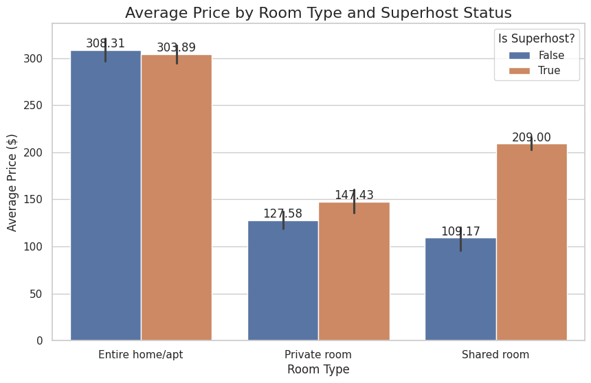
    


### Insights


Hosts seem to charge the same for each type of rooms. With superhosts charging more for shared rooms

## Tableau Sheet 3: Listings by Property Type and their Revenue


```python
import plotly.express as px
import pandas as pd

# 1. --- Prepare the Data for the Treemap ---
# We must group by 'property_type' first
df_treemap = df.groupby('property_type').agg(
    listing_count=('id', 'count'),                 # This will be the SIZE
    avg_revenue=('estimated_revenue_l365d', 'mean')  # This will be the COLOR
).reset_index() # Puts 'property_type' back as a column

# (Optional) For a cleaner chart, you can filter out
# property types with very few listings
#df_treemap = df_treemap[df_treemap['listing_count'] > 5]


# 2. --- Create the Treemap ---
fig = px.treemap(
    df_treemap,
    
    # 'path' defines the hierarchy (the boxes)
    path=[px.Constant("All Property Types"), 'property_type'], 
    
    # 'values' defines the size of the boxes
    values='listing_count',
    
    # 'color' defines the color of the boxes
    color='avg_revenue',
    
    # This color scale (Green-Yellow-Red) matches your Tableau legend
    color_continuous_scale='RdYlGn_r', 
    color_continuous_midpoint=47935,
    
    # This adds extra info to the hover tooltip
    hover_data={
        'property_type': False, 
        'avg_revenue': ':.2f'   # Format revenue to 2 decimal places
    },
    
    title='Listings by Property Type and their Average Revenue'
)

# 3. --- Customize the labels ---
# This updates the text inside the boxes to show the label and its percentage
fig.update_traces(textinfo="label+percent root")

fig.update_layout(
    margin={"r":0, "t":50, "l":0, "b":0} # Add top margin for the title
)

fig.show()
```


### Insights

Looks like generally, the amount of revenue "scales" somnewhat with the property type. Super expensive and rare private rooms make more revenue than regular homes despite being small in quantity. The opposite is also true. Regular rental units and homes make up their revenue through low price + large quantities

## Tableau Sheet 4: "Host Completeness ""Do hosts with more complete profiles (Profile pic, about, location, identity) get more reviews or better scores?""


```python
# 1. Create the 'host_profile_score' column
# Using .astype(int) is the most robust way to convert True/False to 1/0
df['host_profile_score'] = (
    df['host_has_about'].astype(int) + 
    df['host_has_profile_pic'].astype(int) + 
    df['host_identity_verified'].astype(int) +
    df['host_location_provided'].astype(int)
)

# 2. --- THIS IS THE IMPORTANT DEBUGGING STEP ---
# Let's check the distribution of the scores it just created
print("Distribution of Host Profile Scores:")
print(df['host_profile_score'].value_counts().sort_index())
```

    Distribution of Host Profile Scores:
    host_profile_score
    0       8
    1     172
    2     689
    3    1342
    4    1840
    Name: count, dtype: int64


### Translate Tableau Graph


```python
import matplotlib.pyplot as plt
import seaborn as sns

# Set the theme
sns.set_theme(style="whitegrid")

# 1. Create the summary data (just like Tableau's AVG)
# We group by the new score and get the mean of the review scores
score_summary = df.groupby('host_profile_score')['average_review_score'].mean().reset_index()

# 2. Plot the summary data
plt.figure(figsize=(10, 6))
sns.lineplot(
    data=score_summary,
    x='host_profile_score',
    y='average_review_score',
    marker='o',  # Add markers to the points
    linewidth=3  # Make the line thicker
)

# Set titles and labels
plt.title('Host Completeness vs. Average Review Score', fontsize=16)
plt.xlabel('Host Profile Score (0-4)')
plt.ylabel('Average Review Score')

# Set the x-axis ticks to be integers
plt.xticks([0, 1, 2, 3, 4])
plt.ylim(0, 5) 

plt.show()
```


    
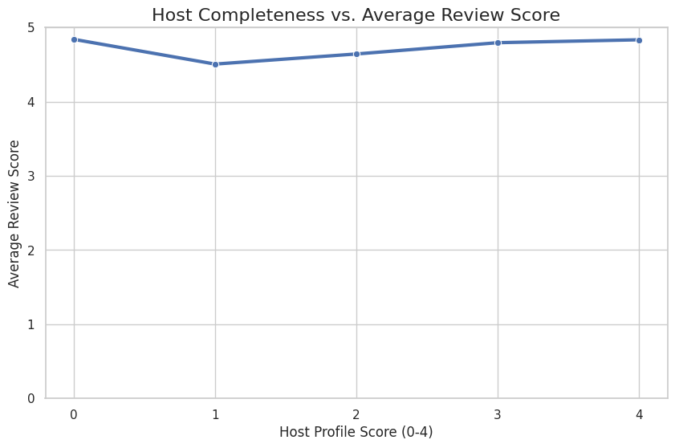
    


### Bonus Graph 1. Checking Outliers


```python
plt.figure(figsize=(10, 6))
sns.boxplot(
    data=df,
    x='host_profile_score',
    y='average_review_score'
)

# Set titles and labels
plt.title('Distribution of Review Scores by Host Profile Completeness', fontsize=16)
plt.xlabel('Host Profile Score (0-4)')
plt.ylabel('Average Review Score')
plt.ylim(0, 5) 
plt.show()
```


    
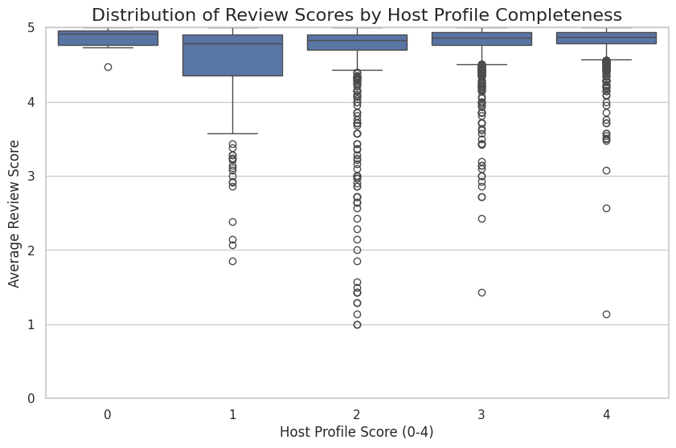
    


### Tableau 4.5


```python
import matplotlib.pyplot as plt
import seaborn as sns

# 1. Select all numeric and boolean columns for correlation

review_corr_cols = [
    'host_response_rate', 'host_acceptance_rate', 'host_is_superhost', 
    'host_total_listings_count', 'host_has_profile_pic', 'host_identity_verified', 
    'accommodates', 'bathrooms', 'bedrooms', 'beds', 'price', 
    'minimum_nights', 'availability_365', 'number_of_reviews', 
    'instant_bookable', 'reviews_per_year', 'max_host_response_time_hours', 
    'host_has_about', 'neighborhood_has_overview', 'host_location_provided', 
    'host_profile_score', 'average_review_score' # Our target
]

# 2. Calculate the correlation matrix
# We filter to only include columns that actually exist in the df
existing_cols = [col for col in review_corr_cols if col in df.columns]
corr_matrix = df[existing_cols].corr()

# 3. Isolate correlations with 'average_review_score'
corr_with_reviews = corr_matrix['average_review_score'].drop('average_review_score')

# 4. Get the Top 10 strongest (positive or negative)
# We get the absolute value to find the strongest, then sort
strongest_corr = corr_with_reviews.abs().sort_values(ascending=False).head(10)

# 5. Get the original (non-absolute) values for plotting
top_10_factors = corr_with_reviews[strongest_corr.index].sort_values(ascending=False)

# 6. Plot the horizontal bar chart
plt.figure(figsize=(12, 7))
sns.barplot(
    x=top_10_factors.values, 
    y=top_10_factors.index, 
    palette='vlag' # A nice Red-Blue diverging palette
)
plt.title('Top 10 Factors Correlated with Average Review Score', fontsize=16)
plt.xlabel('Correlation Coefficient')
plt.ylabel('Feature')
plt.axvline(0, color='black', linewidth=0.8) # Add a line at zero
plt.show()
```

    /tmp/ipykernel_70112/4281335320.py:33: FutureWarning:
    
    
    
    Passing `palette` without assigning `hue` is deprecated and will be removed in v0.14.0. Assign the `y` variable to `hue` and set `legend=False` for the same effect.
    
    


    
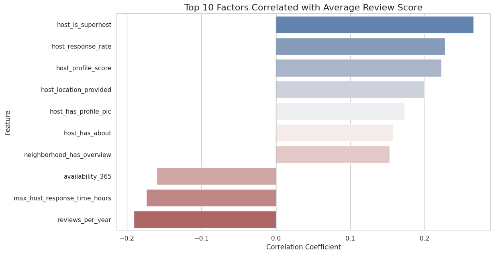
    


### Insights

Seems like all these factors only slightly affect review scores?


```python
df.info()
```

    <class 'pandas.core.frame.DataFrame'>
    Index: 4051 entries, 0 to 5536
    Data columns (total 40 columns):
     #   Column                        Non-Null Count  Dtype         
    ---  ------                        --------------  -----         
     0   id                            4051 non-null   int64         
     1   name                          4051 non-null   object        
     2   description                   4018 non-null   object        
     3   neighborhood_overview         4051 non-null   object        
     4   host_since                    4049 non-null   datetime64[ns]
     5   host_location                 4051 non-null   object        
     6   host_about                    4051 non-null   object        
     7   host_response_rate            3775 non-null   float64       
     8   host_acceptance_rate          3909 non-null   float64       
     9   host_is_superhost             4051 non-null   bool          
     10  host_neighbourhood            3887 non-null   object        
     11  host_total_listings_count     4049 non-null   float64       
     12  host_has_profile_pic          4051 non-null   bool          
     13  host_identity_verified        4051 non-null   bool          
     14  neighbourhood_cleansed        4051 non-null   object        
     15  latitude                      4051 non-null   float64       
     16  longitude                     4051 non-null   float64       
     17  property_type                 4051 non-null   object        
     18  room_type                     4051 non-null   object        
     19  accommodates                  4051 non-null   int64         
     20  bathrooms                     4049 non-null   float64       
     21  bathrooms_text                4048 non-null   object        
     22  bedrooms                      4050 non-null   float64       
     23  beds                          4050 non-null   float64       
     24  amenities                     4051 non-null   object        
     25  price                         4051 non-null   float64       
     26  minimum_nights                4051 non-null   int64         
     27  maximum_nights                4051 non-null   int64         
     28  availability_365              4051 non-null   int64         
     29  number_of_reviews             4051 non-null   int64         
     30  estimated_occupancy_l365d     4051 non-null   int64         
     31  estimated_revenue_l365d       4051 non-null   float64       
     32  instant_bookable              4051 non-null   bool          
     33  average_review_score          4051 non-null   float64       
     34  reviews_per_year              4051 non-null   float64       
     35  max_host_response_time_hours  3775 non-null   float64       
     36  host_has_about                4051 non-null   bool          
     37  neighborhood_has_overview     4051 non-null   bool          
     38  host_location_provided        4051 non-null   bool          
     39  host_profile_score            4051 non-null   int64         
    dtypes: bool(7), datetime64[ns](1), float64(13), int64(8), object(11)
    memory usage: 1.1+ MB


## Tableau Sheet 5. The Price Matrix (Beds vs Baths)


```python
import matplotlib.pyplot as plt
import seaborn as sns
import pandas as pd
import numpy as np 

# 1. --- Prepare the Data 
df_grouped = df.groupby(['bathrooms_text', 'bedrooms'])['price'].mean()
df_pivot = df_grouped.unstack(level='bedrooms')

# 2. --- THIS IS THE NEW STEP ---
# Find the true median of all values in our new pivot table
# .stack() turns the matrix back into a single column, .median() finds the middle value
pivot_median = df_pivot.stack().median()
print(f"Setting color bar center to the data's median: ${pivot_median:,.2f}")

# 3. --- Plot the Heatmap (with one new parameter) ---
plt.figure(figsize=(14, 10))
sns.heatmap(
    df_pivot,
    annot=True,
    fmt=".0f",
    cmap="RdYlGn_r",
    linewidths=.5,
    cbar_kws={'label': 'Avg. Price'},
    
   
    center=pivot_median  # This tells Seaborn where to put "yellow"
)

plt.title('The Price Matrix (Beds vs. Baths) - Median Centered', fontsize=16)
plt.xlabel('Number of Bedrooms')
plt.ylabel('Bathroom Type')
plt.show()
```

    Setting color bar center to the data's median: $476.79


    
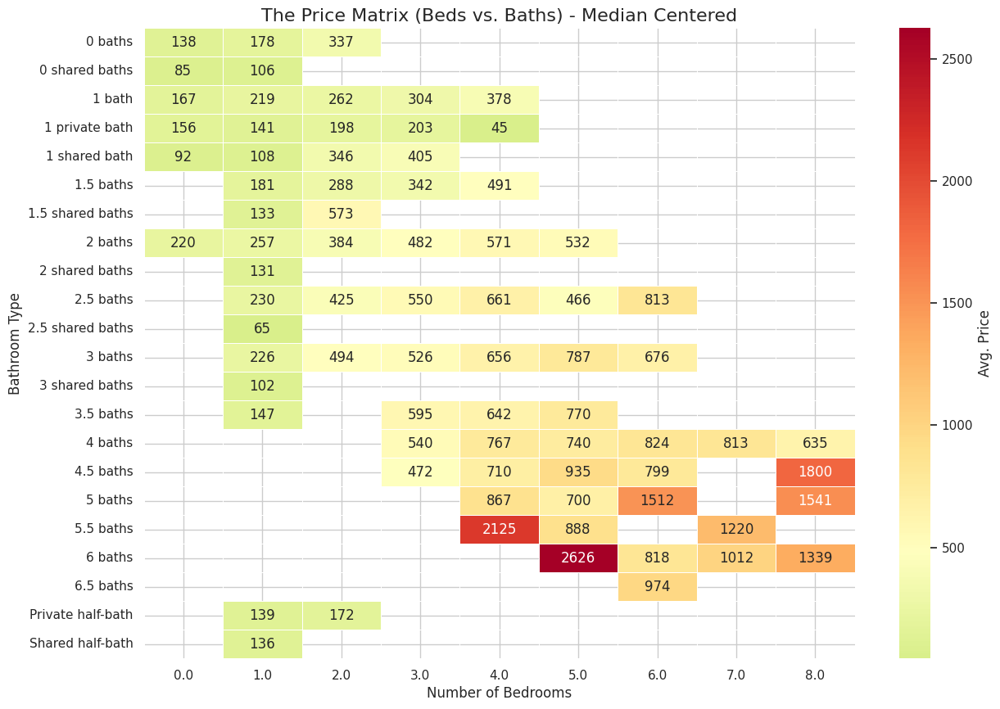
    


### Insights

Seems that 3+ Baths/Baths is when the price starts jumping up

## Tableau Sheet 6: Scatter: Price vs Accommodates (Featuring Room Type and Reviews Per Year)


```python
import matplotlib.pyplot as plt
import seaborn as sns

# 1. --- Filter the Data for a Readable Plot ---

df_scatter = df[df['price'] < 9000] 

# 2. --- Create the Scatter Plot ---
plt.figure(figsize=(12, 8))
sns.scatterplot(
    data=df_scatter,
    x='accommodates',
    y='price',
    hue='room_type',           # This maps 'room_type' to COLOR
    size='reviews_per_year',   # This maps 'reviews_per_year' to SIZE
    
    alpha=0.5,                 # Add transparency to see overlapping points
    sizes=(20, 400)            # Set a min and max bubble size
)

# 3. --- Add Titles and Labels ---
plt.title('Price vs. Accommodates (by Room Type and Review Rate)', fontsize=16)
plt.xlabel('Accommodates')
plt.ylabel('Price ($)')

# 4. --- Move the legend outside the plot ---
# This is often needed so the legend doesn't cover the data
plt.legend(bbox_to_anchor=(1.02, 1), loc='upper left', borderaxespad=0)

plt.show()
```


    
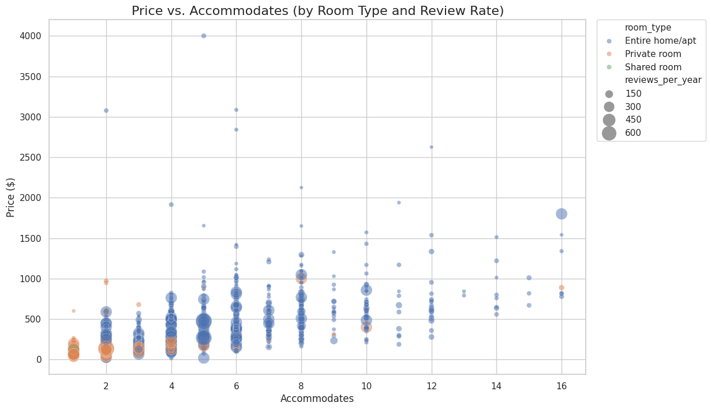
    


### Insights

Seems like homes/appartments are the most common, span the most rang of prices and accomodations and consequently tend to have the widest spectrum of reviews. Private Rooms tend to have more reviews but accomodate fewer people are are lower priced

## Tableau Sheet 7: (Ranked): Top 10 Neighborhoods by Median Revenue


```python
import matplotlib.pyplot as plt
import seaborn as sns
import pandas as pd

# 1. --- Prepare the Data ---
# Group by neighbourhood and get all the metrics we need
df_hoods = df.groupby('neighbourhood_cleansed').agg(
    median_revenue=('estimated_revenue_l365d', 'median'),
    avg_price=('price', 'mean'),
    listing_count=('id', 'count')
).reset_index()

# 2. --- Get the Top 10 ---
# Sort by median revenue and take the top 10
df_top10 = df_hoods.sort_values(by='median_revenue', ascending=False).head(10)

# 3. --- Plot the Improved Chart ---
plt.figure(figsize=(12, 8))

# We'll use a barplot and map 'avg_price' to the color (hue)
# We use 'dodge=False' so the bars aren't split
sns.barplot(
    data=df_top10,
    y='neighbourhood_cleansed',  # Y-axis is better for long names
    x='median_revenue',        # X-axis is the value
    hue='avg_price',           # This adds the 2nd variable
    palette='coolwarm',        # A palette to show high/low prices
    dodge=False
)

plt.title('Top 10 Neighbourhoods by Median Revenue and Avg. Price', fontsize=16)
plt.xlabel('Median Estimated Revenue (L365D)')
plt.ylabel('Neighbourhood')
plt.legend(title='Avg. Price', loc='center left', bbox_to_anchor=(1, 0.5))
plt.show()
```


    
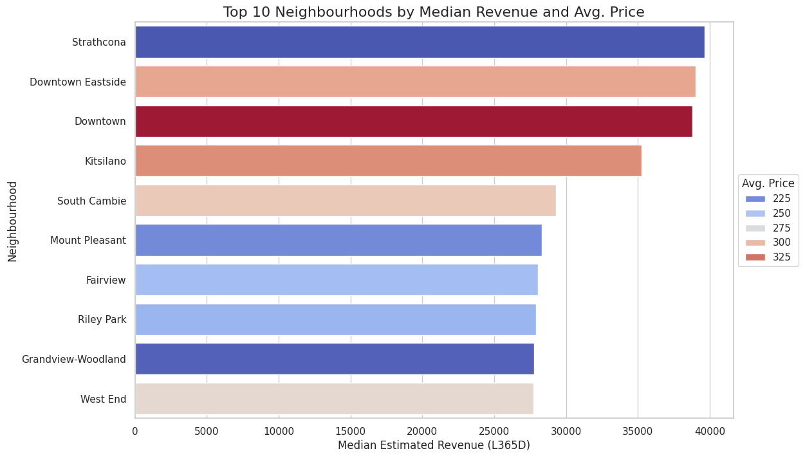
    


# 6. Machine Learning Predictions

## Predicting Price based on factors


```python
!jupyter nbextension enable --py widgetsnbextension
```

    Enabling notebook extension jupyter-js-widgets/extension...
          - Validating: problems found:
            - require?  X jupyter-js-widgets/extension


```python
from sklearn.model_selection import train_test_split
from sklearn.linear_model import LinearRegression
from sklearn.metrics import mean_squared_error, r2_score
import pandas as pd
import numpy as np

# Use UNIQUE variable names for price model
price_target = 'price'
price_numerical_features = [
    'accommodates', 
    'bedrooms', 
    'beds', 
    'bathrooms', 
    'number_of_reviews', 
    'average_review_score', 
    'availability_365', 
    'host_total_listings_count'
]
price_categorical_features = [
    'property_type', 
    'room_type', 
    'neighbourhood_cleansed'
]

# Create price model dataframe
price_features = price_numerical_features + price_categorical_features
price_model_df = df[price_features + [price_target]].copy()

# Fill missing values
for col in price_numerical_features:
    median_val = price_model_df[col].median()
    price_model_df[col] = price_model_df[col].fillna(median_val)

for col in price_categorical_features:
    mode_val = price_model_df[col].mode()[0]
    price_model_df[col] = price_model_df[col].fillna(mode_val)

# One-hot encode
price_model_df_encoded = pd.get_dummies(
    price_model_df, 
    columns=price_categorical_features, 
    drop_first=True
)

# Define X and y for PRICE model
price_y = price_model_df_encoded[price_target]
price_X = price_model_df_encoded.drop(columns=[price_target])

# Split data
price_X_train, price_X_test, price_y_train, price_y_test = train_test_split(
    price_X, price_y, test_size=0.25, random_state=0
)

print(f"Price Model - Training with {price_X_train.shape[1]} features.")

# Train model
price_lin_reg = LinearRegression()
price_lin_reg.fit(price_X_train, price_y_train)

# Evaluate
price_predictions = price_lin_reg.predict(price_X_test)
price_rmse = np.sqrt(mean_squared_error(price_y_test, price_predictions))
price_r2 = r2_score(price_y_test, price_predictions)

print(f"Root Mean Squared Error (RMSE): ${price_rmse:.2f}")
print(f"R2-Square: {price_r2:.2f}")
print(f"\nRMSE: On average, the model's price predictions are off by about ${price_rmse:.2f}.")
print(f"R2-Square: The model explains about {price_r2*100:.1f}% of the variance in the price.")

```

    Price Model - Training with 75 features.
    Root Mean Squared Error (RMSE): $188.72
    R2-Square: 0.46
    
    RMSE: On average, the model's price predictions are off by about $188.72.
    R2-Square: The model explains about 46.1% of the variance in the price.


```python
#Feature Importance
feature_importance = pd.DataFrame(
    {
        'feature': price_X.columns,
        'coefficient': price_lin_reg.coef_
    }
).sort_values('coefficient', ascending=False)

feature_importance.head(10)

```


<div>
<style scoped>
    .dataframe tbody tr th:only-of-type {
        vertical-align: middle;
    }

    .dataframe tbody tr th {
        vertical-align: top;
    }

    .dataframe thead th {
        text-align: right;
    }
</style>
<table border="1" class="dataframe">
  <thead>
    <tr style="text-align: right;">
      <th></th>
      <th>feature</th>
      <th>coefficient</th>
    </tr>
  </thead>
  <tbody>
    <tr>
      <th>33</th>
      <td>property_type_Private room in serviced apartment</td>
      <td>504.696282</td>
    </tr>
    <tr>
      <th>16</th>
      <td>property_type_Entire place</td>
      <td>289.847778</td>
    </tr>
    <tr>
      <th>24</th>
      <td>property_type_Private room in boat</td>
      <td>285.473636</td>
    </tr>
    <tr>
      <th>30</th>
      <td>property_type_Private room in hostel</td>
      <td>113.288617</td>
    </tr>
    <tr>
      <th>20</th>
      <td>property_type_Entire vacation home</td>
      <td>92.918678</td>
    </tr>
    <tr>
      <th>3</th>
      <td>bathrooms</td>
      <td>79.061188</td>
    </tr>
    <tr>
      <th>40</th>
      <td>property_type_Room in hotel</td>
      <td>68.026366</td>
    </tr>
    <tr>
      <th>53</th>
      <td>neighbourhood_cleansed_Downtown</td>
      <td>62.929963</td>
    </tr>
    <tr>
      <th>73</th>
      <td>neighbourhood_cleansed_West End</td>
      <td>58.784642</td>
    </tr>
    <tr>
      <th>54</th>
      <td>neighbourhood_cleansed_Downtown Eastside</td>
      <td>45.368632</td>
    </tr>
  </tbody>
</table>
</div>


### Testing Box


```python
import ipywidgets as widgets
from ipywidgets import interact

# FREEZE feature names for price model
PRICE_FEATURE_NAMES = price_X_train.columns.tolist().copy()

# Get options for dropdowns
price_property_types = sorted(price_model_df['property_type'].dropna().unique().tolist())
price_room_types = sorted(price_model_df['room_type'].dropna().unique().tolist())
price_neighbourhoods = sorted(price_model_df['neighbourhood_cleansed'].dropna().unique().tolist())

print(f"\n✓ Price model ready with {len(PRICE_FEATURE_NAMES)} features")


def predict_price(accommodates, bedrooms, beds, bathrooms, 
                  number_of_reviews, average_review_score, availability_365,
                  host_total_listings_count, property_type, 
                  room_type, neighbourhood_cleansed):
    
    # Create input
    input_data = pd.DataFrame({
        'accommodates': [float(accommodates)],
        'bedrooms': [float(bedrooms)],
        'beds': [float(beds)],
        'bathrooms': [float(bathrooms)],
        'number_of_reviews': [float(number_of_reviews)],
        'average_review_score': [float(average_review_score)],
        'availability_365': [float(availability_365)],
        'host_total_listings_count': [float(host_total_listings_count)],
        'property_type': [property_type],
        'room_type': [room_type],
        'neighbourhood_cleansed': [neighbourhood_cleansed]
    })
    
    # One-hot encode
    input_encoded = pd.get_dummies(
        input_data, 
        columns=['property_type', 'room_type', 'neighbourhood_cleansed'],
        drop_first=True
    )
    
    # Align with trained model features
    final_input = pd.DataFrame(
        np.zeros((1, len(PRICE_FEATURE_NAMES))), 
        columns=PRICE_FEATURE_NAMES,
        dtype=np.float64
    )
    
    for col in input_encoded.columns:
        if col in PRICE_FEATURE_NAMES:
            final_input[col] = input_encoded[col].values[0]
    
    # Predict using PRICE model
    prediction = price_lin_reg.predict(final_input)
    print(f"✓ Predicted Price: ${prediction[0]:.2f}")
    return prediction[0]


# Create widget
print("\n" + "="*60)
print("PRICE PREDICTION WIDGET")
print("="*60)

interact(
    predict_price,
    accommodates = widgets.IntSlider(value=2, min=1, max=16, step=1, description='Accommodates:', continuous_update=False),
    bedrooms = widgets.FloatSlider(value=1.0, min=0.0, max=10.0, step=1.0, description='Bedrooms:', continuous_update=False),
    beds = widgets.FloatSlider(value=1.0, min=0.0, max=16.0, step=1.0, description='Beds:', continuous_update=False),
    bathrooms = widgets.FloatSlider(value=1.0, min=0.5, max=8.0, step=0.5, description='Bathrooms:', continuous_update=False),
    number_of_reviews = widgets.IntSlider(value=20, min=0, max=500, step=5, description='Reviews:', continuous_update=False),
    average_review_score = widgets.FloatSlider(value=4.5, min=0.0, max=5.0, step=0.1, description='Review Score:', continuous_update=False),
    availability_365 = widgets.IntSlider(value=100, min=0, max=365, step=10, description='Availability:', continuous_update=False),
    host_total_listings_count = widgets.IntSlider(value=1, min=0, max=50, step=1, description='Host Listings:', continuous_update=False),
    property_type = widgets.Dropdown(options=price_property_types, value=price_property_types[0], description='Property Type:'),
    room_type = widgets.Dropdown(options=price_room_types, value=price_room_types[0], description='Room Type:'),
    neighbourhood_cleansed = widgets.Dropdown(options=price_neighbourhoods, value=price_neighbourhoods[0], description='Neighbourhood:')
);
```

    
    ✓ Price model ready with 75 features
    
    ============================================================
    PRICE PREDICTION WIDGET
    ============================================================


    interactive(children=(IntSlider(value=2, continuous_update=False, description='Accommodates:', max=16, min=1),…


## Review Score Prediction


```python
from sklearn.model_selection import train_test_split
from sklearn.linear_model import LinearRegression
from sklearn.metrics import mean_squared_error, r2_score
import pandas as pd
import numpy as np

# Create amenities count
df['amenities_count'] = df['amenities'].apply(
    lambda x: len(x.strip('[]').split(',')) if x != '[]' else 0
)

# Use UNIQUE variable names for review model
review_target = 'average_review_score'
review_numerical_features = [
    'host_response_rate', 
    'host_acceptance_rate', 
    'amenities_count',
    'price', 
    'bedrooms', 
    'bathrooms'
]
review_boolean_features = [
    'host_is_superhost',
    'instant_bookable'
]
review_categorical_features = [
    'property_type'
]

# Create review model dataframe
review_features = review_numerical_features + review_boolean_features + review_categorical_features
review_model_df = df[review_features + [review_target]].copy()

# Drop rows with missing target
review_model_df = review_model_df.dropna(subset=[review_target])

# Fill missing numerical features
for col in review_numerical_features:
    median_val = review_model_df[col].median()
    review_model_df[col] = review_model_df[col].fillna(median_val)

# Convert boolean to int
for col in review_boolean_features:
    review_model_df[col] = review_model_df[col].astype(int)

# Fill missing categorical features
for col in review_categorical_features:
    mode_val = review_model_df[col].mode()[0]
    review_model_df[col] = review_model_df[col].fillna(mode_val)

# One-hot encode
review_model_df_encoded = pd.get_dummies(
    review_model_df, 
    columns=review_categorical_features, 
    drop_first=True
)

# Define X and y for REVIEW model
review_y = review_model_df_encoded[review_target]
review_X = review_model_df_encoded.drop(columns=[review_target])

# Split data
review_X_train, review_X_test, review_y_train, review_y_test = train_test_split(
    review_X, review_y, test_size=0.25, random_state=0
)

print(f"Review Score Model - Training with {review_X_train.shape[1]} features.")

# Train model
review_lin_reg = LinearRegression()
review_lin_reg.fit(review_X_train, review_y_train)

# Evaluate
review_predictions = review_lin_reg.predict(review_X_test)
review_rmse = np.sqrt(mean_squared_error(review_y_test, review_predictions))
review_r2 = r2_score(review_y_test, review_predictions)

print(f"Root Mean Squared Error (RMSE): {review_rmse:.2f}")
print(f"R2-Square: {review_r2:.2f}")
print(f"\nRMSE: On average, the model's review score predictions are off by about {review_rmse:.2f} points.")
print(f"R2-Square: The model explains about {review_r2*100:.1f}% of the variance in the average review score.")

```

    Review Score Model - Training with 51 features.
    Root Mean Squared Error (RMSE): 0.33
    R2-Square: 0.15
    
    RMSE: On average, the model's review score predictions are off by about 0.33 points.
    R2-Square: The model explains about 15.0% of the variance in the average review score.


```python
!jupyter nbextension enable --py widgetsnbextension
```

    Enabling notebook extension jupyter-js-widgets/extension...
          - Validating: problems found:
            - require?  X jupyter-js-widgets/extension


## Testing Box:


```python

import ipywidgets as widgets
from ipywidgets import interact

# FREEZE feature names for review model
REVIEW_FEATURE_NAMES = review_X_train.columns.tolist().copy()

# Get options for dropdown
review_property_types = sorted(review_model_df['property_type'].dropna().unique().tolist())

print(f"\n✓ Review score model ready with {len(REVIEW_FEATURE_NAMES)} features")


def predict_review_score(host_is_superhost, host_response_rate, host_acceptance_rate, 
                         property_type, amenities_count, instant_bookable, 
                         price, bedrooms, bathrooms):
    
    # Create input
    input_data = pd.DataFrame({
        'host_is_superhost': [int(host_is_superhost)],
        'host_response_rate': [float(host_response_rate)],
        'host_acceptance_rate': [float(host_acceptance_rate)],
        'property_type': [property_type],
        'amenities_count': [int(amenities_count)],
        'instant_bookable': [int(instant_bookable)],
        'price': [float(price)],
        'bedrooms': [float(bedrooms)],
        'bathrooms': [float(bathrooms)]
    })
    
    # One-hot encode
    input_encoded = pd.get_dummies(
        input_data, 
        columns=['property_type'],
        drop_first=True
    )
    
    # Align with trained model features
    final_input = pd.DataFrame(
        np.zeros((1, len(REVIEW_FEATURE_NAMES))), 
        columns=REVIEW_FEATURE_NAMES,
        dtype=np.float64
    )
    
    for col in input_encoded.columns:
        if col in REVIEW_FEATURE_NAMES:
            final_input[col] = input_encoded[col].values[0]
    
    # Predict using REVIEW model
    prediction = review_lin_reg.predict(final_input)
    print(f"✓ Predicted Average Review Score: {prediction[0]:.2f} stars")
    return prediction[0]


# Create widget
print("\n" + "="*60)
print("REVIEW SCORE PREDICTION WIDGET")
print("="*60)

interact(
    predict_review_score,
    host_is_superhost = widgets.Checkbox(value=True, description='Superhost'),
    host_response_rate = widgets.FloatSlider(value=0.95, min=0.0, max=1.0, step=0.01, description='Response Rate'),
    host_acceptance_rate = widgets.FloatSlider(value=0.90, min=0.0, max=1.0, step=0.01, description='Accept Rate'),
    property_type = widgets.Dropdown(options=review_property_types, value=review_property_types[0], description='Property Type'),
    amenities_count = widgets.IntSlider(value=10, min=0, max=50, step=1, description='Amenities'),
    instant_bookable = widgets.Checkbox(value=False, description='Instant Book'),
    price = widgets.FloatSlider(value=150.0, min=20.0, max=1000.0, step=5.0, description='Price ($)'),
    bedrooms = widgets.IntSlider(value=2, min=1, max=10, step=1, description='Bedrooms'),
    bathrooms = widgets.FloatSlider(value=1.0, min=0.5, max=5.0, step=0.5, description='Bathrooms')
);
```

    
    ✓ Review score model ready with 51 features
    
    ============================================================
    REVIEW SCORE PREDICTION WIDGET
    ============================================================


    interactive(children=(Checkbox(value=True, description='Superhost'), FloatSlider(value=0.95, description='Resp…


```python
#Feature Importance for review score model
review_feature_importance = pd.DataFrame(
    {
        'feature': review_X.columns,
        'coefficient': review_lin_reg.coef_
    }
).sort_values('coefficient', ascending=False)

review_feature_importance
```


<div>
<style scoped>
    .dataframe tbody tr th:only-of-type {
        vertical-align: middle;
    }

    .dataframe tbody tr th {
        vertical-align: top;
    }

    .dataframe thead th {
        text-align: right;
    }
</style>
<table border="1" class="dataframe">
  <thead>
    <tr style="text-align: right;">
      <th></th>
      <th>feature</th>
      <th>coefficient</th>
    </tr>
  </thead>
  <tbody>
    <tr>
      <th>24</th>
      <td>property_type_Private room in boat</td>
      <td>7.725716e-01</td>
    </tr>
    <tr>
      <th>0</th>
      <td>host_response_rate</td>
      <td>7.018648e-01</td>
    </tr>
    <tr>
      <th>11</th>
      <td>property_type_Entire cottage</td>
      <td>1.323137e-01</td>
    </tr>
    <tr>
      <th>6</th>
      <td>host_is_superhost</td>
      <td>1.265303e-01</td>
    </tr>
    <tr>
      <th>47</th>
      <td>property_type_Shared room in rental unit</td>
      <td>1.209133e-01</td>
    </tr>
    <tr>
      <th>23</th>
      <td>property_type_Private room in bed and breakfast</td>
      <td>1.103693e-01</td>
    </tr>
    <tr>
      <th>41</th>
      <td>property_type_Shared room in barn</td>
      <td>5.336175e-02</td>
    </tr>
    <tr>
      <th>45</th>
      <td>property_type_Shared room in hotel</td>
      <td>3.136898e-02</td>
    </tr>
    <tr>
      <th>2</th>
      <td>amenities_count</td>
      <td>4.392155e-03</td>
    </tr>
    <tr>
      <th>38</th>
      <td>property_type_Room in aparthotel</td>
      <td>1.193490e-15</td>
    </tr>
    <tr>
      <th>22</th>
      <td>property_type_Houseboat</td>
      <td>3.330669e-16</td>
    </tr>
    <tr>
      <th>46</th>
      <td>property_type_Shared room in loft</td>
      <td>0.000000e+00</td>
    </tr>
    <tr>
      <th>48</th>
      <td>property_type_Shared room in tiny home</td>
      <td>0.000000e+00</td>
    </tr>
    <tr>
      <th>50</th>
      <td>property_type_Tower</td>
      <td>0.000000e+00</td>
    </tr>
    <tr>
      <th>37</th>
      <td>property_type_Riad</td>
      <td>-3.191891e-15</td>
    </tr>
    <tr>
      <th>31</th>
      <td>property_type_Private room in loft</td>
      <td>-7.435025e-15</td>
    </tr>
    <tr>
      <th>3</th>
      <td>price</td>
      <td>-2.182788e-05</td>
    </tr>
    <tr>
      <th>5</th>
      <td>bathrooms</td>
      <td>-1.679408e-02</td>
    </tr>
    <tr>
      <th>33</th>
      <td>property_type_Private room in serviced apartment</td>
      <td>-1.796840e-02</td>
    </tr>
    <tr>
      <th>4</th>
      <td>bedrooms</td>
      <td>-1.801534e-02</td>
    </tr>
    <tr>
      <th>49</th>
      <td>property_type_Tiny home</td>
      <td>-2.353584e-02</td>
    </tr>
    <tr>
      <th>8</th>
      <td>property_type_Earthen home</td>
      <td>-3.934680e-02</td>
    </tr>
    <tr>
      <th>36</th>
      <td>property_type_Private room in villa</td>
      <td>-4.418903e-02</td>
    </tr>
    <tr>
      <th>7</th>
      <td>instant_bookable</td>
      <td>-5.000877e-02</td>
    </tr>
    <tr>
      <th>19</th>
      <td>property_type_Entire townhouse</td>
      <td>-5.270980e-02</td>
    </tr>
    <tr>
      <th>32</th>
      <td>property_type_Private room in rental unit</td>
      <td>-6.001869e-02</td>
    </tr>
    <tr>
      <th>16</th>
      <td>property_type_Entire place</td>
      <td>-8.594532e-02</td>
    </tr>
    <tr>
      <th>13</th>
      <td>property_type_Entire guesthouse</td>
      <td>-9.202420e-02</td>
    </tr>
    <tr>
      <th>12</th>
      <td>property_type_Entire guest suite</td>
      <td>-9.295907e-02</td>
    </tr>
    <tr>
      <th>34</th>
      <td>property_type_Private room in tiny home</td>
      <td>-9.717982e-02</td>
    </tr>
    <tr>
      <th>14</th>
      <td>property_type_Entire home</td>
      <td>-1.006440e-01</td>
    </tr>
    <tr>
      <th>30</th>
      <td>property_type_Private room in hostel</td>
      <td>-1.055869e-01</td>
    </tr>
    <tr>
      <th>1</th>
      <td>host_acceptance_rate</td>
      <td>-1.087024e-01</td>
    </tr>
    <tr>
      <th>27</th>
      <td>property_type_Private room in guest suite</td>
      <td>-1.148444e-01</td>
    </tr>
    <tr>
      <th>9</th>
      <td>property_type_Entire bungalow</td>
      <td>-1.167722e-01</td>
    </tr>
    <tr>
      <th>17</th>
      <td>property_type_Entire rental unit</td>
      <td>-1.383348e-01</td>
    </tr>
    <tr>
      <th>39</th>
      <td>property_type_Room in boutique hotel</td>
      <td>-1.423813e-01</td>
    </tr>
    <tr>
      <th>15</th>
      <td>property_type_Entire loft</td>
      <td>-1.434340e-01</td>
    </tr>
    <tr>
      <th>10</th>
      <td>property_type_Entire condo</td>
      <td>-1.495111e-01</td>
    </tr>
    <tr>
      <th>21</th>
      <td>property_type_Entire villa</td>
      <td>-1.600522e-01</td>
    </tr>
    <tr>
      <th>40</th>
      <td>property_type_Room in hotel</td>
      <td>-1.642181e-01</td>
    </tr>
    <tr>
      <th>28</th>
      <td>property_type_Private room in guesthouse</td>
      <td>-1.788899e-01</td>
    </tr>
    <tr>
      <th>26</th>
      <td>property_type_Private room in condo</td>
      <td>-2.059166e-01</td>
    </tr>
    <tr>
      <th>25</th>
      <td>property_type_Private room in bungalow</td>
      <td>-2.134647e-01</td>
    </tr>
    <tr>
      <th>35</th>
      <td>property_type_Private room in townhouse</td>
      <td>-2.202858e-01</td>
    </tr>
    <tr>
      <th>42</th>
      <td>property_type_Shared room in condo</td>
      <td>-2.690864e-01</td>
    </tr>
    <tr>
      <th>18</th>
      <td>property_type_Entire serviced apartment</td>
      <td>-2.780190e-01</td>
    </tr>
    <tr>
      <th>44</th>
      <td>property_type_Shared room in hostel</td>
      <td>-2.853956e-01</td>
    </tr>
    <tr>
      <th>29</th>
      <td>property_type_Private room in home</td>
      <td>-2.986316e-01</td>
    </tr>
    <tr>
      <th>20</th>
      <td>property_type_Entire vacation home</td>
      <td>-3.868697e-01</td>
    </tr>
    <tr>
      <th>43</th>
      <td>property_type_Shared room in home</td>
      <td>-9.502417e-01</td>
    </tr>
  </tbody>
</table>
</div>


# Export


```python
# Export cleaned data to CSV
#df.to_csv('listings_cleaned.csv', index=False)

import pandas as pd, csv


with open("listings_cleaned.csv", "w", newline="\n", encoding="utf-8") as f:
    df.to_csv(f, index=False, quoting=csv.QUOTE_ALL, doublequote=True)

```
